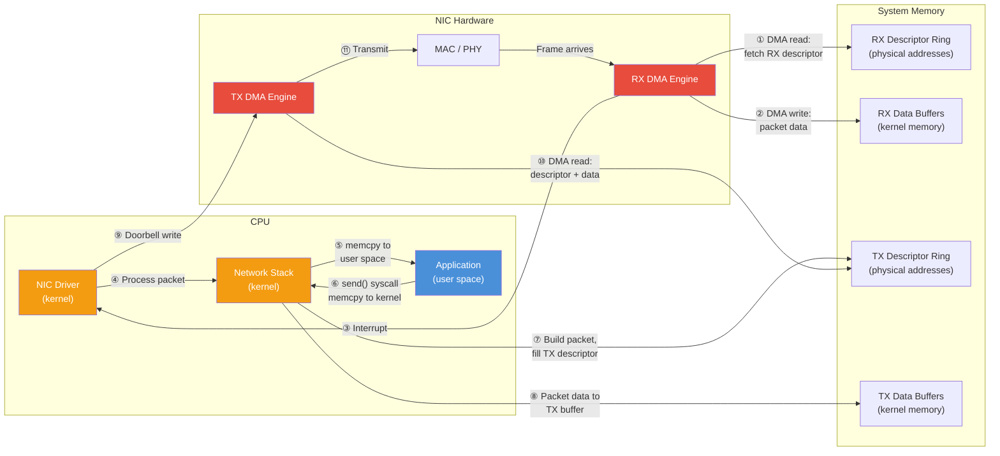

# 1.2 DMA Fundamentals

Before we can understand Remote Direct Memory Access, we need to understand plain Direct Memory Access. DMA is the hardware mechanism that allows peripheral devices---network adapters, storage controllers, GPUs---to read from and write to system memory without involving the CPU for each byte transferred. It is one of the most important performance features in modern computer architecture, and it is the foundation upon which RDMA is built.

## Why DMA Exists

In the earliest personal computers, every byte of data transferred between a peripheral and memory required the CPU to execute an explicit load or store instruction. This technique, known as **Programmed I/O (PIO)**, works as follows:

1. The CPU writes a command to the device's I/O port (or memory-mapped register) telling it to make data available.
2. The CPU reads a byte (or word) from the device's data register into a CPU register.
3. The CPU writes that byte from the CPU register into the destination address in memory.
4. Repeat for each byte.

For a 4 KB transfer at one byte per instruction, this is 4,096 load-store pairs. The CPU is completely occupied during the transfer---it cannot execute any other instructions. On a 1 MHz 8088 processor moving data from a floppy disk controller, this was tolerable. On a modern server receiving data at 400 Gb/s, it would be catastrophically impossible: the CPU would need to execute 50 billion byte-moves per second just to keep up with the network, leaving no cycles for anything else.

DMA solves this by giving the peripheral device the ability to read from and write to system memory autonomously. The CPU's role is reduced to setup: it tells the DMA-capable device *where* in memory to transfer data, *how much* to transfer, and *in which direction*. The device then performs the transfer independently, using the system's memory bus. When the transfer is complete, the device notifies the CPU---typically via an interrupt---and the CPU can then process the data that has appeared in memory.

## Bus Mastering: The Evolution of DMA

The original IBM PC's DMA was handled by a dedicated DMA controller chip (the Intel 8237) on the motherboard. The peripheral would request DMA service from this controller, which would then arbitrate for the bus and perform the transfer on behalf of the device. This approach had severe limitations: the 8237 could only address 16 MB of memory, supported only a handful of channels, and was far too slow for high-bandwidth peripherals.

Modern DMA uses **bus mastering**, where the peripheral device itself contains a DMA engine and directly drives transactions on the system bus (PCIe in today's systems). The device becomes a "bus master"---it can initiate memory read and write transactions without any intermediary. This is vastly more capable than the old controller-based approach:

- **No address limitations**: PCIe devices can address the full 64-bit physical address space (with appropriate IOMMU configuration).
- **No bandwidth bottleneck**: Each PCIe device has its own dedicated lanes to the root complex, so multiple devices can perform DMA concurrently without contention.
- **Sophisticated transfer logic**: Modern NIC DMA engines can handle scatter-gather lists, completion notifications, and multiple concurrent transfers.

Every modern NIC---whether it costs $50 or $5,000---is a bus-mastering DMA device. When your Linux server receives a packet over a standard TCP socket, the packet data was placed into kernel memory by the NIC's DMA engine, not by the CPU. The CPU only gets involved *after* the data has arrived in memory. This is already a major optimization over PIO. RDMA takes it further.

## How Conventional NICs Use DMA

A conventional (non-RDMA) NIC uses DMA extensively, but always under kernel supervision. Here is the standard flow for packet reception:

1. **Ring buffer setup**: During driver initialization, the kernel allocates a set of memory buffers and constructs a **receive descriptor ring**---a circular array of descriptors, each pointing to one pre-allocated buffer. The kernel writes the physical addresses of these buffers into the descriptors and programs the NIC with the ring's base address and size.

2. **Packet arrival**: When a frame arrives from the network, the NIC's DMA engine reads the next available receive descriptor from the ring (via DMA read from host memory), determines the target buffer address, and writes the packet data into that buffer (via DMA write to host memory).

3. **Descriptor completion**: The NIC updates the descriptor with metadata (packet length, checksum status, RSS hash, VLAN tag, timestamps) and advances its internal pointer.

4. **Notification**: The NIC raises an interrupt (or, under NAPI, the kernel polls for completions) to inform the driver that new packets are available.

5. **Processing**: The kernel processes the packet through the network stack (as described in Section 1.1) and eventually copies the data to user space.

The transmit path is the mirror image: the kernel writes packet data into transmit buffers, fills in transmit descriptors with buffer addresses and metadata, and notifies the NIC by writing to a **doorbell register** (a memory-mapped I/O address). The NIC's DMA engine reads the descriptor, reads the packet data from the buffer, and transmits the frame.

The critical observation is that even though DMA handles the bulk data transfer between NIC and memory, **the kernel is still in the control path**. The kernel decides which buffers the NIC uses, the kernel processes every packet through the protocol stack, and the kernel performs the final copy to user space. DMA removes the CPU from the *data movement* between NIC and kernel memory, but the CPU is still deeply involved in everything else.

## The IOMMU: Protecting DMA

Giving a peripheral device unrestricted access to all of physical memory is a serious security and reliability risk. A buggy or malicious device could overwrite kernel code, corrupt page tables, or read sensitive data from any process. The **IOMMU** (Input/Output Memory Management Unit)---known as VT-d on Intel platforms and AMD-Vi on AMD---solves this by providing address translation and access control for DMA transactions.

The IOMMU sits between the PCIe root complex and the memory controller. When a device initiates a DMA transaction to physical address `X`, the IOMMU translates `X` through a set of page tables (separate from the CPU's page tables) to determine the actual physical address---or rejects the transaction if the device is not authorized to access that region.

Key IOMMU concepts relevant to RDMA:

- **DMA address space**: Each device (or group of devices) can have its own virtual address space for DMA. The addresses that the device uses ("IOVA"---I/O Virtual Addresses) need not correspond to physical addresses.
- **Isolation domains**: Devices can be placed in separate IOMMU domains, preventing one device from accessing memory assigned to another. This is essential for safe device assignment to virtual machines (VFIO/PCI passthrough).
- **Page granularity**: IOMMU mappings are page-granular (typically 4 KB, with support for large pages). Creating a mapping is not free---it involves modifying IOMMU page tables and may require an IOTLB (I/O TLB) flush.

For RDMA, the IOMMU adds an important wrinkle: when an RDMA NIC (RNIC) needs to DMA directly to a user-space application's buffer, the IOMMU must have a mapping that translates the NIC's DMA address to the correct physical page frames backing that application buffer. Setting up these mappings is part of the **memory registration** process that we will explore in detail in Chapter 6.[^1]

[^1]: For a thorough treatment of IOMMU performance in high-speed networking, see Farshin et al., "Reexamining Direct Cache Access to Optimize I/O Intensive Applications for Multi-hundred-gigabit Networks," USENIX ATC 2020, and Amit et al., "Strategies for Mitigating the IOTLB Bottleneck," ISPASS 2011.

Note

Some RDMA deployments disable the IOMMU for performance reasons, as IOMMU translation adds latency on IOTLB misses (the exact penalty depends on the page table walk depth and PCIe topology, but can reach hundreds of nanoseconds in the worst case). This is a security trade-off: without the IOMMU, a malfunctioning NIC could corrupt arbitrary memory. Modern RNICs and IOMMUs have improved substantially---Intel's Scalable IOMMU supports large pages (2 MB, 1 GB) that dramatically reduce IOTLB miss rates, and IOTLB sizes have grown. Disabling the IOMMU is increasingly discouraged in production, and is incompatible with SR-IOV-based NIC virtualization, which requires IOMMU isolation between virtual functions.

## Scatter-Gather DMA

Real-world data is rarely laid out in a single contiguous buffer. A network packet, for example, consists of headers and payload that may reside in different memory locations. An application message might span multiple non-contiguous pages due to virtual memory layout. Copying all this data into a single contiguous buffer just so the NIC can DMA it would defeat the purpose of using DMA in the first place.

**Scatter-gather DMA** (also called vectored I/O at the DMA level) solves this. Instead of a single (address, length) pair, the DMA engine accepts a **scatter-gather list (SGL)**---an array of (address, length) entries. For a transmit operation, the NIC reads data from each entry in sequence and transmits it as a single contiguous frame on the wire ("gather"). For a receive operation, the NIC writes incoming data across the entries in sequence ("scatter").

Scatter-gather is essential for efficient networking:

- **On transmit**, a TCP/IP packet can be assembled without copying: the TCP header might be in one buffer, the IP header prepended in another, and the payload data in a third (the application's original buffer, if zero-copy is in use). The NIC gathers them all into one Ethernet frame.
- **On receive**, large messages can be scattered across multiple pages, allowing the kernel (or, in RDMA, the application) to pre-post buffers of various sizes without knowing in advance exactly how large incoming messages will be.

Modern NIC DMA engines support scatter-gather lists with dozens to hundreds of entries. RDMA relies heavily on this capability, as we will see when we discuss work requests and their scatter-gather lists in Chapter 5.

## DMA Engines vs. CPU-Driven I/O

To summarize the evolution and clarify the terminology:

| Technique | Who moves the data? | CPU involvement | Throughput |
|---|---|---|---|
| **Programmed I/O (PIO)** | CPU executes load/store for each word | 100% --- CPU does all the work | Low (limited by instruction throughput) |
| **Third-party DMA** (8237-style) | External DMA controller | Setup only; CPU free during transfer | Moderate (controller is bottleneck) |
| **Bus-mastering DMA** | Device's own DMA engine | Setup only; CPU free during transfer | High (limited by PCIe bandwidth) |
| **RDMA** | NIC's DMA engine, controlled by user-space app | Minimal: app posts requests, NIC executes | Very high (CPU nearly uninvolved) |

The progression from PIO to bus-mastering DMA to RDMA is a story of systematically removing the CPU from the data path. With conventional DMA, the CPU is out of the data-movement loop but still orchestrates every transfer from within the kernel. RDMA removes the kernel from the orchestration, letting the application issue DMA commands directly to the NIC hardware.

## DMA and Cache Coherence

One subtlety of DMA that becomes important for RDMA programming is its interaction with the CPU cache hierarchy. When a NIC DMA-writes data into memory, that data goes to DRAM (or, on modern Intel platforms with DDIO---Data Direct I/O---into the last-level cache). But the CPU core that will process this data may have a stale cache line for that address, or may not have the line cached at all.

On x86 platforms, PCIe transactions are **cache-coherent**:[^2] the DMA write will snoop the CPU caches, and if a conflicting line exists, it will be invalidated or updated.

[^2]: Intel's coherency model for PCIe is specified in the *Intel 64 and IA-32 Architectures Software Developer's Manual*, Volume 3A, Chapter 12 (Memory Ordering). PCIe 3.0+ devices interacting with Intel CPUs observe the Total Store Order (TSO) memory model with respect to host-initiated stores. This means the CPU will always see the correct data after a DMA write, at the cost of a potential cache miss on first access. On other architectures (notably some ARM implementations), DMA coherence is not guaranteed, and explicit cache maintenance operations may be required.

For RDMA, cache coherence matters because:

- **Receive completions**: When the NIC writes data into an application's receive buffer via RDMA, the application must be able to read the correct data immediately upon being notified of the completion. Cache coherence ensures this on x86, but the first read will likely be a cache miss if the buffer was not recently accessed.
- **Send operations**: When the application writes data to a buffer and then posts an RDMA send, the NIC must read the most recent data. On x86, the write will be visible in memory (or LLC) by the time the NIC accesses it, because the CPU's store buffer drains before the doorbell write that triggers the NIC becomes visible on the bus.

Note

Intel's Data Direct I/O (DDIO) technology routes inbound DMA writes to the Last Level Cache (LLC) rather than DRAM, reducing the latency of CPU access to newly-DMA'd data by avoiding a DRAM round trip (~60--80 ns). This is generally beneficial for networking, but creates a subtle and well-documented problem at high receive rates: inbound DMA traffic can evict the application's working set from the LLC, degrading compute performance. On Intel Xeon Scalable processors, DDIO typically uses only two LLC ways (out of 11 on a typical SKU), which limits the cache available for DMA to roughly 10--20% of the LLC. Farshin et al. (USENIX ATC 2020, "Reexamining Direct Cache Access") showed that this default allocation is suboptimal for high-speed networking---too little cache for DMA causes DDIO misses that fall through to DRAM, while too much cache for DMA pollutes the application's working set. Tuning DDIO's LLC allocation via Intel's Cache Allocation Technology (CAT) is a production best practice for RDMA workloads handling 40+ Gb/s of inbound traffic.

## The Gap That RDMA Fills

Conventional DMA, as used by standard NICs, eliminates the CPU from bulk data movement between the NIC and kernel memory. But two major sources of overhead remain:

1. **The kernel is in the control path**: Every send and receive operation requires a system call, kernel protocol processing, and kernel-managed buffer allocation. The CPU is still doing thousands of instructions of work per message---just not the byte-by-byte data movement.

2. **The application's data must be copied**: Even with DMA, the data takes an indirect route: app buffer → kernel buffer → NIC (on send) and NIC → kernel buffer → app buffer (on receive). The kernel buffer is an intermediary that exists because the kernel mediates all NIC access.

RDMA eliminates both of these by extending DMA's reach. Instead of the NIC performing DMA to and from kernel buffers under kernel control, an RDMA NIC performs DMA to and from application buffers under application control. The kernel is involved only during setup---establishing what memory the NIC is allowed to access and what operations are permitted---and then steps out of the data path entirely.

This is what the "Remote" in "Remote Direct Memory Access" means: the DMA is not just between a local NIC and local memory, but between a remote NIC and local memory, or between a local NIC and remote memory---all without kernel involvement on either end during the actual data transfer. The next section explains exactly how this works.
