# 1.3 The RDMA Concept

We have now seen where time and CPU cycles are wasted in traditional networking (Section 1.1) and how DMA already removes the CPU from bulk data movement within a single machine (Section 1.2). RDMA is the synthesis: it extends direct memory access across the network, removes the kernel from the data path, and eliminates data copies between application buffers and the wire. This section introduces the three pillars of RDMA, explains the fundamental architecture, and quantifies the performance difference.

## The Three Pillars

Every discussion of RDMA centers on three capabilities that, taken together, fundamentally change the performance characteristics of network I/O:

### Pillar 1: Kernel Bypass

In the RDMA model, the application communicates directly with the NIC hardware without making system calls. The kernel is involved during **setup**---creating communication endpoints, registering memory regions, establishing connections---but once the data path is active, every send, receive, and memory access operation goes from user space directly to the NIC, bypassing the kernel entirely.

This is achieved through memory-mapped I/O: during setup, the kernel maps a region of the NIC's control registers (specifically, the **doorbell** registers) into the application's virtual address space. The application also has direct access to the submission and completion queues in its own memory. When the application wants to send data, it writes a **Work Queue Element (WQE)** into the submission queue and rings the doorbell by writing to the mapped register. No system call. No context switch. No privilege transition.

The cost of posting a work request in RDMA is approximately **50--100 nanoseconds**---compared to 500--1500 nanoseconds for a system call with KPTI on the same hardware.

### Pillar 2: Zero-Copy

In RDMA, data moves from the application's buffer directly to the wire on the send side, and from the wire directly into the application's buffer on the receive side. There is no intermediate kernel buffer. The NIC's DMA engine reads from (or writes to) the exact virtual addresses where the application stores its data.

This requires a preparatory step called **memory registration**, in which the application tells the NIC (through the kernel) which regions of its virtual address space the NIC is allowed to access via DMA. Memory registration pins the physical pages backing the virtual address range (preventing them from being swapped out), creates IOMMU mappings so the NIC can reach them, and produces a pair of keys (**lkey** and **rkey**) that authorize access. After registration, the NIC can DMA directly to and from those pages.

Zero-copy means that a 1 GB RDMA transfer moves 1 GB of data from the source application's memory to the destination application's memory with zero bytes copied by any CPU. The only entity that touches the data is the NIC's DMA engine on each side.

### Pillar 3: CPU Offload (Protocol Processing in Hardware)

RDMA NICs (often called **RNICs** or **HCAs**---Host Channel Adapters) implement the transport protocol entirely in hardware. For InfiniBand, this means the IB transport with its reliable delivery, ordering guarantees, and credit-based flow control. For RoCE (RDMA over Converged Ethernet), the NIC implements the same transport encapsulated in UDP/IP. For iWARP, the NIC implements RDMA semantics over a TCP stream.

In all cases, the NIC---not the host CPU---handles:

- **Segmentation and reassembly**: Breaking large messages into MTU-sized packets and reassembling them at the receiver
- **Retransmission**: Detecting lost packets (via sequence numbers and acknowledgements) and retransmitting them
- **Flow control**: Managing credits or windows to prevent receiver overrun
- **Ordering**: Ensuring that operations complete in the correct order
- **Checksum/CRC computation**: Verifying data integrity at the transport level

This offload means that the CPU cost per byte transferred is nearly zero. The CPU's only job is to post work requests and consume completions---the "control plane" of data movement, not the "data plane."

## How RDMA Extends DMA Across the Network

The conceptual leap from DMA to RDMA is best understood by considering what happens during an RDMA Write operation:

1. **Application A** (on Host 1) posts an RDMA Write work request. The request says: "Take 64 KB from my local buffer at virtual address `0x7f8a0000`, and write it to remote address `0x7f3b0000` on Host 2, using remote key `rkey=0x1234`."

2. **NIC on Host 1** reads the work request from user memory (no kernel involvement). It DMAs the 64 KB from address `0x7f8a0000` in Host 1's memory, packetizes it (breaking it into MTU-sized chunks), and transmits it on the wire.

3. **NIC on Host 2** receives the packets. Using the `rkey` and the remote virtual address embedded in the packet headers, it translates the address (using tables set up during memory registration) to physical addresses, and DMAs the data directly into the target buffer at the correct location in Host 2's memory.

4. **Application B** (on Host 2) is not involved at all. Its CPU does not execute a single instruction during this transfer. The data simply appears in its memory. Application B discovers the data has arrived only if it has arranged a signaling mechanism (such as polling a known memory location, or using RDMA Send/Receive for notifications).

This is what "remote direct memory access" means in the most literal sense: the NIC on Host 1 directly accesses the memory of Host 2, remotely, without any CPU on Host 2 participating.

## The Verbs Interface

RDMA's user-space API is called the **Verbs** interface. Unlike sockets, which are a POSIX standard with a simple byte-stream abstraction, Verbs expose the hardware's capabilities more directly. The core abstractions are:

- **Protection Domain (PD)**: An isolation boundary; resources within a PD can interact, but resources in different PDs cannot.
- **Memory Region (MR)**: A registered region of application memory that the NIC is authorized to access.
- **Queue Pair (QP)**: The fundamental communication endpoint, consisting of a Send Queue and a Receive Queue. Analogous to a socket, but with very different semantics.
- **Completion Queue (CQ)**: Where the NIC posts completion notifications after processing work requests.
- **Work Request (WR)**: A descriptor posted to a QP telling the NIC to perform an operation (send, receive, RDMA read, RDMA write, atomic).

The programming model is asynchronous and queue-based: the application posts work requests to queues, the NIC processes them, and the application polls completion queues for results. This model maps naturally to high-performance designs because the application can keep many operations in flight simultaneously, overlapping computation with communication.

We will explore the Verbs interface in depth in Chapters 4 and 5. For now, the key insight is that Verbs give the application direct control over the NIC's DMA engine, with the kernel mediating only the initial setup of secure access.

## RDMA vs. Traditional Networking: The Data Path

The following diagram contrasts the traditional socket path with the RDMA path for the same operation: sending a message from Application A to Application B.

```mermaid
graph TD
    subgraph "Traditional Socket Path"
        TA["Application A<br/>send(fd, buf, len)"] -->|"syscall"| TK1["Kernel: Socket Layer"]
        TK1 -->|"memcpy"| TK2["Kernel: TCP/IP Stack"]
        TK2 -->|"descriptor"| TNIC1["NIC DMA Engine"]
        TNIC1 -->|"wire"| TNIC2["Remote NIC DMA"]
        TNIC2 -->|"IRQ"| TK3["Kernel: TCP/IP Stack"]
        TK3 -->|"memcpy"| TK4["Kernel: Socket Layer"]
        TK4 -->|"syscall return"| TB["Application B<br/>recv(fd, buf, len)"]
    end

    subgraph "RDMA Path"
        RA["Application A<br/>ibv_post_send(qp, wr)"] -->|"doorbell<br/>write"| RNIC1["RNIC DMA Engine<br/>(reads app buffer)"]
        RNIC1 -->|"wire"| RNIC2["Remote RNIC DMA<br/>(writes app buffer)"]
        RNIC2 -->|"CQ entry"| RB["Application B<br/>ibv_poll_cq(cq)"]
    end

    style TA fill:#4a90d9,color:#fff
    style TB fill:#4a90d9,color:#fff
    style TK1 fill:#f39c12,color:#fff
    style TK2 fill:#f39c12,color:#fff
    style TK3 fill:#f39c12,color:#fff
    style TK4 fill:#f39c12,color:#fff
    style TNIC1 fill:#e74c3c,color:#fff
    style TNIC2 fill:#e74c3c,color:#fff

    style RA fill:#2ecc71,color:#fff
    style RB fill:#2ecc71,color:#fff
    style RNIC1 fill:#e74c3c,color:#fff
    style RNIC2 fill:#e74c3c,color:#fff
```

The traditional path passes through **seven stages** with two system calls, two data copies, and full protocol processing on both the sender and receiver CPUs. The RDMA path has **three stages**: the application writes to the queue, the NIC handles everything, and the remote application polls for the result. No kernel. No copies. Minimal CPU involvement.

## Latency: Concrete Numbers

The latency difference between traditional networking and RDMA is not marginal---it is an order of magnitude:

| Metric | TCP Sockets (25 Gb/s Ethernet) | RDMA (25 Gb/s RoCEv2) | RDMA (InfiniBand HDR 200 Gb/s) |
|---|---|---|---|
| **Round-trip latency (small message)** | 15--30 μs | 1.5--3 μs | 0.6--1.0 μs |
| **99th percentile latency** | 30--100 μs | 2--5 μs | 1--2 μs |
| **99.9th percentile latency** | 50--500 μs | 3--8 μs | 1.5--3 μs |

The consistency of RDMA latency is just as important as the absolute numbers. TCP latency has a long tail driven by interrupt coalescing, kernel scheduling decisions, lock contention in the network stack, and memory allocation. RDMA's tail latency is tight because the kernel is not involved: there is no scheduler jitter, no lock contention, and no softirq deferral.

Note

Sub-microsecond RDMA latencies require careful system configuration: BIOS tuning (disabling C-states, setting power profile to performance), CPU affinity (pinning the application thread to a core near the NIC's NUMA node), and proper queue pair configuration. Out-of-the-box latencies with default settings are typically 2--5x worse. Chapter 13 covers performance tuning in detail.

## Throughput and CPU Efficiency

The throughput story is equally compelling. Consider saturating a 100 Gb/s link with 4 KB messages:

- **TCP sockets**: Requires 6--12 CPU cores dedicated to network processing (system calls, protocol stack, copies). Achievable but consumes 10--20% of a typical server's compute capacity.
- **RDMA**: A single CPU core can saturate the link, using less than 5% of its cycles. The core's job is just to post work requests and poll completions---the NIC does everything else.

The CPU efficiency metric that matters in practice is **cycles per byte**:

| Technology | Approximate CPU cycles per byte | CPU cores to saturate 100 Gb/s |
|---|---|---|
| TCP sockets (Linux, tuned) | 2--5 cycles/byte | 6--12 |
| TCP sockets (with GSO/GRO) | 1--3 cycles/byte | 4--8 |
| RDMA (any transport) | 0.01--0.1 cycles/byte | <1 |

This 50--500x difference in CPU efficiency is why RDMA is dominant in HPC, storage, and large-scale machine learning. In these environments, every CPU cycle consumed by networking is a cycle not available for computation.

## RDMA Operations: A Preview

RDMA supports several operation types, each with distinct semantics:

- **Send/Receive**: Two-sided operations. The sender posts a Send, the receiver must have pre-posted a Receive. Semantically similar to UDP datagrams (message boundaries are preserved). Both CPUs are involved (both must post work requests).

- **RDMA Write**: One-sided operation. The initiator specifies both the local source buffer and the remote destination address. The remote CPU is not involved---data appears in remote memory without any action on the remote side.

- **RDMA Read**: One-sided operation. The initiator specifies a remote source address and a local destination buffer. Data is fetched from remote memory without the remote CPU's participation.

- **Atomic operations**: Compare-and-swap and fetch-and-add executed directly in remote memory by the NIC, atomically. Used to build distributed synchronization primitives.

The one-sided operations (RDMA Write, RDMA Read, Atomics) are what truly distinguish RDMA from all other networking paradigms. They enable data structures in remote memory to be read and modified without any software running on the remote machine. This capability is the foundation for a generation of novel distributed systems: remote data structures, disaggregated memory, and CPU-bypass storage.

## The Cost of RDMA

RDMA's performance advantages do not come for free. The costs include:

- **Specialized hardware**: RDMA requires an RNIC (RDMA-capable NIC) on both ends of the connection, and often a supporting network fabric (InfiniBand switches, or a lossless Ethernet configuration for RoCEv2).
- **Programming complexity**: The Verbs API is significantly more complex than the socket API. Concepts like memory registration, queue pair state machines, completion handling, and flow control are all exposed to the programmer.
- **Memory registration overhead**: Pinning and registering memory is expensive (hundreds of microseconds to milliseconds for large regions). Applications must amortize this cost, typically by pre-registering buffers at startup.
- **Operational complexity**: RDMA networks (especially RoCEv2 over Ethernet) require careful network configuration: Priority Flow Control (PFC), ECN (Explicit Congestion Notification), and proper traffic classification. Misconfigurations can cause performance collapse or, worse, head-of-line blocking that affects non-RDMA traffic.

These costs are real and significant. They are the reason RDMA has not replaced sockets for all networking---and likely never will. But for workloads where microsecond latency and CPU efficiency matter, the trade-off is overwhelmingly favorable. Section 1.5 provides a framework for making this decision.

Note

The latency and throughput numbers in this section are drawn from published benchmarks and the authors' measurements on commodity hardware (Mellanox/NVIDIA ConnectX-5 and ConnectX-6 adapters, Intel Xeon Scalable processors, Linux kernel 5.x with rdma-core user-space libraries). Your specific numbers will depend on hardware, firmware version, kernel version, and configuration. The relative comparisons---RDMA being 5--20x lower latency and 50--500x more CPU-efficient---are consistent across hardware generations.

