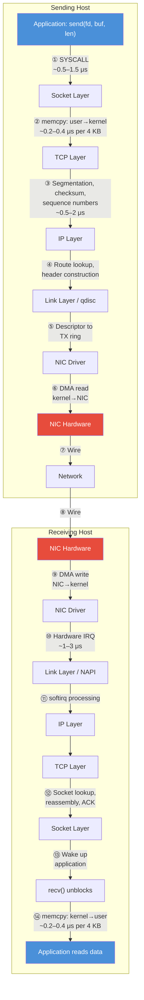

# 1.1 Traditional Networking: The Socket Model

To appreciate what RDMA does, you first need a precise understanding of what happens when an application sends data over a conventional TCP/IP socket. The socket API---`socket()`, `bind()`, `connect()`, `send()`, `recv()`---is elegant in its simplicity. It presents the network as a file descriptor, a byte stream that the programmer reads from and writes to. But that simplicity hides an enormous amount of machinery, and every piece of that machinery costs time and CPU cycles.

This section traces a single message from the moment an application calls `send()` to the moment the bytes leave the wire, and then follows the reverse path on the receiving side. We will quantify each source of overhead and show why, on modern hardware, the software stack has become the bottleneck rather than the network itself.

## The Anatomy of a `send()` Call

Consider an application that calls `send(fd, buffer, 4096, 0)` to transmit 4 KB of data over a connected TCP socket. Here is what happens, step by step:

### Step 1: System Call Entry

The `send()` call is a wrapper around the `sendto()` system call. Entering the kernel requires a privilege level transition---from ring 3 (user mode) to ring 0 (kernel mode) on x86 architectures. This transition involves:

- Saving user-space register state onto the kernel stack
- Switching the stack pointer to the kernel stack
- Executing the `SYSCALL` instruction (or `SYSENTER` on older hardware)
- Looking up the system call handler in the syscall table
- Performing security checks (e.g., verifying the file descriptor)

On modern x86-64 hardware, the raw cost of the `SYSCALL`/`SYSRET` pair is roughly **100--150 nanoseconds** when Spectre/Meltdown mitigations are disabled. With Kernel Page Table Isolation (KPTI) enabled---which is the default on virtually all production systems since 2018---this cost rises to **500--1500 nanoseconds** because the kernel must flush TLB entries and switch page tables. This cost is paid on every single `send()` and `recv()` call.

### Step 2: Socket Layer Processing

Once inside the kernel, the socket layer performs:

- **File descriptor lookup**: The kernel resolves the integer file descriptor to a `struct socket`, then to the protocol-specific `struct sock`. This involves at minimum one hash table lookup.
- **Socket state validation**: Is the socket connected? Is it in an error state? Is the send buffer full?
- **Socket buffer allocation**: The kernel allocates an `sk_buff` (socket buffer) structure---Linux's fundamental network data container. Each `sk_buff` carries metadata (protocol headers, timestamps, routing information) in addition to the data payload. Allocating an `sk_buff` involves a slab allocator call, which on a hot path costs **50--200 nanoseconds**.

### Step 3: Data Copy --- User Space to Kernel

The data must be copied from the application's buffer in user-space virtual memory to the `sk_buff`'s data area in kernel memory. This copy is mandatory in the standard path for two reasons:

1. **Lifetime management**: The application is free to modify or deallocate its buffer immediately after `send()` returns. The kernel must own its own copy.
2. **Address space isolation**: The kernel cannot hold pointers into user-space memory that might be swapped out or remapped.

For our 4 KB message, this copy costs approximately **200--400 nanoseconds** depending on the CPU's memory subsystem. For larger messages, the cost scales linearly---a 64 KB message copy costs roughly **2--4 microseconds**. This is the first of potentially multiple data copies.

### Step 4: TCP Protocol Processing

The TCP layer performs substantial work:

- **Segmentation**: If the message exceeds the Maximum Segment Size (typically 1460 bytes for standard Ethernet, or ~9000 bytes with jumbo frames), the data is split into multiple segments.
- **Sequence number assignment**: Each byte in the stream receives a sequence number. The kernel updates the send-side sequence state.
- **Window management**: The kernel checks the receiver's advertised window and the congestion window to determine how much data can be sent.
- **Header construction**: A 20-byte (minimum) TCP header is prepended to each segment.
- **Checksum computation**: The TCP checksum is computed over the pseudo-header and payload. For 4 KB of data, this requires reading every byte. On modern CPUs with hardware CRC acceleration, this costs approximately **100--300 nanoseconds** for 4 KB.
- **Timer management**: The retransmission timer is (re)set.

The total TCP processing overhead is typically **500--2000 nanoseconds** per message, varying with message size and the complexity of the current connection state.

### Step 5: IP Layer Processing

The IP layer adds:

- **IP header construction**: A 20-byte IPv4 header (or 40-byte IPv6 header) is prepended.
- **Route lookup**: The kernel consults the routing table (FIB) to determine the next hop and outgoing interface. Cached routes make this fast in steady state, but it is still a non-trivial operation.
- **IP checksum**: Computed for the IP header (IPv4 only).
- **Fragmentation check**: If the packet exceeds the path MTU, fragmentation is required (rare in practice due to path MTU discovery).

### Step 6: Data Link Layer and Queuing

The packet enters the network device subsystem:

- **Queueing discipline (qdisc)**: Linux's traffic control layer applies queuing policies. Even the default `pfifo_fast` qdisc involves queue selection and enqueue/dequeue operations.
- **Ethernet header construction**: 14-byte Ethernet header (6-byte destination MAC, 6-byte source MAC, 2-byte EtherType).
- **Driver transmit function**: The NIC driver's `ndo_start_xmit()` function is called, which writes the packet descriptor into the NIC's transmit ring buffer.

### Step 7: NIC DMA and Transmission

The NIC's DMA engine reads the packet data from kernel memory into its own internal buffer, computes the Ethernet FCS (CRC-32), and transmits the frame on the wire. This is the one part of the process that does *not* involve the CPU---but the CPU had to set it all up.

### Step 8: System Call Return

Finally, the kernel returns to user space, reversing the privilege transition from Step 1. The application regains control, having spent---for a small 4 KB message on a modern system---somewhere between **2 and 10 microseconds** in kernel code.

## The Receive Path: Even More Expensive

The receive path is, in many ways, worse than the send path:

1. **Interrupt generation**: When a packet arrives, the NIC raises a hardware interrupt. The CPU must stop whatever it was doing, save state, and invoke the interrupt handler. Each hardware interrupt costs approximately **1--3 microseconds** including cache pollution.

2. **NAPI polling**: Modern Linux uses NAPI (New API), which transitions from interrupt-driven to polling mode under load. The NIC raises one interrupt, and then the kernel polls for additional packets. This amortizes interrupt cost across multiple packets but introduces a different trade-off: at low packet rates, the first packet still pays the full interrupt cost.

3. **DMA from NIC to kernel**: The NIC's DMA engine writes packet data into pre-allocated kernel buffers in a receive ring. This is efficient but requires the kernel to have pre-posted receive buffers.

4. **Protocol processing in softirq context**: TCP/IP receive processing runs in software interrupt (softirq) context. The kernel must:
   - Parse and validate Ethernet, IP, and TCP headers
   - Verify checksums (or trust hardware offload if available)
   - Match the packet to a socket (hash table lookup on the 4-tuple)
   - Reassemble out-of-order segments
   - Update receive window and generate ACKs
   - Append data to the socket's receive buffer

5. **Wake up the blocked application**: If the application is blocked in `recv()`, the kernel wakes it up by moving it from the wait queue to the run queue. This involves the scheduler and costs **1--5 microseconds**.

6. **Data copy --- Kernel to User Space**: When `recv()` runs, data is copied from the `sk_buff` chain in kernel memory into the application's user-space buffer. This is the second data copy for received data.

## Visualizing the Data Path

The following diagram traces the full send-and-receive path, highlighting every layer crossing and data copy:

## The Overhead Budget

Let us compile a realistic overhead budget for a single small (4 KB) message round trip on a modern server with 25 Gb/s Ethernet:

| Component | Send Path | Receive Path |
|---|---|---|
| System call transition (with KPTI) | 0.5--1.5 μs | 0.5--1.5 μs |
| Socket layer processing | 0.1--0.3 μs | 0.1--0.3 μs |
| Data copy (user ↔ kernel) | 0.2--0.4 μs | 0.2--0.4 μs |
| TCP processing | 0.5--2.0 μs | 0.5--2.0 μs |
| IP processing | 0.1--0.3 μs | 0.1--0.3 μs |
| Link layer / qdisc / driver | 0.2--0.5 μs | 0.2--0.5 μs |
| Interrupt handling | --- | 1.0--3.0 μs |
| **Subtotal (software)** | **1.6--5.0 μs** | **2.6--8.0 μs** |
| Wire time (25 Gb/s, 4 KB) | ~1.3 μs | ~1.3 μs |
| **Total one-way** | **~3--6 μs** | **~4--9 μs** |

The wire time for a 4 KB frame at 25 Gb/s is approximately 1.3 microseconds. The software overhead on the send path alone is *at least comparable to, and often several times larger than, the wire time*. For a round trip (send + receive on both sides), total application-to-application latency is typically **10--30 microseconds**, of which only about 2.6 microseconds is actually spent on the wire.

Note

These numbers assume a well-tuned Linux system with recent kernel, RSS (Receive Side Scaling) distributing interrupts across cores, and the application pinned to the same core as its interrupt. In less optimized configurations, latencies can be significantly worse---50 μs or more is common for untuned systems.

## The CPU Cost Problem

Latency is only half the story. The CPU cost per message determines how many messages a core can process per second, and therefore the total throughput of the system.

On a modern server, a single CPU core running TCP socket I/O can typically handle:

- **~1--2 million small messages per second** for request/response workloads (with `epoll` and careful tuning)
- **~5--15 Gb/s** of bulk throughput for streaming workloads

A 100 Gb/s NIC can push approximately 148 million 64-byte packets per second, or around 12 million 1024-byte messages per second. Saturating this link with traditional TCP sockets would require **6--12 CPU cores** dedicated entirely to network processing. On a dual-socket server with 64 cores, that is 10--20% of all CPU resources consumed by the network stack alone, leaving those cycles unavailable for actual application logic.

At 400 Gb/s---which is the current generation of datacenter networking---the problem becomes untenable. No amount of optimization to the kernel TCP/IP stack can close this gap, because the fundamental architecture requires the CPU to participate in every packet.

## What Cannot Be Fixed

It is worth noting what improvements have been attempted and where they hit walls:

- **TCP Offload Engines (TOE)**: Offload TCP processing to the NIC hardware. These largely failed in the market because they created a "second TCP stack" that was difficult to maintain, debug, and keep consistent with the kernel's implementation. Linux never accepted TOE into the mainline kernel.
- **Large Receive Offload (LRO) and Generic Receive Offload (GRO)**: Aggregate multiple received segments into larger buffers before passing them up the stack. This reduces per-packet overhead but does not eliminate the fundamental copies and system calls.
- **TCP zero-copy send (`MSG_ZEROCOPY`)**: Added in Linux 4.14, this avoids the send-side data copy for large messages by pinning user pages. However, it still requires the system call, kernel protocol processing, and comes with significant complexity (the application must track completion notifications to know when it can reuse the buffer). It does nothing for the receive path.
- **Busy polling (`SO_BUSY_POLL`)**: The application polls the NIC directly from the `recv()` system call path, avoiding the interrupt-to-wakeup latency. This reduces latency by 2--5 μs but burns CPU cycles continuously, and the data still traverses the full kernel stack.

Each of these optimizations shaves microseconds from specific parts of the pipeline. None of them eliminate the fundamental overhead: the operating system is in the data path, and removing it is not possible within the socket model.

This is the problem that RDMA was designed to solve.

Note

The numbers in this section are representative of 2020--2025 era server hardware (Intel Xeon Scalable or AMD EPYC processors, Linux 5.x/6.x kernels, 25--100 Gb/s Ethernet or InfiniBand). Specific measurements will vary with hardware generation, kernel version, and system configuration. The relative proportions, however, are remarkably stable: software overhead dominates wire time for small-to-medium messages on high-speed networks.

