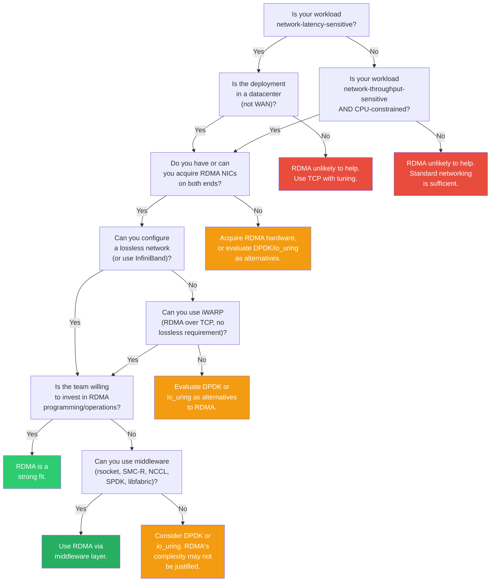

# 1.5 When (and When Not) to Use RDMA

RDMA delivers order-of-magnitude improvements for the right workloads. It also introduces hardware requirements, operational complexity, and programming difficulty that can dwarf its benefits for the wrong ones. This section provides a practical decision framework and addresses the misconceptions that most commonly lead engineers down the wrong path.

## Good Use Cases for RDMA

### High-Performance Computing (HPC)

HPC was RDMA's original and remains its most natural home. Scientific simulations (molecular dynamics, computational fluid dynamics, weather modeling) decompose a problem across hundreds or thousands of nodes that must exchange boundary data at every time step. The key characteristics that make RDMA essential:

- **Latency sensitivity**: Each time step involves a global barrier or nearest-neighbor exchange. The simulation's wall-clock time includes the sum of all communication latencies across all time steps. Reducing per-message latency from 20 μs (TCP) to 1.5 μs (RDMA) translates directly into faster time-to-result.
- **Tight coupling**: The compute-to-communicate ratio is often low---nodes compute for microseconds to milliseconds, then communicate. With TCP, the communication phase can dominate. With RDMA, it becomes negligible.
- **MPI**: The Message Passing Interface (MPI) is the dominant programming model in HPC. All major MPI implementations (Open MPI, MPICH, Intel MPI, MVAPICH2) use RDMA as their preferred transport when available.

RDMA has been ubiquitous in the top 500 supercomputers for over two decades. InfiniBand is the most common RDMA fabric in HPC, though RoCEv2 is making inroads in cloud HPC environments.

### Storage: NVMe over Fabrics (NVMe-oF)

Modern NVMe SSDs deliver random read latencies that vary dramatically by media type: Intel Optane (3D XPoint) drives achieve under 10 μs, while mainstream NAND-flash enterprise drives (Samsung PM9A3, Kioxia CM7) range from 70--120 μs at queue depth 1.[^1] Sequential throughput exceeds 7 GB/s on current-generation drives. When accessing NVMe devices over a network using traditional TCP, the network stack's overhead (15--30 μs round trip) adds meaningfully to the storage latency---and for the fastest storage media, can exceed the device latency itself.

[^1]: See the NVM Express specification and vendor datasheets. Optane P5800X: ~6 μs average read. Samsung PM9A3: ~70 μs random read at QD1.

NVMe over Fabrics with RDMA transport (NVMe-oF/RDMA) adds only 5--15 μs of fabric overhead on top of the underlying device latency.[^2] For Optane targets, this means total remote access latencies under 25 μs; for NAND targets, the fabric overhead is a small fraction of the overall latency. This enables:

[^2]: The 5--15 μs figure represents the incremental network fabric latency (RDMA transport + NVMe-oF protocol processing), not the total end-to-end I/O latency, which also includes the storage device's own access time.

- **Storage disaggregation**: Decoupling compute and storage, allowing them to scale independently. A compute node accesses remote NVMe drives as if they were local, with minimal performance penalty.
- **Shared storage**: Multiple compute nodes can access the same storage pool without a traditional SAN's overhead.
- **Efficient replication**: Storage systems like Ceph with RDMA-enabled messaging can replicate data across nodes at near-wire-speed with minimal CPU consumption.

Major storage vendors (Pure Storage, NetApp, Dell EMC, VAST Data) use RDMA extensively in their storage arrays, and hyperscalers (Microsoft Azure, Google Cloud) use RDMA for internal storage traffic.

### Database Replication and Distributed Databases

Distributed databases face a fundamental tension: strong consistency requires synchronous replication, but synchronous replication over TCP introduces latencies that destroy transaction throughput. RDMA changes this equation:

- **Synchronous replication in <10 μs**: A database can replicate a write-ahead log entry to two or more replicas and receive acknowledgements in under 10 μs total, compared to 50--100 μs with TCP. This makes synchronous replication viable for latency-sensitive workloads.
- **RDMA-based consensus**: Research and production systems have demonstrated that distributed protocols run 5--10x faster over RDMA. FaRM (Microsoft Research, NSDI 2014 / SOSP 2015) uses one-sided RDMA reads for data access and achieves millions of distributed transactions per second. HERD (SIGCOMM 2014) demonstrated that RDMA-based key-value stores can achieve 26 million ops/sec on a single server. Pilaf (ATC 2013) and DrTM (SOSP 2015) explored complementary design points using RDMA reads and hardware transactional memory, respectively.
- **Remote memory access for index lookups**: An RDMA Read can fetch a remote B-tree node or hash table bucket in 2--3 μs without involving the remote CPU, enabling distributed data structures with near-local performance.

Oracle RAC on Exadata uses RDMA (via the RDS protocol over InfiniBand) for Cache Fusion inter-node communication.[^3] Microsoft SQL Server benefits from RDMA through SMB Direct (SMB over RDMA) for storage I/O.

[^3]: Oracle RAC's RDMA support is specific to Oracle Exadata engineered systems; standard RAC deployments use UDP or TCP. See Oracle's [Cache Fusion on Exadata documentation](https://www.oracle.com/a/ocom/docs/database/rac-cache-fusion-performance-optimizations-on-exadata.pdf).

### Machine Learning Training

Distributed ML training (particularly data-parallel training with gradient synchronization) generates enormous volumes of inter-node traffic with strict latency requirements:

- **Gradient all-reduce**: After each mini-batch, workers must synchronize gradients. For a model with 175 billion parameters (GPT-3 scale), each synchronization involves transmitting hundreds of gigabytes across the training cluster.
- **Pipeline parallelism**: Activations and gradients flow between pipeline stages at each micro-batch, requiring low-latency transfers.
- **Tensor parallelism**: Requires all-to-all communication within each layer, where latency directly impacts training throughput.

NVIDIA's NCCL (NVIDIA Collective Communications Library) uses RDMA (both InfiniBand and RoCEv2) as its primary transport for multi-node training. Google's TPU pods use a proprietary RDMA-like interconnect. Meta, Microsoft, and all major AI labs run their training clusters on RDMA fabrics.

The economics are simple: if a 1,000-GPU training run takes 30 days with TCP and 24 days with RDMA (due to reduced communication overhead), the 6 days of saved GPU time at ~$2/GPU-hour represents ~$288,000 in savings for a single training run.

### Financial Trading and Low-Latency Messaging

Ultra-low-latency trading systems, where microseconds translate to millions of dollars, were early adopters of RDMA:

- **Market data distribution**: Feed handlers receive exchange data over RDMA and distribute it to trading engines via RDMA, minimizing the "tick-to-trade" latency.
- **Order routing**: Order management systems use RDMA to communicate with matching engines and risk systems.
- **Risk computation**: Distributed risk calculations use RDMA for inter-node communication.

Companies like Solarflare (now Xilinx/AMD) built their business on ultra-low-latency kernel-bypass NICs for trading, using their OpenOnload user-space TCP/UDP stack rather than RDMA---achieving similar latency goals through a different mechanism.[^4] Mellanox/NVIDIA ConnectX adapters with RoCE are also widely deployed in trading infrastructure. Major exchange colocation facilities support RDMA-capable hardware, and trading firms routinely use RDMA for internal communication between components.

[^4]: Solarflare's approach (kernel-bypass TCP via OpenOnload) and RDMA both eliminate kernel overhead from the data path. The distinction matters: OpenOnload maintains TCP compatibility while RDMA provides a fundamentally different API with one-sided memory access semantics.

## Anti-Patterns: When RDMA Is the Wrong Choice

### Wide-Area Networks (WAN)

RDMA's latency advantage is irrelevant when the network itself introduces milliseconds of latency. On a WAN link with 10 ms of propagation delay, whether the software stack adds 1 μs (RDMA) or 20 μs (TCP) is a rounding error---0.01% vs. 0.2% of total latency.

Moreover, RDMA's reliable transports (InfiniBand, RoCEv2) assume a lossless or near-lossless network. WAN links have packet loss rates of 0.01--1%, which causes catastrophic performance degradation for RDMA's go-back-N retransmission on some implementations. iWARP (RDMA over TCP) can tolerate lossy networks, but then you are back to TCP's overhead, and the latency advantage is lost in the WAN propagation delay anyway.

Note

There is active research on extending RDMA-like semantics beyond traditional single-cluster deployments. Google's Snap (SOSP 2019) is a userspace networking system deployed on over half of Google's fleet, with its Pony Express component providing RDMA-like memory semantics. Google's 1RMA (SIGCOMM 2020) re-envisions remote memory access for multi-tenant datacenter environments.[^5] These are not standard RDMA and require custom hardware/software stacks. For now, standard RDMA (InfiniBand, RoCE, iWARP) is a single-datacenter technology.

[^5]: Snap: Marty et al., "Snap: a Microkernel Approach to Host Networking," SOSP 2019. 1RMA: Singhvi et al., "1RMA: Re-Envisioning Remote Memory Access for Multi-Tenant Datacenters," SIGCOMM 2020. Both are Google projects.

### Multi-Tenant Environments Without Isolation

RDMA's traditional deployment model assumes a trusted, cooperating set of applications on a purpose-built network. In a multi-tenant cloud environment, several challenges arise:

- **Security**: RDMA's memory registration model gives applications direct NIC access. Without careful isolation (e.g., using SR-IOV Virtual Functions), one tenant could potentially interfere with another's traffic.
- **Performance isolation**: RoCEv2's reliance on Priority Flow Control (PFC) means that a single misbehaving tenant generating excessive traffic can trigger PFC pause frames that stall *all* traffic on the link, affecting every other tenant. This "PFC storm" problem is one of the most challenging operational issues in RDMA-over-Ethernet deployments.
- **Fairness**: RDMA's polling-based model can consume CPU cycles aggressively, and the NIC's hardware resources (queue pairs, memory registration entries, doorbell pages) are finite and must be shared.

Cloud providers have addressed many of these challenges (Azure uses RDMA extensively in production, including for tenant VM storage), but it requires significant engineering: SR-IOV for NIC virtualization, hardware-enforced rate limiting, PFC watchdog mechanisms, and careful resource partitioning. A small deployment that does not invest in this infrastructure will encounter these problems.

### Small Deployments Where Operational Complexity Is Not Justified

RDMA hardware and network configuration are significantly more complex than standard Ethernet:

- **RoCEv2 requires**: Lossless Ethernet configuration (PFC), ECN marking at switches, proper DSCP/priority mapping, compatible switch firmware, and careful MTU configuration across the entire path. A single misconfigured switch can cause silent performance degradation.
- **InfiniBand requires**: A dedicated InfiniBand fabric with IB switches, Subnet Manager (SM) software, and separate management tooling.
- **Debugging**: RDMA problems are harder to diagnose than TCP problems. There is no `tcpdump` for RDMA (though tools like `rdma-core`'s `ibdump` and Mellanox's `mlx5_trace` exist). Connection failures often produce opaque error codes.

For a deployment of 3--5 servers running a web application, the operational overhead of RDMA will far exceed any performance benefit. TCP sockets with tuning (busy polling, `MSG_ZEROCOPY`, io_uring) can achieve good enough performance for most small-scale workloads.

### Workloads That Are Not Network-Bound

If your application spends 95% of its time in disk I/O or computation and 5% in network communication, making the network 10x faster buys you ~4.5% (Amdahl's Law). Profile first. RDMA pays off when networking is a significant fraction of the critical path, and it pays off enormously when it is the dominant fraction.

## The Lossless Network Requirement for RoCE

This topic deserves special attention because it is the single largest source of operational pain in RDMA deployments, and it is unique to RoCEv2 (InfiniBand is inherently lossless by design).

Standard Ethernet is a best-effort network: switches drop packets when their buffers overflow. TCP handles this gracefully through selective retransmission. RDMA's transport layer behaves very differently. On InfiniBand and early RoCE implementations, the hardware transport uses **go-back-N retransmission**: a single dropped packet causes the sender to retransmit that packet *and every subsequent packet in the window*, even if they were received correctly. With typical windows of 64--128 packets, a single drop can reduce effective throughput by orders of magnitude. The Mittal et al. IRN paper (SIGCOMM 2018) showed that even 0.1% packet loss can reduce RDMA throughput by 50% or more with go-back-N. Newer NVIDIA ConnectX-6 and later adapters support selective repeat retransmission, which significantly improves loss tolerance, but this is not universal across all RDMA hardware.

To prevent packet loss, RoCEv2 deployments use **Priority Flow Control (PFC)**, an Ethernet mechanism (IEEE 802.1Qbb) that allows a switch to send a PAUSE frame to an upstream sender when its buffers for a specific priority class are approaching full. The upstream sender stops transmitting until the switch signals that buffer space is available.

PFC prevents packet loss but introduces new problems:

- **Head-of-line blocking**: If one flow causes a PFC pause, all flows on the same priority class and physical link are paused, even if they are destined for different, uncongested ports.
- **PFC storms**: A feedback loop where PFC pause frames propagate across the fabric, potentially deadlocking the entire network. This is a well-documented operational nightmare. Microsoft's SIGCOMM 2016 paper on RoCE deployment at scale documented PFC storms causing network-wide outages, and their follow-up work (SIGCOMM 2023, "Revisiting Network Support for RDMA") describes the monitoring and mitigation infrastructure required to operate RoCE reliably---including per-switch PFC watchdog timers that forcibly drop traffic to break deadlocks. The operational cost of this infrastructure is non-trivial.
- **Interaction with non-RDMA traffic**: PFC must be configured on specific priority classes and kept separate from best-effort traffic. Misconfiguration can cause non-RDMA traffic to be paused by RDMA congestion, or vice versa.

To mitigate these issues, production RoCEv2 deployments also use:

- **ECN (Explicit Congestion Notification)**: Switches mark packets (set ECN bits) rather than dropping them. The RDMA NIC's hardware congestion control algorithm (DCQCN on Mellanox/NVIDIA) reacts to ECN marks by reducing its sending rate. This keeps buffer occupancy low, reducing the frequency of PFC events.
- **Buffer management**: Careful allocation of switch buffer space to RDMA priority classes, based on the number of ports, link speeds, and expected congestion patterns.
- **PFC watchdog**: Mechanisms that detect and break PFC storms by dropping traffic on the offending port after a timeout.

Note

The operational complexity of lossless Ethernet is the primary reason many organizations choose InfiniBand for RDMA despite its higher cost and separate fabric requirement. InfiniBand's credit-based flow control is simpler, more robust, and does not suffer from PFC storms. If your deployment can justify a dedicated RDMA fabric, InfiniBand is often the operationally simpler choice.

## Common Misconceptions

### "RDMA Is Always Faster"

RDMA is faster for latency-sensitive, message-intensive workloads. But:

- For bulk streaming of large data (e.g., a single 10 GB file transfer), TCP with tuning can saturate a 100 Gb/s link. RDMA will do it with less CPU, but the transfer time is the same---both are wire-rate.
- For applications that do one network operation per second, the 20 μs vs. 2 μs difference is irrelevant.
- For workloads with computation between network operations, the network latency may not be on the critical path.

### "RDMA Means InfiniBand"

RDMA is a capability, not a specific network technology. It is available over InfiniBand, Ethernet (RoCEv1/v2), and TCP (iWARP). RoCEv2 is the most widely deployed RDMA transport in cloud datacenters. You may already have RDMA-capable NICs in your servers---Mellanox/NVIDIA ConnectX adapters and Broadcom/Emulex adapters support RoCEv2.

### "RDMA Requires Application Rewrites"

While native RDMA programming (using Verbs) does require significant application changes, many applications can benefit from RDMA through transparent middleware:

- **rsocket**: A socket-compatible library that uses RDMA under the hood. Drop-in replacement for many applications via `LD_PRELOAD`.
- **SMC-R (Shared Memory Communications over RDMA)**: A Linux kernel protocol (RFC 7609, merged in Linux 4.11) that transparently uses RDMA for TCP connections between supported endpoints.
- **libfabric/OFI**: An abstraction layer that can use RDMA or other transports, used by MPI implementations and storage systems.
- **Application-specific RDMA libraries**: SPDK (for storage), UCX (for HPC/ML), NCCL (for ML training).

### "RDMA Is Only for Big Companies"

Cloud providers now offer RDMA-capable instances:
- **Azure**: HBv4, NDv5, and other HPC/GPU VM sizes include InfiniBand
- **AWS**: EFA (Elastic Fabric Adapter) provides RDMA-like capabilities for HPC instances
- **GCP**: GPU VMs with RDMA support for ML workloads
- **Oracle Cloud**: Bare-metal instances with RDMA over cluster networking

You can experiment with RDMA on a pair of servers with ConnectX-4 or later NICs (available used for under $100) connected back-to-back or through a standard Ethernet switch (for RoCEv2; PFC configuration optional for a two-node lab).

## Decision Framework

The following flowchart helps determine whether RDMA is appropriate for your workload:

## Cost-Benefit Summary

| Factor | Cost | Benefit |
|---|---|---|
| **Hardware** | RDMA NICs: $200--2,000 per port. InfiniBand switches: $5,000--50,000. | 10x lower latency, 50--500x better CPU efficiency |
| **Network configuration** | PFC/ECN tuning for RoCEv2, or dedicated IB fabric | Lossless, predictable network behavior |
| **Development effort** | Verbs API learning curve: weeks to months. Application redesign for buffer management. | Native control over NIC hardware, maximum performance |
| **Operations** | New monitoring tools, debugging skills, failure modes | Measurable business impact: faster training, lower storage latency, higher throughput per server |

For HPC, ML training, and high-performance storage, RDMA is table stakes---you cannot compete without it. For web applications, microservices, and anything WAN-connected, RDMA is the wrong tool. The interesting decisions are in the middle: databases, financial systems, and medium-scale analytics where the workload might or might not be network-bound enough to justify the investment.

Note

If you are unsure whether RDMA will help your specific workload, the best approach is empirical. Set up a two-node test environment (ConnectX-5 or later, back-to-back or through a switch), run the standard benchmarks (<code>ib_write_lat</code>, <code>ib_write_bw</code>, <code>ib_send_lat</code> from the <code>perftest</code> package), and then prototype your application's critical communication path using RDMA. The perftest tools take minutes to set up and immediately show you the latency and throughput your hardware can achieve. Chapter 12 walks through this benchmarking process in detail.

## What Comes Next

The short version of this chapter: the socket model's kernel involvement is the bottleneck on modern networks, DMA already handles data movement but the kernel stays in the loop, and RDMA removes the kernel entirely by letting applications drive the NIC directly. Nothing else---not DPDK, not io_uring, not XDP---does all of this at once. But RDMA demands specialized hardware, lossless networking (for RoCE), and a fundamentally different programming model. Whether that trade-off pays off depends on your workload.

Chapter 2 traces how RDMA evolved from a niche supercomputing technology into a mainstream datacenter capability, and introduces the three transports---InfiniBand, RoCE, and iWARP---that you will work with throughout this book.
