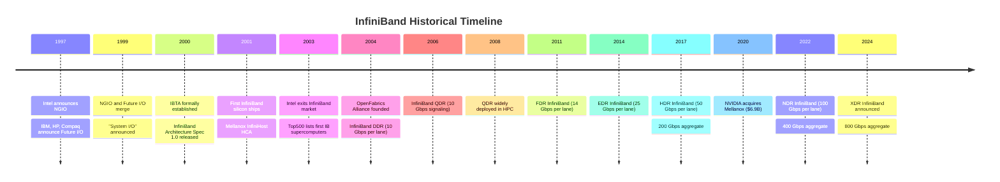

# 2.1 InfiniBand Origins

## The Server I/O Crisis

To understand why InfiniBand was created, you need to understand the state of server hardware in the late 1990s. The Peripheral Component Interconnect (PCI) bus---the standard interconnect between a processor and its I/O devices---was running out of headroom. The original PCI specification, ratified in 1992, delivered a theoretical peak of 133 MB/s on a 32-bit bus at 33 MHz. By 1995, PCI 2.1 pushed this to 266 MB/s with a 64-bit variant, and by 1998, PCI-X was under development to reach 1 GB/s. But these improvements were incremental, and the shared-bus architecture of PCI had fundamental scaling problems: every device on the bus contended for the same bandwidth, adding devices degraded performance for all of them, and the electrical characteristics of the parallel bus limited both clock speeds and physical reach.

Meanwhile, network speeds were doubling. Gigabit Ethernet was arriving. Storage was moving from SCSI to Fibre Channel at 1 Gb/s and beyond. Server consolidation was driving multi-processor systems with ever-increasing I/O demands. The industry consensus was clear: PCI needed a successor, and that successor needed to be a switched, point-to-point fabric rather than a shared bus.

Two competing groups set out to build it.

## NGIO and Future I/O: Parallel Paths

**Next Generation I/O (NGIO)** was Intel's initiative, announced in 1997. Intel designed NGIO as a channel-based, switched fabric that would replace PCI inside servers. The design used small, fixed-size cells---an approach influenced by ATM networking---and defined a layered architecture with a physical layer, a link layer, and a transport layer. Intel brought along a coalition that included Dell, Hitachi, NEC, Sun Microsystems, and others. The core idea was elegant: instead of a shared bus, each device would get its own dedicated point-to-point link to a central switch, eliminating contention and enabling each link to run at full speed independently.

**Future I/O (FIO)** emerged almost simultaneously from an alliance led by IBM, Hewlett-Packard, and Compaq---three of the largest server manufacturers in the world at the time. FIO took a different technical approach, emphasizing variable-length packets rather than fixed-size cells, and placing greater emphasis on reliability, partitioning, and enterprise-class features like hardware-based quality of service. FIO also envisioned its fabric extending beyond a single server chassis to connect clusters of machines, an ambition that would prove prescient.

The existence of two competing, well-funded standards for essentially the same problem created uncertainty that threatened to slow adoption of either one. OEMs did not want to bet on the wrong horse. Silicon vendors did not want to tape out chips for a standard that might lose. The pressure to merge was enormous.

## The Merger: InfiniBand Is Born (1999--2000)

In October 1999, the NGIO and Future I/O groups announced they would combine their efforts into a single specification under a new name: **System I/O**, which was quickly renamed **InfiniBand**. The merged specification drew from both predecessors: it adopted the switched-fabric, point-to-point architecture that both groups favored, used variable-length packets (from FIO rather than NGIO's fixed cells), and incorporated a rich set of management and partitioning features.

The **InfiniBand Trade Association (IBTA)** was formally established in 2000 to own and evolve the specification. Its founding members represented a who's-who of the server industry: Intel, IBM, HP, Compaq, Dell, Microsoft, Sun Microsystems, and others. The IBTA published the InfiniBand Architecture Specification 1.0 in October 2000---a massive document exceeding 2,000 pages that defined everything from the physical layer (signaling rates, cable specifications, connector pinouts) through the link and network layers to the transport layer and the Verbs programming interface.

The initial vision was ambitious: InfiniBand would replace PCI as the primary I/O interconnect inside every server. It would connect processors to storage controllers, network adapters, GPUs, and other peripherals through a high-speed switched fabric. It would also extend beyond the chassis to provide inter-server communication, collapsing the separate networks for Ethernet, Fibre Channel, and inter-process communication into a single unified fabric.

## The Pivot: From I/O Bus to Network Fabric

InfiniBand's grand ambition to replace PCI collided with economic reality almost immediately. In 2001, the dot-com bust cratered IT spending. Server manufacturers, facing falling revenues, were unwilling to invest in a wholesale redesign of their I/O architectures. More critically, PCI was not actually dead---PCI Express (PCIe), a new serial point-to-point design, was under development and would deliver many of the same bandwidth and scaling benefits that InfiniBand promised for I/O, without requiring a completely new infrastructure. PCIe was backward-compatible enough in its software model that existing driver ecosystems could be preserved. Intel, a founding IBTA member, was simultaneously developing PCIe, and by 2003 had effectively chosen PCIe as the future of internal server I/O.

Intel's withdrawal from InfiniBand as a server I/O technology was a watershed moment. With the dominant processor manufacturer backing PCIe for internal interconnects, InfiniBand's original mission was effectively over. Several early InfiniBand silicon vendors---including the startup Banderacom and divisions within Intel itself---exited the market.

But InfiniBand had a second life waiting for it. The technology's characteristics---low latency (under 5 microseconds), high bandwidth (10 Gbps per link initially, scaling with each generation), hardware-offloaded reliable transport, and native support for RDMA---made it spectacularly well-suited for a different problem: connecting the nodes of a compute cluster. High-performance computing (HPC) applications, running on clusters of hundreds or thousands of nodes, needed exactly the kind of low-latency, high-throughput, CPU-efficient communication that InfiniBand provided. MPI (Message Passing Interface), the dominant programming model for parallel scientific computing, could run directly over InfiniBand verbs, bypassing the kernel and achieving message rates and latencies that Ethernet-based clusters could not approach.

By the mid-2000s, InfiniBand had become the dominant interconnect for HPC clusters. The Top500 list of the world's fastest supercomputers tells the story: InfiniBand's share of Top500 interconnects grew steadily from near zero in 2003 to over 40% by 2010, and it has remained the technology of choice for the highest-performance systems ever since.

## The Key Companies

Three companies defined the early InfiniBand market, and their trajectories shaped the technology's evolution.

**Mellanox Technologies**, founded in 1999 in Yokneam, Israel, became the dominant InfiniBand company. Mellanox designed both Host Channel Adapters (HCAs)---the InfiniBand equivalent of network interface cards---and switch silicon. Its InfiniHost and later ConnectX families of HCAs became the de facto standard for InfiniBand connectivity. Mellanox's strategy of aggressive performance optimization, tight integration between hardware and software, and relentless generation-over-generation speed increases (SDR to DDR to QDR to FDR to EDR to HDR) kept it ahead of competitors and established InfiniBand as a performance leader. In 2020, NVIDIA acquired Mellanox for $6.9 billion---a transaction that signaled the convergence of high-performance networking with GPU-accelerated computing.

**QLogic** was Mellanox's primary competitor in the HCA market through the 2000s. QLogic offered both InfiniBand HCAs and Fibre Channel adapters, and competed for HPC cluster deployments. However, QLogic struggled to match Mellanox's pace of innovation and market share. QLogic sold its InfiniBand business to Intel in 2012, which used the technology as the foundation for its Omni-Path Architecture---a related but proprietary interconnect aimed at HPC.

**Voltaire** was a leading manufacturer of InfiniBand switches. Founded in Israel in 1997, Voltaire built high-port-count InfiniBand switch systems for large clusters. Voltaire was acquired by Mellanox in 2011, consolidating the InfiniBand switching market under Mellanox's umbrella and giving Mellanox control of both endpoints and network fabric.

The InfiniBand specification and the InfiniBand Trade Association (IBTA) still exist and continue to evolve the standard. However, the practical InfiniBand market is overwhelmingly dominated by a single vendor---NVIDIA (formerly Mellanox)---for both HCA and switch silicon. This has implications for pricing, roadmap influence, and interoperability testing that practitioners should be aware of.

## InfiniBand Speed Generations

InfiniBand's speed grades have followed a consistent naming convention tied to the per-lane signaling rate. Each generation approximately doubles the per-lane data rate, and links can be bonded in widths of 1x, 4x, or 12x to multiply aggregate throughput.

| Generation | Per-Lane Rate | 4x Link Rate | Year Introduced |
|------------|--------------|---------------|-----------------|
| SDR        | 2.5 Gbps     | 10 Gbps       | 2001            |
| DDR        | 5.0 Gbps     | 20 Gbps       | 2005            |
| QDR        | 10 Gbps      | 40 Gbps       | 2008            |
| FDR        | 14 Gbps      | 56 Gbps       | 2011            |
| EDR        | 25 Gbps      | 100 Gbps      | 2014            |
| HDR        | 50 Gbps      | 200 Gbps      | 2017            |
| NDR        | 100 Gbps     | 400 Gbps      | 2022            |
| XDR        | 200 Gbps     | 800 Gbps      | 2024            |

Each generation has also brought improvements beyond raw speed: lower latency, more advanced congestion management, better adaptive routing, and richer hardware offloads (such as in-network computing features in HDR and NDR).

## The InfiniBand Architecture in Brief

InfiniBand defines a complete networking architecture, not merely a physical layer. Several concepts introduced by InfiniBand became foundational to all of RDMA:

**Queue Pairs (QPs)** are the fundamental communication abstraction. Each QP consists of a Send Queue and a Receive Queue. The application posts work requests to these queues, and the hardware processes them without kernel involvement. This queue-based model, where the application and the hardware communicate through shared memory structures, is the architectural basis for kernel bypass in all RDMA transports.

**Completion Queues (CQs)** receive completion notifications when work requests finish. The separation of request submission (to the QP) from completion notification (from the CQ) enables asynchronous, pipelined operation.

**Memory Regions (MRs)** define the areas of application memory that the HCA is permitted to access. Registering a memory region pins the physical pages and provides the HCA with a translation table from virtual to physical addresses. This registration mechanism is essential for zero-copy operation and is common to all RDMA transports.

**The Subnet Manager (SM)** is a software agent that configures the InfiniBand network: it discovers the topology, assigns addresses (LIDs---Local Identifiers), computes routing tables, and distributes them to all switches and endpoints. This centralized management model is specific to InfiniBand (Ethernet networks use distributed protocols like spanning tree and OSPF instead), and it enables features like deterministic routing and fine-grained partitioning.

These architectural concepts---queue pairs, completion queues, memory regions, and the Verbs programming interface that ties them together---were generalized beyond InfiniBand to form the basis of the common RDMA programming model. When iWARP and RoCE were later developed, they adopted the same abstractions, which is why a single API (libibverbs) can drive all three transports.

The Verbs API is not formally part of the InfiniBand specification. It originated as a software abstraction in the OpenFabrics community, inspired by the InfiniBand specification's description of how applications interact with HCAs. The important point is that the *concepts*---queue pairs, work requests, completions, memory registration---came from InfiniBand and were then generalized.

## Legacy and Influence

InfiniBand's influence extends far beyond its direct market share. The technology established several principles that now pervade all high-performance networking:

1. **Hardware-offloaded reliable transport**: The idea that the NIC, not the CPU, should manage sequence numbers, retransmissions, and acknowledgments for reliable delivery.

2. **Kernel bypass as an architectural principle**: The demonstration that moving the data path out of the kernel and into user space---with hardware enforcing protection---could deliver order-of-magnitude latency improvements.

3. **Memory semantics over the network**: The concept that a remote machine's memory can be read and written directly, without involving the remote CPU, fundamentally changed how distributed systems could be architected.

4. **The Verbs programming model**: The queue-based, asynchronous, event-driven API that all RDMA applications use today traces its lineage directly to InfiniBand.

InfiniBand began as an ambitious attempt to reinvent server I/O, was humbled by market forces into a niche interconnect, and then proved so successful in that niche that its programming model became the universal standard for high-performance network communication. It is a story of a technology finding its true purpose---and that purpose turned out to be more significant than the original vision.
