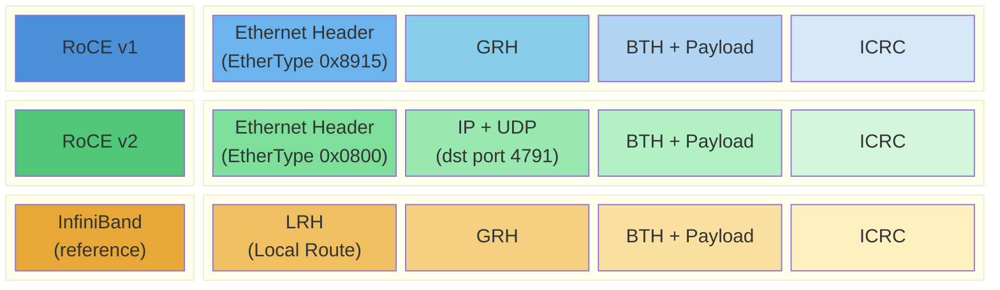

# 2.3 RoCE and RoCE v2

## The Best of Both Worlds

By the late 2000s, the RDMA landscape presented a clear dilemma. InfiniBand delivered outstanding performance but required a dedicated, parallel network fabric. iWARP ran over existing Ethernet but carried the overhead and complexity of TCP. What the market wanted was a third option: InfiniBand's efficient, lightweight RDMA transport running directly over the Ethernet infrastructure that already connected every machine in every datacenter.

RoCE---RDMA over Converged Ethernet---was that option. Developed by the InfiniBand Trade Association and first specified in 2010, RoCE took InfiniBand's transport protocol and placed it directly on top of Ethernet frames, bypassing TCP and IP entirely. The result was RDMA with InfiniBand-class latency and throughput, delivered over standard Ethernet cabling and Ethernet NICs. It was a conceptually simple and technically elegant solution, and it has become the dominant RDMA transport for cloud and datacenter deployments.

But the first version of RoCE had a critical limitation that took four years to resolve, and the resolution---RoCE v2---required a careful engineering compromise that shaped the modern datacenter network. Understanding the distinction between RoCE v1 and v2 is essential for any RDMA practitioner.

## RoCE v1: InfiniBand Transport on Ethernet (2010)

RoCE v1 works by taking an InfiniBand transport-layer packet---the same packet format used by InfiniBand HCAs, with the same headers, the same BTH (Base Transport Header), and the same payload format---and encapsulating it directly in an Ethernet frame. The Ethernet frame uses a dedicated EtherType, **0x8915**, to identify its payload as an InfiniBand transport packet rather than an IP datagram.

From the perspective of the RDMA hardware, very little changes between InfiniBand and RoCE v1. The transport layer---queue pairs, sequence numbers, acknowledgments, retransmission, RDMA Read/Write/Send semantics---is identical. The main difference is below the transport layer: instead of InfiniBand's link layer (with its Local Identifiers, Virtual Lanes, and Subnet Manager-assigned routing), RoCE v1 uses Ethernet's link layer (with MAC addresses and VLAN tags).

This reuse of InfiniBand's transport layer was a deliberate strategy. It allowed Mellanox (the primary RoCE developer) to add RoCE support to its ConnectX adapters with relatively modest silicon changes, and it allowed the same software stack---libibverbs, librdmacm, and the kernel RDMA subsystem---to drive RoCE hardware with minimal modifications.

RoCE v1 appeared in the ConnectX-2 adapter with a firmware update and was natively supported in ConnectX-3. Early deployments demonstrated latency and throughput comparable to InfiniBand over the same link speeds, validating the design approach.

### The Layer 2 Problem

RoCE v1's simplicity was also its greatest limitation. Because RoCE v1 frames are Ethernet frames with a non-IP EtherType, they are **Layer 2 only**. Standard IP routers do not know how to forward them. They cannot cross subnet boundaries. They cannot be load-balanced across multiple paths using Equal-Cost Multi-Path (ECMP) routing, because ECMP operates on IP headers that RoCE v1 frames do not have.

In a small cluster connected by a single Ethernet switch, this is not a problem. But modern datacenters are built on multi-tier, routed network fabrics---often leaf-spine or fat-tree topologies where every path between two servers crosses at least one Layer 3 boundary. In these environments, RoCE v1 traffic was confined to a single Layer 2 domain (a single VLAN or subnet), severely limiting its utility.

This Layer 2 limitation also prevented RoCE v1 from benefiting from the sophisticated traffic engineering capabilities of modern datacenter networks: ECMP load balancing across spine switches, traffic isolation between tenants using IP routing, and the operational simplicity of Layer 3-only network designs where every switch link is a routed interface.

## RoCE v2: UDP/IP Encapsulation (2014)

RoCE v2, specified by the IBTA in 2014, solved the routing problem by adding IP and UDP headers beneath the InfiniBand transport packet. The RoCE v2 packet format places the same InfiniBand BTH and payload inside a UDP datagram, using a well-known destination port: **4791**.

The choice of UDP as the encapsulation layer---rather than TCP or a raw IP protocol---was deliberate and consequential:

**Statelessness.** UDP is stateless: there is no connection setup, no sequence numbers, no acknowledgment processing, and no congestion window to maintain. The InfiniBand transport layer, which sits above UDP in the RoCE v2 stack, already handles all of these functions. Using TCP would have meant duplicating reliable transport functionality, adding latency and complexity for no benefit---which is precisely the problem iWARP suffers from. UDP allows the InfiniBand transport layer to operate as if it were running natively, with the UDP/IP headers serving purely as a routing envelope.

**ECMP compatibility.** Modern datacenter networks distribute traffic across multiple equal-cost paths by hashing on the 5-tuple (source IP, destination IP, source port, destination port, protocol). By placing RoCE traffic inside UDP datagrams, RoCE v2 gives network switches the entropy they need to distribute RDMA flows across spine switches. The source UDP port is typically derived from a hash of the queue pair number or other per-flow state, providing good flow distribution even when many RDMA connections exist between the same pair of hosts.

**Routability.** With standard IP headers, RoCE v2 packets are routable across Layer 3 boundaries by any IP router, without requiring the router to understand RDMA or InfiniBand protocols. The router sees an ordinary UDP/IP packet and forwards it according to its routing table.

The UDP destination port 4791 for RoCE v2 is assigned by IANA. The source port is not fixed---it is typically chosen by the NIC to provide entropy for ECMP hashing. A common implementation hashes the source and destination QP numbers to generate the source port, ensuring that different QP connections between the same hosts take different ECMP paths.

## The Lossless Ethernet Requirement

RoCE v2 solved the routing problem, but it introduced (or more precisely, inherited from RoCE v1) a different operational challenge: **the need for a lossless Ethernet network**.

InfiniBand's transport layer was designed for a lossless fabric. InfiniBand's link layer implements credit-based flow control that prevents buffer overflow at every hop, ensuring that packets are never dropped due to congestion. The reliable transport protocol in InfiniBand does include retransmission capabilities (go-back-N retransmission), but these are intended as a safety net for rare hardware errors, not as a routine response to congestion-induced loss. The retransmission path is slow, expensive, and can cascade into severe performance degradation if triggered frequently.

When this same transport layer is placed on top of Ethernet---a network that was designed to tolerate and recover from packet loss---a mismatch arises. If an Ethernet switch drops a RoCE packet due to buffer overflow, the InfiniBand transport layer must detect the loss (via a timeout or a sequence number gap in an acknowledgment) and retransmit. This retransmission is far more expensive than TCP's retransmission: it can stall the entire queue pair, and in early implementations, it often required resending all packets in the window rather than just the lost one (go-back-N behavior).

To avoid this, RoCE deployments configure the Ethernet network for **lossless** operation using two key mechanisms:

**Priority Flow Control (PFC)**, defined in IEEE 802.1Qbb, allows a switch to send a pause frame to its upstream neighbor when a receive buffer for a specific traffic class (priority) is filling up. The upstream device stops transmitting traffic of that priority until the congestion clears. By enabling PFC for the traffic class carrying RoCE traffic, the network creates a lossless path for RDMA while allowing other traffic classes to operate in the normal lossy manner.

**Explicit Congestion Notification (ECN)**, defined in RFC 3168 and adapted for RoCE, provides a complementary congestion signal. When a switch detects that a queue is building up, it marks packets passing through that queue by setting the ECN bits in their IP header. The RoCE receiver echoes this congestion signal back to the sender via a Congestion Notification Packet (CNP), and the sender reduces its transmission rate. ECN acts as an early warning system that reduces congestion *before* PFC is triggered, because PFC's binary stop/go behavior can cause head-of-line blocking and congestion spreading if activated frequently.

Together, PFC and ECN form the **Data Center Bridging (DCB)** configuration required for RoCE. Deploying DCB correctly---with appropriate buffer thresholds, PFC headroom calculations, and ECN marking thresholds---is one of the more operationally complex aspects of running RoCE in production.

PFC-induced deadlocks are a real and well-documented problem in datacenter networks. When PFC pause frames create circular dependencies across multiple switches, the result is a deadlock where no traffic can flow. Modern datacenter designs mitigate this through careful topology design (avoiding cycles in the PFC-enabled paths), PFC watchdog timers that break deadlocks by dropping traffic after a timeout, and DCQCN (Data Center QoS-based Congestion Notification) tuning. Chapters on network configuration later in this book cover these topics in detail.

## The Rise of Lossy RoCE

The operational burden of maintaining lossless Ethernet has driven significant industry effort toward making RoCE work acceptably over **lossy** networks---standard Ethernet without PFC. Several developments have contributed:

**Improved retransmission in hardware.** Modern ConnectX-5 and later adapters support selective retransmission (rather than go-back-N), significantly reducing the performance impact of occasional packet loss.

**Software-based congestion control.** NVIDIA's DCQCN and subsequent algorithms provide congestion management that reduces loss rates even without PFC.

**Application-level tolerance.** Some applications, particularly those with large transfer sizes and tolerance for occasional latency spikes, can operate over RoCE with packet loss rates that would be unacceptable for latency-sensitive workloads.

While lossless configuration remains the recommendation for production RoCE deployments, the trend toward lossy-tolerant RoCE is relaxing one of the technology's most significant operational barriers.

## Rapid Adoption: Why RoCE Won

RoCE v2's ascent to dominance was driven by the convergence of several market forces:

**Ethernet ubiquity.** Every datacenter already has an Ethernet network. Deploying RoCE requires upgrading NICs but not replacing the fabric. Switches need firmware updates for DCB support, but no hardware replacement.

**Hyperscale demand.** Cloud providers---Microsoft Azure, Google Cloud, and others---needed RDMA for internal services (storage, inter-VM communication, AI training) at a scale where building parallel InfiniBand networks for every rack was impractical. RoCE over their existing Ethernet fabrics was the natural choice.

**NVIDIA/Mellanox's product strategy.** Mellanox's ConnectX adapters have supported both InfiniBand and RoCE from the same hardware since ConnectX-3. Customers choosing Ethernet did not have to sacrifice RDMA capability. This dual-mode support lowered the barrier to RoCE adoption and allowed organizations to start with Ethernet/RoCE and migrate to InfiniBand only if their workloads demanded it.

**AI and machine learning.** The explosion of GPU-accelerated training workloads, which require massive bandwidth for gradient synchronization across hundreds or thousands of GPUs, created urgent demand for RDMA. AI training clusters increasingly use either InfiniBand (for the largest installations) or RoCE v2 (for smaller and mid-scale clusters), and RoCE's lower infrastructure cost makes it the entry point for most organizations.

## Comparing the Three RDMA Transports

With all three transports now introduced, a summary comparison is useful:

| Characteristic       | InfiniBand           | iWARP               | RoCE v2             |
|----------------------|----------------------|----------------------|----------------------|
| Network              | InfiniBand fabric    | Any Ethernet/IP      | Ethernet (DCB recommended) |
| Routing              | Subnet Manager       | Standard IP routing   | Standard IP routing  |
| Typical latency      | ~1 us                | ~3--7 us             | ~1.5 us             |
| Lossless required    | Yes (credit-based)   | No (TCP handles loss) | Recommended (PFC/ECN)|
| Connection setup     | Fast (~10 us)        | Slow (TCP handshake)  | Fast (~10 us)       |
| ECMP support         | Adaptive routing     | Yes (TCP 5-tuple)     | Yes (UDP 5-tuple)   |
| Max connections      | Hardware-limited     | TOE table limited     | Hardware-limited    |
| Standards body       | IBTA                 | IETF                  | IBTA / RoCEv2 Annex |
| Primary market       | HPC, AI at scale     | Legacy, niche         | Cloud, datacenter   |

Today, the choice between InfiniBand and RoCE v2 is the primary architectural decision for new RDMA deployments. InfiniBand dominates in dedicated HPC and AI supercomputing environments where every microsecond and every gigabit matters, and where the operational team controls the entire network. RoCE v2 dominates in cloud and enterprise datacenters where Ethernet is the established fabric and RDMA is one of many workloads sharing the network.

iWARP remains a viable choice for specific scenarios---RDMA over networks that cannot be configured for lossless operation, or RDMA over routed wide-area paths---but its market share continues to decline as lossy-tolerant RoCE improves and as more organizations invest in DCB-capable Ethernet infrastructure.
