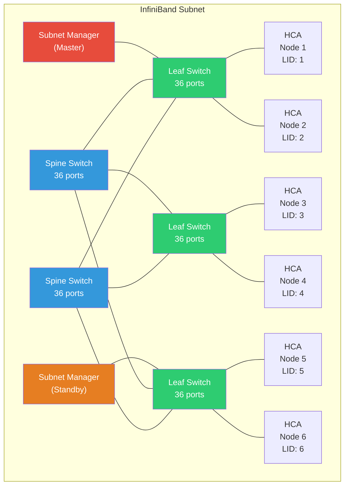

# 3.1 InfiniBand Architecture

InfiniBand is a complete network architecture designed from the ground up for high-performance computing and data center interconnects. Unlike protocols that retrofit RDMA onto existing network stacks, InfiniBand defines every layer --- from the physical signaling on the wire to the transport semantics that applications consume. This section examines the key architectural components that make InfiniBand the highest-performing RDMA transport available.

## Link Layer: Speeds and Widths

InfiniBand uses a serial signaling scheme where bandwidth scales along two independent axes: the per-lane data rate and the number of lanes bonded together in a single link.

### Per-Lane Data Rates

Each generation of InfiniBand increases the per-lane signaling rate and the encoding efficiency:

| Generation | Signal Rate (Gbaud) | Encoding   | Effective Rate/Lane | Year   |
|-----------|---------------------|------------|---------------------|--------|
| SDR       | 2.5                 | 8b/10b     | 2.0 Gbps            | 2001   |
| DDR       | 5.0                 | 8b/10b     | 4.0 Gbps            | 2005   |
| QDR       | 10.0                | 8b/10b     | 8.0 Gbps            | 2008   |
| FDR-10    | 10.3125             | 64b/66b    | 10.0 Gbps           | 2011   |
| FDR       | 14.0625             | 64b/66b    | 13.64 Gbps          | 2011   |
| EDR       | 25.78125            | 64b/66b    | 25.0 Gbps           | 2014   |
| HDR       | 25.78125 (PAM-4)    | 64b/66b    | 25.0 Gbps           | 2018   |
| NDR       | 53.125 (PAM-4)      | 64b/66b    | 50.0 Gbps           | 2022   |
| XDR       | 106.25 (PAM-4)      | 64b/66b    | 100.0 Gbps          | 2024   |

Starting with HDR, InfiniBand adopted PAM-4 (4-level Pulse Amplitude Modulation) signaling, which transmits two bits per symbol, doubling the data rate without increasing the baud rate proportionally.

### Lane Widths

Each InfiniBand port can bond 1, 2, 4, 8, or 12 lanes together. In practice, the most common configurations are:

- **1x**: Single lane, used in embedded or low-bandwidth applications
- **4x**: The standard HCA port width, yielding 100 Gbps at HDR, 200 Gbps at NDR, and 400 Gbps at XDR
- **12x**: Used in backbone switch-to-switch links and older-generation switches

A typical modern deployment uses NDR 4x links, providing 200 Gbps per port. HDR switches commonly have 40 ports of 200 Gbps (HDR) or are split into 80 ports of 100 Gbps (HDR100) using port splitting.

Do not confuse marketing bandwidth numbers with achievable throughput. A "200 Gbps" NDR link delivers approximately 200 Gbps at the raw signaling level. After encoding overhead and inter-packet gaps, maximum useful throughput is approximately 196 Gbps for large messages. For small messages, header overhead further reduces effective throughput.

## Subnet Architecture

An InfiniBand network is organized into **subnets**, each managed by a centralized control plane entity called the **Subnet Manager (SM)**. This is one of the most distinctive features of InfiniBand compared to Ethernet: the fabric is actively managed rather than self-organizing.

### The Subnet Manager

The Subnet Manager is a software component that runs on one node in the subnet (often a dedicated management node, or on a switch with an embedded SM). It performs several critical functions:

1. **Topology discovery**: The SM uses Subnet Management Packets (SMPs) to traverse every link and discover all switches, HCAs, and routers in the subnet.
2. **LID assignment**: Each port in the subnet receives a unique Local Identifier (LID) from the SM.
3. **Routing table computation**: The SM computes forwarding tables for every switch in the fabric, determining the path from every source LID to every destination LID.
4. **Partition configuration**: The SM programs P_Key tables on all ports, controlling which nodes can communicate.
5. **QoS configuration**: The SM sets up SL-to-VL mapping tables on switches to enforce quality-of-service policies.

The SM performs periodic **sweeps** of the fabric (typically every few seconds) to detect changes --- new devices appearing, links going down, or ports changing state. When a change is detected, the SM recomputes the affected tables and reprograms the switches.

### Subnet Manager Failover

A subnet can have multiple SM instances running simultaneously in a **master/standby** configuration. The standby SM monitors the master via periodic polling. If the master becomes unreachable, the standby promotes itself to master and takes over fabric management. The OpenSM implementation (open-source) and vendor-specific SMs (such as UFM from NVIDIA) both support this failover model.

### The Subnet Administrator

The **Subnet Administrator (SA)** is a query interface provided by the SM. Applications and management tools use SA queries to look up path information, multicast group membership, and service registrations. For example, when an application wants to connect to a remote QP, it queries the SA for a **PathRecord** that provides the DLID, SL, MTU, and rate for the path to the destination.

## Addressing

InfiniBand uses a two-tier addressing scheme: local identifiers for intra-subnet routing and global identifiers for inter-subnet routing.

### Local Identifiers (LIDs)

A LID is a 16-bit address assigned by the Subnet Manager to each port. LID values range from 0x0001 to 0xBFFF (1 to 49,151) for unicast addresses, and 0xC000 to 0xFFFE for multicast. LID 0x0000 is reserved, and 0xFFFF is the permissive LID (used during initialization before a LID is assigned).

The 16-bit LID space limits a single InfiniBand subnet to approximately 49,000 unicast endpoints. In practice, the limit is 48,000 endpoints because some LIDs are consumed by switch management ports. For larger fabrics, multiple subnets must be connected via InfiniBand routers, or the administrator can use **LID Mask Control (LMC)** which assigns multiple consecutive LIDs to a single port to enable multipath routing at the cost of reducing the total number of addressable endpoints.

### Global Identifiers (GIDs)

A GID is a 128-bit identifier that follows the IPv6 address format. Every HCA port has at least one GID, formed by combining:

- **Subnet prefix** (64 bits): Assigned by the SM, identifies the subnet. The default is `fe80:0000:0000:0000` (the IPv6 link-local prefix).
- **Interface ID** (64 bits): Derived from the port's GUID (Globally Unique Identifier), which is burned into the hardware by the manufacturer.

GIDs are used in the Global Route Header (GRH) for inter-subnet routing and are also the primary addressing mechanism for RoCE. A port can have multiple GIDs in its **GID table** --- index 0 is always the default GID based on the port GUID, and additional entries can be added for RoCE (mapping to IPv4 or IPv6 addresses).

## Partitions (P_Key)

Partitions provide network isolation within an InfiniBand subnet, serving a purpose analogous to VLANs in Ethernet. Each partition is identified by a 16-bit **Partition Key (P_Key)**, where the most significant bit indicates membership type:

- **Full member** (bit 15 = 1): Can communicate with both full and limited members of the same partition.
- **Limited member** (bit 15 = 0): Can only communicate with full members, not with other limited members.

Every QP is associated with a P_Key. When a packet arrives, the HCA checks that the incoming P_Key matches one of the P_Keys in the receiving port's P_Key table. If not, the packet is silently dropped. The default partition (P_Key = 0xFFFF) includes all ports in the subnet.

Partitions are enforced at the HCA hardware level, making them a robust isolation mechanism. Unlike Ethernet VLANs, which can be bypassed by a malicious host sending tagged frames, P_Key enforcement cannot be circumvented without physical access to reprogram the HCA firmware. The SM programs P_Key tables during fabric initialization and can update them dynamically.

## Virtual Lanes (VLs)

Virtual Lanes are a quality-of-service mechanism implemented in the link layer. Each InfiniBand link supports up to 16 data VLs (VL0 through VL14) plus one management VL (VL15). Each VL has its own independent flow control credits, meaning that congestion on one VL does not block traffic on another VL over the same physical link.

### VL15: The Management VL

VL15 is reserved for Subnet Management Packets (SMPs). It operates without flow control credits --- management traffic is never back-pressured. This design ensures that the Subnet Manager can always communicate with switches and HCAs, even when the data path is congested or deadlocked.

### Service Levels and SL-to-VL Mapping

Applications do not select VLs directly. Instead, they tag traffic with a **Service Level (SL)**, a 4-bit value (0--15) embedded in the Local Route Header. Each switch in the path maps the SL to a VL using an **SL-to-VL mapping table** programmed by the Subnet Manager. This indirection allows the fabric administrator to:

- Assign different traffic classes (bulk data, latency-sensitive, management) to different VLs
- Change VL assignments without modifying application code
- Use different SL-to-VL mappings at different points in the network (important for deadlock avoidance in topologies with multiple paths)

A common configuration assigns SL 0 to VL 0 for default traffic, SL 1 to VL 1 for high-priority traffic, and reserves VL 15 for management.

## Routing

InfiniBand switches use **destination-based forwarding**. Each switch has a **Linear Forwarding Table (LFT)** that maps each destination LID to an output port. The SM computes these tables using routing algorithms appropriate for the fabric topology.

### Routing Algorithms

Several routing algorithms are available, each suited to different topologies:

- **Min-hop**: Finds shortest paths; simple but may not balance load well. Suitable for fat-tree topologies.
- **Up/Down**: Assigns a direction to each link to prevent routing loops. Works for arbitrary topologies but can leave bandwidth underutilized.
- **Fat-tree**: Optimized for fat-tree (Clos) topologies, the most common HPC interconnect topology. Distributes routes evenly across spine switches.
- **DFSSSP (Deadlock-Free Single Source Shortest Path)**: Uses multiple SLs to break deadlock cycles while maintaining shortest paths.
- **Adaptive routing**: Modern switches (HDR and later) support adaptive routing, where the switch dynamically selects among multiple output ports based on queue occupancy, reducing congestion hot spots.

### LID Mask Control (LMC)

LMC allows a port to respond to 2^LMC consecutive LIDs. For example, with LMC = 2, a port responds to four consecutive LIDs (e.g., LID 4, 5, 6, 7). The SM programs different paths for each LID, enabling multipath routing. The source selects which LID to use in each packet, spreading traffic across multiple paths through the fabric.

LMC-based multipath is particularly valuable in fat-tree topologies where there are multiple equal-cost paths between any two endpoints. By assigning LMC = 3 (8 LIDs per port), a node can spread traffic across up to 8 distinct paths through the spine, approaching the full bisection bandwidth of the fabric.

## Multicast

InfiniBand supports hardware multicast. A multicast group is identified by a multicast LID (in the range 0xC000--0xFFFE) and a multicast GID. To join a multicast group, a node sends a request to the SA, which updates the multicast forwarding tables on all switches along the multicast tree.

Each switch maintains a **Multicast Forwarding Table (MFT)** that maps multicast LIDs to a set of output ports. The SM computes spanning trees for each multicast group to avoid loops.

Multicast is used by several IB management protocols (SA notifications, for example) and by applications such as MPI collective operations. However, hardware multicast has scalability limitations --- the number of multicast groups is limited by the MFT size on switches, typically 1,024 to 4,096 groups depending on the switch ASIC.

## Credit-Based Flow Control

InfiniBand uses a **credit-based flow control** scheme at the link layer to prevent buffer overflow and packet loss. This is one of the most important architectural differences from Ethernet: InfiniBand is a lossless fabric by design.

### How Credits Work

Each VL on a receiving port has a finite buffer. The receiver advertises the available buffer space to the sender as **credits**, measured in 64-byte allocation units. The sender tracks how many credits it has consumed (by transmitting packets) and how many the receiver has returned (via credit update packets). A sender must not transmit a packet on a VL unless it has sufficient credits for that VL.

The flow control operates **per-VL and per-link**. This means:

1. **No head-of-line blocking across VLs**: Congestion on VL 0 does not affect VL 1, even on the same physical link.
2. **Back-pressure propagation**: If a downstream switch runs out of buffer space on a VL, it stops returning credits to the upstream switch on that VL, which in turn stops forwarding packets for that VL, propagating back-pressure toward the source.
3. **Deadlock avoidance**: By using multiple VLs with appropriate SL-to-VL mapping, the routing algorithm can break credit dependency cycles that would otherwise cause deadlock.

### Credit Stalls

A credit stall occurs when a sender has exhausted its credits on a VL and the receiver has not returned any. This is a normal flow control event, but prolonged stalls indicate congestion. Credit stalls are visible via hardware performance counters on both HCAs and switches, and monitoring them is a key part of InfiniBand fabric health management.

Credit-based flow control prevents packet loss but does not prevent congestion. A congested fabric will experience credit stalls, which increase latency. In severe cases, credit dependencies across VLs can cause fabric-wide deadlock. The Subnet Manager's routing algorithm must ensure deadlock freedom by using enough VLs and mapping SLs to VLs correctly. This is not a theoretical concern --- deadlocks have been observed in production HPC clusters with misconfigured routing.

## Congestion Control

Starting with the InfiniBand Architecture specification 1.2.1, InfiniBand defines an optional congestion control mechanism. When a switch detects congestion (based on queue depth thresholds), it marks packets with a **Forward ECN (FECN)** bit. The receiver echoes this back to the sender as a **Backward ECN (BECN)** signal. The sender then throttles its injection rate using a congestion control table that maps congestion severity to rate reduction.

In practice, congestion control has become more important as fabrics have grown larger. NVIDIA's implementation, known as **IB Congestion Control**, is supported on ConnectX-4 and later HCAs and on Quantum and later switches.

## Putting It Together: A Packet's Journey

When a node sends an RDMA Write on InfiniBand:

1. The application posts a work request to a QP.
2. The HCA constructs a packet with LRH (containing DLID, SL, VL), optionally GRH, BTH (containing destination QPN, PSN, opcode), and RETH (containing remote virtual address, R_Key, DMA length).
3. The HCA checks that it has flow control credits on the appropriate VL before transmitting.
4. The first switch receives the packet, looks up the DLID in its LFT, and forwards the packet to the appropriate output port, consuming credits on the output VL.
5. At each hop, the switch checks credits before forwarding. If the output VL has no credits, the packet waits in the switch buffer.
6. The destination HCA receives the packet, validates the P_Key, verifies the ICRC, looks up the destination QPN, validates the R_Key, and DMAs the payload directly to the specified virtual address.
7. The receiver returns flow control credits for the consumed buffer space.
8. For reliable transport (RC), the receiver generates an ACK packet back to the sender, which completes the work request.

This end-to-end flow --- from application work request to direct memory placement with hardware-enforced security and lossless delivery --- is what makes InfiniBand the benchmark against which all other RDMA transports are measured.
