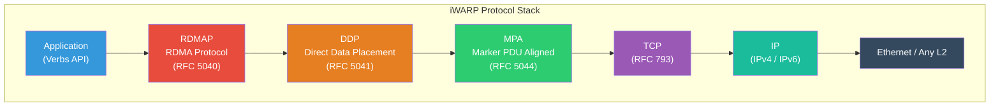

# 3.3 iWARP Protocol Stack

The Internet Wide Area RDMA Protocol (iWARP) takes a fundamentally different approach to RDMA transport than InfiniBand and RoCE. Rather than demanding a lossless network, iWARP layers RDMA semantics on top of TCP/IP --- the same protocol stack that carries web traffic, email, and virtually every other Internet application. This choice trades some raw performance for universal deployability: iWARP works over any IP network, through any router, without any special switch configuration.

iWARP is defined in a series of IETF RFCs (5040, 5041, 5042, 5043, 5044, 6580, 6581) published between 2007 and 2012. The protocol stack comprises three layers, each specified in its own RFC, stacked on top of a TCP connection.

## The iWARP Protocol Layer Cake



Each layer serves a specific purpose:

- **MPA** (Marker PDU Aligned Framing): Provides message framing on top of TCP's byte-stream abstraction.
- **DDP** (Direct Data Placement): Enables the receiver to place incoming data directly into application-specified memory buffers without intermediate copies.
- **RDMAP** (RDMA Protocol): Maps RDMA operations (Send, Receive, RDMA Read, RDMA Write) to DDP messages.

Let us examine each layer in detail, from bottom to top.

## MPA: Marker PDU Aligned Framing (RFC 5044)

TCP provides a reliable, in-order byte stream. But RDMA operations are message-oriented --- an RDMA Send is a discrete message, not a stream of bytes. MPA bridges this mismatch by adding framing to TCP's byte stream.

### The Framing Problem

Consider the challenge facing a hardware RDMA implementation on top of TCP. TCP segments can be split, merged, and retransmitted arbitrarily. A single RDMA message may span multiple TCP segments, and a single TCP segment may contain parts of multiple RDMA messages. The hardware must determine where each RDMA message begins and ends within the TCP byte stream.

MPA solves this with two mechanisms: **FPDU framing** and **markers**.

### FPDUs (Framed Protocol Data Units)

An FPDU consists of:

```
+------------------+------------------+------------------+--------+
| DDP Header       | DDP Payload      | Pad (0-3 bytes)  | CRC    |
| (variable)       | (variable)       |                  | 4 bytes|
+------------------+------------------+------------------+--------+
|<-------------- ULPDU Length (16 bits) --------------->|         |
```

The FPDU is preceded by a 2-byte **ULPDU Length** field at the start of each MPA frame, followed by a 2-byte reserved/marker field. Together, these allow the receiver to parse FPDUs from the TCP byte stream.

Each FPDU is aligned to a 4-byte boundary (hence the pad field) and protected by a 32-bit CRC. The CRC covers the entire FPDU, providing end-to-end data integrity beyond what TCP's 16-bit checksum offers.

### Markers

Markers are a mechanism unique to MPA that enables a hardware implementation to find FPDU boundaries even when TCP segments arrive in arbitrary sizes. A marker is a 4-byte pointer placed at a fixed interval (every 512 bytes) in the TCP byte stream. Each marker points to the start of the next FPDU, allowing the hardware to resynchronize to FPDU boundaries after receiving any TCP segment.

<div class="note">

MPA markers are optional in the enhanced version of MPA (MPA v2, RFC 6581). Many implementations disable markers because modern TCP offload engines can track FPDU boundaries without them, and markers add overhead. MPA v2 also adds the ability to negotiate marker usage during connection setup.

</div>

### MPA v2 Enhancements (RFC 6581)

MPA v2 (also called Enhanced MPA or eMPA) adds several important capabilities:

- **Marker negotiation**: Peers can agree to disable markers, reducing overhead.
- **Enhanced connection mode**: Supports iWARP connections over RDMA-capable (zero-copy) connections for improved performance.
- **Optimized RTR (Ready to Receive)**: Reduces the number of round trips needed during connection setup.
- **Private data in connection frames**: Allows exchanging application-specific data during MPA negotiation.

## DDP: Direct Data Placement (RFC 5041)

DDP is the layer that enables **zero-copy** data placement --- the defining capability of RDMA. Without DDP, incoming data would first land in a kernel buffer, then be copied to the application's buffer by the CPU. DDP provides the addressing information that allows the NIC hardware to place data directly into the correct application buffer.

### Two Data Placement Models

DDP defines two models for identifying the target buffer:

#### Tagged Model

In the tagged model, the sender specifies the target buffer using a **Steering Tag (STag)**, a **Tagged Offset**, and a **length**. The STag is equivalent to an R_Key (Remote Key) in InfiniBand terminology --- it identifies a memory region that has been registered and made remotely accessible. The tagged offset specifies where within that memory region the data should be placed.

The tagged model is used for:
- **RDMA Write**: The sender specifies the remote STag and offset where data should be written.
- **RDMA Read Response**: The responder sends data from the memory region identified by the STag that the requester specified.

A tagged DDP header contains:

```
+-------+-------+-------+-------+-------+-------+-------+-------+
| Rsvd  |  DV   |   T   |   L   |  Rsvd |      DDP Queue Number |
+-------+-------+-------+-------+-------+-------+-------+-------+
|                          STag (32 bits)                        |
+-------+-------+-------+-------+-------+-------+-------+-------+
|                      Tagged Offset (64 bits)                   |
+-------+-------+-------+-------+-------+-------+-------+-------+
```

The `T` (Tagged) bit is set to 1, and `L` (Last) indicates whether this is the last DDP segment of a message.

#### Untagged Model

In the untagged model, the receiver posts receive buffers in advance, and incoming data is placed into the next available buffer. The sender identifies the target using a **Queue Number** and a **Message Sequence Number (MSN)**, and the receiver maps these to the pre-posted buffers.

The untagged model is used for:
- **Send/Receive**: The receiver pre-posts receive buffers; incoming Send messages consume them in order.
- **RDMA Read Request**: The request message is delivered to a specific queue on the responder.
- **Terminate message**: Used to signal connection errors.

An untagged DDP header contains:

```
+-------+-------+-------+-------+-------+-------+-------+-------+
| Rsvd  |  DV   |   T   |   L   |  Rsvd |      DDP Queue Number |
+-------+-------+-------+-------+-------+-------+-------+-------+
|                         MSN (32 bits)                          |
+-------+-------+-------+-------+-------+-------+-------+-------+
|                    Message Offset (32 bits)                    |
+-------+-------+-------+-------+-------+-------+-------+-------+
```

The `T` bit is set to 0, and the Message Offset indicates where within the pre-posted buffer this segment's data should be placed.

### DDP Streams

Each DDP connection can have multiple **DDP streams**, identified by Queue Numbers. Stream 0 is used for Send operations, Stream 1 for RDMA Read Requests, and Stream 2 for Terminate messages. The tagged model does not use queue numbers (the STag provides the needed routing information).

## RDMAP: RDMA Protocol (RFC 5040)

RDMAP is the top layer of the iWARP stack, immediately below the application's verbs interface. It maps RDMA operations to DDP messages:

| RDMA Operation      | DDP Model  | DDP Queue | Description                                            |
|---------------------|-----------|-----------|--------------------------------------------------------|
| Send                | Untagged  | 0         | Delivers data to next posted receive buffer            |
| Send with Invalidate| Untagged  | 0         | Send + invalidates an STag on the receiver             |
| RDMA Write          | Tagged    | N/A       | Places data at remote STag + offset                    |
| RDMA Read Request   | Untagged  | 1         | Requests data from remote STag + offset                |
| RDMA Read Response  | Tagged    | N/A       | Returns requested data                                 |
| Terminate           | Untagged  | 2         | Signals a fatal error on the connection                |

### RDMAP Header

The RDMAP header is compact --- just 1 byte prepended to the DDP header:

```
+-------+-------+-------+-------+-------+-------+-------+-------+
|    RDMAP Version (2b) |      Reserved     |   Opcode (4b)     |
+-------+-------+-------+-------+-------+-------+-------+-------+
```

The opcode encodes the RDMA operation type. The version field is currently 1.

### Operation Mapping

When an application posts an RDMA Write work request:

1. RDMAP formats the operation as a tagged DDP message, setting the STag and offset from the work request's remote address fields.
2. DDP segments the message into FPDUs that fit within the TCP MSS.
3. MPA adds framing (length, markers, CRC) to each FPDU.
4. TCP handles reliable delivery, segmentation, and flow/congestion control.

For an RDMA Read:

1. RDMAP sends an RDMA Read Request (untagged DDP to Queue 1) containing the source STag/offset (where to read from) and the sink STag/offset (where to place the response).
2. The responder's RDMAP layer issues a DDP tagged message with the response data, using the sink STag/offset.
3. Multiple RDMA Read Requests can be outstanding simultaneously (the number is negotiated during connection setup as **IRD/ORD** --- Inbound/Outbound Read Depth).

## Connection Setup: MPA Negotiation

iWARP connection setup is more complex than InfiniBand's CM protocol because it must negotiate the MPA parameters on top of a standard TCP connection:

1. **TCP handshake**: A standard TCP three-way handshake establishes the connection.
2. **MPA Request/Reply**: The initiator sends an MPA Request Frame, and the responder replies with an MPA Reply Frame. These frames negotiate:
   - MPA marker usage (on or off)
   - CRC usage (mandatory per spec, but some implementations allow disabling)
   - Protocol revision (MPA v1 or v2)
   - Connection mode (for MPA v2)
3. **Private data exchange**: Both the MPA Request and Reply frames can carry up to 512 bytes of private data, which applications use to exchange connection parameters (similar to InfiniBand CM private data).
4. **RDMA mode**: After the MPA handshake completes, the connection transitions from "streaming mode" (normal TCP) to "RDMA mode" (all data is exchanged as MPA-framed DDP/RDMAP messages).

<div class="note">

The transition from streaming mode to RDMA mode is one-way and irreversible. Once an iWARP connection enters RDMA mode, it cannot revert to streaming TCP. If the application needs to send non-RDMA data, it must use a separate TCP connection or encode the data as RDMA Send messages.

</div>

### Connection Management with librdmacm

In practice, most applications use the `librdmacm` (RDMA Connection Manager) library to set up iWARP connections. The `rdma_cm` abstraction hides the differences between IB CM and iWARP MPA negotiation behind a common API:

```c
// Same API for IB, RoCE, and iWARP
rdma_create_id(&id, NULL, RDMA_PS_TCP, IB_QPT_RC);
rdma_resolve_addr(id, src_addr, dst_addr, timeout);
rdma_resolve_route(id, timeout);
rdma_connect(id, &conn_param);  // Handles CM or MPA internally
```

## TCP Considerations

Running RDMA over TCP introduces several interactions that do not exist with InfiniBand or RoCE:

### Nagle's Algorithm

Nagle's algorithm delays sending small segments to aggregate them into larger ones. This is catastrophic for RDMA latency, where even a small RDMA Send should be transmitted immediately. iWARP implementations must disable Nagle's algorithm (TCP_NODELAY) on all connections. Hardware implementations do this automatically.

### Delayed ACK

TCP's delayed ACK mechanism waits up to 200 ms (on Linux, 40 ms) before sending an ACK, hoping to piggyback it on a data segment going in the opposite direction. For RDMA operations that require an ACK to complete (like RDMA Read), delayed ACK can add significant latency. Hardware iWARP implementations typically use immediate ACK or very short delayed ACK timers (1--10 microseconds).

### Out-of-Order Segment Handling

TCP guarantees in-order byte delivery to the application. But TCP segments can arrive out of order at the receiver, and TCP buffers them until the missing segment arrives. For an RDMA NIC that wants to place data directly into application memory, out-of-order segments present a dilemma:

- **Buffer and wait**: Hold out-of-order segments in NIC memory until the gap is filled, then place them. This requires large NIC buffers and wastes PCIe bandwidth (data is read from the network, stored in NIC memory, then DMA'd to host memory later).
- **Place optimistically**: Place out-of-order segments directly into application memory immediately, then "un-place" them if the connection resets due to unrecoverable loss. This is the approach used by most hardware implementations, but it introduces the risk of **data corruption** if the connection is reset after partial placement.

The DDP specification addresses this with the concept of **data delivery** versus **data placement**. Data can be placed (written to the target buffer) before it is delivered (marked as complete). If a connection terminates abnormally, placed-but-not-delivered data may be in the target buffer, and the application must handle this.

<div class="warning">

The out-of-order placement problem is a fundamental challenge for iWARP. If a hardware iWARP NIC places data from TCP segments into application memory out of order, and the TCP connection subsequently resets (due to retransmission failure or RST), the application's memory may contain a mix of old and new data with no indication of which bytes are valid. This is known as the "RDMA data corruption" problem and has been the subject of significant discussion in the IETF. The practical impact is small because TCP connection resets are rare, but it is a theoretical concern that does not exist with InfiniBand or RoCE.

</div>

### Retransmission and Latency

When a TCP segment is lost, the sender must retransmit it. The minimum retransmission timeout (RTO) in Linux is 200 ms (reduced to 1 ms in some data center kernels). Even with fast retransmit (triggered by 3 duplicate ACKs), recovery takes at least one round-trip time. During this period, no new data can be delivered to the RDMA layer (because TCP guarantees in-order delivery), stalling all RDMA operations on that connection.

This is the fundamental performance limitation of iWARP compared to InfiniBand: a single lost packet stalls an entire connection for at least one RTT, and possibly for the full RTO. InfiniBand's credit-based flow control prevents loss entirely, and RoCE's PFC prevents loss at L2.

## Hardware Offload: TOE Integration

To achieve competitive performance, iWARP hardware implements a **TCP Offload Engine (TOE)** that moves TCP processing from the CPU to the NIC. The TOE handles:

- TCP segmentation and reassembly
- Checksum computation and verification
- ACK generation and processing
- Retransmission (using NIC-local timers and buffers)
- Congestion window management

The TOE maintains TCP connection state (sequence numbers, window sizes, timers) in NIC memory, alongside the RDMA QP state. This tight integration allows the NIC to process incoming TCP segments and perform RDMA data placement in a single pass, without CPU involvement.

### Hardware Availability

As of 2025, the primary hardware vendors for iWARP are:

- **Chelsio**: The T6 series adapters (T62100-LP-CR, etc.) support iWARP at up to 100 Gbps with full TOE. Chelsio has been the most consistent iWARP hardware vendor.
- **Intel**: The older X722 (10/25 Gbps) supported iWARP. Intel's E810 series supports iWARP at 100 Gbps but with limited market presence. Intel's focus has shifted to other areas.
- **Broadcom/QLogic**: The 578xx series supported iWARP but is largely end-of-life.

NVIDIA (formerly Mellanox) does not support iWARP on their ConnectX adapters; they focus exclusively on InfiniBand and RoCE.

## SoftiWARP (siw)

**SoftiWARP** (kernel module `siw`) is the software implementation of iWARP in the Linux kernel, analogous to Soft-RoCE for RoCE. It implements the full iWARP protocol stack (MPA, DDP, RDMAP) in software over standard TCP sockets.

### Setup

```bash
# Load the kernel module
modprobe siw

# Add a SoftiWARP device bound to an interface
rdma link add siw0 type siw netdev eth0

# Verify
rdma link show
ibv_devinfo
```

SoftiWARP uses the kernel's TCP stack, so all standard TCP tuning parameters (window sizes, congestion control algorithm, etc.) apply. This makes it a useful tool for experimenting with how TCP parameters affect RDMA performance.

### SoftiWARP vs. Soft-RoCE

Both are software RDMA implementations, but they differ in important ways:

| Aspect            | Soft-RoCE (rxe)         | SoftiWARP (siw)         |
|-------------------|------------------------|------------------------|
| Transport         | UDP/IP                 | TCP/IP                 |
| Loss handling     | Go-back-N retransmission| TCP retransmission     |
| Flow control      | None (lossy)           | TCP window             |
| Congestion control| None (relies on PFC)   | TCP congestion control |
| Connection setup  | IB CM over UDP         | TCP + MPA              |
| Typical latency   | 20-30 us               | 25-50 us               |

<div class="tip">

For development and testing, Soft-RoCE is generally preferred because it exercises the same code paths as hardware RoCE (which is more commonly deployed than hardware iWARP). However, SoftiWARP is useful when you need an RDMA device that works correctly over routed networks without any PFC configuration, since it inherits TCP's reliable delivery.

</div>

## When iWARP Makes Sense

Despite its performance disadvantages, iWARP has legitimate use cases:

1. **Brownfield deployments**: When an organization has an existing Ethernet infrastructure with no PFC support, iWARP provides RDMA without network changes.
2. **Storage over IP**: Microsoft Windows Server uses iWARP for SMB Direct (RDMA-accelerated file sharing). Many Windows Server deployments use Chelsio iWARP adapters.
3. **Long-distance RDMA**: Because iWARP uses TCP, it can work over WAN links where InfiniBand and RoCE cannot. Some storage replication products use iWARP for RDMA-accelerated remote replication.
4. **Simplicity**: No PFC configuration, no ECN tuning, no special switch requirements. For organizations without dedicated network engineering staff, iWARP is significantly easier to deploy.

The market share of iWARP has declined as RoCE has matured and as switch vendors have improved PFC/ECN support. However, iWARP remains relevant in specific niches, particularly in Windows-centric storage environments and in deployments where network simplicity is paramount.
