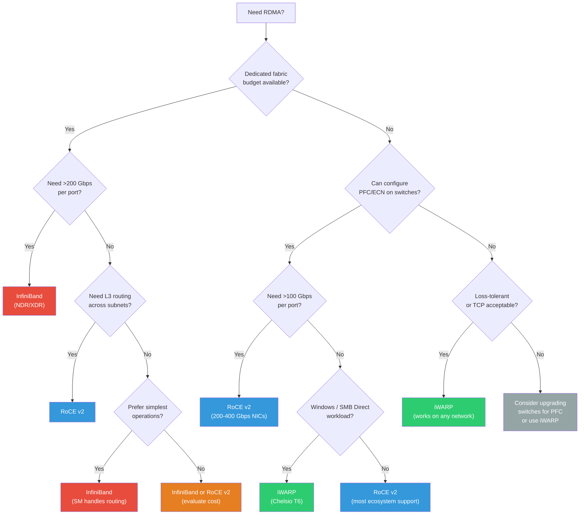

# 3.5 Protocol Comparison

Choosing the right RDMA transport is one of the most consequential decisions in data center network design. The choice affects hardware procurement, network topology, operational complexity, application performance, and long-term migration paths. This section provides a comprehensive comparison of InfiniBand, RoCE v1, RoCE v2, and iWARP across every dimension that matters in practice.

## Comprehensive Comparison

| Dimension | InfiniBand | RoCE v1 | RoCE v2 | iWARP |
|-----------|-----------|---------|---------|-------|
| **Wire protocol** | Native IB (custom L1-L4) | Ethernet + IB transport | Ethernet + UDP/IP + IB transport | Ethernet + TCP/IP + MPA/DDP/RDMAP |
| **Current max bandwidth** | 400 Gbps (NDR 4x), 800 Gbps (XDR 4x) | 100 Gbps (limited by legacy) | 400 Gbps (ConnectX-7) | 100 Gbps (Chelsio T6) |
| **Typical latency (small msg)** | 0.5--1.0 us | 1.0--1.5 us | 1.0--2.0 us | 3--7 us |
| **Routability** | Within subnet (L2); routers for inter-subnet | L2 only (same broadcast domain) | L3 routable (standard IP routing) | Fully routable (TCP/IP) |
| **Lossless mechanism** | Credit-based flow control (per-VL, per-link) | PFC required | PFC required (ECN/DCQCN recommended) | TCP handles loss (retransmission) |
| **Packet loss tolerance** | Zero loss by design | Extremely loss-sensitive | Extremely loss-sensitive (improving) | Tolerant (TCP retransmission) |
| **Connection setup** | IB CM (REQ/REP/RTU) | IB CM (REQ/REP/RTU) | IB CM (REQ/REP/RTU) | TCP 3-way handshake + MPA negotiation |
| **Address resolution** | SA PathRecord query | GID-based (like IB) | ARP/ND + GID table | DNS/IP (standard TCP) |
| **QoS mechanism** | SL/VL mapping (up to 15 data VLs) | PCP (802.1p) | DSCP + PCP | TCP-level (limited) |
| **Congestion control** | IB CC (FECN/BECN, optional) | None standard | ECN/DCQCN | TCP congestion control (Cubic, BBR, etc.) |
| **MTU** | 256--4096 bytes (negotiated) | Ethernet MTU (1500/9000) | Ethernet MTU (1500/9000) | TCP MSS (typically 1460/8960) |
| **Multicast** | Hardware multicast (MLID) | Hardware multicast | Limited support | No RDMA multicast |
| **Management** | Subnet Manager (centralized) | Standard Ethernet | Standard Ethernet + PFC/ECN config | Standard TCP/IP |
| **Switch infrastructure** | Dedicated IB switches | Standard Ethernet switches | Standard Ethernet switches | Standard Ethernet switches |
| **NIC hardware** | IB HCA (NVIDIA ConnectX, Intel Cornelis) | RoCE RNIC (NVIDIA ConnectX) | RoCE RNIC (NVIDIA ConnectX, Broadcom, etc.) | iWARP RNIC (Chelsio T6, Intel E810) |
| **Software RDMA** | None | Soft-RoCE (rxe) | Soft-RoCE (rxe) | SoftiWARP (siw) |
| **Linux kernel support** | Mature (mlx4, mlx5) | Mature (mlx4, mlx5) | Mature (mlx5, bnxt_re, etc.) | Mature (cxgb4, irdma) |
| **Typical price (NIC)** | $500--$2,000 | $300--$1,500 | $300--$1,500 | $400--$1,000 |
| **Typical price (switch port)** | $300--$800 | $50--$200 | $50--$200 | $50--$200 |

## Performance Deep Dive

### Latency

InfiniBand consistently achieves the lowest latency because the entire path --- from HCA through switches to the destination HCA --- is optimized for RDMA. There is no IP processing, no UDP encapsulation/decapsulation, and no TCP state machine. A one-way RDMA Write latency measurement on NDR InfiniBand typically shows:

- **0.5 us**: HCA-to-HCA through a single switch (back-to-back through one hop)
- **0.6 us**: Through two switches (leaf-spine)
- **0.8 us**: Through three switches (full fat-tree)

RoCE v2 adds the overhead of UDP/IP processing (though this is fully offloaded in hardware) and Ethernet switching latency (which is comparable to IB switching). Typical RoCE v2 latencies are:

- **1.0 us**: Through a single Ethernet switch
- **1.3 us**: Through a leaf-spine pair
- **1.8 us**: Through a three-tier network

iWARP latency is dominated by TCP processing. Even with a full TOE, the TCP state machine and the MPA/DDP framing add latency:

- **3--5 us**: Best case with hardware TOE (Chelsio T6)
- **15--30 us**: With SoftiWARP (software TCP)

### Throughput

For large messages (1 MB and above), all three protocols can saturate their respective link speeds. The differences emerge with smaller messages:

| Message Size | IB NDR (200G) | RoCE v2 (200G) | iWARP (100G) |
|-------------|--------------|----------------|-------------|
| 64 B        | ~120 Mpps (60 Gbps effective) | ~100 Mpps (50 Gbps) | ~5 Mpps (2.5 Gbps) |
| 1 KB        | ~28 Mpps (225 Gbps) | ~25 Mpps (200 Gbps) | ~4 Mpps (32 Gbps) |
| 4 KB        | ~6.1 Mpps (200 Gbps) | ~6.0 Mpps (196 Gbps) | ~3 Mpps (98 Gbps) |
| 1 MB        | 198 Gbps | 196 Gbps | 98 Gbps |

The message rate numbers above are approximate and vary significantly by hardware generation, firmware version, and benchmark methodology. Always benchmark with your specific hardware and workload pattern. The `perftest` suite (`ib_write_bw`, `ib_write_lat`, `ib_send_bw`, etc.) is the standard tool for RDMA microbenchmarks.

### Scalability

InfiniBand subnets are limited by the 16-bit LID space to approximately 48,000 endpoints per subnet. For larger deployments, multiple subnets must be connected via IB routers, which add latency and complexity. In practice, the largest single-subnet IB deployments are in the 10,000--40,000 node range.

RoCE v2, being IP-based, can scale to millions of endpoints in a single routed domain. The practical limit is the number of QPs that the RNICs can support and the congestion control system's ability to manage the traffic. Hyperscale RoCE v2 deployments at Google, Microsoft, and Meta operate at scales of 100,000+ endpoints.

iWARP scales like TCP --- effectively unlimited in address space, but limited by the number of TCP connections the NIC can offload (typically 16,000--128,000 connections per NIC for hardware iWARP).

## Network Requirements

### InfiniBand

- Dedicated IB switches and cabling (QSFP/OSFP with IB transceivers)
- Subnet Manager software (OpenSM, UFM, or vendor equivalent)
- No interaction with existing Ethernet infrastructure
- Simplified operational model (the SM handles routing and configuration)

### RoCE v2

- Standard Ethernet switches, but they must support:
  - PFC (IEEE 802.1Qbb) with per-priority flow control
  - ECN marking (RFC 3168) with configurable thresholds
  - Sufficient buffer depth for PFC headroom
  - DSCP/PCP trust and mapping
- Network engineering expertise for PFC/ECN tuning
- Monitoring infrastructure for PFC counters, ECN rates, buffer utilization
- Typically requires jumbo frames (MTU 9000) for best performance

### iWARP

- Any Ethernet switch (no special requirements)
- Standard IP routing
- No PFC, no ECN, no special QoS configuration
- Works with standard 1500-byte MTU (though jumbo frames help)
- Standard TCP tuning (window sizes, congestion control)

The network complexity ordering is clear: iWARP < InfiniBand < RoCE v2. This may seem counterintuitive --- InfiniBand is simpler than RoCE despite being a dedicated fabric? Yes, because the Subnet Manager automates routing and QoS configuration, while RoCE requires manual PFC/ECN tuning on every switch in the path. Many organizations that deploy RoCE underestimate the operational burden of maintaining a lossless Ethernet fabric.

## Hardware Ecosystem

### NVIDIA (formerly Mellanox)

NVIDIA dominates the RDMA hardware market. Their ConnectX series adapters support both InfiniBand and RoCE (but not iWARP):

- **ConnectX-6**: 200 Gbps HDR IB / 200 Gbps Ethernet, 2 ports
- **ConnectX-6 Dx**: 100 Gbps Ethernet only (no IB), enhanced RoCE features
- **ConnectX-7**: 400 Gbps NDR IB / 400 Gbps Ethernet, advanced congestion control
- **BlueField DPU**: ConnectX + ARM cores, offloads network management

Their switch products mirror the NIC capabilities:
- **Quantum-2**: NDR InfiniBand switch, 64 ports x 400 Gbps
- **Spectrum-4**: 400 Gbps Ethernet switch, designed for RoCE

### Intel / Cornelis Networks

Cornelis Networks (spun out of Intel's HPC division) produces the **Omni-Path** interconnect, which is related to but distinct from InfiniBand. Intel's E810 Ethernet NICs support iWARP and basic RoCE.

### Broadcom

Broadcom's **BCM57500** series supports RoCE v2 at 100/200 Gbps. They are used in some cloud provider deployments.

### Chelsio

Chelsio's **T6** series is the primary iWARP hardware, supporting 100 Gbps with full TCP offload.

## Cloud Provider Support

| Provider | RDMA Transport | Bandwidth | Notes |
|----------|---------------|-----------|-------|
| **AWS** | EFA (Elastic Fabric Adapter) | 100--400 Gbps | Custom protocol, SRD; not standard IB/RoCE but supports verbs API subset |
| **Azure** | RoCE v2 (via NVIDIA SmartNIC) | 100--200 Gbps | Available on HPC and GPU VM series |
| **GCP** | Custom (Falcon) | 100--200 Gbps | Proprietary; exposed via NCCL plugin for GPU workloads |
| **Oracle Cloud** | RoCE v2 | 100 Gbps | Bare-metal RDMA clusters |
| **On-premises HPC** | InfiniBand (dominant) | 200--400 Gbps | NDR widely deployed, XDR emerging |

Cloud RDMA offerings are not always standard verbs-compatible. AWS EFA uses a custom protocol (Scalable Reliable Datagram) that supports a subset of the verbs API (primarily unreliable datagram operations with application-level reliability). GCP's Falcon is entirely proprietary. Only Azure and Oracle Cloud offer standard RoCE v2 that is fully compatible with unmodified verbs-based applications. Always verify API compatibility before assuming cloud RDMA will work with your application.

## When to Choose Each Protocol

### Choose InfiniBand When:

- **Maximum performance is required**: HPC simulation, AI training clusters (NVIDIA DGX/HGX), financial trading systems.
- **The deployment is dedicated**: The RDMA fabric serves a specific cluster, not a shared multi-tenant data center.
- **Scale is moderate**: Fewer than 40,000 endpoints per subnet.
- **Budget allows dedicated infrastructure**: IB switches cost more per port, but total cost of ownership may be lower because operational complexity is lower.
- **The workload uses MPI**: InfiniBand has the most mature MPI implementations and collective operation optimizations.

### Choose RoCE v2 When:

- **You have an existing Ethernet infrastructure** that you want to leverage for RDMA.
- **L3 routing is required**: Multi-rack, multi-pod, or multi-site deployments.
- **Scale is large**: Tens of thousands to hundreds of thousands of endpoints.
- **The workload is storage-oriented**: NVMe-oF, distributed file systems, object storage.
- **You have network engineering expertise** to configure and maintain PFC/ECN.
- **Cost optimization is important**: Shared Ethernet infrastructure for both RDMA and non-RDMA traffic.

### Choose iWARP When:

- **Network simplicity is paramount**: No network engineering team, no ability to configure PFC.
- **The deployment is on legacy infrastructure**: Existing switches that do not support PFC.
- **The workload is Windows-centric**: SMB Direct, Windows Server storage.
- **WAN RDMA is needed**: iWARP works over routed, lossy, long-distance networks.
- **Performance requirements are moderate**: 10--100 Gbps, latency tolerance of 5+ microseconds.

## Decision Matrix

## Migration Paths

### InfiniBand to RoCE

This is the most common migration path, driven by cost reduction and the desire to converge on a single Ethernet fabric. Key considerations:

1. **Application compatibility**: If applications use the verbs API (not IB-specific features like multicast or atomic operations on UD QPs), they work on RoCE without code changes.
2. **Address resolution**: IB applications that query the SA for PathRecords must switch to `rdma_cm` or manual GID-based addressing. The `rdma_cm` library abstracts this.
3. **Performance**: Expect 5--20% latency increase and similar throughput. The performance gap narrows with each hardware generation.
4. **Network configuration**: The largest effort. You must design and implement PFC/ECN on your Ethernet fabric, which requires switch-by-switch configuration and testing.
5. **Monitoring**: Replace IB-specific monitoring (perfquery, ibdiagnet) with Ethernet/IP-based monitoring plus RDMA-specific counters.

### iWARP to RoCE

This migration is motivated by higher performance and broader ecosystem support:

1. **Application compatibility**: Verbs-based applications generally work, but connection management differs. Applications using `rdma_cm` are portable; those using raw socket-based setup need modification.
2. **QP type differences**: iWARP only supports RC QPs. If the application already uses RC, migration is straightforward. If it relies on iWARP-specific features (like TCP-level flow control preventing buffer overflow), the RoCE version must handle PFC-based flow control.
3. **Network**: Must add PFC/ECN support to the Ethernet switches.

### RoCE v1 to RoCE v2

This is a relatively simple upgrade:

1. Replace or update NICs to support RoCE v2 (most modern NICs support both).
2. Ensure IP addresses are configured on the RDMA interfaces.
3. Update GID table references in applications (the GID index for RoCE v2 differs from RoCE v1).
4. Configure DSCP marking (RoCE v2) instead of relying solely on PCP (RoCE v1).
5. Enable ECN/DCQCN (not available in RoCE v1).

## Future Convergence Trends

The RDMA transport landscape is converging along several axes:

### Ultra Ethernet Consortium (UEC)

Founded in 2023, the UEC aims to define a next-generation Ethernet-native transport for AI/HPC workloads. The goals include:

- Packet spraying with out-of-order delivery (eliminating head-of-line blocking)
- Hardware-based reliability without requiring lossless Ethernet (no PFC)
- Multipath transport integrated into the NIC
- Standardized congestion control

If UEC succeeds, it could obsolete both RoCE and iWARP by providing an Ethernet-native RDMA transport that does not require PFC.

### Lossy RoCE

NVIDIA and other vendors are making RoCE work better on lossy (non-PFC) networks through:

- Selective retransmission (instead of go-back-N)
- Microsecond-scale retry timers
- RTT-based congestion control
- Per-packet sequence numbers

This trend blurs the line between RoCE and iWARP: if RoCE can handle loss gracefully, the primary advantage of iWARP (loss tolerance) disappears.

### InfiniBand Evolution

InfiniBand continues to push bandwidth with XDR (800 Gbps per port in 4x configuration) and GDR on the roadmap. NVIDIA's tight integration of InfiniBand with their GPU platforms (NVLink, NVSwitch, DGX) ensures InfiniBand's relevance in AI training clusters for the foreseeable future.

### Software-Defined RDMA

Cloud providers are increasingly implementing custom RDMA-like protocols in programmable NICs (SmartNICs, DPUs). AWS's SRD, Google's Falcon, and Azure's MANA are examples. These are not standard RDMA protocols, but they expose verbs-like APIs and achieve similar performance. This trend suggests that the future may be less about choosing between IB, RoCE, and iWARP, and more about using whatever RDMA-capable transport the cloud provider offers, with the verbs API serving as the common programming model.

Regardless of which transport you choose today, invest in abstracting the transport layer in your application. Use `rdma_cm` for connection management, use the verbs API for data transfer, and avoid transport-specific assumptions wherever possible. This will make future migration --- to a different RDMA transport, to a cloud-specific protocol, or to whatever the UEC defines --- as painless as possible.

