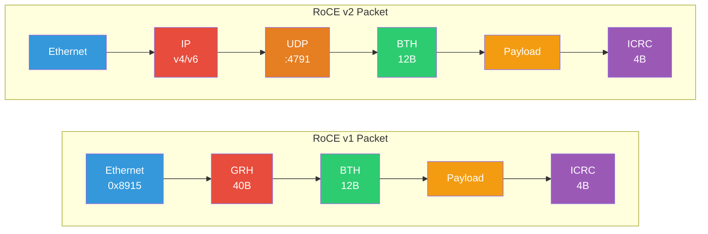

# 3.2 RoCE v1 and v2

RDMA over Converged Ethernet (RoCE) brings InfiniBand's transport protocol to Ethernet networks. It exists in two versions: RoCE v1, which operates at Layer 2, and RoCE v2, which adds UDP/IP encapsulation for Layer 3 routability. RoCE v2 has become the dominant RDMA transport in hyperscale data centers, but deploying it correctly requires understanding the tension between InfiniBand's lossless assumptions and Ethernet's best-effort heritage.

## RoCE v1: Layer 2 RDMA

RoCE v1 was defined in the InfiniBand Architecture specification Annex A17 (2010). It takes the InfiniBand transport layer --- the same BTH, payload, and ICRC that travel over native InfiniBand --- and encapsulates them directly in Ethernet frames.

### RoCE v1 Packet Format

```
+------------------+
| Ethernet Header  |  14 bytes (+ 4 bytes if VLAN tagged)
| EtherType: 0x8915|
+------------------+
| GRH              |  40 bytes (Global Route Header)
+------------------+
| BTH              |  12 bytes (Base Transport Header)
+------------------+
| Payload + Headers|  Variable (RETH, AETH, etc.)
+------------------+
| ICRC             |  4 bytes (Invariant CRC)
+------------------+
| FCS              |  4 bytes (Ethernet Frame Check Sequence)
+------------------+
```

The EtherType 0x8915 identifies the frame as a RoCE v1 packet. The GRH is mandatory in RoCE v1 (unlike native InfiniBand, where it is optional for intra-subnet traffic) because it carries the GID, which serves as the endpoint identifier.

### RoCE v1 Limitations

RoCE v1's fundamental limitation is that it is confined to a single Layer 2 broadcast domain. Because the packet has no IP header, standard IP routers cannot forward it. This restriction means:

- All communicating nodes must be on the same VLAN or bridged network segment.
- The network diameter is limited to what a single L2 domain can support (typically a few hundred nodes before broadcast storms and MAC table overflow become problems).
- There is no path for multi-site or WAN deployment.

These limitations made RoCE v1 impractical for large-scale deployments, and it has been largely superseded by RoCE v2. However, some legacy deployments and certain specialized appliances still use RoCE v1.

## RoCE v2: Routable RDMA over Ethernet

RoCE v2 was defined in the InfiniBand Architecture specification Annex A16 and A17 addendum (2014). It wraps the BTH and payload inside a UDP/IP packet, making it routable across Layer 3 boundaries.

### RoCE v2 Packet Format

```
+------------------+
| Ethernet Header  |  14 bytes (+ 4 bytes if VLAN tagged)
+------------------+
| IP Header        |  20 bytes (IPv4) or 40 bytes (IPv6)
+------------------+
| UDP Header       |  8 bytes (dest port: 4791)
+------------------+
| BTH              |  12 bytes (Base Transport Header)
+------------------+
| Payload + Headers|  Variable (RETH, AETH, etc.)
+------------------+
| ICRC             |  4 bytes (Invariant CRC)
+------------------+
| FCS              |  4 bytes (Ethernet Frame Check Sequence)
+------------------+
```



### The UDP Destination Port: 4791

IANA has assigned UDP port 4791 to RoCE v2. All RoCE v2 packets use this destination port. The source port, however, is not fixed --- it is chosen by the sender to provide **entropy for ECMP (Equal-Cost Multi-Path) load balancing**.

### Why UDP Enables ECMP

This is perhaps the single most important reason RoCE v2 exists. In a leaf-spine data center topology, there are multiple equal-cost paths between any two endpoints. Switches distribute traffic across these paths using ECMP, typically hashing on a combination of fields from the packet header --- the classic 5-tuple: source IP, destination IP, IP protocol, source port, destination port.

With RoCE v1, there is no IP header and no UDP header. The fields available for hashing are limited to source and destination MAC addresses. Since all traffic between two nodes shares the same MAC pair, every flow between those nodes follows the same path, creating hot spots and wasting available bandwidth.

With RoCE v2, the UDP source port provides per-flow entropy. The RNIC generates different source port values for different Queue Pairs (or even different flows within a QP, depending on the implementation), ensuring that ECMP distributes traffic across all available paths. NVIDIA ConnectX adapters compute the UDP source port as a hash of the source and destination QPN and optionally the PSN, providing good distribution.

<div class="tip">

When benchmarking RoCE v2, always verify that ECMP is actually distributing your traffic. A single `ib_write_bw` benchmark between two nodes will use a single QP, which maps to a single UDP source port, which follows a single ECMP path. To saturate a multi-path fabric, you need multiple QPs or multiple node pairs sending simultaneously.

</div>

## GID to IP Address Mapping

In RoCE, the GID (Global Identifier) from the InfiniBand specification maps directly to IP addresses:

- **RoCE v1**: The GID is carried in the GRH. It is an IPv6-format 128-bit address derived from the port GUID (same as native InfiniBand).
- **RoCE v2 with IPv4**: The GID is mapped to an IPv4 address using the standard IPv4-mapped IPv6 format: `::ffff:<IPv4 address>`. For example, IP address `10.0.1.5` becomes GID `::ffff:10.0.1.5` (or in full notation, `0000:0000:0000:0000:0000:ffff:0a00:0105`).
- **RoCE v2 with IPv6**: The GID is the IPv6 address itself.

The GID table on each RNIC port contains entries for each IP address configured on the network interface associated with that port. When the application creates an address handle or modifies a QP, it specifies a GID index that selects which source IP address to use.

<div class="note">

The GID table is populated automatically by the RDMA subsystem in the Linux kernel. When you add or remove an IP address from a network interface (e.g., via `ip addr add`), the corresponding GID entries are added or removed from the GID table. You can inspect the GID table using `ibv_devinfo -v` or by reading `/sys/class/infiniband/<device>/ports/<port>/gids/<index>`.

</div>

## Quality of Service: DSCP and PCP

RoCE v2 leverages standard IP and Ethernet QoS mechanisms rather than InfiniBand's SL/VL system:

- **DSCP (Differentiated Services Code Point)**: A 6-bit field in the IP header that marks the traffic class. RoCE v2 applications set the DSCP value via the `traffic_class` field in the address handle or QP attributes. Switches and routers use DSCP to classify packets into forwarding classes.
- **PCP (Priority Code Point)**: A 3-bit field in the 802.1Q VLAN tag that indicates the frame priority. PCP is used by Ethernet switches to map frames to output queues and, critically, to determine which priority receives PFC (Priority Flow Control) protection.

Typically, the RoCE traffic class is mapped to a specific PCP value (e.g., PCP 3), and PFC is enabled only for that priority. Non-RoCE traffic (TCP, UDP) uses a different PCP and is not protected by PFC, so it experiences normal Ethernet drop-tail behavior under congestion.

## The Lossless Ethernet Requirement

Here lies the central challenge of RoCE deployment. InfiniBand's transport protocol (the BTH layer) was designed for a lossless fabric. The Reliable Connection (RC) transport does have a retransmission mechanism, but it was designed as a rare-event recovery path, not as a steady-state loss recovery mechanism like TCP's. When packet loss occurs on RC transport:

1. The sender's retry timer fires (typically 8--20 ms, configurable but with coarse granularity).
2. The sender retransmits from the last acknowledged PSN, discarding all subsequent completions (go-back-N).
3. During retransmission, the QP is stalled --- no new operations can make progress.

The result is that even modest packet loss (0.1%) can reduce RoCE throughput by 50% or more. At 1% loss, RC connections become essentially unusable. This is fundamentally different from TCP, where loss is an expected signal and recovery is fast and fine-grained.

### Priority Flow Control (PFC)

PFC (IEEE 802.1Qbb) is the primary mechanism for making Ethernet lossless for RoCE. PFC extends Ethernet's basic PAUSE mechanism with per-priority flow control:

- Each of the 8 IEEE 802.1p priorities can be independently paused or unpaused.
- When a switch's receive buffer for a specific priority reaches a configurable threshold, it sends a PFC PAUSE frame to the upstream sender, specifying the priority and a pause duration (in 512-bit time quanta).
- The upstream sender must stop transmitting frames of that priority for the specified duration.
- When the buffer drains below a resume threshold, the switch sends a PFC frame with duration 0 (or simply lets the pause timer expire).

### Configuring PFC for RoCE

A typical PFC configuration for RoCE involves the following steps:

1. **Designate a lossless priority**: Choose one of the 8 PCP values (commonly PCP 3 or PCP 4) for RoCE traffic.
2. **Enable PFC on that priority**: Configure every switch and NIC in the path to send and respond to PFC PAUSE for the chosen priority.
3. **Map RoCE traffic to the lossless priority**: Configure the RNIC to tag RoCE packets with the appropriate PCP value. On the switch, configure trust mode (typically "trust DSCP" or "trust PCP") so the switch respects the marking.
4. **Set buffer thresholds**: Configure the PFC trigger threshold (when to send PAUSE) and the resume threshold (when to stop pausing). These thresholds must account for the round-trip propagation delay plus the maximum burst that can arrive during the pause response time. For a 100 Gbps link with 1 microsecond round-trip delay, the minimum headroom is approximately 12.5 KB.
5. **Leave other priorities lossy**: Non-RoCE traffic uses different PCP values and is not PFC-protected.

<div class="warning">

PFC is notoriously difficult to configure correctly and can cause severe problems when misconfigured:

- **PFC storms**: A misbehaving NIC or switch that sends continuous PAUSE frames can propagate back-pressure across the entire fabric, effectively freezing all traffic on the paused priority. Modern switches include PFC watchdog timers that detect and break storms by dropping traffic on the stalled priority.
- **Head-of-line blocking**: Even when PFC is working correctly, a paused priority shares physical link bandwidth with unpaused priorities. Heavy RoCE traffic that triggers frequent PFC pauses can starve lossy traffic classes.
- **Buffer exhaustion**: Switch buffer is a finite resource. Allocating sufficient headroom for PFC on every port and every priority is not always possible, especially on switches with shallow buffers.

Many operators consider PFC a necessary evil and invest heavily in congestion control (ECN/DCQCN) to minimize the frequency of PFC events.

</div>

## Congestion Control: ECN and DCQCN

The best RoCE deployments use PFC as a safety net but rely on end-to-end congestion control to prevent congestion from building to the point where PFC triggers. The standard mechanism is **DCQCN (Data Center QCN)**, which combines ECN marking at switches with rate limiting at the sender.

### How DCQCN Works

1. **ECN marking at switches**: When a switch's output queue for the RoCE priority exceeds a configured threshold, it sets the ECN bits in the IP header of passing RoCE packets (changing the ECN field from `01` or `10` to `11`, indicating Congestion Experienced).
2. **CNP generation at the receiver**: When the destination RNIC receives a packet with ECN CE marking, it generates a **Congestion Notification Packet (CNP)** back to the source. CNPs are special RoCE v2 packets identified by a specific BTH opcode.
3. **Rate reduction at the sender**: When the source RNIC receives a CNP, it reduces the sending rate for the affected QP according to the DCQCN algorithm. The rate reduction is multiplicative (similar to TCP's multiplicative decrease).
4. **Rate recovery**: After a period without CNPs, the sender gradually increases its rate using a combination of timer-based recovery and byte-count-based recovery, approaching the original line rate.

### ECN Configuration

ECN must be enabled on three entities:

- **The sender RNIC**: Must mark outgoing packets as ECN-capable (ECN field = `01` or `10`).
- **Every switch in the path**: Must be configured with ECN marking thresholds for the RoCE traffic class.
- **The receiver RNIC**: Must detect ECN CE marking and generate CNPs.

ECN marking thresholds on switches are critical tuning parameters. If set too low, the network underutilizes bandwidth. If set too high, queues build up and PFC triggers before ECN has time to take effect. A common starting point is to set the ECN marking threshold at 5--10% of the switch buffer allocated to the RoCE priority, while the PFC threshold is set at 80--90%.

<div class="tip">

Modern NVIDIA ConnectX-6 Dx and later adapters support **RTT-based congestion control** in addition to ECN-based DCQCN. RTT-based schemes (similar to TCP BBR) measure round-trip time to detect congestion before queues build up, providing faster convergence and better throughput. This is particularly beneficial in multi-tenant environments where ECN thresholds are harder to tune.

</div>

## RoCE Without PFC: The Lossy RoCE Debate

An active area of development is making RoCE work acceptably without PFC. Several approaches are being pursued:

- **Improved retransmission**: Modern RNICs support faster retry timers (microsecond-scale instead of millisecond-scale) and selective retransmission instead of go-back-N. NVIDIA's ConnectX-7 supports **selective repeat** on RC connections, significantly reducing the performance penalty from occasional packet drops.
- **IRN (Improved RoCE NIC)**: Research proposals for RNIC designs that handle loss gracefully, with per-packet sequence numbers and selective ACKs similar to TCP SACK.
- **Proactive congestion control**: Using RTT-based congestion control to keep queues nearly empty, making packet drops extremely rare even without PFC.
- **Application-level tolerance**: Using UD (Unreliable Datagram) transport and handling retransmission in software, as some key-value stores do.

Some hyperscale operators (notably Google with their Falcon transport) have moved away from PFC entirely, implementing loss recovery in custom hardware. However, for standard RoCE v2 with the verbs API, PFC remains the recommended deployment model as of 2025.

## Soft-RoCE (rxe)

**Soft-RoCE** is a software implementation of the RoCE v2 protocol in the Linux kernel (module `rdma_rxe`). It implements the full RoCE v2 packet format and the verbs API entirely in software, using standard Ethernet NICs without any RDMA hardware support.

### Use Cases

Soft-RoCE is invaluable for:

- **Development and testing**: Write and debug RDMA applications on any Linux machine with an Ethernet NIC, then deploy on hardware RNICs.
- **Functional validation**: Test RDMA application logic without investing in RDMA hardware.
- **Learning**: Explore the RDMA programming model hands-on.

### Setup

Enabling Soft-RoCE is straightforward:

```bash
# Load the kernel module
modprobe rdma_rxe

# Add a Soft-RoCE device bound to an Ethernet interface
rdma link add rxe0 type rxe netdev eth0

# Verify
rdma link show
ibv_devinfo
```

After this, `rxe0` appears as a standard RDMA device, and all verbs-based applications (including `ib_write_bw`, `ib_send_lat`, `perftest`, etc.) work against it.

<div class="warning">

Soft-RoCE provides functional correctness but not performance. Expect latencies of 20--50 microseconds (vs. 1--2 microseconds for hardware RoCE) and throughput limited to a few Gbps (vs. 100--400 Gbps for hardware). It is also not suitable for production workloads because all protocol processing happens in the kernel on the CPU, consuming significant CPU cycles. Never benchmark Soft-RoCE and draw conclusions about RDMA performance.

</div>

## Deployment Considerations

When deploying RoCE v2, consider the following:

1. **Switch selection**: Not all Ethernet switches support PFC and ECN well. Switches based on Memory-Mapped (cut-through) architectures with deep buffers (e.g., NVIDIA Spectrum series, Broadcom Memory Crossbar series) are better suited for RoCE than shallow-buffer merchant silicon.

2. **MTU**: RoCE benefits significantly from jumbo frames (MTU 9000). The header overhead is amortized over a larger payload, and fewer packets are needed for a given transfer size, reducing per-packet processing overhead. Ensure jumbo frames are enabled end-to-end.

3. **Firmware and driver versions**: RoCE behavior (especially congestion control and retransmission) is heavily firmware-dependent. Keep RNIC firmware and drivers up to date, and test thoroughly after upgrades.

4. **Monitoring**: Deploy monitoring for PFC counters (both Tx and Rx), ECN marking rates, and RoCE retransmission counters on both RNICs and switches. PFC storms and misconfigured ECN thresholds are the most common causes of RoCE performance problems.

5. **Multi-tenancy**: In shared environments, use different DSCP values and traffic classes for different tenants' RoCE traffic. Ensure that one tenant's congestion cannot trigger PFC pauses that affect another tenant.
