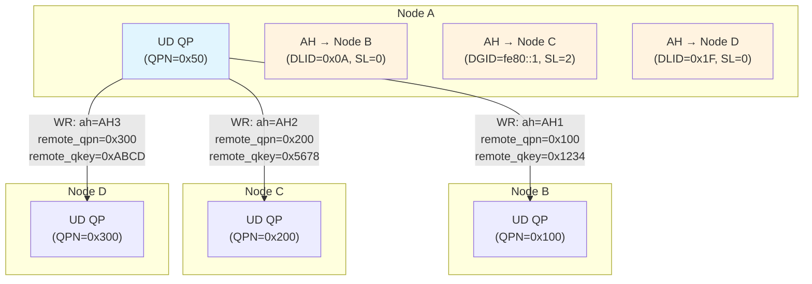

# 4.6 Address Handles (AH)

The Address Handle is the RDMA abstraction for routing information in connectionless (datagram) communication. While Reliable Connected (RC) QPs embed their destination in the QP state itself -- set once during connection establishment and used for every message thereafter -- Unreliable Datagram (UD) QPs are connectionless: a single UD QP can send messages to any number of different destinations. Each send work request on a UD QP must therefore specify where the message should go. The Address Handle encapsulates this destination information in a reusable object.

## Why Address Handles Exist

To understand the need for Address Handles, consider the difference between connected and connectionless QP types:

**RC (Reliable Connected):** During the QP state transition from INIT to RTR, the application specifies the remote QPN, LID, GID, and path parameters. These are stored in the QP's hardware context. Every packet sent on this QP automatically uses these stored values. There is no need to specify a destination per message -- the connection defines it.

**UD (Unreliable Datagram):** There is no connection. A single UD QP might send messages to QP 0x100 on node A, QP 0x200 on node B, and QP 0x300 on node C, all in succession. Each work request must carry its own destination information.

Rather than embedding raw routing data (LIDs, GIDs, service levels, etc.) directly in each work request -- which would make the WQE large and would require re-encoding the routing information every time -- RDMA provides the Address Handle: a pre-encoded, reusable object that the NIC can efficiently reference.



## Address Handle Attributes

An Address Handle is created from a structure that describes the destination and path characteristics:

```c
struct ibv_ah_attr {
    struct ibv_global_route grh;      /* Global Route Header fields */
    uint16_t        dlid;             /* Destination Local ID (IB only) */
    uint8_t         sl;               /* Service Level (QoS) */
    uint8_t         src_path_bits;    /* Source path bits for LMC */
    uint8_t         static_rate;      /* Rate limiting */
    uint8_t         is_global;        /* If nonzero, GRH fields are valid */
    uint8_t         port_num;         /* Local port number to send from */
};

struct ibv_global_route {
    union ibv_gid   dgid;            /* Destination GID (128-bit) */
    uint32_t        flow_label;       /* IPv6 flow label */
    uint8_t         sgid_index;       /* Index of source GID to use */
    uint8_t         hop_limit;        /* IP TTL equivalent */
    uint8_t         traffic_class;    /* IPv6 traffic class / DSCP */
};
```

Each field serves a specific purpose:

### DLID (Destination Local ID)

The LID is the InfiniBand layer-2 address, assigned by the Subnet Manager. It is a 16-bit value (extended to 20 bits in the HDR specification) that uniquely identifies a port within a subnet.[^1] For native InfiniBand fabrics, the DLID is the primary routing identifier -- switches use it to forward packets.

For RoCE (RDMA over Converged Ethernet), LIDs are not used. Instead, all routing is done via GIDs (which map to IPv4 or IPv6 addresses). The DLID field is typically set to zero or ignored.

### GRH (Global Route Header)

The Global Route Header provides IPv6-like routing for packets that need to traverse subnets or that use GID-based addressing. The GRH contains:

- **dgid**: The destination GID -- a 128-bit identifier. For InfiniBand, this is the port's GUID combined with the subnet prefix. For RoCEv2, this is an IPv4-mapped or IPv6 address.
- **sgid_index**: Which of the local port's GIDs to use as the source address. A port may have multiple GIDs (one per VLAN, one per IP address, etc.). The GID table can be viewed via `ibv_query_gid()` or through sysfs.
- **hop_limit**: Equivalent to the IP TTL. Decremented by each router/switch. If it reaches zero, the packet is discarded.
- **traffic_class**: Used for QoS classification, analogous to the IPv6 traffic class or DSCP field.
- **flow_label**: A 20-bit label that can be used for ECMP (Equal-Cost Multi-Path) load balancing in switches.

### is_global

This boolean flag determines whether the GRH is included in the packet:

- **is_global = 0**: No GRH. Routing uses only the DLID. This is valid only for InfiniBand communication within a single subnet.
- **is_global = 1**: GRH is included. **Required** for all RoCE communication, for InfiniBand communication across subnets (via routers), and for IPv6/multicast.

<div class="admonition warning">
<div class="admonition-title">Warning</div>
For <strong>RoCE (both v1 and v2)</strong>, the GRH is always required. Setting <code>is_global = 0</code> on a RoCE device will cause packet transmission to fail. This is a common source of confusion when porting InfiniBand applications to RoCE. Always set <code>is_global = 1</code> and populate the GRH fields when using RoCE.
</div>

### Service Level (SL)

The Service Level is a 4-bit value (0-15) that maps to Virtual Lanes (VLs) in the fabric. Different SLs can be assigned different bandwidth guarantees and priorities. The SL-to-VL mapping is configured by the Subnet Manager. For RoCE, the SL maps to Ethernet priority (PCP) bits and ultimately to traffic classes for PFC (Priority Flow Control) and ECN (Explicit Congestion Notification).

### Source Path Bits

When a port is configured with a LID Mask Control (LMC) value greater than zero, it responds to multiple LIDs. The `src_path_bits` field selects which of the port's LIDs to use as the source. This is used for multi-path routing in InfiniBand fabrics.

### Static Rate

For fabrics with mixed-speed links, the `static_rate` field allows rate limiting to prevent overwhelming a slower destination. In modern fabrics with uniform link speeds, this is typically set to zero (no rate limiting).

## Creating and Destroying Address Handles

```c
/* Create an Address Handle for InfiniBand (within a subnet) */
struct ibv_ah_attr ah_attr = {
    .dlid       = remote_lid,        /* Destination LID */
    .sl         = 0,                 /* Service Level 0 */
    .port_num   = 1,                 /* Use port 1 */
    .is_global  = 0,                 /* No GRH needed for local IB subnet */
};

struct ibv_ah *ah = ibv_create_ah(pd, &ah_attr);
if (!ah) {
    perror("ibv_create_ah");
    exit(1);
}

/* Create an Address Handle for RoCE (GRH required) */
struct ibv_ah_attr roce_ah_attr = {
    .dlid       = 0,                 /* Not used for RoCE */
    .sl         = 0,
    .port_num   = 1,
    .is_global  = 1,                 /* GRH required for RoCE */
    .grh = {
        .dgid       = remote_gid,   /* Remote GID (IPv4 or IPv6 addr) */
        .sgid_index = gid_index,     /* Local GID table index */
        .hop_limit  = 64,
        .traffic_class = 0,
        .flow_label = 0,
    },
};

struct ibv_ah *roce_ah = ibv_create_ah(pd, &roce_ah_attr);

/* When no longer needed */
ibv_destroy_ah(ah);
ibv_destroy_ah(roce_ah);
```

<div class="admonition note">
<div class="admonition-title">Note</div>
Address Handles belong to a Protection Domain. An AH created in PD X can only be used by QPs in PD X. The NIC enforces this check in hardware.
</div>

## Using Address Handles in UD Communication

The Address Handle is referenced in the UD-specific section of the send work request:

```c
/* Prepare a UD send work request */
struct ibv_sge sge = {
    .addr   = (uintptr_t)send_buffer,
    .length = message_length,
    .lkey   = mr->lkey,
};

struct ibv_send_wr wr = {
    .wr_id    = 42,
    .sg_list  = &sge,
    .num_sge  = 1,
    .opcode   = IBV_WR_SEND,
    .send_flags = IBV_SEND_SIGNALED,
    .wr.ud = {
        .ah          = ah,              /* Address Handle for destination */
        .remote_qpn  = remote_qpn,     /* Destination QP number */
        .remote_qkey = remote_qkey,     /* Q_Key for authorization */
    },
};

struct ibv_send_wr *bad_wr;
int ret = ibv_post_send(ud_qp, &wr, &bad_wr);
```

Note the three UD-specific fields:

- **ah**: The Address Handle object encapsulating the routing information.
- **remote_qpn**: The QP number on the remote node. Unlike RC, this is specified per work request because UD is connectionless.
- **remote_qkey**: The Queue Key. UD QPs use Q_Keys as a simple authorization mechanism: the receiver's QP has a Q_Key, and the sender must specify a matching Q_Key for the message to be accepted. Q_Key values with the high bit set (0x80000000 and above) are privileged and can only be set by trusted (kernel-level) consumers.[^2]

## UD Receive Side: The GRH Prefix

When a UD QP receives a message, the NIC prepends a 40-byte **Global Route Header (GRH)** to the received data, regardless of whether the original packet contained a GRH.[^3] This is a crucial detail that frequently causes bugs in UD receive processing:

```c
/* UD receive buffers must account for the 40-byte GRH prefix */
#define GRH_SIZE 40

size_t recv_buf_size = GRH_SIZE + max_message_size;
void *recv_buffer = malloc(recv_buf_size);

struct ibv_sge recv_sge = {
    .addr   = (uintptr_t)recv_buffer,
    .length = recv_buf_size,
    .lkey   = mr->lkey,
};

struct ibv_recv_wr recv_wr = {
    .wr_id   = 0,
    .sg_list = &recv_sge,
    .num_sge = 1,
};

ibv_post_recv(ud_qp, &recv_wr, &bad_recv_wr);

/* After receiving a completion: */
void *grh = recv_buffer;                          /* First 40 bytes: GRH */
void *payload = (char *)recv_buffer + GRH_SIZE;   /* Actual message data */
uint32_t payload_len = wc.byte_len - GRH_SIZE;    /* Actual message length */
```

<div class="admonition warning">
<div class="admonition-title">Warning</div>
If your UD receive buffer is not at least 40 bytes larger than the maximum expected message, the receive will fail with a Local Length Error. Always allocate receive buffers as <code>GRH_SIZE + max_msg_size</code>.
</div>

## Creating Address Handles from Received Packets

A common pattern in UD communication is to reply to received messages. Rather than requiring the application to manually parse the received GRH and construct a new AH, libibverbs provides a convenience function:

```c
/* Create an AH from the work completion of a received UD message */
struct ibv_ah_attr ah_attr;
int ret = ibv_init_ah_from_wc(ctx, port_num, &wc, grh, &ah_attr);
if (ret) {
    fprintf(stderr, "ibv_init_ah_from_wc failed\n");
}

struct ibv_ah *reply_ah = ibv_create_ah(pd, &ah_attr);

/* Or, as a single call: */
struct ibv_ah *reply_ah = ibv_create_ah_from_wc(pd, &wc, grh, port_num);
```

This function extracts the source routing information from the work completion (source LID, source QPN, SL, etc.) and the GRH (source GID, traffic class, etc.) and populates an `ibv_ah_attr` that can be used to create an AH pointing back to the sender. This is particularly useful for implementing request-response protocols over UD.

## AH Caching and Reuse

Creating an Address Handle involves a system call (control-path operation), so creating a new AH for every message would add significant overhead. The recommended practice is to **cache and reuse** Address Handles:

```c
/* AH cache: map from destination identifier to AH */
struct ah_cache_entry {
    uint16_t dlid;       /* or GID for RoCE */
    struct ibv_ah *ah;
    struct ah_cache_entry *next;
};

struct ibv_ah *get_or_create_ah(struct ibv_pd *pd, uint16_t dlid,
                                 struct ibv_ah_attr *template) {
    /* Check cache first */
    struct ah_cache_entry *entry = lookup_cache(dlid);
    if (entry)
        return entry->ah;

    /* Cache miss: create a new AH */
    template->dlid = dlid;
    struct ibv_ah *ah = ibv_create_ah(pd, template);

    /* Insert into cache */
    insert_cache(dlid, ah);
    return ah;
}
```

In steady-state operation, an application that communicates with a fixed set of peers will create one AH per peer and reuse them for the lifetime of the communication. The AH creation overhead is paid once during the initial message exchange.

## Address Handles and Multicast

UD QPs support multicast communication via InfiniBand multicast groups. To send to a multicast group, the application creates an AH with the multicast group's LID and GID:

```c
/* Multicast group address */
union ibv_gid mgid;  /* Multicast GID, e.g., ff12:601b::1 */
uint16_t mlid;       /* Multicast LID, assigned by SM */

struct ibv_ah_attr mcast_ah_attr = {
    .dlid      = mlid,
    .sl        = 0,
    .port_num  = 1,
    .is_global = 1,
    .grh = {
        .dgid      = mgid,
        .sgid_index = 0,
        .hop_limit = 1,
    },
};

struct ibv_ah *mcast_ah = ibv_create_ah(pd, &mcast_ah_attr);

/* Send to multicast group */
struct ibv_send_wr wr = {
    .opcode = IBV_WR_SEND,
    .wr.ud = {
        .ah         = mcast_ah,
        .remote_qpn = 0xFFFFFF,    /* Multicast QPN (all 1s) */
        .remote_qkey = mcast_qkey,
    },
    /* ... */
};
```

The receiving QPs must join the multicast group using `ibv_attach_mcast()` before they can receive multicast messages.

## Address Handles vs. Address Vectors

In some literature and hardware documentation, you may encounter the term **Address Vector (AV)** used interchangeably with Address Handle. Strictly speaking, the Address Vector is the underlying data structure inside the NIC that contains the encoded routing information, while the Address Handle is the user-space object that references it. In practice, the terms are synonymous.

On some hardware (notably NVIDIA ConnectX), creating an AH does not immediately program the NIC. Instead, the AH is encoded into a software structure, and the actual NIC-side address vector is written into the WQE by the provider library when the work request is posted. This is an implementation detail that varies by provider but does not affect the programming model.

## AH in the Extended API

The extended verbs interface provides `ibv_create_ah_ex()` with additional capabilities, and the `rdma_create_ah()` function in the rdma_cm library integrates AH creation with the RDMA Connection Manager for easier address resolution:

```c
#include <rdma/rdma_cma.h>

/* Using rdma_cm for address resolution and AH creation */
struct rdma_cm_id *id;
rdma_create_id(NULL, &id, NULL, RDMA_PS_UDP);
rdma_resolve_addr(id, NULL, dst_addr, timeout_ms);
rdma_resolve_route(id, timeout_ms);

/* The resolved route contains the AH attributes */
struct ibv_ah_attr ah_attr = id->route.addr.ibaddr;
struct ibv_ah *ah = ibv_create_ah(pd, &ah_attr);
```

This is particularly useful for RoCE, where the GID is an IP address and the application needs ARP/neighbor resolution to determine the destination MAC address. The RDMA CM handles this resolution transparently.

## Performance Considerations

Address Handle operations have the following performance characteristics:

- **Creation**: Control-path operation, 5-20 microseconds. Avoid creating AHs on the data path.
- **Usage in WQE**: Zero additional overhead. The provider encodes the AV into the WQE at post time, which is part of the normal WQE construction cost.
- **Destruction**: Control-path operation, similar cost to creation.
- **Memory footprint**: Each AH consumes a small amount of memory (typically 64-128 bytes) for the software structure. On some hardware, an NIC-side resource is also allocated.

For applications communicating with a small number of peers (tens to hundreds), AH overhead is negligible. For applications communicating with thousands of peers (e.g., large-scale collective operations), the total AH memory and creation time can become relevant, and batched creation or lazy allocation strategies may be warranted.

<div class="admonition tip">
<div class="admonition-title">Tip</div>
If your application uses both RC and UD QPs (a common pattern where UD is used for initial discovery and RC is used for bulk data transfer), you can reuse the addressing information from AH creation when setting up the RC connection. The <code>ibv_ah_attr</code> fields (DLID, GID, SL, etc.) are the same information needed for the RC QP's RTR transition.
</div>

## Summary

The Address Handle encapsulates destination routing information for connectionless (UD) communication. It contains the destination LID (for InfiniBand), GID (for RoCE and cross-subnet routing), Service Level, and other path parameters. AHs are created once and reused across multiple send operations, amortizing the creation cost. For RoCE, the GRH (and thus `is_global = 1`) is always required. On the receive side, UD messages always carry a 40-byte GRH prefix that must be accounted for in buffer sizing. The `ibv_create_ah_from_wc()` convenience function simplifies reply-path creation. Together with Queue Pairs, Completion Queues, Memory Regions, and Protection Domains, Address Handles complete the set of core RDMA abstractions that form the foundation of the programming model explored throughout the rest of this book.

[^1]: LID assignment and format are defined in the InfiniBand Architecture Specification, Volume 1, Section 4.1.3. The original specification defines LIDs as 16-bit values (0x0001-0xBFFF for unicast, 0xC000-0xFFFE for multicast). Starting with HDR (200 Gbps) InfiniBand, the specification was extended to support 20-bit LIDs to accommodate larger subnets.

[^2]: Q_Key semantics are defined in the InfiniBand Architecture Specification, Volume 1, Section 10.2.4. The high bit (bit 31) of the Q_Key is the "controlled" bit: Q_Keys with this bit set can only be placed in a QP's Q_Key field by a privileged (kernel) consumer. This prevents user-space applications from spoofing management traffic that uses well-known Q_Keys such as `IB_QP1_QKEY` (0x80010000).

[^3]: The 40-byte GRH prepended to UD receive data is mandated by the IBA specification, Volume 1, Section 10.2.5. Even when the incoming packet has no GRH (intra-subnet communication with `is_global = 0`), the HCA still prepends a 40-byte header with the source port's GID information. This ensures that UD receive processing has a uniform buffer layout. See `ibv_create_ah_from_wc(3)` for the convenience function that parses this header.
