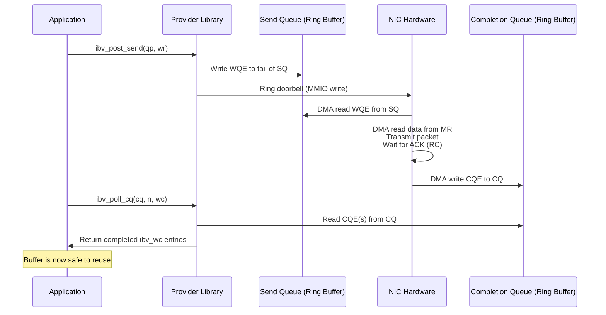

# 4.3 Completion Queues (CQ)

If Queue Pairs are where work begins, Completion Queues are where work ends. Every RDMA operation -- send, receive, RDMA write, RDMA read, atomic -- eventually generates a completion. The Completion Queue is the mechanism by which the NIC reports to the application that a work request has been processed. Understanding the CQ is essential not only for correctness (knowing when a buffer can be reused) but for performance (the completion path is often the bottleneck in high-throughput applications).

## The Role of Completions

Why do completions exist? Consider what happens when you post a send work request:

1. You call `ibv_post_send()`, which writes a WQE into the QP's Send Queue.
2. The NIC reads the WQE via DMA, reads the data from your registered buffer via DMA, and transmits the packet.
3. For RC QPs, the NIC waits for an acknowledgment from the remote side.
4. Only at this point is the operation truly complete: the data has been transmitted, acknowledged (for RC), and the buffer is safe to reuse or free.

Without completions, you would have no way to know when step 4 has occurred. You would either have to assume the worst case (wait an arbitrarily long time) or risk reusing a buffer while the NIC is still reading from it -- a recipe for data corruption.

The Completion Queue Entry (CQE) is the answer: a small structure written by the NIC into a ring buffer accessible to the application, containing the status and metadata of a completed operation.

## CQE Structure

The application reads completions through the `ibv_wc` (work completion) structure:

```c
struct ibv_wc {
    uint64_t        wr_id;          /* The wr_id from the original WQE */
    enum ibv_wc_status status;      /* IBV_WC_SUCCESS or error code */
    enum ibv_wc_opcode opcode;      /* IBV_WC_SEND, IBV_WC_RECV, IBV_WC_RDMA_WRITE, etc. */
    uint32_t        vendor_err;     /* Vendor-specific error code */
    uint32_t        byte_len;       /* Number of bytes transferred (for receive ops) */
    uint32_t        imm_data;       /* Immediate data (network byte order) */
    uint32_t        qp_num;         /* QP number that generated this completion */
    uint32_t        src_qp;         /* Source QPN (for UD receives) */
    uint16_t        pkey_index;     /* Partition key index */
    uint16_t        slid;           /* Source LID (for UD receives) */
    uint8_t         sl;             /* Service Level (for UD receives) */
    uint8_t         dlid_path_bits; /* DLID path bits (for UD receives) */
    /* ... additional fields ... */
};
```

Key fields:

- **wr_id**: This is the 64-bit value you set in the original work request. It is your primary mechanism for correlating completions with requests. A common pattern is to store a pointer to a context structure or an index into a work-request tracking array.
- **status**: `IBV_WC_SUCCESS` (0) means the operation completed normally. Any other value indicates an error. Common error codes include `IBV_WC_LOC_LEN_ERR` (local length error), `IBV_WC_LOC_PROT_ERR` (local protection error -- typically an lkey/rkey mismatch), `IBV_WC_REM_ACCESS_ERR` (remote access error), and `IBV_WC_RETRY_EXC_ERR` (retry count exceeded -- the remote side is unreachable).
- **opcode**: Indicates what kind of operation completed. Note that for send-side completions, this reflects the original operation (Send, RDMA Write, RDMA Read, etc.). For receive-side completions, the opcode is `IBV_WC_RECV` or `IBV_WC_RECV_RDMA_WITH_IMM`.
- **byte_len**: Only meaningful for receive completions -- indicates how many bytes of data were actually received.
- **qp_num**: Identifies which QP generated this completion. This is essential when a single CQ is shared across multiple QPs.

<div class="admonition warning">
<div class="admonition-title">Warning</div>
When <code>status != IBV_WC_SUCCESS</code>, the only reliable fields in the CQE are <code>wr_id</code>, <code>status</code>, <code>vendor_err</code>, and <code>qp_num</code>. All other fields are undefined. Do not read <code>byte_len</code>, <code>opcode</code>, or any other field from a failed completion.
</div>

## The Completion Flow



The key observation is that the NIC writes CQEs directly into application-accessible memory via DMA. The `ibv_poll_cq()` call does not involve a system call or kernel transition -- the provider library simply reads from the CQ's ring buffer in user-space memory. This is why CQ polling achieves sub-microsecond latency.

## CQ Sizing

A Completion Queue has a fixed capacity set at creation time. It must be large enough to accommodate the maximum number of outstanding CQEs that can be generated before the application polls them.

The sizing calculation depends on which QPs are associated with the CQ:

```
Required CQ size ≥ Σ(max_send_wr for all QPs using this CQ for send completions)
                  + Σ(max_recv_wr for all QPs using this CQ for recv completions)
```

In practice, not all send WQEs generate completions -- only those with `IBV_SEND_SIGNALED` set (when `sq_sig_all = 0`). However, sizing the CQ for the worst case is the safe approach:

```c
/* Two QPs, each with 256 send WRs and 256 recv WRs, sharing one CQ */
int cq_size = 2 * (256 + 256);  /* = 1024 */

struct ibv_cq *cq = ibv_create_cq(ctx, cq_size, NULL, NULL, 0);
if (!cq) {
    perror("ibv_create_cq");
    exit(1);
}
/* Like QPs, the actual CQ size may be rounded up by the hardware */
printf("Actual CQ size: %d\n", cq->cqe);
```

<div class="admonition warning">
<div class="admonition-title">Warning: CQ Overrun</div>
If the CQ becomes full and the NIC cannot write a new CQE, a <strong>CQ overrun</strong> occurs. This is a fatal error: the NIC generates an asynchronous error event, and all QPs associated with the overflowing CQ are moved to the Error state. Recovery requires destroying and recreating the affected QPs. Always size your CQ generously and poll it frequently enough to prevent this condition.
</div>

## Polling Mode: ibv_poll_cq()

The most common and lowest-latency approach to consuming completions is **busy polling** (also called spinning):

```c
struct ibv_wc wc[16];  /* Poll up to 16 completions at once */
int ne;

/* Busy-poll loop */
while (running) {
    ne = ibv_poll_cq(cq, 16, wc);
    if (ne < 0) {
        fprintf(stderr, "ibv_poll_cq failed\n");
        break;
    }
    for (int i = 0; i < ne; i++) {
        if (wc[i].status != IBV_WC_SUCCESS) {
            fprintf(stderr, "Completion error on wr_id %lu: %s (%d)\n",
                    wc[i].wr_id,
                    ibv_wc_status_str(wc[i].status),
                    wc[i].status);
            handle_error(&wc[i]);
            continue;
        }
        process_completion(&wc[i]);
    }
}
```

`ibv_poll_cq()` is a non-blocking call that returns:
- **> 0**: The number of completions retrieved (up to the requested count).
- **0**: No completions are available.
- **< 0**: An error occurred.

This function is typically the hottest function in an RDMA application. It executes entirely in user space -- no system call, no context switch, no kernel involvement. On modern hardware with ConnectX-5+, a single `ibv_poll_cq()` call takes on the order of tens of nanoseconds.

The trade-off is CPU consumption: a busy-poll loop consumes 100% of one CPU core. This is often acceptable in high-performance computing and low-latency trading, where dedicated cores are the norm. For applications that cannot afford a dedicated polling core, event-driven mode provides an alternative.

## Event-Driven Mode: Completion Channels

For applications that need to wait for completions without spinning, RDMA provides a **completion channel** mechanism based on file descriptors and the `select()`/`poll()`/`epoll()` system calls:

```c
/* Step 1: Create a completion channel */
struct ibv_comp_channel *channel = ibv_create_comp_channel(ctx);

/* Step 2: Create the CQ with the completion channel */
struct ibv_cq *cq = ibv_create_cq(ctx, cq_size, NULL, channel, 0);

/* Step 3: Request notification -- arm the CQ */
ibv_req_notify_cq(cq, 0);  /* 0 = notify on any completion */
                             /* 1 = notify only on solicited completions */

/* Step 4: Wait for notification */
struct ibv_cq *ev_cq;
void *ev_ctx;
ibv_get_cq_event(channel, &ev_cq, &ev_ctx);  /* Blocks until notification */

/* Step 5: Acknowledge the event (MUST be done to avoid resource leak) */
ibv_ack_cq_events(ev_cq, 1);

/* Step 6: Re-arm the CQ for the next notification */
ibv_req_notify_cq(cq, 0);

/* Step 7: Poll for ALL completions */
struct ibv_wc wc[16];
int ne;
while ((ne = ibv_poll_cq(cq, 16, wc)) > 0) {
    for (int i = 0; i < ne; i++) {
        process_completion(&wc[i]);
    }
}
```

The event-driven model introduces several important concepts:

### Completion Channels

A completion channel (`ibv_comp_channel`) is a file-descriptor-based notification mechanism. Its file descriptor can be used with `select()`, `poll()`, or `epoll()`, making it compatible with event-loop frameworks. Multiple CQs can share a single completion channel.

### Arming the CQ

The `ibv_req_notify_cq()` call "arms" the CQ: it tells the NIC to generate an interrupt (and thus a notification on the completion channel) when the next CQE is written. This is a one-shot mechanism -- after a notification fires, the CQ must be re-armed to receive another.

### Solicited-Only Notifications

The second parameter to `ibv_req_notify_cq()` controls which completions trigger notification:

- **0 (unsolicited)**: Notify on any completion.
- **1 (solicited only)**: Notify only when a CQE arrives for a receive operation where the sender set the `IBV_SEND_SOLICITED` flag. This is an optimization that allows the receiver to avoid waking up for routine completions while still being notified for "important" ones.

<div class="admonition note">
<div class="admonition-title">Note</div>
The event-driven model has inherently higher latency than busy polling because it involves an interrupt from the NIC, a kernel-to-user notification via the file descriptor, and the overhead of the event acknowledgment. Typical added latency is 5-20 microseconds. For this reason, high-performance applications often use a hybrid approach: busy-poll for a period, then fall back to event-driven mode after a timeout to save CPU.
</div>

### The Race Condition and Its Resolution

There is a subtle race between `ibv_req_notify_cq()` and `ibv_poll_cq()`. Consider:

1. You arm the CQ with `ibv_req_notify_cq()`.
2. A CQE arrives *before* you call `ibv_get_cq_event()`.
3. You call `ibv_get_cq_event()`, which returns immediately because the event already fired.
4. You poll the CQ and process the completion.
5. You re-arm the CQ.

But what if another CQE arrived between steps 4 and 5? It would be missed until the *next* notification, which might never come if no more work is posted.

The solution is the polling loop in step 7 above: after receiving a notification, always poll the CQ until it is empty, and only *then* re-arm. This ensures no completions are missed. Even better, re-arm *before* draining the CQ:

```c
/* Better pattern: re-arm before polling to close the race window */
ibv_get_cq_event(channel, &ev_cq, &ev_ctx);
ibv_ack_cq_events(ev_cq, 1);
ibv_req_notify_cq(cq, 0);  /* Re-arm BEFORE polling */

/* Now drain all completions -- if new ones arrive during this
   drain, they will trigger another event */
while ((ne = ibv_poll_cq(cq, 16, wc)) > 0) {
    /* ... process ... */
}
```

## Shared CQs

A single CQ can serve as the send CQ and/or receive CQ for multiple QPs. This is both common and recommended:

```c
/* One CQ shared by many QPs */
struct ibv_cq *shared_cq = ibv_create_cq(ctx, total_depth, NULL, NULL, 0);

for (int i = 0; i < num_qps; i++) {
    struct ibv_qp_init_attr attr = {
        .send_cq = shared_cq,
        .recv_cq = shared_cq,
        .cap = { ... },
        .qp_type = IBV_QPT_RC,
    };
    qps[i] = ibv_create_qp(pd, &attr);
}
```

Benefits of shared CQs:

- **Fewer objects to manage**: One poll loop drains completions from all QPs.
- **Natural work aggregation**: When processing completions from multiple QPs in one poll, you can batch responses and repost receive buffers more efficiently.
- **Reduced interrupt overhead**: In event-driven mode, one completion channel and one CQ event replaces N separate events.

The `qp_num` field in each CQE identifies which QP generated the completion, so the application can still dispatch appropriately.

<div class="admonition tip">
<div class="admonition-title">Tip</div>
A common high-performance pattern is to use separate send and receive CQs. This allows different threads to poll send and receive completions concurrently without lock contention, while still sharing each CQ across multiple QPs.
</div>

## CQ Moderation and Coalescing

At very high message rates (millions of messages per second), even the overhead of polling for each individual completion can become significant. **CQ moderation** (also called interrupt coalescing, though it applies to polling as well) allows the NIC to delay generating CQEs or events until a threshold is reached:

```c
struct ibv_modify_cq_attr cq_attr = {
    .attr_mask = IBV_CQ_ATTR_MODERATE,
    .moderate = {
        .cq_count  = 64,     /* Generate event after 64 completions */
        .cq_period = 10,     /* ... or after 10 microseconds, whichever comes first */
    },
};
ibv_modify_cq(cq, &cq_attr);
```

CQ moderation reduces the number of events (and thus interrupts, if using event-driven mode) at the cost of increased latency for individual completions. This is primarily useful for event-driven applications processing high-throughput bulk transfers. For busy-polling applications, CQ moderation is less relevant since the application is already polling at maximum rate.

## Extended CQ: ibv_create_cq_ex()

The extended CQ interface provides additional capabilities:

```c
struct ibv_cq_init_attr_ex cq_attr = {
    .cqe = cq_size,
    .cq_context = my_context,
    .channel = comp_channel,
    .comp_vector = 0,
    .wc_flags = IBV_WC_EX_WITH_BYTE_LEN |
                IBV_WC_EX_WITH_IMM |
                IBV_WC_EX_WITH_COMPLETION_TIMESTAMP,
    .flags = IBV_CREATE_CQ_ATTR_SINGLE_THREADED,  /* No internal locking */
};

struct ibv_cq_ex *cq_ex = ibv_create_cq_ex(ctx, &cq_attr);
```

Notable extensions:

- **Completion timestamps** (`IBV_WC_EX_WITH_COMPLETION_TIMESTAMP`): The NIC records a hardware timestamp when each CQE is generated. This is invaluable for latency measurement and profiling.
- **Single-threaded flag** (`IBV_CREATE_CQ_ATTR_SINGLE_THREADED`): Tells the provider that only one thread will access this CQ, eliminating internal locking overhead.
- **Flexible CQE fields**: The `wc_flags` parameter specifies exactly which fields the application needs, allowing the provider to optimize CQE parsing by skipping unnecessary fields.

The extended CQ uses a different polling interface based on iterators:

```c
struct ibv_poll_cq_attr poll_attr = {};
int ret = ibv_start_poll(cq_ex, &poll_attr);
while (ret == 0) {
    /* Access fields via accessor functions */
    uint64_t wr_id = cq_ex->wr_id;
    enum ibv_wc_status status = cq_ex->status;
    uint32_t byte_len = ibv_wc_read_byte_len(cq_ex);
    uint64_t timestamp = ibv_wc_read_completion_ts(cq_ex);

    /* Process completion... */

    ret = ibv_next_poll(cq_ex);
}
ibv_end_poll(cq_ex);
```

## Completion Vectors

When creating a CQ, the `comp_vector` parameter specifies which completion vector (interrupt vector) the NIC should use for event delivery:

```c
struct ibv_cq *cq = ibv_create_cq(ctx, depth, NULL, channel, comp_vector);
```

Completion vectors correspond to MSI-X interrupt vectors on the NIC. By assigning different CQs to different completion vectors, and binding those vectors to specific CPU cores (via `/proc/irq/N/smp_affinity`), you can control which core handles each CQ's interrupts. This is critical for NUMA-aware designs:

- Place the CQ's completion vector on the same NUMA node as the polling thread.
- Spread CQs across vectors to avoid interrupt concentration on a single core.

The number of available completion vectors can be queried via `ibv_query_device()`:

```c
printf("Completion vectors: %d\n", ctx->num_comp_vectors);
```

## Summary

The Completion Queue is the feedback mechanism of the RDMA programming model. Its ring-buffer design enables the NIC to report completed operations directly to user space, without kernel involvement. The choice between busy polling and event-driven notification is a fundamental design decision that trades CPU consumption for latency. Proper CQ sizing prevents overrun, shared CQs reduce overhead for multi-QP designs, and extended CQ features like timestamps and single-threaded optimization unlock additional performance.
