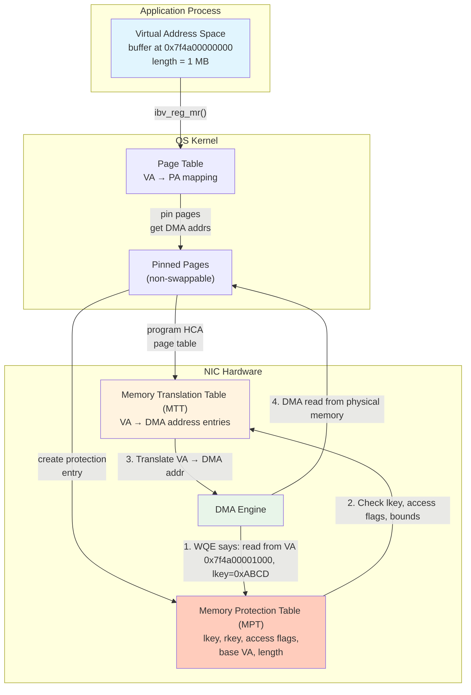

# 4.4 Memory Regions (MR)

Memory registration is the concept that most distinguishes RDMA programming from conventional networking. In socket-based programming, you hand the kernel a buffer and it copies the data. In RDMA, the NIC reads from and writes to your application's memory directly, without any CPU involvement. For this to work safely and correctly, the NIC must know the physical addresses of your buffers, and those addresses must remain stable. This is the purpose of a Memory Region: it tells the NIC which parts of application memory it is authorized to access, and provides the address translations necessary for DMA.

## Why Memory Registration Exists

To understand memory registration, consider what happens when the NIC needs to read data from a user-space buffer for transmission:

1. The application provides a **virtual address** and a length in the work request.
2. The NIC's DMA engine operates on **physical (bus) addresses** -- it does not understand virtual memory, page tables, or the MMU.
3. The operating system may swap pages to disk at any time, changing or invalidating the physical-to-virtual mapping.

Memory registration solves all three problems:

- **Address translation**: Registration creates a mapping from virtual addresses to physical (DMA) addresses inside the NIC, so the NIC can translate the virtual addresses in work requests to the physical addresses it needs for DMA.
- **Page pinning**: Registration pins the physical pages in memory (marks them as non-swappable), ensuring that the physical addresses remain valid for the lifetime of the registration.
- **Access authorization**: Registration produces keys (lkey and rkey) that must be presented in work requests.[^1] The NIC checks these keys before performing any DMA operation, preventing unauthorized memory access.



## The Registration API

The fundamental registration function is `ibv_reg_mr()`:

```c
#include <infiniband/verbs.h>

/* Allocate a buffer */
size_t size = 1024 * 1024;  /* 1 MB */
void *buffer = malloc(size);

/* Register it for RDMA access */
struct ibv_mr *mr = ibv_reg_mr(
    pd,                             /* Protection Domain */
    buffer,                         /* Start of virtual address range */
    size,                           /* Length in bytes */
    IBV_ACCESS_LOCAL_WRITE |        /* NIC can write to this memory (required for receives) */
    IBV_ACCESS_REMOTE_WRITE |       /* Remote NIC can RDMA Write to this memory */
    IBV_ACCESS_REMOTE_READ          /* Remote NIC can RDMA Read from this memory */
);

if (!mr) {
    perror("ibv_reg_mr");
    exit(1);
}

printf("MR registered: lkey=0x%x, rkey=0x%x\n", mr->lkey, mr->rkey);
```

The `ibv_mr` structure returned by registration contains:

```c
struct ibv_mr {
    struct ibv_context *context;    /* Device context */
    struct ibv_pd      *pd;        /* Protection Domain */
    void               *addr;      /* Start of registered region */
    size_t              length;     /* Length of registered region */
    uint32_t            handle;     /* Kernel handle */
    uint32_t            lkey;       /* Local key */
    uint32_t            rkey;       /* Remote key */
};
```

## Local Key (lkey) and Remote Key (rkey)

Memory registration produces two keys that serve fundamentally different purposes:

### L_Key (Local Key)

The lkey authorizes the **local** NIC to access the registered memory. It must be provided in every scatter-gather entry (`ibv_sge`) of every work request:

```c
struct ibv_sge sge = {
    .addr   = (uintptr_t)buffer + offset,
    .length = data_len,
    .lkey   = mr->lkey,        /* Local authorization */
};
```

Every time the NIC processes a WQE, it validates the lkey against its Memory Protection Table. If the lkey is invalid, the access is outside the registered region's bounds, or the access type is not permitted, the NIC generates a Local Protection Error (`IBV_WC_LOC_PROT_ERR`).

### R_Key (Remote Key)

The rkey authorizes a **remote** NIC to access the registered memory via RDMA Read or RDMA Write operations. The rkey, along with the virtual address and registered region bounds, must be communicated to the remote side out of band (typically during connection setup or via a Send message).

```c
/* On the passive side: communicate rkey and address to the active side */
struct rdma_info {
    uint64_t addr;
    uint32_t rkey;
    uint32_t size;
};
struct rdma_info info = {
    .addr = (uintptr_t)mr->addr,
    .rkey = mr->rkey,
    .size = mr->length,
};
/* Send 'info' to remote peer via Send/Recv or out-of-band channel */

/* On the active side: use the received rkey in RDMA operations */
struct ibv_send_wr wr = {
    .opcode = IBV_WR_RDMA_WRITE,
    .sg_list = &local_sge,
    .num_sge = 1,
    .wr.rdma = {
        .remote_addr = remote_info.addr,    /* Remote virtual address */
        .rkey        = remote_info.rkey,     /* Remote authorization */
    },
};
```

<div class="admonition warning">
<div class="admonition-title">Warning</div>
The rkey is a <strong>capability</strong> -- anyone who possesses it can read from or write to the registered memory region (subject to the access flags). Treat rkeys as sensitive information. Do not expose them to untrusted parties. If an rkey is leaked, an attacker with access to the RDMA fabric can read or corrupt arbitrary data in the registered region. We discuss RDMA security in depth in Chapter 16.
</div>

## Access Flags

The access flags specified during registration determine what operations are permitted on the memory region:

| Flag | Value | Meaning |
|------|-------|---------|
| `IBV_ACCESS_LOCAL_WRITE` | 0x01 | Local NIC can write to this memory. **Required** for any receive buffer and for RDMA Read local buffers. |
| `IBV_ACCESS_REMOTE_WRITE` | 0x02 | Remote NIC can RDMA Write to this memory. Implies `LOCAL_WRITE`. |
| `IBV_ACCESS_REMOTE_READ` | 0x04 | Remote NIC can RDMA Read from this memory. |
| `IBV_ACCESS_REMOTE_ATOMIC` | 0x08 | Remote NIC can perform atomic operations on this memory. Implies `LOCAL_WRITE`. |
| `IBV_ACCESS_MW_BIND` | 0x10 | Memory Windows can be bound to this MR. |
| `IBV_ACCESS_ZERO_BASED` | 0x20 | WQEs specify offsets from the MR start rather than absolute virtual addresses. |
| `IBV_ACCESS_ON_DEMAND` | 0x40 | On-Demand Paging: pages are pinned lazily on first access (see Chapter 6). |
| `IBV_ACCESS_HUGETLB` | 0x80 | Memory must be backed by huge pages. |
| `IBV_ACCESS_RELAXED_ORDERING` | 0x100000 | Allow NIC to reorder DMA operations for higher throughput. |

<div class="admonition note">
<div class="admonition-title">Note</div>
A common mistake is forgetting to set <code>IBV_ACCESS_LOCAL_WRITE</code> on receive buffers. When the NIC delivers incoming data, it <em>writes</em> to the receive buffer. Without this flag, the write is rejected and the operation fails with a protection error. Similarly, <code>REMOTE_WRITE</code> and <code>REMOTE_ATOMIC</code> implicitly require <code>LOCAL_WRITE</code> because the NIC must write to local memory to complete these operations.
</div>

## Inside the NIC: MTT and MPT

When you call `ibv_reg_mr()`, the kernel driver and NIC hardware cooperate to build two internal data structures:

### Memory Translation Table (MTT)

The MTT is the NIC's equivalent of a CPU page table. It maps virtual page addresses to physical (DMA-capable) addresses. For a 1 MB region with 4 KB pages, the MTT contains 256 entries, each mapping one virtual page to one physical page.

The MTT is stored in NIC-accessible memory (either on the NIC itself for older hardware, or in host memory for newer hardware that uses the "host memory MTT" feature). The NIC's DMA engine consults the MTT for every data-path operation to translate the virtual addresses in WQEs to the physical addresses needed for DMA.

### Memory Protection Table (MPT)

The MPT stores the metadata for each registered memory region: the lkey/rkey, base virtual address, length, access flags, and a pointer to the corresponding MTT entries. When the NIC receives a WQE with an lkey, it looks up the MPT entry, verifies that the access is within bounds and the access type is permitted, and then uses the MTT to perform address translation.

```
MPT Entry for MR (lkey=0xABCD):
+----------------------------------+
| lkey: 0xABCD                     |
| rkey: 0xABCE                     |
| base_va: 0x7f4a00000000          |
| length: 1048576 (1 MB)           |
| access: LOCAL_WRITE | REMOTE_READ|
| mtt_ptr: → MTT entries           |
| pd: 0x0003                       |
+----------------------------------+

MTT Entries:
+-------+-----------------------------+
| Index | Physical (DMA) Address      |
+-------+-----------------------------+
|   0   | 0x000000013A000000          |
|   1   | 0x000000013A001000          |
|   2   | 0x0000000187042000          |  ← Note: non-contiguous!
|   3   | 0x0000000187043000          |
| ...   | ...                         |
| 255   | 0x00000001C2FFF000          |
+-------+-----------------------------+
```

Note that the physical pages are not necessarily contiguous, even if the virtual addresses are. This is a fundamental aspect of virtual memory, and the MTT handles it transparently.

## Performance Impact of Registration

Memory registration is not free. It involves:

1. **System call overhead**: `ibv_reg_mr()` is a control-path operation that goes through the kernel.
2. **Page pinning**: The kernel must walk the process's page table, pin each page (increment its reference count and remove it from the swap candidate list), and compute the DMA address for each page.
3. **NIC programming**: The kernel driver must program the MTT and MPT in NIC-accessible memory.
4. **Memory lock limits**: Pinned pages count against the process's `RLIMIT_MEMLOCK` ulimit.[^2] The default is often 64 KB, which is far too low for RDMA applications.

The cost of registration scales roughly linearly with the number of pages, since the kernel must walk the page table, pin each page, and program the NIC's MTT. Approximate ranges on modern hardware (actual times vary with CPU speed, NUMA topology, and NIC generation):

| Region Size | Pages (4KB) | Approximate Registration Time |
|-------------|-------------|-------------------------------|
| 4 KB | 1 | ~5-10 us |
| 1 MB | 256 | ~20-50 us |
| 1 GB | 262,144 | ~5-50 ms |
| 16 GB | 4,194,304 | ~100-500 ms |

For large regions, registration can take hundreds of milliseconds -- an eternity in the RDMA world. This has significant implications for application design:

### Registration Caching

Many RDMA middleware libraries (including the MPI implementations and libfabric) implement **MR caching**:[^4] instead of registering and deregistering memory for every operation, they maintain a cache of previously registered regions and reuse them when possible. The cache is typically keyed by virtual address range and invalidated when memory is freed.

### Pre-registration

High-performance applications often pre-register all memory they will use during initialization, avoiding registration overhead on the data path. This works well when the memory footprint is known in advance (e.g., fixed-size buffer pools).

### Huge Pages

Using huge pages (2 MB or 1 GB) reduces the number of page table entries and MTT entries by orders of magnitude, dramatically speeding up registration and reducing NIC page-table memory consumption:

```c
/* Allocate memory using huge pages */
size_t size = 1UL << 30;  /* 1 GB */
void *buffer = mmap(NULL, size,
                    PROT_READ | PROT_WRITE,
                    MAP_PRIVATE | MAP_ANONYMOUS | MAP_HUGETLB,
                    -1, 0);

/* Register with huge page hint */
struct ibv_mr *mr = ibv_reg_mr(pd, buffer, size,
                               IBV_ACCESS_LOCAL_WRITE | IBV_ACCESS_HUGETLB);
```

With 2 MB huge pages, a 1 GB region requires only 512 MTT entries instead of 262,144 -- a 512x reduction.

<div class="admonition tip">
<div class="admonition-title">Tip</div>
For production RDMA applications, always increase the <code>RLIMIT_MEMLOCK</code> (or <code>ulimit -l</code>) to a value large enough to cover all registered memory. A common approach is to set it to unlimited:
<pre>
# In /etc/security/limits.conf:
*  soft  memlock  unlimited
*  hard  memlock  unlimited
</pre>
Without this, <code>ibv_reg_mr()</code> will fail with <code>ENOMEM</code> for regions larger than the memlock limit.
</div>

## Deregistration

When a memory region is no longer needed, it must be deregistered:

```c
int ret = ibv_dereg_mr(mr);
if (ret) {
    fprintf(stderr, "ibv_dereg_mr failed: %s\n", strerror(ret));
}
```

Deregistration:

1. Invalidates the lkey and rkey -- any subsequent use will fail.
2. Removes the MTT and MPT entries from the NIC.
3. Unpins the physical pages, allowing the OS to swap them again.
4. Does **not** free the underlying memory -- that remains the application's responsibility.

<div class="admonition warning">
<div class="admonition-title">Warning</div>
You must ensure that no in-flight operations reference the MR before deregistering it. If a WQE referencing the MR's lkey is still outstanding (not yet completed), deregistering the MR results in undefined behavior -- the NIC may DMA to/from the wrong physical page if the OS reassigns the previously-pinned page. Always drain all completions before deregistration.
</div>

## Implicit vs. Explicit ODP

Modern NVIDIA ConnectX NICs support **On-Demand Paging (ODP)**,[^3] which fundamentally changes the registration model. With ODP, pages are not pinned at registration time. Instead:

1. Registration records the virtual address range but does not resolve or pin physical pages.
2. When the NIC first attempts to access a page, it generates a page fault.
3. The kernel handles the page fault, pins the page, and updates the NIC's page table.
4. The NIC retries the access.

ODP eliminates the upfront cost of registration and removes the need for `RLIMIT_MEMLOCK` (since pages are pinned lazily and can be unpinned under memory pressure). However, the first access to each page incurs a page-fault penalty of several microseconds.

There are two ODP modes:

- **Explicit ODP**: The application registers with `IBV_ACCESS_ON_DEMAND`. Each `ibv_reg_mr()` call still creates an MR, but pages are faulted on demand.
- **Implicit ODP**: A single registration covers the entire virtual address space. The application does not need to call `ibv_reg_mr()` for individual buffers at all.

```c
/* Explicit ODP */
struct ibv_mr *mr = ibv_reg_mr(pd, buffer, size,
                               IBV_ACCESS_LOCAL_WRITE | IBV_ACCESS_ON_DEMAND);

/* Implicit ODP: register entire address space */
struct ibv_mr *mr = ibv_reg_mr(pd, NULL, SIZE_MAX,
                               IBV_ACCESS_LOCAL_WRITE |
                               IBV_ACCESS_REMOTE_WRITE |
                               IBV_ACCESS_ON_DEMAND);
```

We cover ODP, Memory Windows, and Device Memory in detail in Chapter 6.

## The Registration Conundrum

Memory registration creates a fundamental tension in RDMA application design:

- **Registration is expensive** (milliseconds for large regions), so you want to register as few times as possible.
- **Registered memory is pinned** (non-swappable), so you want to register as little memory as possible.
- **The NIC can only access registered memory**, so you must register everything the NIC touches.

Different applications resolve this tension differently:

| Strategy | Pros | Cons |
|----------|------|------|
| Pre-register fixed pools | Predictable, fast data path | Inflexible, may waste memory |
| Register on demand | Flexible | High per-operation cost |
| MR caching | Balances flexibility and performance | Complex, cache invalidation is hard |
| ODP | No upfront cost, flexible | Page-fault latency, not all ops supported |
| Huge pages | Fast registration, smaller MTT | Requires system configuration |

The right choice depends on the application's memory access patterns, latency requirements, and deployment constraints. High-frequency trading systems typically pre-register everything with huge pages. Storage systems often use MR caching. Cloud RDMA services increasingly rely on ODP.

## Summary

Memory Regions are the bridge between the application's virtual address space and the NIC's DMA engine. Registration pins physical pages, builds address translation tables in the NIC, and produces keys that authorize access. The lkey authorizes local NIC access in every work request; the rkey authorizes remote RDMA operations and must be shared with peers. Registration is expensive and must be managed carefully -- through pre-registration, caching, huge pages, or On-Demand Paging -- to avoid becoming a performance bottleneck.

[^1]: Memory key semantics (L_Key and R_Key), access flags, and the protection model are defined in the InfiniBand Architecture Specification, Volume 1, Chapter 10.6 (Memory Management). The `ibv_reg_mr(3)` man page in rdma-core documents the Linux implementation. See [rdma-core man pages](https://github.com/linux-rdma/rdma-core/blob/master/libibverbs/man/ibv_reg_mr.3).

[^2]: The `RLIMIT_MEMLOCK` limit controls how much memory a process can pin (lock) using `mlock()`, `mlockall()`, or RDMA memory registration. See the `setrlimit(2)` man page. Since Linux 5.0, RDMA memory pinning uses the per-cgroup memory lock limit when running under cgroup v2, in addition to the per-process ulimit.

[^3]: On-Demand Paging for RDMA was first implemented in the mlx5 driver for ConnectX-4 and later, with kernel support added in Linux 4.5. The ODP infrastructure uses MMU notifiers (`mmu_notifier`) to track page table changes and invalidate NIC-side translations. For implicit ODP (whole-address-space registration), see A. Margaritov et al., "Understanding and Improving the Cost of RDMA Memory Registration," *ACM SIGMETRICS*, 2019.

[^4]: MR caching in MPI implementations is described in S. Sur, M. J. Koop, and D. K. Panda, "High-performance and scalable MPI over InfiniBand with reduced memory usage: an in-depth performance analysis," *ACM/IEEE Supercomputing Conference (SC)*, 2006. Modern implementations (Open MPI, MVAPICH2, libfabric) intercept `munmap()` and `free()` via `LD_PRELOAD` to invalidate cached registrations when the underlying memory is freed.
