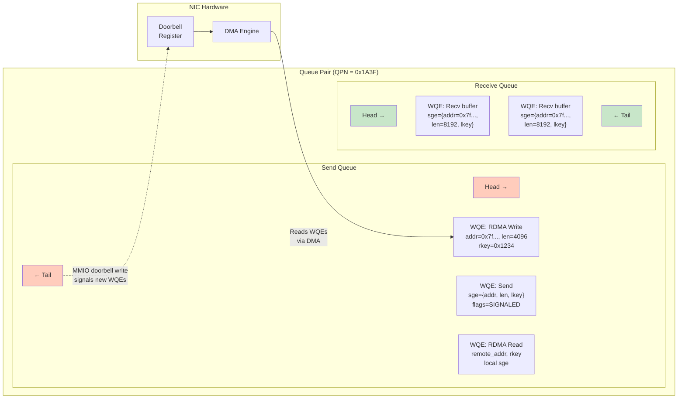

# 4.2 Queue Pairs (QP)

The Queue Pair is the fundamental unit of RDMA communication. Every RDMA data transfer -- whether a simple send/receive, a one-sided RDMA read, or an atomic compare-and-swap -- is initiated through a Queue Pair. Understanding QPs deeply is essential to writing correct and performant RDMA applications.

## Anatomy of a Queue Pair

A Queue Pair is, as its name implies, a pair of queues:

- **Send Queue (SQ)**: The application posts work requests here to initiate outbound operations -- sends, RDMA writes, RDMA reads, and atomic operations.
- **Receive Queue (RQ)**: The application posts receive buffers here, each describing a region of memory where incoming data can be placed.

Together, the SQ and RQ form a single QP, identified by a 24-bit **Queue Pair Number (QPN)**. The QPN is unique within a device and serves as the RDMA equivalent of a port number in TCP/UDP: it identifies a specific communication endpoint.



Both queues are implemented as **ring buffers** (circular queues) in memory that is shared between the application (via the user-space provider) and the NIC hardware. The application writes new Work Queue Elements at the tail of the ring; the NIC hardware processes them from the head. This producer-consumer pattern allows zero-copy, lock-free operation between software and hardware.

## Queue Pair Types

Not all communication patterns require the same guarantees. RDMA defines several QP types, each offering a different trade-off between reliability, connection overhead, and supported operations:

### RC -- Reliable Connected

RC is the most commonly used QP type. It provides:

- **Reliable delivery**: Hardware retransmission, duplicate detection, and in-order delivery. If a packet is lost, the NIC retransmits it automatically -- no software involvement required.
- **Connection-oriented**: Each RC QP is connected to exactly one remote RC QP. This is a one-to-one relationship, analogous to a TCP connection.
- **Full operation support**: Send/Recv, RDMA Write, RDMA Write with Immediate, RDMA Read, Atomic Compare-and-Swap, Atomic Fetch-and-Add.
- **Message segmentation**: Large messages are automatically segmented into MTU-sized packets and reassembled at the receiver.

RC is the right choice for most applications. The connection overhead (one QP per peer) becomes a concern only at very large scale (thousands of peers).

### UC -- Unreliable Connected

UC provides:

- **Connected**: Like RC, each UC QP connects to exactly one remote UC QP.
- **Unreliable**: No acknowledgments, no retransmission. Lost packets result in silently dropped messages.
- **Supported operations**: Send/Recv, RDMA Write, RDMA Write with Immediate. RDMA Read and atomics are *not* supported (they require acknowledgments to return data).
- **Segmentation**: Large messages are segmented, but if any segment is lost, the entire message is silently discarded.

UC is rarely used in practice. Its main advantage over RC is slightly lower latency (no ACK processing) and reduced NIC resource consumption (no retransmission state). It can be useful for streaming workloads where occasional loss is acceptable.

### UD -- Unreliable Datagram

UD provides:

- **Connectionless**: A single UD QP can communicate with any number of remote UD QPs. Destination information is specified per work request via an Address Handle.
- **Unreliable**: No acknowledgments or retransmission.
- **Supported operations**: Send/Recv only. RDMA operations are *not* supported.
- **No segmentation**: Messages must fit in a single packet (limited to the path MTU minus headers, typically ~4KB for a 4096-byte MTU).
- **40-byte GRH header**: Received UD messages include a 40-byte Global Route Header (GRH) prepended to the data.

UD is essential for RDMA infrastructure -- the Subnet Management Protocol, the Connection Manager, and address resolution all use UD QPs. It is also used by applications that need to communicate with many peers efficiently, since one UD QP replaces potentially thousands of RC QPs.

### XRC -- Extended Reliable Connected

XRC (introduced in the IBA specification and supported on Mellanox/NVIDIA hardware) addresses the scalability problem of RC:

- **Reliable**: Same reliability guarantees as RC.
- **Shared Receive Queue**: XRC allows multiple QPs on a node to share a single Receive Queue (via an SRQ). This means that for N processes on node A communicating with M processes on node B, you need N x M QPs but only M shared Receive Queues, rather than N x M separate Receive Queues.
- **Reduced memory footprint**: In large-scale MPI applications with thousands of ranks per node, XRC dramatically reduces the memory consumed by receive buffers.

### Raw Packet

Raw Packet QPs allow applications to send and receive raw Ethernet frames, bypassing the RDMA protocol entirely. This is used for custom protocols, packet capture, and network function virtualization. Not all hardware supports this QP type.

<div class="admonition note">
<div class="admonition-title">Note</div>
The choice of QP type is fundamental and cannot be changed after creation. Most applications should start with RC (Reliable Connected) and consider alternatives only when specific scalability, latency, or multicast requirements demand it.
</div>

## Queue Pair Numbers

Every QP is assigned a 24-bit QPN (Queue Pair Number) by the hardware, ranging from 0 to 2^24 - 1 (16,777,215). Two QPNs are reserved:

- **QP0**: The Subnet Management QP (SMA). Used exclusively for Subnet Management Packets (SMPs) -- the control protocol that configures InfiniBand switches and assigns LIDs. Only the Subnet Manager opens QP0.
- **QP1**: The General Service QP (GSI). Used for general management datagrams, including the Communication Manager (CM) protocol for RC/UC connection establishment, and other management services. Both QP0 and QP1 are UD-type QPs.

Application QPs are numbered starting from 2 and up. The QPN is part of the addressing information exchanged during connection setup: to connect an RC QP to a remote peer, you need to know the peer's QPN (along with its LID or GID and other routing information).

## Work Queue Elements (WQE)

A Work Queue Element (WQE, pronounced "wookie" by some practitioners) is the descriptor that tells the NIC what to do. When you call `ibv_post_send()` or `ibv_post_recv()`, the provider library translates your work request into one or more WQEs written directly into the QP's ring buffer.

The WQE format is hardware-specific -- each provider defines its own binary layout optimized for its NIC's DMA engine. However, the application-facing work request structure is standardized:

```c
struct ibv_send_wr {
    uint64_t                wr_id;      /* User-defined ID, returned in CQE */
    struct ibv_send_wr     *next;       /* Linked list for batch posting */
    struct ibv_sge         *sg_list;    /* Scatter-gather list */
    int                     num_sge;    /* Number of SGE entries */
    enum ibv_wr_opcode      opcode;     /* SEND, RDMA_WRITE, RDMA_READ, etc. */
    unsigned int            send_flags; /* IBV_SEND_SIGNALED, IBV_SEND_INLINE, etc. */

    union {
        struct {
            uint64_t        remote_addr;  /* For RDMA ops: remote virtual address */
            uint32_t        rkey;         /* For RDMA ops: remote memory key */
        } rdma;
        struct {
            uint64_t        remote_addr;
            uint64_t        compare_add;  /* For atomics */
            uint64_t        swap;
            uint32_t        rkey;
        } atomic;
        struct {
            struct ibv_ah  *ah;           /* For UD: address handle */
            uint32_t        remote_qpn;
            uint32_t        remote_qkey;
        } ud;
    } wr;

    /* ... additional fields for immediate data, etc. */
};

struct ibv_sge {
    uint64_t addr;    /* Virtual address of the data buffer */
    uint32_t length;  /* Length of the data buffer in bytes */
    uint32_t lkey;    /* Local key from memory registration */
};
```

Each WQE contains:

- **wr_id**: A 64-bit value set by the application and returned verbatim in the corresponding Completion Queue Entry. Typically used as a pointer to application state or an index into a tracking array.
- **opcode**: The operation to perform (Send, RDMA Write, RDMA Read, Atomic CAS, Atomic Fetch-and-Add, etc.).
- **Scatter-Gather List (SGL)**: An array of `ibv_sge` entries, each pointing to a registered memory buffer. For send operations, the SGEs describe the data to transmit (gathered from multiple buffers). For receive operations, the SGEs describe where to place incoming data (scattered into multiple buffers).
- **Send flags**: Bit flags that modify the operation's behavior.

### Send Flags

The send flags control important aspects of WQE processing:

| Flag | Meaning |
|------|---------|
| `IBV_SEND_SIGNALED` | Generate a CQE when this WQE completes. If not set, the WQE completes "silently" (no CQE). Only applicable if the QP was created with `sq_sig_all = 0`. |
| `IBV_SEND_SOLICITED` | Set the solicited bit in the packet. The receiver can request notification only for solicited completions, reducing interrupt overhead. |
| `IBV_SEND_INLINE` | Copy the data directly into the WQE instead of having the NIC DMA it from the SGE buffers. Reduces latency for small messages by avoiding an extra DMA read, but limited by `max_inline_data`. |
| `IBV_SEND_FENCE` | Ensure all previous RDMA Read operations on this QP have completed before processing this WQE. Essential for read-after-read ordering correctness. |

<div class="admonition warning">
<div class="admonition-title">Warning</div>
If <code>sq_sig_all = 0</code> and you never set <code>IBV_SEND_SIGNALED</code>, the Send Queue will eventually fill up because the application has no way to know when WQEs have been consumed. A common pattern is to signal every Nth WQE, providing a balance between completion overhead and queue management.
</div>

## The Doorbell Mechanism

After the provider library writes WQEs into the Send Queue's ring buffer, it must notify the NIC that new work is available. This is done via the **doorbell mechanism**: a single write to a memory-mapped I/O (MMIO) register on the NIC.

The doorbell write typically contains:

- The QPN identifying which QP has new work.
- The new tail index of the Send Queue, telling the NIC how many new WQEs are available.

On modern NVIDIA ConnectX hardware, the doorbell mechanism has been optimized in several ways:

1. **Doorbell record (DBR)**: A 64-bit value in DMA-accessible memory that the provider updates. The NIC reads it via DMA rather than relying solely on MMIO.
2. **BlueFlame (BF)**: An optimization where small WQEs are written directly into a special MMIO region (the BlueFlame register) rather than into main memory. This combines the WQE write and doorbell into a single operation, reducing latency by avoiding the round-trip through main memory.
3. **Doorbell batching**: Multiple WQEs can be written to the ring buffer before a single doorbell is rung, amortizing the doorbell cost across multiple operations.

```c
/* Posting multiple work requests with a single doorbell */
struct ibv_send_wr wr[3], *bad_wr;

/* Chain the work requests into a linked list */
wr[0].next = &wr[1];
wr[1].next = &wr[2];
wr[2].next = NULL;

/* Single call posts all three and rings doorbell once */
int ret = ibv_post_send(qp, &wr[0], &bad_wr);
if (ret) {
    fprintf(stderr, "ibv_post_send failed: %s\n", strerror(ret));
    /* bad_wr points to the first WR that failed */
}
```

## QP Capacity and Creation

When creating a Queue Pair, the application specifies capacity parameters that determine the sizes of the Send and Receive Queues:

```c
struct ibv_qp_init_attr qp_init_attr = {
    .send_cq = send_cq,              /* CQ for send completions */
    .recv_cq = recv_cq,              /* CQ for receive completions */
    .cap = {
        .max_send_wr  = 256,         /* Max outstanding send WQEs */
        .max_recv_wr  = 256,         /* Max outstanding receive WQEs */
        .max_send_sge = 4,           /* Max scatter-gather entries per send WQE */
        .max_recv_sge = 4,           /* Max scatter-gather entries per recv WQE */
        .max_inline_data = 128,      /* Max bytes for inline sends */
    },
    .qp_type = IBV_QPT_RC,           /* Reliable Connected */
    .sq_sig_all = 0,                  /* Only signal when IBV_SEND_SIGNALED is set */
};

struct ibv_qp *qp = ibv_create_qp(pd, &qp_init_attr);
if (!qp) {
    perror("ibv_create_qp");
    exit(1);
}

/* IMPORTANT: After creation, check what the hardware actually allocated.
   The NIC may round up capacities to hardware-aligned values. */
printf("Actual send WR capacity: %d\n", qp_init_attr.cap.max_send_wr);
printf("Actual recv WR capacity: %d\n", qp_init_attr.cap.max_recv_wr);
printf("QPN: 0x%x\n", qp->qp_num);
```

<div class="admonition tip">
<div class="admonition-title">Tip</div>
The hardware may grant more capacity than you requested -- queue sizes are typically rounded up to the next power of two. Always read the capacity fields back after <code>ibv_create_qp()</code> returns to know the actual allocated sizes. This is essential for correctly sizing your Completion Queue.
</div>

The capacity parameters have important implications:

- **max_send_wr / max_recv_wr**: Determine the ring buffer sizes. Larger values consume more device memory (on the NIC itself) and host memory (for the doorbell records and shared buffers). Oversizing wastes resources; undersizing leads to posting failures when the queue is full.
- **max_send_sge / max_recv_sge**: Each additional SGE increases the WQE size, which reduces the effective queue depth for a given amount of memory. Use the minimum you need.
- **max_inline_data**: Inline data is stored within the WQE itself. A higher inline limit makes each WQE larger. A common value is 64-256 bytes.

## QP State Machine

A newly created Queue Pair cannot immediately send or receive data. QPs have a well-defined state machine that must be traversed before communication is possible:

```
  RESET → INIT → RTR (Ready to Receive) → RTS (Ready to Send)
```

The transitions are performed via `ibv_modify_qp()`, and each transition requires different attributes. For an RC QP:

- **RESET → INIT**: Specify the port number, access flags, and partition key index.
- **INIT → RTR**: Specify the remote QPN, remote LID/GID, path MTU, and various path parameters. At this point the QP can receive data.
- **RTR → RTS**: Specify timeout, retry count, and RNR retry count. At this point the QP can send data.

We cover the QP state machine in detail in Chapter 7 (Connection Management), including the various connection establishment protocols.

## Shared Receive Queues (SRQ)

For applications that manage many QPs, dedicating a separate Receive Queue to each QP is wasteful -- each RQ must be pre-posted with receive buffers, and the total memory consumption grows linearly with the number of QPs. A **Shared Receive Queue (SRQ)** allows multiple QPs to share a single pool of receive buffers.

```c
struct ibv_srq_init_attr srq_attr = {
    .attr = {
        .max_wr  = 1024,   /* Total receive buffers shared among all QPs */
        .max_sge = 1,       /* SGEs per receive WQE */
    },
};

struct ibv_srq *srq = ibv_create_srq(pd, &srq_attr);

/* When creating QPs, attach them to the SRQ */
struct ibv_qp_init_attr qp_init_attr = {
    .send_cq = cq,
    .recv_cq = cq,
    .srq = srq,           /* Use shared receive queue */
    .cap = { .max_send_wr = 128, .max_send_sge = 1 },
    .qp_type = IBV_QPT_RC,
};
struct ibv_qp *qp = ibv_create_qp(pd, &qp_init_attr);
```

When a QP is associated with an SRQ, its individual Receive Queue is not used -- all incoming messages are matched against receive buffers from the SRQ. The application posts receive WQEs to the SRQ using `ibv_post_srq_recv()`, and those buffers are consumed in arrival order across all associated QPs.

<div class="admonition note">
<div class="admonition-title">Note</div>
SRQ provides a watermark mechanism: you can configure the SRQ to generate an asynchronous event when the number of available receive WQEs drops below a specified <code>srq_limit</code>. This allows the application to refill the SRQ before it runs empty, preventing Receiver-Not-Ready (RNR) NAKs.
</div>

## Resource Consumption and Limits

Queue Pairs consume resources on both the host and the NIC:

- **Host memory**: The ring buffer memory for SQ and RQ, doorbell records, and provider-internal tracking structures.
- **NIC memory**: QP context (current state, sequence numbers, retry state for RC), and on some NICs, WQE cache.

Device limits can be queried via `ibv_query_device()`:

```c
struct ibv_device_attr attr;
ibv_query_device(ctx, &attr);
printf("Max QPs: %d\n", attr.max_qp);           /* Typical: 128K-1M */
printf("Max QP WRs: %d\n", attr.max_qp_wr);     /* Typical: 32K */
printf("Max SGE per WR: %d\n", attr.max_sge);    /* Typical: 30 */
printf("Max SRQs: %d\n", attr.max_srq);
```

At large scale -- tens of thousands of QPs -- memory consumption becomes a real concern. This is one of the motivations for connection-management strategies like SRQ, XRC, and the DC (Dynamically Connected) transport that we cover in later chapters.

## Summary

The Queue Pair is where RDMA communication begins. Its dual-queue structure, hardware-backed ring buffers, and zero-copy doorbell mechanism provide the foundation for microsecond-latency networking. Choosing the right QP type (RC for reliability, UD for scalability, XRC for memory efficiency) and sizing the queues appropriately are the first critical decisions in any RDMA application design.
