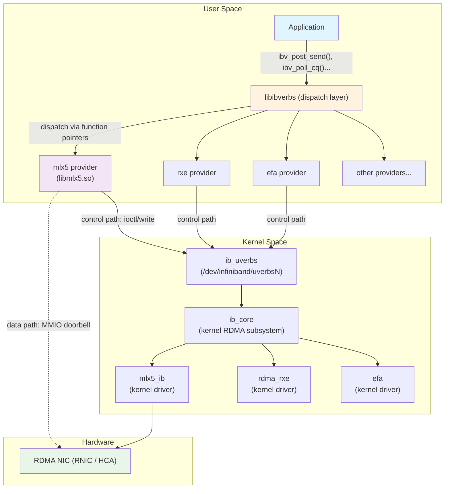

# 4.1 The Verbs Abstraction Layer

## Origins: From Specification to Software

The term "verbs" has a specific historical origin. The InfiniBand Architecture (IBA) Specification, first released on October 24, 2000, by the InfiniBand Trade Association (IBTA),[^2] defined the programming interface to InfiniBand hardware not as a concrete API with fixed function signatures, but as a set of abstract operations called **verbs**. The specification was deliberately abstract: it described *what* operations an implementation must support (e.g., "Create Queue Pair," "Post Send Request," "Poll for Completion") without dictating the exact function prototypes, data structures, or calling conventions. This was a design decision -- it allowed different operating systems, programming languages, and hardware vendors to implement the same semantics in platform-appropriate ways.

The verb definitions in the IBA specification fall into two broad categories:

- **Privileged verbs** (also called management verbs): operations that modify shared fabric state, such as configuring ports, managing partition keys, or programming forwarding tables in switches. These require elevated privilege.
- **User verbs**: operations available to unprivileged applications, such as creating Queue Pairs, registering memory, posting work requests, and polling for completions.

In practice, on Linux, the abstract verbs became a concrete C API through the **libibverbs** library, originally developed by Roland Dreier as part of the OpenFabrics Alliance (OFA) software stack,[^3] and now maintained as part of the **rdma-core** repository on GitHub ([linux-rdma/rdma-core](https://github.com/linux-rdma/rdma-core)). This library is the single most important piece of software in the RDMA ecosystem. Every RDMA application on Linux -- whether it uses InfiniBand, RoCE, or iWARP -- links against libibverbs.

## The Provider Model

libibverbs does not directly communicate with hardware. Instead, it serves as a **dispatch layer** that routes API calls to hardware-specific **provider libraries**. Each provider is a shared library that implements the verbs interface for a particular hardware family. The most important providers include:

| Provider | Hardware | Notes |
|----------|----------|-------|
| `mlx4` | Mellanox ConnectX-2/3 | Legacy, ConnectX-3 Pro and earlier |
| `mlx5` | Mellanox/NVIDIA ConnectX-4 through ConnectX-7, BlueField | Most widely deployed high-performance provider |
| `rxe` | Software (Soft-RoCE) | Kernel-based RoCE emulation over any Ethernet NIC |
| `siw` | Software (Soft-iWARP) | Kernel-based iWARP emulation |
| `efa` | AWS Elastic Fabric Adapter | Cloud-native RDMA in AWS |
| `hfi1` | Intel Omni-Path (OPA) | Intel's HPC fabric |
| `hns` | HiSilicon Hip08/09 | Huawei's RoCE implementation |
| `erdma` | Alibaba Elastic RDMA | Cloud RDMA in Alibaba Cloud |



This architecture is the key to RDMA's portability: applications code against libibverbs, and the provider model ensures that the same source code can run on Mellanox InfiniBand hardware, AWS EFA, or a software-emulated RoCE NIC, without modification. The dispatch is efficient -- function pointers are resolved at device-open time, so there is no dynamic lookup on the data path.

## Control Path vs. Data Path

The most important architectural principle in the verbs layer is the **split between control path and data path**.

**Control path** operations are infrequent, heavyweight, and go through the kernel:

- Opening a device (`ibv_open_device()`)
- Allocating a Protection Domain (`ibv_alloc_pd()`)
- Creating a Queue Pair (`ibv_create_qp()`)
- Registering memory (`ibv_reg_mr()`)
- Creating a Completion Queue (`ibv_create_cq()`)
- Modifying QP state (`ibv_modify_qp()`)

These operations involve system calls (via `ioctl()` or `write()` to the uverbs device file), kernel memory allocation, DMA mapping, and hardware configuration. They are expected to take microseconds to milliseconds. Applications perform them during initialization, not in the hot loop.

**Data path** operations are frequent, lightweight, and bypass the kernel entirely:

- Posting send requests (`ibv_post_send()`)
- Posting receive requests (`ibv_post_recv()`)
- Polling for completions (`ibv_poll_cq()`)

These operations execute entirely in user space. The provider library writes Work Queue Elements directly into memory-mapped NIC buffers, rings a doorbell via MMIO, and reads completion entries from a shared memory region. No system call is involved. This is the foundation of RDMA's latency advantage -- the data path touches no kernel code, performs no context switches, and requires no interrupts.

```c
/* Control path: goes through kernel -- called once during setup */
struct ibv_pd *pd = ibv_alloc_pd(context);
struct ibv_cq *cq = ibv_create_cq(context, cq_depth, NULL, NULL, 0);
struct ibv_qp *qp = ibv_create_qp(pd, &qp_init_attr);
struct ibv_mr *mr = ibv_reg_mr(pd, buffer, size, access_flags);

/* Data path: user-space only -- called millions of times per second */
ibv_post_send(qp, &send_wr, &bad_wr);  /* no syscall */
ibv_post_recv(qp, &recv_wr, &bad_wr);  /* no syscall */
ibv_poll_cq(cq, num_entries, wc_array); /* no syscall */
```

<div class="admonition note">
<div class="admonition-title">Note</div>
The control/data path split has a subtle but important consequence: once a QP is created and transitioned to the Ready-to-Send state, the kernel driver is no longer involved in sending or receiving data. This means that even if the kernel is heavily loaded -- handling disk I/O, running other processes, or servicing interrupts -- the RDMA data path remains unaffected. This property is sometimes called <strong>OS-bypass</strong> or <strong>kernel-bypass</strong>.
</div>

## The Device Handle: ibv_context

Every RDMA application begins by opening a device and obtaining an `ibv_context` -- the opaque handle that represents an open connection to a specific RDMA device. This is the root object from which all other RDMA resources are created.

```c
#include <infiniband/verbs.h>

/* Step 1: Get the list of available RDMA devices */
struct ibv_device **dev_list = ibv_get_device_list(NULL);
if (!dev_list) {
    perror("ibv_get_device_list");
    exit(1);
}

/* Step 2: Open the first device (or search by name) */
struct ibv_context *ctx = ibv_open_device(dev_list[0]);
if (!ctx) {
    perror("ibv_open_device");
    exit(1);
}

/* Step 3: Query device capabilities */
struct ibv_device_attr dev_attr;
ibv_query_device(ctx, &dev_attr);
printf("Max QP: %d, Max CQ: %d, Max MR: %d\n",
       dev_attr.max_qp, dev_attr.max_cq, dev_attr.max_mr);

/* ... use the device ... */

/* Cleanup */
ibv_close_device(ctx);
ibv_free_device_list(dev_list);
```

Under the hood, `ibv_open_device()` performs the following:

1. Opens the character device file `/dev/infiniband/uverbsN` corresponding to the requested device.
2. Issues an `ioctl()` to the kernel's `ib_uverbs` module to establish the user-kernel connection.
3. Memory-maps regions of the device for data-path access (doorbell pages, completion queue memory, etc.).
4. Loads the appropriate provider library and populates a function-pointer table for all verbs operations.
5. Returns an `ibv_context` structure with the provider-specific `ops` table installed.

After this point, every call to `ibv_post_send()`, `ibv_poll_cq()`, etc., on objects created from this context will dispatch directly to the provider's implementation via the function-pointer table.

## The uverbs Kernel Interface

The kernel side of the verbs interface is implemented by the `ib_uverbs` module. This module creates character device files at `/dev/infiniband/uverbs0`, `/dev/infiniband/uverbs1`, etc. -- one per RDMA device. When a user-space application calls `ibv_open_device()`, libibverbs opens the corresponding character device.

The uverbs interface supports two mechanisms for user-kernel communication:

1. **ioctl-based interface** (modern): The kernel-side infrastructure was first merged in Linux 4.14 (by Matan Barak at Mellanox), and rdma-core adopted it as the default path for all commands by late 2018.[^1] It uses `ioctl()` commands on the uverbs file descriptor, supports extensible command structures, and is the preferred path in current rdma-core.
2. **write-based interface** (legacy): The original interface used `write()` to send command structures and `read()` to receive responses. Still supported for backward compatibility.

The kernel's `ib_core` module provides the RDMA subsystem framework. It defines the `ib_device` abstraction that kernel-level providers (e.g., `mlx5_ib`, `rdma_rxe`) register against. The `ib_uverbs` module bridges between user-space verbs calls and the kernel providers.

## Provider Loading and Discovery

In modern rdma-core, providers are compiled directly into `libibverbs.so` as built-in modules rather than separate shared objects. Older installations placed providers in a well-known directory (e.g., `/usr/lib/x86_64-linux-gnu/libibverbs/`) as individual `.so` files, but this layout is now legacy. Either way, each provider registers itself with libibverbs during initialization.

The provider discovery process works as follows:

1. When the application calls `ibv_get_device_list()`, libibverbs enumerates RDMA devices via the sysfs filesystem (`/sys/class/infiniband/`).
2. For each device, libibverbs reads the device's `modalias` or driver name to determine which provider library is needed.
3. The provider library is loaded via `dlopen()`.
4. The provider's initialization function registers a set of function pointers -- one for each verb operation.
5. When the application calls `ibv_open_device()`, the provider's device-open function is invoked, which establishes the memory-mapped data-path structures.

<div class="admonition tip">
<div class="admonition-title">Tip</div>
You can inspect which providers are available on a system by listing the provider directory and by running <code>ibv_devinfo</code>, which queries all available devices and their capabilities. The environment variable <code>IBV_PROVIDERS_PATH</code> can override the default provider search path.
</div>

## Kernel Drivers and User-Space Providers: The Dual Nature

A critical point that often confuses newcomers: each RDMA device requires **both** a kernel driver and a user-space provider library, and these are tightly coupled.

The **kernel driver** (e.g., `mlx5_ib`) is responsible for:

- Device initialization and firmware communication
- Creating the uverbs character device
- Handling control-path operations (creating QPs, registering MRs, etc.)
- Setting up DMA mappings and memory-mapped I/O regions
- Managing device interrupts (for completion events, async events)
- Enforcing security and resource limits

The **user-space provider** (e.g., `libmlx5`) is responsible for:

- Implementing data-path operations (posting WQEs, polling CQs) by directly manipulating hardware data structures
- Constructing Work Queue Elements in the hardware's native format
- Writing doorbells to notify the NIC of new work
- Reading Completion Queue Entries from hardware-owned memory

The kernel driver and user-space provider must agree on the exact layout of shared data structures -- the format of WQEs, the doorbell mechanism, the CQE format, and the memory-mapped regions. This is why they are always released together as part of the same rdma-core and kernel version pair. Mixing versions can lead to subtle data corruption or crashes.

```
+-------------------------------------------------+
|              Application Code                   |
+-------------------------------------------------+
|     libibverbs (dispatch + common logic)        |
+-------------------------------------------------+
|  libmlx5 (user-space provider)                  |
|  - Formats WQEs in mlx5 hardware format         |
|  - Writes MMIO doorbells                        |
|  - Parses CQEs from hardware format             |
+-------------------------------------------------+
|  ~~~ user/kernel boundary (no crossing on       |
|      data path) ~~~                             |
+-------------------------------------------------+
|  mlx5_ib (kernel driver)                        |
|  - Control path: create/destroy/modify objects  |
|  - Sets up memory mappings for data path        |
|  - Manages interrupts and async events          |
+-------------------------------------------------+
|  mlx5_core (low-level kernel driver)            |
|  - Firmware commands, device init, PCI setup    |
+-------------------------------------------------+
|  ConnectX NIC Hardware                          |
+-------------------------------------------------+
```

## Extended Verbs and Device-Specific Extensions

The base libibverbs API covers the common denominator of RDMA functionality. However, modern NICs -- particularly NVIDIA's ConnectX series -- offer features that go beyond the standard verbs. These are exposed through two mechanisms:

1. **Extended verbs** (`_ex` suffix): Functions like `ibv_create_cq_ex()`, `ibv_create_qp_ex()`, and `ibv_query_device_ex()` accept extensible attribute structures that can carry additional parameters. This is the preferred approach for features that are broadly useful.

2. **Direct verbs** (provider-specific): For hardware-specific features, applications can access provider-specific interfaces via `ibv_get_device_name()` checks or the `mlx5dv_*` family of functions (for mlx5). These "direct verbs" bypass the abstraction layer and allow applications to use features like Multi-Packet RQ, hardware timestamps, or DevX commands directly.

```c
/* Standard verbs: portable across all providers */
struct ibv_cq *cq = ibv_create_cq(ctx, depth, NULL, NULL, 0);

/* Extended verbs: portable but with richer configuration */
struct ibv_cq_init_attr_ex cq_attr = {
    .cqe = depth,
    .wc_flags = IBV_WC_EX_WITH_COMPLETION_TIMESTAMP,
};
struct ibv_cq_ex *cq_ex = ibv_create_cq_ex(ctx, &cq_attr);

/* Direct verbs: mlx5-specific, not portable */
struct mlx5dv_cq_init_attr mlx5_cq_attr = {
    .comp_mask = MLX5DV_CQ_INIT_ATTR_MASK_CQE_SIZE,
    .cqe_size = 128,  /* 128-byte CQEs for extra data */
};
struct ibv_cq_ex *cq_dv = mlx5dv_create_cq(ctx, &cq_attr, &mlx5_cq_attr);
```

<div class="admonition warning">
<div class="admonition-title">Warning</div>
Using direct verbs (e.g., <code>mlx5dv_*</code>) ties your application to a specific hardware vendor. This is appropriate for performance-critical code that targets a known deployment environment, but it breaks portability. Always prefer standard or extended verbs unless you have a specific need for hardware-specific features.
</div>

## Summary

The Verbs abstraction layer is the foundation upon which all RDMA programming rests. Its key properties are:

- **Abstraction through dispatch**: libibverbs provides a uniform API, while hardware-specific providers implement the actual operations.
- **Control/data path split**: control operations go through the kernel; data operations execute entirely in user space.
- **Provider coupling**: kernel drivers and user-space providers are tightly coupled and must match in version.
- **Extensibility**: extended verbs and direct verbs allow access to advanced hardware features without breaking the core API.

With this architectural understanding in place, we can now examine the individual objects that populate the verbs model, starting with the most fundamental: the Queue Pair.

[^1]: The kernel-side ioctl infrastructure for uverbs was authored by Matan Barak (Mellanox) and first merged in Linux 4.14. See [KernelNewbies Linux 4.14 release notes](https://kernelnewbies.org/Linux_4.14) under "Infiniband: New ioctl API for the RDMA ABI." The rdma-core user-space library adopted the ioctl path as default for all commands in late 2018.

[^2]: InfiniBand Architecture Specification, Volume 1, Release 1.0, October 24, 2000. Published by the InfiniBand Trade Association. The current version (as of this writing) is Volume 1, Release 1.6. Available to IBTA members at [infinibandta.org](https://www.infinibandta.org/ibta-specification/).

[^3]: Roland Dreier's original libibverbs was hosted as part of the OpenFabrics (formerly OpenIB) software stack. It was later merged into the unified [rdma-core](https://github.com/linux-rdma/rdma-core) repository, which now contains libibverbs, librdmacm, and all upstream provider libraries.
