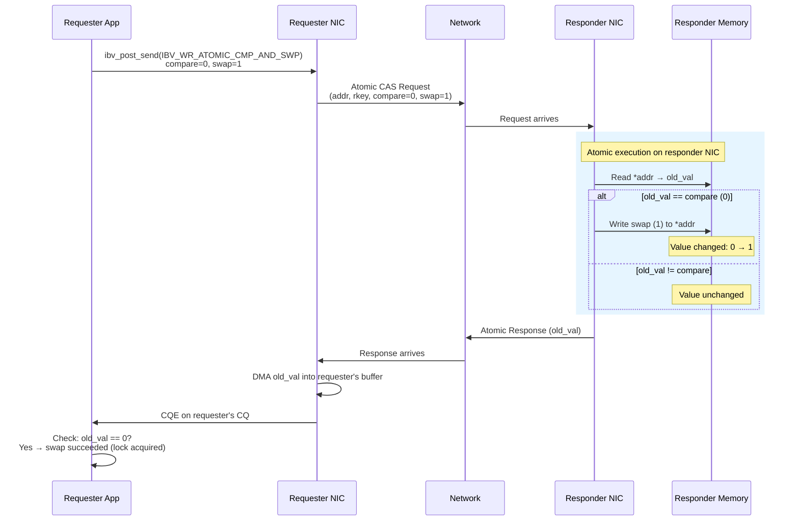

# 5.4 Atomic Operations

Atomic operations are the most specialized and arguably the most powerful tools in the RDMA operation set. They allow a requester to perform a **read-modify-write** on a remote memory location in a single, indivisible operation -- without any involvement from the remote CPU. The remote NIC reads a value from memory, performs a computation, writes the result back, and returns the original value to the requester, all as an atomic unit. No other operation -- local or remote -- can observe a partial update.

This capability is extraordinary. It means that distributed systems can implement locks, counters, sequence number generators, and consensus protocols directly in hardware, with the NIC serving as the atomic execution engine. No software on the remote node needs to run. No cache coherency protocol on the remote CPU needs to fire. The NIC itself guarantees atomicity.

RDMA defines two atomic operations: **Compare-and-Swap (CAS)** and **Fetch-and-Add (FAA)**. Both operate on 8-byte (64-bit) values, and both return the original value at the target address.

## Compare-and-Swap (CAS)

Compare-and-Swap is the fundamental building block of lock-free and wait-free data structures. The operation is:

```
atomically {
    old_value = *remote_addr;
    if (old_value == compare_value)
        *remote_addr = swap_value;
    return old_value;
}
```

The requester supplies three operands: the remote address, a **compare** value, and a **swap** value. The remote NIC reads the 8-byte value at the remote address, compares it to the compare value, and if they are equal, writes the swap value. Regardless of whether the swap occurred, the original value is returned to the requester.

The requester determines whether the swap succeeded by comparing the returned original value to its compare operand: if they match, the swap occurred.



## Fetch-and-Add (FAA)

Fetch-and-Add atomically adds a value to a remote 8-byte integer and returns the original value:

```
atomically {
    old_value = *remote_addr;
    *remote_addr = old_value + add_value;
    return old_value;
}
```

The add value is a signed 64-bit integer, so subtraction is supported by adding a negative number. FAA always succeeds -- there is no conditional check. This makes it ideal for counters and sequence number generators where contention should not cause retries.

## The Verbs API

Both atomic operations use `ibv_post_send()` with their respective opcodes. The key fields are in the `wr.atomic` union member:

```c
// Compare-and-Swap example: try to acquire a remote lock
struct ibv_sge sge = {
    .addr   = (uintptr_t)&result_buf,   // 8-byte buffer for returned value
    .length = 8,                          // Always 8 bytes
    .lkey   = local_mr->lkey
};

struct ibv_send_wr wr = {
    .wr_id      = my_wr_id,
    .sg_list    = &sge,
    .num_sge    = 1,
    .opcode     = IBV_WR_ATOMIC_CMP_AND_SWP,
    .send_flags = IBV_SEND_SIGNALED,
    .wr = {
        .atomic = {
            .remote_addr = lock_addr,       // Remote VA of lock word
            .rkey        = remote_rkey,      // Remote memory region key
            .compare_add = 0,               // Compare value (expect unlocked=0)
            .swap        = 1                // Swap value (locked=1)
        }
    }
};

struct ibv_send_wr *bad_wr;
ibv_post_send(qp, &wr, &bad_wr);
```

For Fetch-and-Add, the fields are slightly different:

```c
struct ibv_send_wr wr = {
    .wr_id      = my_wr_id,
    .sg_list    = &sge,        // 8-byte buffer for returned original value
    .num_sge    = 1,
    .opcode     = IBV_WR_ATOMIC_FETCH_AND_ADD,
    .send_flags = IBV_SEND_SIGNALED,
    .wr = {
        .atomic = {
            .remote_addr = counter_addr,   // Remote VA of counter
            .rkey        = remote_rkey,
            .compare_add = 1,              // Value to add (reuses compare_add field)
            .swap        = 0               // Unused for FAA
        }
    }
};
```

<div class="warning">

**Alignment Requirement.** The remote address for atomic operations **must** be 8-byte aligned. If the address is not aligned, the NIC will generate a completion with a Remote Access Error (`IBV_WC_REM_ACCESS_ERR`). This is a hardware requirement -- the NIC's atomic unit cannot operate on unaligned addresses. Always ensure your atomic variables are 8-byte aligned, using `__attribute__((aligned(8)))` or equivalent.

</div>

## The Local Buffer

Both CAS and FAA return the **original** value at the remote address before the operation. This value is deposited into the requester's local buffer via DMA. The local SGE must point to an 8-byte buffer in a registered memory region.

```c
uint64_t result_buf __attribute__((aligned(8)));

// After CQE indicates success:
uint64_t old_value = result_buf;

// For CAS: check if swap succeeded
if (old_value == expected_value) {
    // CAS succeeded - we swapped the value
} else {
    // CAS failed - someone else modified it first
    // old_value tells us the current value
}

// For FAA: old_value is the counter before our add
uint64_t my_sequence = old_value;  // Our allocated sequence number
```

## Atomicity Guarantees

The atomicity guarantee is absolute with respect to all RDMA operations targeting the same address on the same NIC. If two CAS operations from different QPs target the same remote address simultaneously, one will execute first and the other will see its result. There is no torn read, no partial update, no race condition at the RDMA level.

However, there is an important caveat regarding **CPU access**. The atomicity guarantee is between the **NIC** and other NIC operations. If the remote CPU is simultaneously reading or writing the same memory location using regular load/store instructions, atomicity with respect to those CPU operations is **not guaranteed** by the InfiniBand specification. In practice, the behavior depends on the platform's PCIe ordering and cache coherency model. On x86 systems with modern NICs, atomic operations are typically implemented using PCIe atomic operations, which do provide atomicity with respect to CPU accesses. But this is a platform property, not an RDMA specification guarantee.

<div class="warning">

**CPU-NIC Atomicity.** If your application requires atomicity between NIC atomic operations and CPU load/store operations on the same address, you must verify that your platform supports this. On x86 with Mellanox/NVIDIA ConnectX NICs, PCIe atomics are used and CPU-NIC atomicity is preserved. On other platforms, you may need to use RDMA operations exclusively (no CPU access to the contested address) to guarantee correctness.

</div>

## Performance Characteristics

Atomic operations have distinct performance properties compared to Read and Write:

- **Latency**: Similar to RDMA Read (request-response), plus the atomic execution time on the remote NIC. Expect 2-3 microseconds for small operations on modern hardware. This is higher than RDMA Write but comparable to RDMA Read.

- **Throughput**: Significantly lower than Read or Write when contended. Because atomic operations serialize at the remote NIC on a per-address basis, concurrent atomics to the same address from multiple QPs create contention and reduce aggregate throughput. Uncontended atomics (targeting different addresses) scale much better.

- **Contention effects**: This is the dominant performance concern. When N clients simultaneously attempt CAS on the same lock word, throughput degrades dramatically -- often to hundreds of thousands of operations per second, compared to millions for uncontended operations. The remote NIC's atomic processing unit becomes the bottleneck.

| Scenario | Typical Throughput (per NIC) |
|---|---|
| Uncontended FAA (different addresses) | 10-20 Mops |
| Contended FAA (same address, 4 clients) | 1-3 Mops |
| Contended CAS (same address, 4 clients) | 1-3 Mops |

These numbers are approximate and vary significantly by hardware generation and firmware version. The key insight is that contention, not network bandwidth, is the limiting factor for atomic operations.

## Distributed Lock with CAS

The most common use of CAS is implementing a distributed spinlock:

```c
// Lock acquisition (spinlock)
uint64_t old;
do {
    post_cas(qp, lock_addr, rkey,
             /* compare */ 0,     // Expect unlocked
             /* swap */    1,     // Set to locked
             &old);
    poll_cq(cq);
} while (old != 0);  // Retry until we see unlocked state

// Critical section...

// Lock release: write 0 to the lock word
post_rdma_write(qp, lock_addr, rkey, &zero_value, sizeof(uint64_t));
poll_cq(cq);
```

This is a correct but naive implementation. In practice, distributed locks need backoff strategies to avoid overwhelming the remote NIC with contended CAS operations. Exponential backoff or MCS-style queuing locks (adapted for RDMA) significantly improve performance under contention.

## Sequence Number Allocation with FAA

FAA is ideal for allocating unique sequence numbers from a shared counter:

```c
// Allocate a batch of sequence numbers
uint64_t batch_size = 100;
post_faa(qp, counter_addr, rkey, batch_size, &old_value);
poll_cq(cq);

// old_value is our starting sequence number
// We own the range [old_value, old_value + batch_size)
for (uint64_t seq = old_value; seq < old_value + batch_size; seq++) {
    assign_sequence(seq);
}
```

Because FAA always succeeds (no conditional failure), it provides guaranteed progress. Every caller gets a unique range, regardless of contention. The throughput may degrade under contention, but no caller will starve.

## Extended Atomics

The base InfiniBand specification defines only 8-byte CAS and FAA. Some vendors have extended this with additional atomic operations:

**Masked Compare-and-Swap**: Applies a mask to the compare and swap operations, allowing modification of specific bits within the 8-byte value. This enables packing multiple independent fields into a single atomic word.

**Masked Fetch-and-Add**: Applies a mask to the add operation, enabling addition to a sub-field of the 8-byte value.

These extended atomics are vendor-specific extensions and are accessed through the `ibv_exp_` (experimental) or vendor-specific API extensions. They are not available on all hardware:

```c
// Extended CAS (vendor-specific, Mellanox/NVIDIA example)
struct ibv_exp_send_wr wr = {
    .exp_opcode = IBV_EXP_WR_EXT_MASKED_ATOMIC_CMP_AND_SWP,
    .ext_op.masked_atomics = {
        .log_arg_sz  = 3,                 // log2(8) = 3 for 8-byte
        .remote_addr = remote_addr,
        .rkey        = remote_rkey,
        .wr_data = {
            .inline_data = {
                .op.cmp_swap = {
                    .compare_val    = compare,
                    .swap_val       = swap,
                    .compare_mask   = 0x00000000FFFFFFFF,  // Compare lower 32 bits
                    .swap_mask      = 0x00000000FFFFFFFF   // Swap lower 32 bits
                }
            }
        }
    }
};
```

## Ordering with Other Operations

Atomic operations share the same ordering considerations as RDMA Read:

- Atomics are ordered with respect to each other on the same QP.
- Atomics may be reordered with respect to prior RDMA Writes on the same QP (use `IBV_SEND_FENCE` to prevent this).
- Atomics count against the `max_rd_atomic` limit along with RDMA Reads.

A common pattern is to use RDMA Write to update a data structure and then CAS to update an associated pointer or version number. In this case, you must ensure the Write is complete before the CAS executes:

```c
// Write new data to remote buffer
struct ibv_send_wr write_wr = {
    .opcode = IBV_WR_RDMA_WRITE,
    // ... data, remote_addr, rkey
};

// Atomically update version/pointer (must see the write)
struct ibv_send_wr cas_wr = {
    .opcode     = IBV_WR_ATOMIC_CMP_AND_SWP,
    .send_flags = IBV_SEND_FENCE | IBV_SEND_SIGNALED,
    // ... lock_addr, rkey, compare, swap
};

write_wr.next = &cas_wr;
ibv_post_send(qp, &write_wr, &bad_wr);
```

## When to Use Atomics

Atomic operations are the right choice when you need distributed synchronization without involving the remote CPU:

- **Distributed locks**: CAS-based spinlocks, ticket locks, MCS locks.
- **Reference counting**: FAA to increment/decrement shared counters.
- **Sequence number generation**: FAA to allocate unique IDs from a shared counter.
- **Consensus protocols**: CAS for leader election, ballot acquisition.
- **Lock-free data structures**: CAS for pointer swings in concurrent queues, stacks, and lists.
- **Distributed barriers**: FAA to count participants, CAS to signal completion.

They are **not** the right choice for high-contention scenarios where throughput matters more than CPU avoidance. In those cases, a server-based approach (Send/Receive to a CPU that processes operations locally) often outperforms NIC-based atomics because CPUs can handle contention more efficiently than NICs. Systems like FaRM found that server-side processing outperforms RDMA atomics for lock-heavy workloads due to the NIC's serialization bottleneck.
