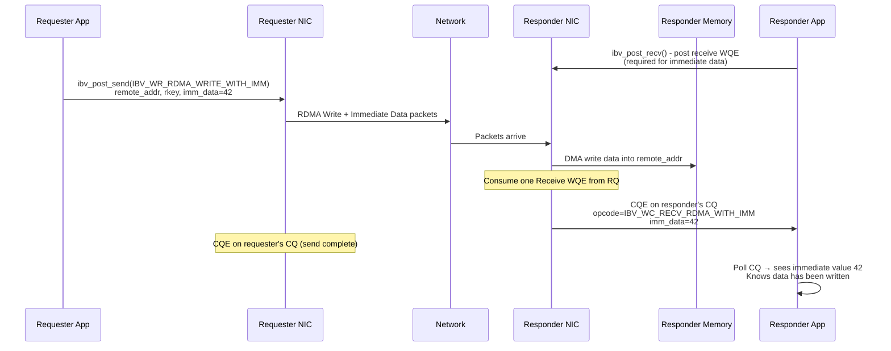

# 5.5 Immediate Data

The previous sections revealed a fundamental tension in RDMA's operation model. One-sided operations (RDMA Write and RDMA Read) are fast because they bypass the remote CPU entirely -- but they provide no mechanism to notify the remote CPU that something has happened. Two-sided operations (Send/Receive) do notify the remote CPU via completion queue entries -- but they require receive buffer management and impose overhead on both sides. What if you want the performance of one-sided data placement with the notification capability of two-sided messaging?

This is precisely the problem that **Immediate Data** solves. Immediate Data is a modifier that can be attached to a Send or an RDMA Write, piggy-backing a 32-bit value onto the operation. The critical property is this: when an operation carries Immediate Data, it generates a **Completion Queue Entry on the receiver side**, even if the base operation would not normally do so.

This makes "RDMA Write with Immediate Data" one of the most important hybrid operations in the RDMA toolkit. It combines the one-sided data placement of RDMA Write (data goes directly to a specified remote address without CPU involvement) with the notification semantics of Send/Receive (the remote CPU gets a CQE containing the 32-bit immediate value). This hybrid pattern is the foundation of many high-performance RDMA-based systems.

## The Two Immediate Data Opcodes

Immediate Data is available on two opcodes:

| Opcode | Base Operation | Receiver Notification |
|---|---|---|
| `IBV_WR_SEND_WITH_IMM` | Send (two-sided) | Yes (CQE with immediate value, consumes Receive WQE) |
| `IBV_WR_RDMA_WRITE_WITH_IMM` | RDMA Write (one-sided) | Yes (CQE with immediate value, **consumes Receive WQE**) |

The Send with Immediate variant is straightforward: it works just like a regular Send, except the CQE on the receiver side contains the 32-bit immediate value. This is useful for out-of-band metadata: the data payload goes into the receive buffer, and the immediate value carries a tag, type code, or sequence number.

The RDMA Write with Immediate variant is the more interesting and widely used one. It behaves like an RDMA Write (data is placed at the specified remote address using the remote key and virtual address), but additionally:

1. It **generates a CQE** on the receiver's completion queue.
2. It **consumes a Receive WQE** from the receiver's Receive Queue.
3. The CQE contains the 32-bit immediate value in network byte order.



## The Verbs API

### RDMA Write with Immediate Data

```c
struct ibv_sge sge = {
    .addr   = (uintptr_t)local_buf,
    .length = data_len,
    .lkey   = local_mr->lkey
};

struct ibv_send_wr wr = {
    .wr_id      = my_wr_id,
    .sg_list    = &sge,
    .num_sge    = 1,
    .opcode     = IBV_WR_RDMA_WRITE_WITH_IMM,
    .send_flags = IBV_SEND_SIGNALED,
    .imm_data   = htonl(42),     // 32-bit immediate value (network byte order!)
    .wr = {
        .rdma = {
            .remote_addr = remote_va,
            .rkey        = remote_rkey
        }
    }
};

struct ibv_send_wr *bad_wr;
ibv_post_send(qp, &wr, &bad_wr);
```

### Send with Immediate Data

```c
struct ibv_send_wr wr = {
    .wr_id      = my_wr_id,
    .sg_list    = &sge,
    .num_sge    = 1,
    .opcode     = IBV_WR_SEND_WITH_IMM,
    .send_flags = IBV_SEND_SIGNALED,
    .imm_data   = htonl(msg_type),    // Network byte order
};
```

<div class="warning">

**Network Byte Order.** The `imm_data` field is transmitted in network byte order (big-endian). You must use `htonl()` when setting the value and `ntohl()` when reading it from the completion entry. Forgetting this conversion is a common bug that manifests as mysteriously wrong values, especially on little-endian x86 systems.

</div>

## Processing Immediate Data on the Receiver

On the receiver side, the immediate value arrives in the completion entry:

```c
struct ibv_wc wc;
int n = ibv_poll_cq(cq, 1, &wc);
if (n > 0 && wc.status == IBV_WC_SUCCESS) {
    switch (wc.opcode) {
    case IBV_WC_RECV:
        // Normal Send completion
        printf("Received message, %u bytes\n", wc.byte_len);
        break;

    case IBV_WC_RECV_RDMA_WITH_IMM:
        // RDMA Write with Immediate Data
        uint32_t imm_val = ntohl(wc.imm_data);
        printf("RDMA Write completed with imm_data=%u\n", imm_val);
        // Data is already in the remote buffer (remote_addr)
        // wc.byte_len is 0 for RDMA Write with IMM (data went to RDMA addr)
        break;
    }
}
```

Note the distinction in opcodes: a regular Receive completion has `wc.opcode = IBV_WC_RECV`, while an RDMA Write with Immediate generates `wc.opcode = IBV_WC_RECV_RDMA_WITH_IMM`. Both consume a Receive WQE from the receiver's RQ.

An important detail for RDMA Write with Immediate: the `wc.byte_len` field in the receiver's CQE is **zero** (or may contain only GRH length for UD), because the data was placed at the RDMA target address, not into the receive buffer. The receive buffer from the consumed Receive WQE is essentially unused for data -- it exists only to satisfy the protocol requirement that a Receive WQE must be available. Some implementations allow posting zero-length receive buffers for this purpose.

## The Receive WQE Requirement

This is the most important operational constraint of Immediate Data: **the receiver must have a Receive WQE posted.** The immediate data mechanism works by consuming a Receive WQE to generate the CQE on the receiver side. If no Receive WQE is available when an RDMA Write with Immediate arrives, the behavior is the same as for a Send arriving without a posted receive:

- On RC: The NIC sends an RNR NAK. The sender retries. If retries are exhausted, both QPs go to Error state.
- On UC: The message is silently dropped.

This means that RDMA Write with Immediate requires receive buffer management on the remote side, just like Send/Receive. The key advantage over plain Send/Receive is that the **data payload** goes directly to the right address via RDMA -- only the notification mechanism uses the receive queue.

<div class="warning">

**Receive Buffer Pool Management.** When using RDMA Write with Immediate Data, you must maintain a pool of posted Receive WQEs, just as you would for Send/Receive. The receive buffers can be small (or even zero-length, on some implementations), since the actual data is placed via the RDMA Write portion. But they must be posted, and they will be consumed. Failure to maintain the pool will cause RNR errors and, eventually, QP failure.

</div>

## Comprehensive Completion Semantics Comparison

The following table summarizes which operations generate completions on each side and whether they consume receive queue resources:

| Operation | Requester Posts To | Requester Gets CQE | Responder Needs Recv WQE | Responder Gets CQE | CQE Contains |
|---|---|---|---|---|---|
| Send | SQ | Yes | Yes | Yes (`IBV_WC_RECV`) | byte_len |
| Send with IMM | SQ | Yes | Yes | Yes (`IBV_WC_RECV`) | byte_len + imm_data |
| RDMA Write | SQ | Yes | No | No | -- |
| RDMA Write with IMM | SQ | Yes | **Yes** | **Yes** (`IBV_WC_RECV_RDMA_WITH_IMM`) | imm_data |
| RDMA Read | SQ | Yes | No | No | -- |
| Atomic CAS | SQ | Yes | No | No | -- |
| Atomic FAA | SQ | Yes | No | No | -- |
| (Receive) | RQ | -- | -- | Yes (`IBV_WC_RECV`) | byte_len |

The critical row is RDMA Write with IMM: it is the **only** one-sided data operation that generates a completion on the responder side. This unique property makes it the bridge between one-sided efficiency and two-sided notification.

## The Hybrid Signaling Pattern

The most powerful use of Immediate Data is the **hybrid signaling pattern**, commonly used in high-performance RDMA systems:

1. **Bulk data transfer**: Use multiple plain RDMA Writes to transfer large amounts of data to known locations in remote memory. These are fast, generate no remote completions, and consume no remote receive resources.

2. **Completion notification**: After all data writes are complete, issue a single RDMA Write with Immediate Data. This carries a small notification payload (e.g., a buffer index, a byte count, or a transaction ID) and generates a CQE on the remote side.

3. **Receiver processing**: The remote CPU polls its CQ, sees the immediate data completion, and knows that all the data from step 1 has been placed and is ready to process.

```c
// Requester: transfer data in chunks, then notify
for (int i = 0; i < num_chunks; i++) {
    // Plain RDMA Write -- no remote notification
    post_rdma_write(qp, remote_addr + i * CHUNK_SIZE, rkey,
                    local_data + i * CHUNK_SIZE, CHUNK_SIZE,
                    0 /* unsignaled */);
}

// Final notification with total byte count as immediate data
post_rdma_write_imm(qp, remote_addr + num_chunks * CHUNK_SIZE, rkey,
                    final_chunk, final_len,
                    htonl(total_bytes),   // Immediate data
                    IBV_SEND_SIGNALED);   // Signal this one
```

This pattern achieves the best of both worlds: the bulk transfer has zero overhead on the remote CPU and zero receive queue consumption, while the final notification provides reliable delivery confirmation with metadata.

<div class="warning">

**Ordering Guarantee.** On an RC QP, the RDMA Write with Immediate is guaranteed to be processed after all preceding RDMA Writes on the same QP. This means that when the receiver sees the CQE from the Write with Immediate, all prior writes are guaranteed to be in remote memory. This ordering guarantee is what makes the hybrid pattern safe -- you do not need explicit fences between the data writes and the notification write.

</div>

## Use Cases

**RPC frameworks.** An RPC server writes the response payload directly into the client's pre-registered response buffer via RDMA Write, then sends the completion status and response length via Immediate Data. The client wakes up, reads the immediate value to learn the response length, and processes the response data that is already in its local buffer.

**Buffer index signaling.** In ring-buffer-based protocols, the writer writes data to the next slot in the ring buffer and uses the immediate value to communicate the slot index. The receiver uses this index to process the correct slot.

**Transaction commit notification.** In distributed databases, a node writes transaction log entries to replicas via RDMA Write, then signals commit with an RDMA Write with Immediate carrying the transaction ID. Replicas poll their CQ to learn which transactions have been committed.

**Zero-copy receive notification.** Unlike Send/Receive where the receiver must guess the right buffer size, RDMA Write with Immediate places data at a known address. The receiver knows exactly where the data is and how large it is (from the immediate value or a protocol convention). This eliminates the buffer-sizing guesswork.

## Performance Considerations

RDMA Write with Immediate Data has the same wire-level performance as a plain RDMA Write -- the 32-bit immediate value adds negligible overhead to the packet headers. The additional cost is entirely on the receiver side: consuming a Receive WQE and generating a CQE.

For high-message-rate workloads, the receiver's CQ processing can become a bottleneck. The hybrid pattern mitigates this by batching many plain RDMA Writes (no CQE) followed by a single Write with Immediate (one CQE). This reduces CQ pressure by a factor of the batch size.

One subtle performance consideration: RDMA Write with Immediate Data on RC transport requires the responder to send an ACK that also carries the immediate data notification. This means the ACK processing path on the responder NIC is slightly more complex than for a plain RDMA Write ACK. In practice, this difference is negligible on modern hardware.

## Send with Immediate vs. RDMA Write with Immediate

Both operations carry immediate data, but they serve different purposes:

| Aspect | Send with IMM | RDMA Write with IMM |
|---|---|---|
| Data placement | Into receiver's posted buffer | Into specified remote address (RDMA) |
| Data location known by receiver? | No (depends on which recv buffer was consumed) | Yes (sender specified the address) |
| Use case | Small messages with metadata tag | Bulk data placement with notification |
| Receiver buffer management | Must size buffers for data payload | Recv buffers can be minimal (data goes to RDMA addr) |

In general, RDMA Write with Immediate is preferred for data transfer scenarios because it gives the sender control over data placement, while Send with Immediate is useful for control messages where the immediate value serves as a message type discriminator.
