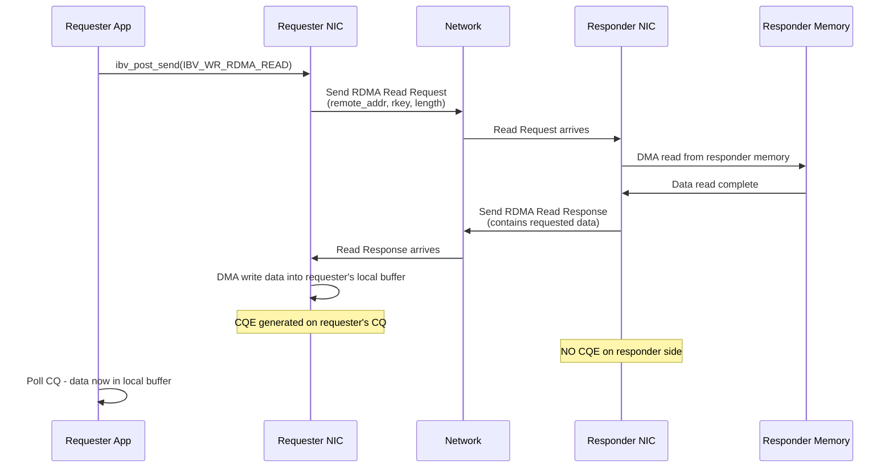

# 5.3 RDMA Read (One-Sided)

RDMA Read is the mirror image of RDMA Write: instead of pushing data into remote memory, the requester **pulls** data from a specified location in remote memory into its own local buffer. Like RDMA Write, it is a one-sided operation -- the remote CPU is not involved, no receive buffer is needed on the remote side, and no completion is generated there. But unlike RDMA Write, which completes with a single outbound data transfer, RDMA Read is a **request-response** operation at the wire protocol level: the requester sends a short read request, and the remote NIC responds with the requested data.

This request-response nature has important implications for latency, ordering, and performance. An RDMA Read inherently requires at least one full network round trip, making it roughly twice the latency of an RDMA Write of the same size. But it provides a capability that RDMA Write cannot: it lets the requester access remote data without the remote side doing anything at all -- no posting of work requests, no buffer management, no CPU cycles consumed.

## Wire-Level Mechanics

When the requester posts an RDMA Read, the following sequence occurs:

1. The requester's NIC constructs an RDMA Read Request packet containing the remote virtual address, remote key, and requested length.
2. This request packet is sent to the remote NIC.
3. The remote NIC validates the `rkey` and address range against its memory region tables.
4. The remote NIC DMAs the requested data from the remote host's memory.
5. The remote NIC sends the data back in one or more RDMA Read Response packets.
6. The requester's NIC receives the response packets and DMAs the data into the requester's local buffer.
7. A CQE is generated on the requester's completion queue.

At no point does the remote CPU participate. The entire operation is handled by the two NICs and the network.



## The Verbs API

RDMA Read uses `ibv_post_send()` with the `IBV_WR_RDMA_READ` opcode. Note that despite being a "read" from the remote side, it is posted to the **Send Queue** -- all initiator-side operations go through the SQ:

```c
// Local buffer where the read data will be deposited
struct ibv_sge sge = {
    .addr   = (uintptr_t)local_buf,    // Local destination buffer
    .length = read_len,                 // Number of bytes to read
    .lkey   = local_mr->lkey            // Local memory region key
};

struct ibv_send_wr wr = {
    .wr_id      = my_wr_id,
    .sg_list    = &sge,
    .num_sge    = 1,
    .opcode     = IBV_WR_RDMA_READ,
    .send_flags = IBV_SEND_SIGNALED,
    .wr = {
        .rdma = {
            .remote_addr = remote_va,   // Address in remote process space
            .rkey        = remote_rkey   // Remote memory region key
        }
    }
};

struct ibv_send_wr *bad_wr;
int ret = ibv_post_send(qp, &wr, &bad_wr);
```

The local SGE specifies the **destination** buffer -- where the remote data will be placed. The `wr.rdma` fields specify the **source** -- where in remote memory to read from. The remote memory region must have been registered with at least `IBV_ACCESS_REMOTE_READ` permission.

<div class="warning">

**Local Buffer Must Be Pre-Registered.** The local destination buffer must be part of a registered memory region with local write access. The requester's NIC will DMA the incoming data into this buffer, so it must be pinned and mapped in the NIC's page tables. Failing to register the local buffer will result in a local access error (`IBV_WC_LOC_ACCESS_ERR`).

</div>

## Completion Semantics

RDMA Read generates a CQE only on the **requester** side. The completion indicates that the data has been successfully read from remote memory and placed into the local buffer. After polling a successful CQE, the requester can immediately access the data in `local_buf`.

On the responder side, nothing happens -- no CQE, no notification, no resource consumption. The remote NIC handles the entire operation autonomously.

```c
struct ibv_wc wc;
int n = ibv_poll_cq(cq, 1, &wc);
if (n > 0 && wc.status == IBV_WC_SUCCESS) {
    // wc.opcode == IBV_WC_RDMA_READ
    // Data is now available in local_buf
    // wc.byte_len contains the number of bytes read
    process_data(local_buf, wc.byte_len);
}
```

## Latency Characteristics

RDMA Read has inherently higher latency than RDMA Write because it requires a round trip:

| Operation | Typical Latency (InfiniBand HDR) | Network Traversals |
|---|---|---|
| RDMA Write (small) | ~1 us | 1 (data) + 1 (ACK) |
| RDMA Read (small) | ~2 us | 1 (request) + 1 (response) |
| Send/Receive (small) | ~1.5 us | 1 (data) + 1 (ACK) |

For small reads, the request packet is tiny (just the address, key, and length), but the round trip still dominates. For large reads, the latency is amortized over the data volume, and throughput approaches that of RDMA Write.

The latency gap narrows for large transfers because both RDMA Read and RDMA Write are ultimately bandwidth-limited. A 1 MB RDMA Read takes only marginally longer than a 1 MB RDMA Write, because the data transfer time dominates the setup overhead.

## Outstanding Reads and Pipelining

A critical performance parameter is the number of **outstanding RDMA Read requests** that a QP can have in flight simultaneously. This is controlled by two parameters negotiated during QP creation:

- `max_rd_atomic` (initiator): the maximum number of RDMA Read (and Atomic) operations the QP can have outstanding as a requester.
- `max_dest_rd_atomic` (responder): the maximum number of RDMA Read requests the QP can handle concurrently as a responder.

```c
struct ibv_qp_attr attr = {
    .max_rd_atomic      = 16,   // We can have 16 reads in flight
    .max_dest_rd_atomic = 16,   // We can service 16 reads from peers
    // ... other attributes
};
ibv_modify_qp(qp, &attr, IBV_QP_MAX_QP_RD_ATOMIC |
                          IBV_QP_MAX_DEST_RD_ATOMIC | ...);
```

The hardware limit for these parameters varies by device and can be queried via `ibv_query_device()`, which returns `max_qp_rd_atom` in `struct ibv_device_attr`. Typical modern NICs support 16 to 32 outstanding reads per QP.

Pipelining multiple RDMA Reads is essential for achieving high throughput. A single outstanding read cannot saturate a high-bandwidth link because the round-trip latency creates idle time. By having N reads in flight simultaneously, the pipeline stays full:

```
Effective bandwidth ≈ min(N × read_size / RTT, link_bandwidth)
```

## Ordering Considerations

RDMA Read has weaker ordering guarantees than RDMA Write on RC QPs, and this is a frequent source of subtle bugs:

**Reads vs. Reads.** Multiple RDMA Reads posted to the same QP are completed in order. Read A posted before Read B will complete before Read B.

**Reads vs. Writes.** Here is the critical subtlety: an RDMA Read may be **reordered** relative to a preceding RDMA Write on the same QP. If you post an RDMA Write followed by an RDMA Read, the NIC may initiate the Read before the Write's data has been acknowledged by the remote side. This can lead to the Read returning stale data if it reads from the same location that the Write is updating.

To enforce ordering between a Write and a subsequent Read, use the `IBV_SEND_FENCE` flag on the Read:

```c
// Post RDMA Write to update remote state
struct ibv_send_wr write_wr = {
    .opcode     = IBV_WR_RDMA_WRITE,
    .send_flags = 0,  // Unsignaled is fine
    // ... remote addr, rkey, local SGE
};

// Post RDMA Read that must see the Write's effect
struct ibv_send_wr read_wr = {
    .opcode     = IBV_WR_RDMA_READ,
    .send_flags = IBV_SEND_SIGNALED | IBV_SEND_FENCE,  // Fence!
    // ... remote addr, rkey, local SGE
};

write_wr.next = &read_wr;  // Post as a linked list
ibv_post_send(qp, &write_wr, &bad_wr);
```

The `IBV_SEND_FENCE` flag guarantees that all prior RDMA Read and Atomic operations (and, on most implementations, all prior operations including Writes) have completed before this operation begins.

<div class="warning">

**Fence Semantics are Subtle.** The InfiniBand specification defines the Fence indicator as ensuring completion of all prior RDMA Read and Atomic operations. Some implementations extend this to cover Writes as well, but this is not guaranteed by the specification. If you need a Write to be visible before a subsequent Read, the safest approach is to make the Write signaled, wait for its CQE, and then post the Read. Alternatively, use a Fence and verify the behavior on your specific hardware.

</div>

## Practical Use Cases

**Key-value lookup.** In systems like Pilaf and DrTM, clients RDMA-Read hash table entries directly from the server's memory. The server publishes its data structure in a registered memory region, and clients traverse it entirely via RDMA Read -- the server CPU is not involved in serving lookups at all. This enables millions of lookups per second per client.

**Polling remote state.** A node can periodically RDMA-Read a status word or counter from a remote node to monitor its health, progress, or state. This is cheaper than sending explicit heartbeat messages because it requires no CPU involvement on the monitored node.

**Distributed consensus.** Protocols like DARE use RDMA Read to check the state of remote log entries during leader election, avoiding the overhead of message-based communication.

**Remote data structure traversal.** Some systems implement remote B-tree or skip-list traversal using chains of RDMA Reads: read the root node, determine which child to follow, read that child, and so on. Each step requires a round trip, so minimizing tree height is important for performance.

## RDMA Read vs. RDMA Write: The Design Trade-off

A common design question is whether to use a "push" model (the data owner writes data to consumers via RDMA Write) or a "pull" model (consumers read data from the owner via RDMA Read). The trade-offs are:

| Factor | RDMA Read (Pull) | RDMA Write (Push) |
|---|---|---|
| Latency | Higher (round trip) | Lower (one-way + ACK) |
| CPU on data owner | Zero | Owner must initiate the write |
| Scalability | Excellent (readers are independent) | Owner must write to each consumer |
| Data freshness | Point-in-time snapshot when read | Whenever owner decides to push |
| Consistency | Must handle concurrent modifications | Owner controls when data is visible |

In general, RDMA Read is preferred when there are many consumers and one data source, because it avoids the fan-out problem on the writer. RDMA Write is preferred when latency is critical or when the data source needs to control exactly when updates become visible.

## Large Reads and Segmentation

Like RDMA Write, large RDMA Read operations are automatically segmented into MTU-sized packets at the wire level. The remote NIC generates multiple RDMA Read Response packets, and the requester's NIC reassembles them into the local buffer. The application sees a single CQE when all data has arrived.

The maximum size of a single RDMA Read is typically 2 GB (limited by the 31-bit length field in the InfiniBand packet headers), though practical limits may be lower depending on the implementation. For very large transfers, applications may wish to break them into smaller reads for better pipelining and error granularity.

## Resource Consumption on the Responder

Although the remote CPU is not involved, RDMA Read does consume resources on the remote NIC. Each outstanding read request occupies a slot in the responder's QP context (governed by `max_dest_rd_atomic`). If too many peers simultaneously issue reads against the same QP, some requests will be NAK'd and retried, adding latency. This is an important consideration in systems where many clients read from a shared server.
