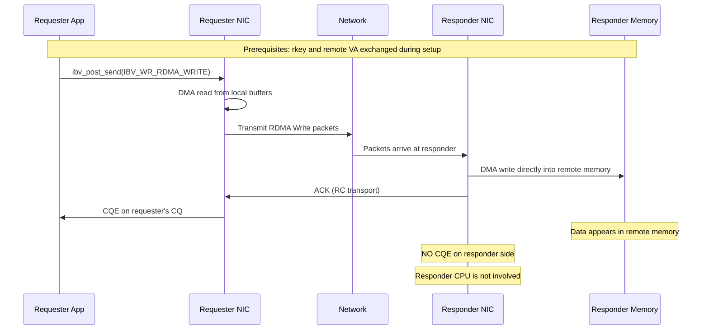

# 5.2 RDMA Write (One-Sided)

RDMA Write is the operation that most viscerally demonstrates what makes RDMA different from conventional networking. When an application posts an RDMA Write, the local NIC reads data from the application's memory, transmits it across the network, and the remote NIC deposits it directly into a specified location in the remote application's memory. The remote CPU is not involved. No receive buffer is posted. No interrupt is raised. No completion is generated on the remote side. The data simply materializes in remote memory, as if placed there by a ghost.

This one-sided semantic is what enables RDMA to achieve throughput and latency numbers that are fundamentally impossible with traditional networking. The remote CPU is entirely free to do other work -- or to be completely idle. The remote application does not even need to be running when the write occurs, as long as the memory region remains registered and the QP remains connected.

## Anatomy of an RDMA Write

An RDMA Write requires four pieces of information:

1. **Local data source**: one or more scatter-gather entries describing the local buffers to send, each with a local key (`lkey`).
2. **Remote destination address**: the virtual address in the remote process's address space where data should be written.
3. **Remote key** (`rkey`): the memory region key that authorizes access to the remote memory.
4. **Length**: implicit from the scatter-gather list -- the sum of all SGE lengths.

The remote address and remote key must be exchanged out-of-band before any RDMA Write can occur. Typically, during connection setup, each side registers a memory region, obtains its `rkey` and base virtual address, and sends these to the peer via a Send/Receive exchange or an out-of-band TCP connection. This key exchange is a one-time setup cost; once the keys are exchanged, any number of RDMA Writes can be performed without further coordination.



## The Verbs API

RDMA Write uses `ibv_post_send()` with the `IBV_WR_RDMA_WRITE` opcode. The key difference from a plain Send is the `wr.rdma` union member, which carries the remote address and key:

```c
struct ibv_sge sge = {
    .addr   = (uintptr_t)local_buf,
    .length = data_len,
    .lkey   = local_mr->lkey
};

struct ibv_send_wr wr = {
    .wr_id      = my_wr_id,
    .sg_list    = &sge,
    .num_sge    = 1,
    .opcode     = IBV_WR_RDMA_WRITE,
    .send_flags = IBV_SEND_SIGNALED,
    .wr = {
        .rdma = {
            .remote_addr = remote_va,      // Remote virtual address
            .rkey        = remote_rkey      // Remote memory region key
        }
    }
};

struct ibv_send_wr *bad_wr;
int ret = ibv_post_send(qp, &wr, &bad_wr);
```

The `remote_addr` field is a 64-bit virtual address in the remote process's address space. It must fall within the bounds of a memory region that the remote side has registered with at least `IBV_ACCESS_REMOTE_WRITE` permission. The `rkey` is the remote key associated with that memory region.

<div class="warning">

**Security Model.** The `rkey` is essentially a capability token. Anyone who possesses a valid `rkey` and the corresponding virtual address can write to (or read from, if read access is also granted) the remote memory. RDMA has no per-operation authentication. The protection is at the memory region level: registering a region with `IBV_ACCESS_REMOTE_WRITE` is an explicit grant of write access to anyone holding the `rkey`. Protect `rkey` values as carefully as you would protect a password. In production systems, consider using Memory Windows (MWs) for finer-grained, revocable access control.

</div>

## Completion Semantics: Local Only

This is one of the most important properties of RDMA Write and one of the most common sources of confusion: **RDMA Write generates a completion only on the requester side.** The responder gets nothing -- no CQE, no interrupt, no notification of any kind.

On the requester side, the CQE semantics depend on the transport type:

| Transport | CQE Meaning |
|---|---|
| RC (Reliable Connected) | The remote NIC has acknowledged the write. Data is in remote memory. |
| UC (Unreliable Connected) | The data has left the local NIC. No guarantee of delivery. |

For RC transport, a successful completion on the requester side is a strong guarantee: the data has been written to the remote memory region and is visible to subsequent RDMA operations targeting that address. However, note a subtlety: the data is visible to the remote **NIC** (for subsequent RDMA operations) but not necessarily visible to the remote **CPU** immediately, due to CPU cache coherency effects. In practice, modern PCIe-attached NICs write directly to main memory (or are cache-coherent via mechanisms like DDIO), so this is rarely an issue -- but it is an important distinction in theory.

## Segmentation and MTU

For messages larger than the path MTU, the NIC automatically segments the RDMA Write into multiple packets. On an RC QP, each packet is individually acknowledged, and the NIC handles retransmission of lost packets transparently. The application sees a single completion for the entire write, regardless of how many packets were needed.

For example, a 1 MB RDMA Write over a 4 KB MTU generates 256 packets. If packet 100 is lost, the NIC retransmits it (and possibly subsequent packets, depending on the go-back-N vs. selective-repeat implementation). The application sees a single successful CQE only after all 256 packets are acknowledged.

## Zero-Byte RDMA Write

An RDMA Write with zero length is legal and useful. It acts as a **fence** or **flush** operation: the CQE confirms that all prior RDMA Writes on this QP have been delivered to the remote NIC. This can be used as a lightweight synchronization mechanism.

## Performance Characteristics

RDMA Write is typically the highest-performance data transfer operation in RDMA:

- **Latency**: One network traversal plus local and remote DMA. For small messages on modern hardware (ConnectX-6/7), expect 1-2 microseconds on InfiniBand, slightly more on RoCE.
- **Throughput**: Can saturate the link bandwidth. A single QP on HDR InfiniBand (200 Gbps) can achieve close to line rate with sufficiently large messages and pipelining.
- **CPU overhead**: Minimal on both sides. The requester CPU only posts the work request and polls the completion. The responder CPU does nothing at all.

RDMA Write outperforms Send/Receive for bulk data transfer because there is no receive buffer management overhead on the remote side. There is no RNR NAK risk, no receive pool to maintain, and no per-message completion to process on the responder.

## Practical Use Cases

**Log replication.** A primary node writes log entries directly into a pre-allocated circular buffer in the replica's memory. The replica periodically checks a watermark to see how far the log has advanced. This is the pattern used by systems like HERD, FaRM, and many replicated state machines.

**Remote buffer updates.** In key-value stores like Pilaf, the server publishes its hash table in a memory region. Clients use RDMA Read to look up keys and RDMA Write to update values (with appropriate concurrency control).

**Distributed file systems.** Systems like Octopus and Assise use RDMA Write to transfer file data between nodes, achieving near-wire-speed throughput without any involvement from the CPU on the storage node.

**RDMA-based RPC data path.** Many high-performance RPC frameworks (eRPC, FaSST) use RDMA Write to deliver response payloads directly into the caller's buffer, bypassing the receive queue entirely.

## Writing to Specific Offsets

One of the most powerful aspects of RDMA Write is the ability to target a specific offset within a remote memory region. The `remote_addr` can be any address within the registered region, not just its base address. This enables patterns like:

```c
// Write to a specific slot in a remote ring buffer
uint64_t slot_addr = remote_base_addr + (slot_index * SLOT_SIZE);

wr.wr.rdma.remote_addr = slot_addr;
wr.wr.rdma.rkey        = remote_rkey;
```

This capability is what makes RDMA Write suitable for building complex remote data structures: ring buffers, hash tables, B-trees, and log-structured stores, all updated from the remote side without any CPU involvement on the host.

## The Notification Problem

The power of RDMA Write -- the remote CPU's non-involvement -- is also its limitation. If the remote CPU needs to know that a write has occurred, RDMA Write alone is insufficient. There are several patterns for solving this notification problem:

1. **Polling a flag.** The writer writes data to one region and then writes a flag value to a known "doorbell" location. The remote CPU polls this location. This requires careful ordering (see Section 5.6 on fencing).

2. **RDMA Write with Immediate Data.** The write carries a 32-bit immediate value that generates a CQE on the remote side. This is covered in Section 5.5.

3. **Separate Send.** After the RDMA Write, the requester posts a Send that acts as a notification. The remote CPU processes the Send completion and knows the data is ready.

4. **Application-level protocol.** The remote CPU periodically scans the data region for changes (e.g., checking a sequence number or watermark).

Each approach has trade-offs. Polling wastes CPU cycles. Immediate data requires the remote side to post receive buffers. A separate Send adds a round trip of latency. Application-level scanning adds detection latency. The right choice depends on the application's latency, throughput, and CPU utilization requirements.

<div class="warning">

**Ordering Subtlety.** When performing multiple RDMA Writes to the same remote node, they are guaranteed to be **initiated** in posting order on an RC QP. However, if you write data to one address and then write a "ready" flag to another address, you need the second write to be visible only after the first. On most implementations, writes within a single QP are ordered -- but if you need an absolute guarantee, use the `IBV_SEND_FENCE` flag on the second write, or use RDMA Write with Immediate Data for the notification step. See Section 5.6 for the full ordering model.

</div>

## RDMA Write vs. Send: When to Use Which

| Consideration | RDMA Write | Send/Receive |
|---|---|---|
| Remote CPU involvement | None | Required (must post receives) |
| Remote notification | None (unless Immediate Data) | CQE on receiver |
| Buffer management | Remote address pre-exchanged | Receive pool managed at runtime |
| Maximum throughput | Higher (no remote CQ overhead) | Lower (CQE per message) |
| Use case fit | Bulk data, known destinations | Control messages, RPC requests |
| Flow control | Application-managed | Implicit via receive buffer availability |

The general rule: use RDMA Write when you know exactly where data should go in remote memory and the remote CPU does not need per-transfer notification. Use Send/Receive when the remote side needs to actively process each message or when you need the built-in flow control of the receive queue.
