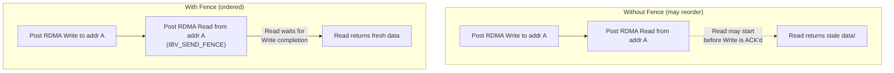

# 5.6 Operation Semantics and Ordering

The preceding sections introduced the five RDMA operation types. But knowing **what** each operation does is only half the story. To build correct and performant RDMA systems, you must also understand the **rules** that govern when operations execute, when completions are generated, when data is visible, and how operations interact with each other. These rules -- signaling, fencing, ordering, and work request modifiers -- are the control plane of the RDMA data path.

Getting these rules wrong does not usually cause crashes or obvious errors. Instead, it causes subtle correctness bugs: stale reads, lost writes, overflowed queues, and race conditions that only manifest under load. This section is your reference for avoiding those bugs.

## Signaled vs. Unsignaled Completions

Every Send Queue work request can optionally generate a Completion Queue Entry when it completes. This behavior is controlled by two mechanisms working together: the `sq_sig_all` flag on the QP, and the `IBV_SEND_SIGNALED` flag on individual work requests.

When a QP is created with `sq_sig_all = 1`, every Send Queue work request generates a CQE, regardless of the per-WR flags. When `sq_sig_all = 0`, only work requests that have `IBV_SEND_SIGNALED` set in their `send_flags` will generate a CQE. Unsignaled work requests are still processed by the NIC -- data is transmitted, RDMA operations are performed -- but no CQE is generated.

```c
// QP creation: selective signaling
struct ibv_qp_init_attr init_attr = {
    .sq_sig_all = 0,    // Selective signaling mode
    // ...
};

// Unsignaled work request -- no CQE generated
struct ibv_send_wr wr_unsignaled = {
    .opcode     = IBV_WR_RDMA_WRITE,
    .send_flags = 0,    // No IBV_SEND_SIGNALED
    // ...
};

// Signaled work request -- CQE generated
struct ibv_send_wr wr_signaled = {
    .opcode     = IBV_WR_RDMA_WRITE,
    .send_flags = IBV_SEND_SIGNALED,
    // ...
};
```

### Why Use Unsignaled Completions?

The primary motivation is **performance**. Generating a CQE consumes resources on both the NIC and the CPU:

- The NIC must write the CQE to the CQ's memory, which consumes PCIe bandwidth.
- The application must poll the CQ, which consumes CPU cycles.
- The CQ has a fixed capacity; more CQEs means either a larger CQ (more memory) or more frequent polling.

For workloads that post many small work requests (e.g., millions of small RDMA Writes per second), generating a CQE for every operation can become a significant bottleneck. By signaling only every Nth operation, the application reduces CQ pressure by a factor of N while still maintaining visibility into completion progress.

### The Overflow Danger

Unsignaled completions create a subtle but critical problem: **Send Queue overflow.** Work requests occupy slots in the Send Queue until they complete. For signaled work requests, the application knows a slot is free when it polls the CQE. For unsignaled work requests, there is no explicit notification.

If the application posts work requests faster than the NIC processes them, the Send Queue fills up. Once the SQ is full, `ibv_post_send()` returns `ENOMEM`, and the application is stuck -- it cannot post more work to drain the queue, because the queue is full.

The solution is to periodically post a signaled work request to serve as a **progress marker**:

```c
#define SIGNAL_INTERVAL 64

uint32_t wr_count = 0;

void post_write(struct ibv_qp *qp, /* ... */) {
    struct ibv_send_wr wr = {
        .opcode = IBV_WR_RDMA_WRITE,
        // ...
    };

    wr_count++;
    if (wr_count % SIGNAL_INTERVAL == 0) {
        wr.send_flags = IBV_SEND_SIGNALED;
    } else {
        wr.send_flags = 0;
    }

    ibv_post_send(qp, &wr, &bad_wr);

    // When we get the signaled CQE, we know all prior
    // SIGNAL_INTERVAL work requests have also completed.
}
```

<div class="warning">

**Completion Ordering Guarantee.** On an RC QP, when a signaled CQE arrives, all work requests posted **before** the signaled work request are guaranteed to have completed. This is why periodic signaling works: polling a single CQE implicitly confirms the completion of all preceding unsignaled work requests. The SQ slots for all those work requests can be safely considered free.

</div>

### Choosing the Signal Interval

The optimal signal interval depends on the workload:

| Interval | Effect |
|---|---|
| 1 (every WR) | Maximum visibility, maximum CQ overhead. Use for debugging or low-rate workloads. |
| 16-64 | Good balance for most workloads. |
| 256+ | Minimal CQ overhead, but requires large Send Queue capacity. |

The Send Queue depth must be at least as large as the signal interval. If you signal every 64 operations, you need at least 64 slots in the SQ, plus headroom for in-flight operations.

## The Fence Flag (IBV_SEND_FENCE)

The `IBV_SEND_FENCE` flag enforces ordering between a work request and all **prior RDMA Read and Atomic operations** on the same QP. When Fence is set, the NIC guarantees that all prior Read and Atomic operations have completed before this work request begins execution.

Why is this necessary? On an RC QP, RDMA Writes are processed in posting order and are guaranteed to be visible in posting order. But RDMA Reads and Atomics are **request-response** operations that occupy separate processing pipelines inside the NIC. Without a fence, the NIC may initiate a new operation before a prior Read has received its response data.



### Common Fence Use Cases

**Write-then-Read consistency.** When you write data to a remote location and then read from the same or a dependent location, the fence ensures the read sees the effect of the write.

**Write-then-Atomic ordering.** When you write data and then perform a CAS to publish a pointer to that data, the fence ensures the data is visible before the pointer update.

```c
// Write data to remote buffer
struct ibv_send_wr data_wr = {
    .opcode = IBV_WR_RDMA_WRITE,
    .send_flags = 0,
    .wr.rdma = { .remote_addr = data_addr, .rkey = rkey },
    // ...
};

// Atomically publish pointer to the data (must see the write)
struct ibv_send_wr publish_wr = {
    .opcode = IBV_WR_ATOMIC_CMP_AND_SWP,
    .send_flags = IBV_SEND_FENCE | IBV_SEND_SIGNALED,
    .wr.atomic = {
        .remote_addr = pointer_addr,
        .rkey        = rkey,
        .compare_add = 0,
        .swap        = data_addr
    },
    // ...
};

data_wr.next = &publish_wr;
ibv_post_send(qp, &data_wr, &bad_wr);
```

## Ordering Guarantees by QP Transport Type

Different QP transport types provide different ordering guarantees:

### RC (Reliable Connected)

RC provides the strongest ordering guarantees:

- **Writes are ordered.** RDMA Write A posted before RDMA Write B will be visible in that order on the remote side. The remote NIC processes them in order.
- **Sends are ordered.** Send A posted before Send B will be delivered in that order.
- **Reads may bypass Writes.** A Read posted after a Write may begin before the Write completes. Use `IBV_SEND_FENCE` to prevent this.
- **Atomics may bypass Writes.** Same as Reads -- use Fence.
- **Reads are ordered with Reads.** Read A completes before Read B if posted in that order.
- **Completions are ordered.** CQEs appear in the CQ in posting order.

### UC (Unreliable Connected)

UC preserves ordering but not reliability:

- **Ordered delivery.** Messages are delivered in posting order, but individual messages may be lost (no retransmission).
- **No Read/Atomic support.** UC does not support RDMA Read or Atomic operations, so the Read-bypassing-Write issue does not arise.
- **Message loss is all-or-nothing.** If a multi-packet message loses any packet, the entire message is discarded.

### UD (Unreliable Datagram)

UD provides the weakest guarantees:

- **No ordering.** Messages between the same pair of nodes may arrive in any order.
- **No reliability.** Messages may be lost, duplicated, or corrupted (though corruption is detected and the message is dropped).
- **No multi-packet messages.** Each message must fit in a single MTU.
- **Only Send/Receive.** No RDMA Write, Read, or Atomic operations.

## The Solicited Flag (IBV_SEND_SOLICITED)

The `IBV_SEND_SOLICITED` flag marks a Send or RDMA Write with Immediate as "solicited." This interacts with the CQ notification mechanism to implement a two-tier event system:

```c
// Requester marks a high-priority message as solicited
struct ibv_send_wr wr = {
    .opcode     = IBV_WR_SEND,
    .send_flags = IBV_SEND_SIGNALED | IBV_SEND_SOLICITED,
    // ...
};
```

On the receiver side, `ibv_req_notify_cq()` can request either all-event or solicited-only notification:

```c
// Wake me up only for solicited messages
ibv_req_notify_cq(cq, /* solicited_only */ 1);

// This will trigger a notification (completion channel event):
//   - Send with IBV_SEND_SOLICITED
//   - RDMA Write with IMM and IBV_SEND_SOLICITED
// This will NOT trigger a notification (but CQE is still generated):
//   - Regular Send (without SOLICITED flag)
//   - Regular RDMA Write with IMM (without SOLICITED flag)
```

The Solicited flag is purely a notification optimization. The CQE is generated regardless -- the flag only affects whether the completion triggers an interrupt via the completion channel. Applications can poll and find all CQEs whether they are solicited or not.

### Use Case: Two-Tier Notification

A server that processes mostly routine data messages with occasional high-priority control messages:

```c
// Server event loop
ibv_req_notify_cq(cq, 1);  // Solicited-only notification

while (running) {
    // Block until a solicited message arrives
    ibv_get_cq_event(comp_channel, &ev_cq, &ev_ctx);
    ibv_ack_cq_events(ev_cq, 1);

    // Process ALL queued completions (solicited and non-solicited)
    while (ibv_poll_cq(cq, BATCH, wc) > 0) {
        for (int i = 0; i < n; i++) {
            process(wc[i]);
        }
    }

    // Re-arm notification for next solicited message
    ibv_req_notify_cq(cq, 1);
}
```

This allows the server to sleep during idle periods (saving CPU) while waking instantly for priority messages, and batch-processing all accumulated routine messages when it does wake.

## Inline Sends (IBV_SEND_INLINE)

The `IBV_SEND_INLINE` flag tells the NIC to copy the data directly from the work request, rather than performing a DMA read from the application's buffer. For small messages, this eliminates one DMA operation and can reduce latency:

```c
struct ibv_send_wr wr = {
    .opcode     = IBV_WR_SEND,
    .send_flags = IBV_SEND_SIGNALED | IBV_SEND_INLINE,
    .sg_list    = &sge,
    .num_sge    = 1,
    // ...
};
```

### How Inline Works

Without inline: the NIC reads the work request descriptor from the SQ, then performs a **separate DMA read** to fetch the data from the application's buffer (pointed to by the SGE). This is two PCIe transactions.

With inline: the CPU copies the data directly into the work request descriptor in the SQ. The NIC reads both the descriptor and the data in a single PCIe transaction. For small messages (typically under 64-256 bytes, depending on hardware), this saves a round trip across the PCIe bus.

### Benefits and Limitations

- **Reduced latency**: Eliminates one PCIe DMA read. Can shave 100-200 nanoseconds from small message latency.
- **No lkey needed**: Because the NIC does not DMA from the buffer, the data does not need to be in a registered memory region. You can send inline from any memory, including stack variables.
- **Size limit**: The maximum inline data size is device-specific and typically small (64-256 bytes). It is limited by the WQE size in the SQ. Query the maximum with `ibv_query_device()` and request the desired maximum with `max_inline_data` in the QP creation attributes.
- **Immediate buffer reuse**: The application can reuse or modify the send buffer immediately after `ibv_post_send()` returns, because the data has already been copied into the SQ. Without inline, the buffer cannot be modified until the CQE confirms completion.

```c
struct ibv_qp_init_attr qp_attr = {
    .cap = {
        .max_send_wr     = 128,
        .max_inline_data = 128,   // Request up to 128 bytes inline
        // ...
    },
    // ...
};
```

<div class="warning">

**Inline Data and Memory Registration.** When using `IBV_SEND_INLINE`, the SGE's `lkey` field is ignored. The CPU copies data from the address specified in `sge.addr` directly into the WQE. This means the buffer does not need to be registered. However, the buffer must be valid and readable at the time `ibv_post_send()` is called, since the copy happens during the post call itself, not later during DMA.

</div>

## Work Request ID (wr_id)

Every work request -- Send, Receive, RDMA Write, RDMA Read, Atomic -- carries a 64-bit `wr_id` field. This value is set by the application, is completely opaque to the NIC, and is returned unchanged in the Completion Queue Entry. It is the application's primary mechanism for correlating completions with the operations that generated them.

Common `wr_id` strategies:

```c
// Strategy 1: Buffer pool index
wr.wr_id = buffer_index;  // CQE tells you which buffer completed

// Strategy 2: Pointer to context
wr.wr_id = (uint64_t)(uintptr_t)context_ptr;  // Cast pointer to uint64_t

// Strategy 3: Encoded operation info
wr.wr_id = (op_type << 48) | (conn_id << 32) | seq_num;

// On completion:
struct ibv_wc wc;
ibv_poll_cq(cq, 1, &wc);
// wc.wr_id contains the value you set
```

The choice of encoding depends on the application's needs. Buffer pool indices are simple and cache-friendly. Pointers are flexible but require careful lifetime management. Encoded fields pack multiple pieces of information into 64 bits but require bitwise manipulation.

## Comprehensive Operation Comparison

The following table summarizes the complete semantics of every RDMA operation type:

| Property | Send | Send w/IMM | RDMA Write | Write w/IMM | RDMA Read | CAS | FAA |
|---|---|---|---|---|---|---|---|
| **Opcode** | `SEND` | `SEND_WITH_IMM` | `RDMA_WRITE` | `RDMA_WRITE_WITH_IMM` | `RDMA_READ` | `ATOMIC_CMP_AND_SWP` | `ATOMIC_FETCH_AND_ADD` |
| **Sides involved** | Two | Two | One | Hybrid | One | One | One |
| **Requester posts to** | SQ | SQ | SQ | SQ | SQ | SQ | SQ |
| **Responder posts to** | RQ | RQ | -- | RQ | -- | -- | -- |
| **Requester CQE** | Yes | Yes | Yes | Yes | Yes | Yes | Yes |
| **Responder CQE** | Yes | Yes | No | Yes | No | No | No |
| **Consumes Recv WQE** | Yes | Yes | No | Yes | No | No | No |
| **Remote CPU involved** | Yes | Yes | No | Notification only | No | No | No |
| **Data placement** | Recv buffer | Recv buffer | Remote addr (RDMA) | Remote addr (RDMA) | Local buffer | Local buffer (old val) | Local buffer (old val) |
| **Remote key needed** | No | No | Yes | Yes | Yes | Yes | Yes |
| **Fence applicable** | Yes | Yes | Yes | Yes | Yes | Yes | Yes |
| **Inline applicable** | Yes | Yes | Yes | Yes | No | No | No |
| **Max data size** | 2 GB (RC) | 2 GB (RC) | 2 GB | 2 GB | 2 GB | 8 bytes | 8 bytes |
| **RC support** | Yes | Yes | Yes | Yes | Yes | Yes | Yes |
| **UC support** | Yes | Yes | Yes | Yes | No | No | No |
| **UD support** | Yes | Yes | No | No | No | No | No |

This table is your reference for designing RDMA-based protocols. When choosing an operation, ask:

1. Does the remote CPU need to know about this transfer? If yes, use Send, Send with IMM, or Write with IMM.
2. Does the sender know the exact destination address? If yes, consider RDMA Write. If no (or if the receiver manages buffers), use Send.
3. Do you need atomicity on a remote word? Use CAS or FAA.
4. Is latency critical? Prefer RDMA Write over RDMA Read (one-way vs. round-trip).
5. How many completions can you afford? Use unsignaled operations with periodic signaling to reduce CQ pressure.

The interplay of these operations, their signaling options, and their ordering guarantees is what makes RDMA programming both powerful and demanding. Master these semantics, and you have the foundation for building systems that operate at the limits of what the hardware can deliver.
