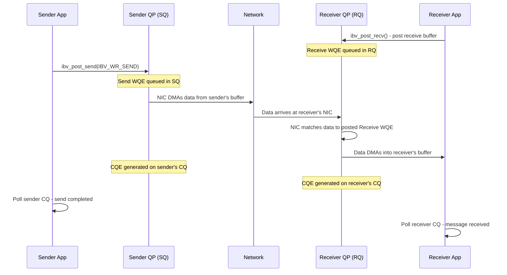

# 5.1 Send/Receive (Two-Sided Operations)

Send/Receive is the most intuitive RDMA operation and the closest analog to traditional message passing. It is a **two-sided** or **channel** semantic: both the sender and the receiver must actively participate. The sender posts a Send work request to its Send Queue; the receiver posts a Receive work request to its Receive Queue. The NIC on the receiving side matches the incoming data against a posted receive buffer, deposits the payload, and generates a completion entry for both sides.

Despite its conceptual simplicity, Send/Receive in RDMA differs from socket-based messaging in several critical ways. There is no kernel involvement on the data path. There is no intermediate copy into a kernel buffer. The NIC delivers data directly into the application's pre-registered memory, and the completion notification goes straight to user space. And unlike TCP's byte stream abstraction, RDMA Send/Receive preserves **message boundaries** -- each Send corresponds to exactly one Receive, and the receiver always knows where one message ends and the next begins.

## The Two-Sided Contract

The fundamental contract of Send/Receive is simple but rigid: the receiver must post a Receive work request **before** the sender posts its Send. If a message arrives and no receive buffer is available, the behavior depends on the QP transport type. On a Reliable Connected (RC) QP, the NIC will issue a Receiver Not Ready (RNR) NAK back to the sender, which will retry after a configurable delay. If retries are exhausted, both QPs transition to an error state. On an Unreliable Datagram (UD) QP, the message is silently dropped.

This pre-posting requirement is one of the most common sources of bugs in RDMA applications. Unlike TCP, where the kernel maintains receive buffers on your behalf, RDMA requires the application to explicitly manage its receive buffer pool. If the pool runs dry under load, messages are lost or connections break.



## Posting a Receive Buffer

The receiver posts receive buffers using `ibv_post_recv()`. Each receive work request describes one or more memory buffers (a scatter list) into which the NIC will deposit incoming data:

```c
struct ibv_sge sge = {
    .addr   = (uintptr_t)recv_buf,   // Virtual address of receive buffer
    .length = RECV_BUF_SIZE,          // Buffer size in bytes
    .lkey   = mr->lkey                // Local key from memory registration
};

struct ibv_recv_wr recv_wr = {
    .wr_id   = RECV_WR_ID,   // User-defined 64-bit cookie
    .sg_list = &sge,          // Scatter/gather list
    .num_sge = 1,             // Number of scatter/gather entries
    .next    = NULL           // Linked list for batch posting
};

struct ibv_recv_wr *bad_wr;
int ret = ibv_post_recv(qp, &recv_wr, &bad_wr);
if (ret) {
    fprintf(stderr, "ibv_post_recv failed: %s\n", strerror(ret));
}
```

The `wr_id` field is critical. It is a 64-bit opaque value that the NIC returns in the completion entry. Applications typically use it as an index into a buffer pool, a pointer to a context structure, or a sequence number. Whatever value you store here, you will get it back unchanged when this receive completes.

<div class="warning">

**Buffer Size Matters.** If the incoming message is larger than the posted receive buffer, the NIC generates a completion with an error status (`IBV_WC_LOC_LEN_ERR` for local length error). On an RC QP, this transitions the QP to the Error state. Always ensure your receive buffers are large enough for the maximum expected message. For UD QPs, remember that the first 40 bytes of the buffer are consumed by the Global Routing Header (GRH), so you need to allocate an extra 40 bytes beyond the maximum message payload.

</div>

## Posting a Send

The sender posts send work requests using `ibv_post_send()` with the `IBV_WR_SEND` opcode:

```c
struct ibv_sge sge = {
    .addr   = (uintptr_t)send_buf,   // Virtual address of data to send
    .length = msg_len,                // Length of data in bytes
    .lkey   = mr->lkey                // Local key from memory registration
};

struct ibv_send_wr send_wr = {
    .wr_id      = SEND_WR_ID,
    .sg_list    = &sge,
    .num_sge    = 1,
    .opcode     = IBV_WR_SEND,
    .send_flags = IBV_SEND_SIGNALED,  // Generate CQE on completion
    .next       = NULL
};

struct ibv_send_wr *bad_wr;
int ret = ibv_post_send(qp, &send_wr, &bad_wr);
```

The `send_flags` field accepts a bitmask of flags that control completion and optimization behavior. We will examine `IBV_SEND_SIGNALED`, `IBV_SEND_SOLICITED`, `IBV_SEND_FENCE`, and `IBV_SEND_INLINE` in detail in Section 5.6.

## Scatter-Gather: Multi-Buffer Operations

Both Send and Receive work requests support **scatter-gather** lists -- arrays of `ibv_sge` entries that allow the NIC to assemble a message from (or deposit a message into) multiple non-contiguous memory buffers. This is often referred to as **vectored I/O**.

On the send side, scatter-gather is a **gather** operation: the NIC reads data from multiple buffers and transmits it as a single, contiguous message on the wire:

```c
struct ibv_sge sge_list[3] = {
    { .addr = (uintptr_t)header,  .length = HDR_LEN,  .lkey = mr->lkey },
    { .addr = (uintptr_t)payload, .length = data_len,  .lkey = mr->lkey },
    { .addr = (uintptr_t)trailer, .length = TRL_LEN,   .lkey = mr->lkey }
};

struct ibv_send_wr send_wr = {
    .wr_id      = wr_id,
    .sg_list    = sge_list,
    .num_sge    = 3,               // Three buffers gathered into one message
    .opcode     = IBV_WR_SEND,
    .send_flags = IBV_SEND_SIGNALED,
};
```

On the receive side, scatter-gather is a **scatter** operation: the NIC distributes the incoming message across multiple receive buffers. The first bytes fill the first SGE, then the next SGE, and so on. This is useful for separating headers from payloads without a memcpy.

The maximum number of scatter-gather entries per work request is determined by the `max_send_sge` and `max_recv_sge` parameters specified when creating the QP. Typical hardware supports 16 to 30 SGEs per work request, though the exact limit is device-specific and can be queried via `ibv_query_device()`.

## Message Boundaries and Size Limits

Unlike TCP, which presents a byte stream interface where the receiver has no notion of where one `send()` call's data ends and another's begins, RDMA Send/Receive preserves **message boundaries**. Each Send operation delivers a discrete, atomic message. The receiver processes it as a unit. If the sender posts three 1 KB sends, the receiver will get three separate completions, each for exactly 1 KB -- never a single 3 KB blob, never a partial message.

The maximum message size for a single Send operation depends on the QP transport type:

| Transport Type | Maximum Message Size |
|---|---|
| RC (Reliable Connected) | Up to 2 GB (segmented automatically by the NIC into MTU-sized packets) |
| UC (Unreliable Connected) | Up to 2 GB (segmented, but lost segments cause entire message to be dropped) |
| UD (Unreliable Datagram) | Single MTU only (typically 4096 bytes minus headers) |

For RC QPs, the NIC handles segmentation and reassembly transparently. A 1 MB Send is automatically broken into MTU-sized packets (typically 4 KB each), transmitted as a sequence with per-packet acknowledgment, and reassembled on the receiver into a single message. The receiver gets one completion for the entire 1 MB message once all packets have arrived.

## Completion Semantics

Send/Receive generates completions on **both** sides:

- **Sender CQE**: Indicates that the send buffer can be reused. For RC QPs, this means the data has been acknowledged by the remote NIC (it has been written to the receiver's buffer). For UD QPs, it merely means the data has left the local NIC.

- **Receiver CQE**: Indicates that data has been placed in the receive buffer and is ready to be read. The completion entry includes `wc.byte_len`, the actual number of bytes received, and `wc.opcode` set to `IBV_WC_RECV`.

```c
struct ibv_wc wc;
int n = ibv_poll_cq(cq, 1, &wc);
if (n > 0) {
    if (wc.status != IBV_WC_SUCCESS) {
        fprintf(stderr, "Completion error: %s\n",
                ibv_wc_status_str(wc.status));
        // Handle error -- QP may have transitioned to Error state
    } else {
        printf("wr_id: %lu, opcode: %d, byte_len: %u\n",
               wc.wr_id, wc.opcode, wc.byte_len);
    }
}
```

## The Solicited Event Flag

The `IBV_SEND_SOLICITED` flag on a Send work request marks the message as "solicited." This flag interacts with the CQ notification mechanism on the receiver side. When the receiver calls `ibv_req_notify_cq()`, it can request notifications for **all** completions or for **solicited-only** completions:

```c
// Notify on all completions
ibv_req_notify_cq(cq, 0);

// Notify only on solicited completions
ibv_req_notify_cq(cq, 1);
```

This mechanism allows applications to implement efficient event-driven processing: routine data messages are processed by polling, while high-priority or control messages are sent with the Solicited flag to trigger an interrupt and wake a sleeping receiver. This two-tier notification scheme avoids the overhead of interrupts on every message while still providing low-latency wakeup when it matters.

## Practical Patterns

**Pre-posting receive buffers.** The most robust pattern is to maintain a pool of posted receive buffers and replenish them as completions arrive. A common approach is to pre-post N receive buffers at QP creation time, and then re-post each buffer immediately after processing its completion:

```c
// Initial pre-posting
for (int i = 0; i < RECV_POOL_SIZE; i++) {
    post_recv(qp, &recv_bufs[i]);
}

// Main loop: process completions, re-post buffers
while (running) {
    int n = ibv_poll_cq(recv_cq, BATCH_SIZE, wc_array);
    for (int i = 0; i < n; i++) {
        process_message(&recv_bufs[wc_array[i].wr_id]);
        post_recv(qp, &recv_bufs[wc_array[i].wr_id]);  // Re-post immediately
    }
}
```

**Shared Receive Queues (SRQ).** When an application manages many QPs (e.g., one per connected client), maintaining a per-QP receive buffer pool becomes memory-prohibitive. A Shared Receive Queue allows multiple QPs to draw receive buffers from a common pool, dramatically reducing memory consumption. We will explore SRQs in detail in later chapters.

<div class="warning">

**Ordering Guarantee.** On an RC QP, messages are delivered in the order they were posted. If the sender posts Send A followed by Send B, the receiver will always complete A before B. This ordering guarantee applies within a single QP. Messages on different QPs have no ordering relationship, even if they share the same connection endpoints.

</div>

## When to Use Send/Receive

Send/Receive is the right choice when both sides need to coordinate -- when the receiver needs to know that a message has arrived and needs to process it. Common use cases include:

- **Control plane messaging**: Connection setup, configuration exchange, error notifications.
- **RPC request/response**: The receiver needs to dispatch each incoming message to a handler.
- **Small message exchange**: When messages are small enough that the overhead of posting receive buffers is negligible relative to the data transfer.
- **Protocol negotiation**: When you need flow control at the application level (the receiver controls the rate by managing how many receive buffers it posts).

For bulk data transfer where the receiver does not need per-message notification, RDMA Write is almost always a better choice. For reading remote state without involving the remote CPU, RDMA Read is more appropriate. The key question is: **does the remote CPU need to know about this transfer?** If yes, use Send/Receive (or RDMA Write with Immediate Data). If no, use one-sided operations.
