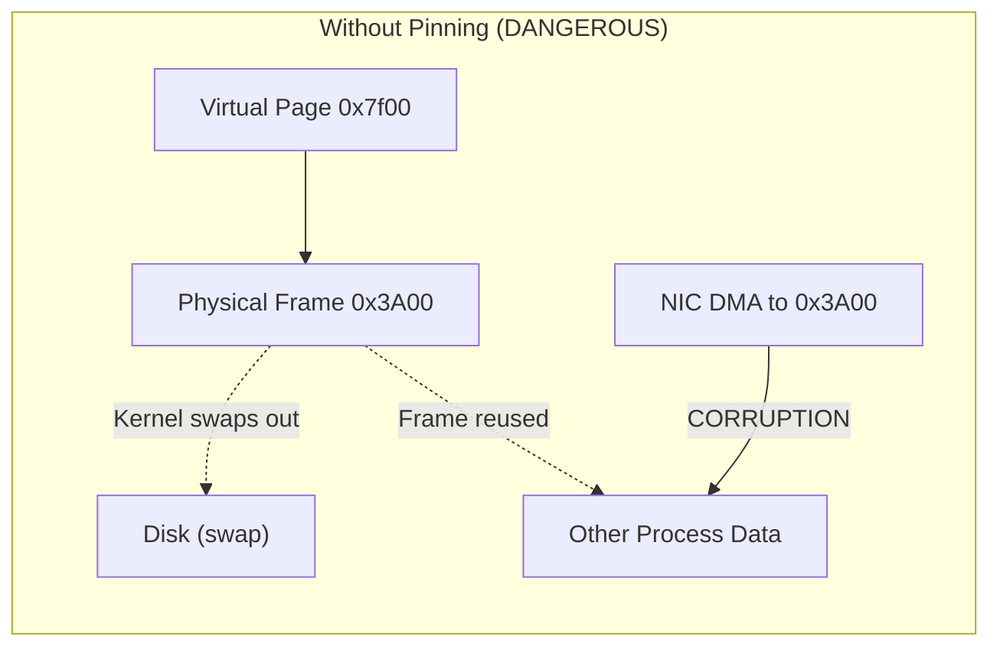
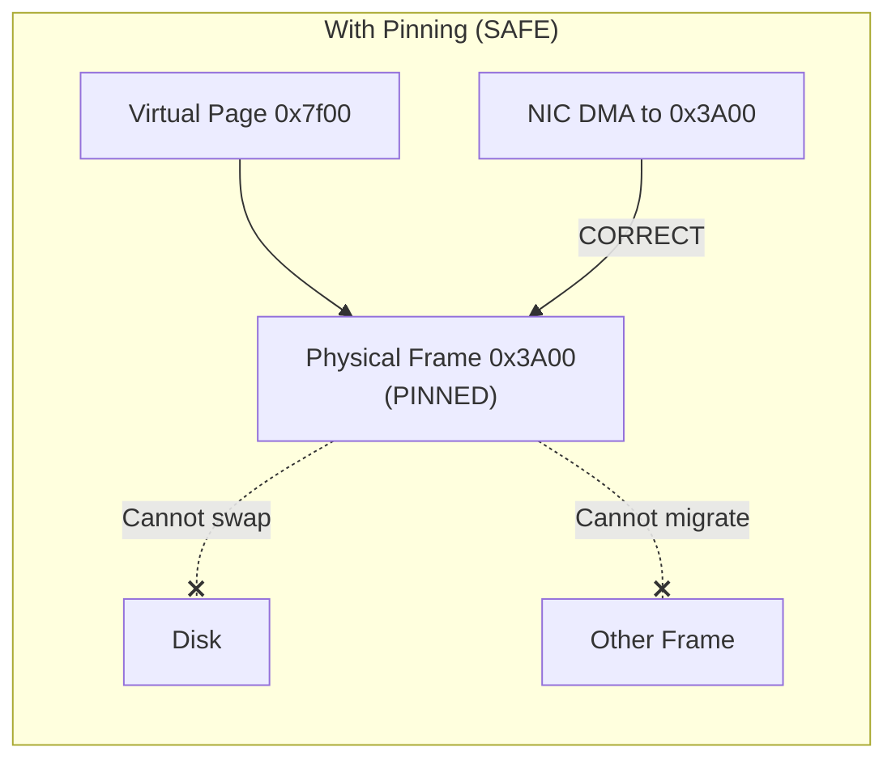

# 6.2 Memory Pinning

In the previous section, we traced the path of `ibv_reg_mr()` through the kernel and noted that page pinning is a critical step. In this section, we examine pinning in depth: why it is necessary, how the kernel implements it, what impact it has on the system, and how administrators and developers can manage its consequences.

## Why Pinning Is Necessary

A modern operating system manages physical memory as a fungible resource. The kernel's virtual memory subsystem continuously makes decisions about physical pages: swapping infrequently used pages to disk, migrating pages between NUMA nodes for locality, compacting pages to create contiguous regions for huge page allocation, and reclaiming pages from file-backed mappings when memory is scarce. This dynamic management is transparent to applications, which see only stable virtual addresses.

RDMA breaks this transparency. When a NIC performs a DMA transfer, it uses a **physical** (or bus/IOMMU) address that was programmed into its Memory Translation Table at registration time. If the kernel were to swap a page to disk, migrate it to a different physical frame, or reclaim it entirely, the NIC's DMA address would become stale. The NIC would then read garbage data or, worse, write to memory now belonging to a different process or the kernel itself.





Pinning solves this by telling the kernel: "Do not touch these physical pages. They must remain at their current physical addresses until I say otherwise." The kernel honors this by incrementing a reference count on each page, which prevents the page from being considered for any operation that would change its physical location.

## The Kernel's Page Pinning Mechanism

The kernel provides several functions for pinning user-space pages. The historical interface is `get_user_pages()` and its faster variant `get_user_pages_fast()`. In newer kernels (5.6+), the preferred interface is `pin_user_pages()` / `pin_user_pages_fast()`, which was introduced specifically to address long-standing issues with how DMA-pinned pages interact with the kernel's memory management.

The calling sequence within an RDMA registration typically looks like this (simplified):

```c
/* Kernel-side pseudocode during ibv_reg_mr() */
long npages = (length + offset_in_page(addr) + PAGE_SIZE - 1) / PAGE_SIZE;
struct page **pages = kvmalloc_array(npages, sizeof(struct page *));

/* Pin all pages in the user's address space */
long pinned = pin_user_pages_fast(
    addr,           /* Starting user virtual address */
    npages,         /* Number of pages to pin */
    FOLL_WRITE,     /* Need write access (for receive buffers) */
    pages           /* Output: array of struct page pointers */
);

if (pinned != npages) {
    /* Handle partial pin: unpin what we got and return error */
    unpin_user_pages(pages, pinned);
    return -ENOMEM;
}
```

### What `pin_user_pages_fast()` Does

Internally, this function:

1. **Walks the process's page tables** to find the physical frame backing each virtual page.
2. **Faults in pages** that are not yet present -- this includes pages that have never been accessed (demand-paged), pages that have been swapped out, and pages in lazily-mapped regions.
3. **Sets the FOLL_PIN flag** (in modern kernels) on each page, which increments a special pin count distinct from the regular reference count. This pin count prevents the page from being migrated by mechanisms like `move_pages()`, compaction, or CMA (Contiguous Memory Allocator) reclaim.
4. **Handles copy-on-write (COW) pages**: If a page is shared (e.g., after `fork()`) and the caller needs write access, the kernel breaks the COW by allocating a new physical page and copying the data.

<div class="warning">

**Warning**: The interaction between RDMA pinning and `fork()` is a well-known source of bugs. When a process calls `fork()`, the kernel marks all writable pages as copy-on-write. If a parent process has pinned pages for RDMA and then forks, the child's writes to those shared pages trigger COW, but the parent's NIC still DMA's to the *original* physical page. This can lead to data corruption. The `ibv_fork_init()` function (or the `RDMAV_FORK_SAFE=1` environment variable) instructs libibverbs to call `madvise(MADV_DONTFORK)` on registered regions, preventing the child from inheriting them. However, this comes at a cost: `madvise()` adds overhead, and the child cannot access those memory regions at all.

</div>

## Impact on System Memory

Pinned pages are removed from the kernel's pool of reclaimable memory. This has several consequences:

### Reduced Available Memory

Every pinned page is a page that cannot be reclaimed, even under severe memory pressure. If an RDMA application pins 64 GB of memory on a 128 GB machine, only 64 GB remains for the kernel, page cache, other applications, and the swap daemon. Under memory pressure, the OOM killer may terminate processes because it cannot reclaim the pinned pages.

### No Swap-Out

Pinned pages cannot be written to swap. This is the entire point -- but it means that RDMA applications effectively reduce the system's overcommit capacity. A system that could previously support 200 GB of virtual memory across all processes (using 128 GB of RAM plus 72 GB of swap) may struggle when 64 GB of that RAM is pinned.

### NUMA Implications

Pages are pinned at their current physical location. If a page was allocated on NUMA node 0 but the RDMA NIC is attached to NUMA node 1, the NIC's DMA must cross the inter-socket link on every access. Pinning prevents the kernel from migrating the page to node 1 for better locality. The solution is to ensure correct NUMA-local allocation *before* registration:

```c
/* Allocate memory on the NUMA node local to the NIC */
void *buf = numa_alloc_onnode(size, nic_numa_node);

/* Now register -- pages will be pinned on the correct node */
struct ibv_mr *mr = ibv_reg_mr(pd, buf, size, access_flags);
```

### Fragmentation

Large numbers of pinned pages can contribute to physical memory fragmentation. Because pinned pages cannot be moved, the kernel's compaction mechanism (which moves pages to create contiguous free regions) becomes less effective. This can interfere with huge page allocation and CMA regions.

## The Memlock Limit: RLIMIT_MEMLOCK

The kernel imposes a per-process limit on the amount of memory that can be locked (pinned). This limit is controlled by `RLIMIT_MEMLOCK`, accessible via the `ulimit` shell command:

```bash
$ ulimit -l
65536    # 64 MB default on many distributions
```

When `ibv_reg_mr()` internally calls `pin_user_pages()`, the kernel checks whether pinning additional pages would exceed this limit. If it would, the registration fails with `errno = ENOMEM`.

### Setting Appropriate Limits

For RDMA applications, the default limit is almost always too low. A typical configuration requires increasing it to match the application's needs:

**For a specific user (persistent)**:

Edit `/etc/security/limits.conf`:

```
# /etc/security/limits.conf
rdma_user    soft    memlock    unlimited
rdma_user    hard    memlock    unlimited
```

Or for a specific group:

```
@rdma_group    soft    memlock    unlimited
@rdma_group    hard    memlock    unlimited
```

**For a systemd service**:

```ini
# /etc/systemd/system/my-rdma-app.service
[Service]
LimitMEMLOCK=infinity
```

**Programmatically**:

```c
#include <sys/resource.h>

struct rlimit rl = {
    .rlim_cur = RLIM_INFINITY,
    .rlim_max = RLIM_INFINITY,
};
setrlimit(RLIMIT_MEMLOCK, &rl);  /* Requires CAP_SYS_RESOURCE */
```

<div class="note">

**Note**: Setting `memlock` to `unlimited` removes the per-process constraint but does not remove the physical constraint. The system still has finite RAM. Monitor actual pinned memory usage to avoid OOM conditions.

</div>

## Huge Pages

Standard Linux pages are 4 KB. For large RDMA registrations, using **huge pages** (2 MB or 1 GB) provides significant benefits:

### Fewer Page Table Entries

A 1 GB buffer registered with 4 KB pages requires 262,144 MTT entries in the NIC. With 2 MB huge pages, the same buffer requires only 512 entries. With 1 GB huge pages, a single entry suffices. Fewer entries mean:

- **Faster registration**: Fewer pages to pin, fewer DMA mappings to create, fewer MTT entries to program.
- **Smaller MTT footprint**: The NIC's internal memory for translation tables is finite. Smaller MTTs leave room for more concurrent registrations.
- **Fewer TLB misses**: Both the CPU's TLB and the NIC's internal TLB benefit from larger pages.

### Allocating Huge Pages

**Reserve huge pages at boot (most reliable)**:

```bash
# In kernel command line (grub):
hugepagesz=2M hugepages=8192    # Reserve 16 GB as 2 MB huge pages
hugepagesz=1G hugepages=16      # Reserve 16 GB as 1 GB huge pages
```

**Reserve at runtime**:

```bash
echo 8192 > /sys/kernel/mm/hugepages/hugepages-2048kB/nr_hugepages
```

**Use in application code**:

```c
#include <sys/mman.h>

/* Allocate 1 GB using 2 MB huge pages */
void *buf = mmap(NULL, 1UL << 30,
                 PROT_READ | PROT_WRITE,
                 MAP_PRIVATE | MAP_ANONYMOUS | MAP_HUGETLB,
                 -1, 0);

/* Register with IBV_ACCESS_HUGETLB for optimal NIC handling */
struct ibv_mr *mr = ibv_reg_mr(pd, buf, 1UL << 30,
                                IBV_ACCESS_LOCAL_WRITE |
                                IBV_ACCESS_HUGETLB);
```

The `IBV_ACCESS_HUGETLB` flag is a hint to the provider that the memory is backed by huge pages, allowing it to optimize MTT programming.

### Transparent Huge Pages (THP)

Transparent Huge Pages are the kernel's mechanism for automatically promoting 4 KB page runs into 2 MB huge pages without application changes. While THP can benefit RDMA in theory (fewer MTT entries), the interaction is nuanced:

- **THP pages can be split**: Under memory pressure, the kernel may split a transparent huge page back into 4 KB pages. If this happens to a pinned region, the behavior depends on the driver -- some handle it gracefully, others do not.
- **Khugepaged overhead**: The `khugepaged` kernel thread scans memory to find promotion opportunities, which can cause latency spikes.
- **Compaction stalls**: THP promotion requires contiguous physical memory. Under fragmentation, allocation attempts can stall for milliseconds.

<div class="note">

**Tip**: For RDMA workloads, explicit huge pages (via `mmap` with `MAP_HUGETLB` or `libhugetlbfs`) are generally preferred over THP. They provide the same benefits with predictable behavior and no risk of unexpected splitting or compaction stalls.

</div>

## Memory Overcommit Considerations

Linux allows memory overcommit by default: applications can `malloc()` more memory than physically exists, and the kernel only allocates physical pages on first access. This works well for general workloads but interacts poorly with RDMA:

- When `ibv_reg_mr()` pins pages, it forces the kernel to back every page with a physical frame **immediately**. A 10 GB registration on a system with only 8 GB of free RAM will fail -- or worse, trigger the OOM killer.
- Applications that `malloc()` a large region, register it, but only use a small portion waste physical memory. The registration pins all pages, even untouched ones (which the kernel must fault in during pinning).

Best practice: allocate memory with `mmap(MAP_POPULATE)` or explicitly fault pages with `memset()` before registration. This makes the physical memory cost explicit and avoids surprises during registration.

```c
/* Allocate and immediately populate all pages */
void *buf = mmap(NULL, size, PROT_READ | PROT_WRITE,
                 MAP_PRIVATE | MAP_ANONYMOUS | MAP_POPULATE,
                 -1, 0);
if (buf == MAP_FAILED) {
    /* Handle allocation failure here, before registration */
    perror("mmap");
    return -1;
}
struct ibv_mr *mr = ibv_reg_mr(pd, buf, size, access_flags);
```

## Monitoring Pinned Memory

Administrators can monitor pinned memory through several interfaces:

### /proc/meminfo

```bash
$ grep -E "Mlocked|Unevictable" /proc/meminfo
Unevictable:     4194304 kB
Mlocked:         4194304 kB
```

`Mlocked` shows the total amount of memory locked by all processes (via `mlock()`, `mlockall()`, or RDMA registration). `Unevictable` includes mlocked pages plus other pages that cannot be reclaimed.

### Per-process monitoring

```bash
$ grep -E "VmLck|VmPin" /proc/<pid>/status
VmLck:    4194304 kB    # Memory locked by mlock/mlockall
VmPin:    4194304 kB    # Memory pinned for DMA (newer kernels)
```

### RDMA-specific counters

Some NVIDIA/Mellanox drivers expose registration statistics:

```bash
$ cat /sys/class/infiniband/mlx5_0/diag_counters/num_mrs
1024

$ cat /sys/class/infiniband/mlx5_0/diag_counters/num_page_fault_eq
0
```

<div class="note">

**Tip**: In production environments, monitor `Mlocked` and `Unevictable` in `/proc/meminfo` and alert if they approach a threshold (e.g., 80% of total RAM). Excessive pinning can lead to OOM kills of unrelated processes.

</div>

## Best Practices Summary

1. **Pre-allocate and pre-register**: Allocate all RDMA buffers at application startup. Register them once and reuse them.

2. **Use explicit huge pages for large registrations**: Allocate via `mmap(MAP_HUGETLB)` and pass `IBV_ACCESS_HUGETLB`. This reduces MTT pressure and accelerates registration.

3. **Set appropriate memlock limits**: Configure `/etc/security/limits.conf` or systemd unit files to allow sufficient pinning for your workload.

4. **Allocate NUMA-locally**: Use `numa_alloc_onnode()` or `mbind()` to ensure buffers are on the same NUMA node as the NIC before registering.

5. **Populate pages before registration**: Use `MAP_POPULATE` or `memset()` to fault in pages before calling `ibv_reg_mr()`, making physical memory allocation explicit.

6. **Monitor pinned memory**: Track `Mlocked` and `Unevictable` in `/proc/meminfo`. Set up alerts for memory pressure.

7. **Handle fork() carefully**: Call `ibv_fork_init()` or set `RDMAV_FORK_SAFE=1` if your application forks. Better yet, avoid forking after memory registration.

8. **Size your system appropriately**: If your application will pin 64 GB, the system needs at least 64 GB of RAM plus enough additional RAM for the kernel, page cache, and other processes. Do not rely on overcommit for RDMA workloads.
