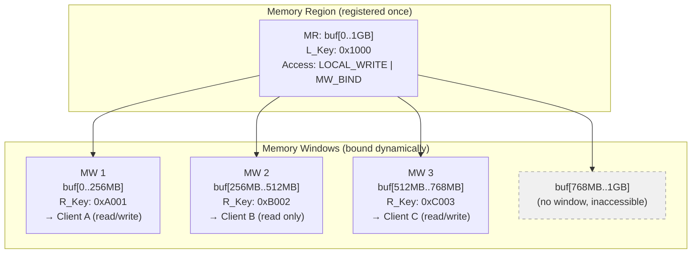
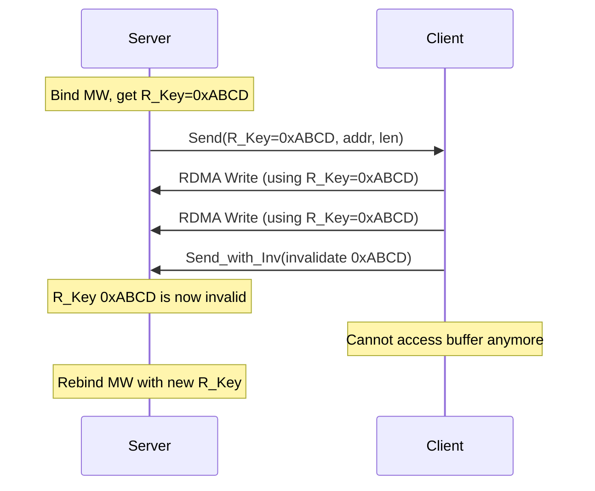

# 6.4 Memory Windows (MW)

Memory Regions provide the fundamental mechanism for making memory accessible to RDMA hardware, but they have a significant limitation: their access permissions and address range are fixed at registration time. Changing permissions requires re-registration, and each registration is expensive. **Memory Windows** address this limitation by providing a lightweight mechanism for dynamically granting and revoking remote access to sub-regions of an already-registered Memory Region.

## Motivation

Consider a storage server that manages a large data buffer. Different clients need access to different portions of this buffer at different times. Without Memory Windows, the server has two unpalatable choices:

1. **Register the entire buffer with full remote access**: This is simple but insecure. Every client can read or write any part of the buffer, even regions belonging to other clients.

2. **Register separate MRs for each client's region**: This provides isolation but requires a full `ibv_reg_mr()` / `ibv_dereg_mr()` cycle every time a client's access changes -- costing microseconds to milliseconds per change.

Memory Windows offer a third option: register the entire buffer once as a single MR with `IBV_ACCESS_MW_BIND`, then create lightweight Memory Windows that expose specific sub-regions to specific clients. Binding and unbinding a Memory Window costs a fraction of what registration costs, and each binding generates a new R_Key that can be independently invalidated.



## Memory Window Concepts

A Memory Window is a verbs object that, once **bound** to a region of an existing MR, grants remote access to that region with its own R_Key. The key concepts are:

- **A MW does not register memory**: It does not pin pages or create DMA mappings. All of that was done when the underlying MR was registered. This is why MW operations are fast.

- **A MW has its own R_Key**: Each bind operation generates a new R_Key. The remote peer uses this R_Key (not the MR's R_Key) for RDMA operations targeting the window's region.

- **A MW can be narrower than the MR**: The window can cover any contiguous sub-range of the MR. You can create multiple non-overlapping windows over a single MR, each with different access permissions and R_Keys.

- **A MW can be invalidated independently**: Invalidating a MW's R_Key revokes remote access without affecting the underlying MR or other windows bound to the same MR.

## Type 1 Memory Windows

Type 1 Memory Windows use a dedicated verb for binding:

```c
/* Allocate a Type 1 MW */
struct ibv_mw *mw = ibv_alloc_mw(pd, IBV_MW_TYPE_1);

/* Bind the MW to a region of an existing MR */
struct ibv_mw_bind bind_info = {
    .wr_id = 1,
    .send_flags = IBV_SEND_SIGNALED,
    .bind_info = {
        .mr = mr,                          /* Underlying MR */
        .addr = (uint64_t)buf + offset,    /* Start of window */
        .length = window_size,             /* Size of window */
        .mw_access_flags = IBV_ACCESS_REMOTE_READ |
                           IBV_ACCESS_REMOTE_WRITE,
    },
};

int rc = ibv_bind_mw(qp, mw, &bind_info);
```

### Type 1 Binding Semantics

- `ibv_bind_mw()` posts a special work request to the QP's Send Queue. It completes like any other send WR, generating a CQE.
- The bind operation is **serialized** with other work requests on the same QP. It is guaranteed to complete before any subsequent work request on that QP.
- The MW's R_Key is updated upon successful completion. The application reads it from `mw->rkey` after polling the completion.
- The underlying MR must have been registered with `IBV_ACCESS_MW_BIND`.

### Type 1 Invalidation

To revoke access, the application binds the MW with zero length, or deallocates it:

```c
/* Invalidate by binding with zero length */
struct ibv_mw_bind unbind = {
    .wr_id = 2,
    .send_flags = IBV_SEND_SIGNALED,
    .bind_info = {
        .mr = mr,
        .addr = 0,
        .length = 0,
        .mw_access_flags = 0,
    },
};
ibv_bind_mw(qp, mw, &unbind);

/* Or simply deallocate */
ibv_dealloc_mw(mw);
```

## Type 2 Memory Windows

Type 2 Memory Windows use the standard `ibv_post_send()` mechanism with a special opcode for binding, rather than a dedicated verb. This design has important implications for thread safety and performance.

```c
/* Allocate a Type 2 MW */
struct ibv_mw *mw = ibv_alloc_mw(pd, IBV_MW_TYPE_2);

/* Bind via post_send with IBV_WR_BIND_MW */
struct ibv_send_wr wr = {
    .wr_id = 1,
    .opcode = IBV_WR_BIND_MW,
    .send_flags = IBV_SEND_SIGNALED,
    .bind_mw = {
        .mw = mw,
        .rkey = ibv_inc_rkey(mw->rkey),  /* Must provide new rkey */
        .bind_info = {
            .mr = mr,
            .addr = (uint64_t)buf + offset,
            .length = window_size,
            .mw_access_flags = IBV_ACCESS_REMOTE_READ |
                               IBV_ACCESS_REMOTE_WRITE,
        },
    },
};

struct ibv_send_wr *bad_wr;
int rc = ibv_post_send(qp, &wr, &bad_wr);
```

### Type 2 Key Differences

**R_Key management**: With Type 2, the application explicitly provides the new R_Key value (using `ibv_inc_rkey()` to increment the variant bits). This gives the application direct control over key generation, which is useful for protocols that need to predict the R_Key before the bind completes.

**Thread safety**: Because Type 2 binds go through `ibv_post_send()`, they benefit from the same thread-safety guarantees as regular send operations. Multiple threads can post bind operations to different QPs concurrently without additional synchronization. Type 1's `ibv_bind_mw()` has weaker thread-safety guarantees in some implementations.

**Ordering with data operations**: A Type 2 bind posted to a QP is ordered with respect to other work requests on that QP. You can post a bind followed by a Send that carries the new R_Key to the remote peer, guaranteeing that the bind completes before the Send is transmitted.

```c
/* Post bind, then send the R_Key to the peer -- guaranteed ordering */
uint32_t new_rkey = ibv_inc_rkey(mw->rkey);

struct ibv_send_wr bind_wr = {
    .wr_id = 1,
    .opcode = IBV_WR_BIND_MW,
    .bind_mw = {
        .mw = mw,
        .rkey = new_rkey,
        .bind_info = { .mr = mr, .addr = addr, .length = len,
                       .mw_access_flags = IBV_ACCESS_REMOTE_WRITE },
    },
};

/* Pack the R_Key into a message for the peer */
struct rkey_msg msg = { .rkey = new_rkey, .addr = addr, .len = len };
memcpy(send_buf, &msg, sizeof(msg));

struct ibv_send_wr send_wr = {
    .wr_id = 2,
    .opcode = IBV_WR_SEND,
    .send_flags = IBV_SEND_SIGNALED,
    .sg_list = &send_sge,
    .num_sge = 1,
};

/* Chain: bind first, then send */
bind_wr.next = &send_wr;
ibv_post_send(qp, &bind_wr, &bad_wr);
```

## Invalidation

Invalidation is the mechanism for revoking the R_Key associated with a Memory Window (or MR). Once invalidated, any remote peer that attempts to use the old R_Key will receive a Remote Access Error. There are two forms:

### Local Invalidation

The application that owns the MW posts a local invalidate work request:

```c
struct ibv_send_wr inv_wr = {
    .wr_id = 3,
    .opcode = IBV_WR_LOCAL_INV,
    .send_flags = IBV_SEND_SIGNALED,
    .invalidate_rkey = mw->rkey,
};

ibv_post_send(qp, &inv_wr, &bad_wr);
```

After this completes, the R_Key is no longer valid and the MW can be rebound with a new R_Key.

### Remote Invalidation

The remote peer can invalidate the R_Key as part of a Send operation:

```c
/* Remote peer sends a message and invalidates the R_Key in one operation */
struct ibv_send_wr send_inv_wr = {
    .wr_id = 4,
    .opcode = IBV_WR_SEND_WITH_INV,
    .send_flags = IBV_SEND_SIGNALED,
    .invalidate_rkey = remote_rkey_to_invalidate,
    .sg_list = &sge,
    .num_sge = 1,
};

ibv_post_send(qp, &send_inv_wr, &bad_wr);
```

On the receiving side, the completion entry for this receive will have the `IBV_WC_WITH_INV` flag set, and the R_Key will have been automatically invalidated.

Remote invalidation is particularly powerful in request-response protocols:

1. Server binds a MW and sends the R_Key to the client.
2. Client performs RDMA Write(s) to the window.
3. Client sends a completion notification with `IBV_WR_SEND_WITH_INV`, automatically revoking its own access.
4. Server knows the client can no longer access the buffer.



## Type 1 vs Type 2: Detailed Comparison

| Feature | Type 1 MW | Type 2 MW |
|---------|-----------|-----------|
| **Bind mechanism** | `ibv_bind_mw()` (dedicated verb) | `ibv_post_send()` with `IBV_WR_BIND_MW` |
| **R_Key management** | Automatic (HCA assigns) | Manual (`ibv_inc_rkey()`) |
| **Thread safety** | Implementation-dependent | Same as `ibv_post_send()` |
| **Remote invalidation** | Not supported | Supported |
| **QP type requirement** | Any QP type | RC or UC only |
| **Ordering** | Serialized on QP | Ordered with other WRs |
| **Typical use case** | Simple access control | Protocol-integrated access management |
| **Hardware support** | Widely supported | Less universally supported |

<div class="note">

**Tip**: If your hardware supports Type 2 MWs and your protocol already uses Send/Receive for signaling, prefer Type 2. The ability to chain bind operations with data operations and to use remote invalidation makes Type 2 significantly more useful in practice.

</div>

## Memory Window Use Cases

### Temporary Buffer Access

A server allocates a result buffer, binds a MW to it, and sends the R_Key to the client. The client writes its request data directly into the buffer via RDMA Write. When done, the server invalidates the MW.

### Multi-Tenant Isolation

A storage target serves multiple initiators. Each initiator receives MWs bound to its own data regions. No initiator can access another's data, even though all regions are within the same underlying MR. When an initiator disconnects, its MWs are invalidated.

### Rolling Buffer Access

A streaming protocol uses a circular buffer. As the consumer advances, the producer rebinds the MW to the newly available region, preventing the consumer from reading data that has been overwritten.

### Fine-Grained Permission Changes

An application needs to temporarily grant write access to a buffer that is normally read-only. Instead of re-registering the MR with different access flags (expensive), it binds a MW with write permission, performs the operation, and then invalidates the MW.

## Performance Characteristics

The performance advantage of Memory Windows over MR registration/deregistration is substantial:

| Operation | Approximate Cost |
|-----------|-----------------|
| `ibv_reg_mr()` (1 MB) | 30-80 us |
| `ibv_dereg_mr()` (1 MB) | 20-60 us |
| MW bind (Type 1) | 1-3 us |
| MW bind (Type 2, via post_send) | 0.5-2 us |
| MW local invalidation | 0.5-2 us |

MW operations are cheaper because they do not involve page pinning, DMA mapping, or MTT programming. They only update a small amount of HCA-internal metadata (the window descriptor and R_Key mapping).

<div class="warning">

**Warning**: Memory Windows add complexity to your protocol design. You must carefully manage R_Key lifecycle, ensure that invalidation occurs before buffer reuse, and handle the case where a peer disconnects with an outstanding MW bound to your memory. In many applications, the simpler approach of pre-registering MRs with appropriate access flags is sufficient. Use MWs when you have a demonstrated need for dynamic access control and the performance of re-registration is inadequate.

</div>

## Practical Considerations

### Hardware Support

Not all RDMA NICs support Memory Windows, and support varies between Type 1 and Type 2. Query the device capabilities:

```c
struct ibv_device_attr attr;
ibv_query_device(ctx, &attr);

if (attr.max_mw > 0) {
    printf("Memory Windows supported, max: %d\n", attr.max_mw);
}

/* Check specific type support via device flags or trial allocation */
struct ibv_mw *mw1 = ibv_alloc_mw(pd, IBV_MW_TYPE_1);
struct ibv_mw *mw2 = ibv_alloc_mw(pd, IBV_MW_TYPE_2);
```

### Relationship to Protection Domains

A Memory Window must belong to the same Protection Domain as the MR it is bound to and the QP used for binding. Cross-PD binds are rejected by the hardware.

### Maximum Number of MWs

NICs have a finite number of MW slots (reported by `attr.max_mw`). High-density workloads (many clients, many buffers) may exhaust this limit. Plan accordingly and implement MW pooling if necessary.

### Error Handling

If a bind operation fails (e.g., due to invalid parameters or resource exhaustion), the completion will have an error status. The MW remains in its previous state (unbound or bound to the previous region). Always check completion status before using the new R_Key.
