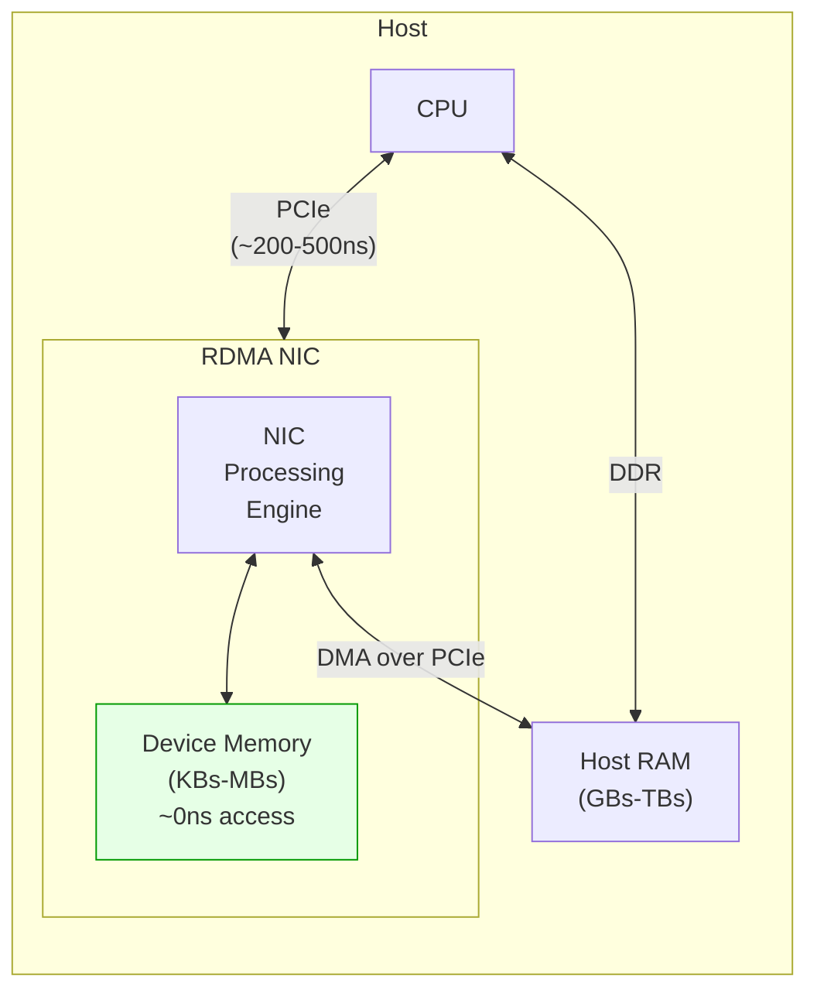

# 6.3 MR Types

The standard `ibv_reg_mr()` call described in Section 6.1 is the most common way to register memory, but it is not the only one. The verbs API supports several distinct types of Memory Regions, each designed for different use cases and offering different trade-offs in terms of flexibility, performance, and capability. This section surveys the full taxonomy of MR types available to RDMA programmers.

## Regular MR: ibv_reg_mr()

The regular Memory Region is the workhorse of RDMA memory management. It registers a contiguous range of user virtual memory with the HCA, making it available for local and remote RDMA operations.

```c
struct ibv_mr *mr = ibv_reg_mr(pd, buf, length,
                                IBV_ACCESS_LOCAL_WRITE |
                                IBV_ACCESS_REMOTE_WRITE |
                                IBV_ACCESS_REMOTE_READ);
```

**Characteristics**:
- The IO Virtual Address (IOVA) used by the NIC to address this region defaults to the user-space virtual address. When a remote peer issues an RDMA Write to address `0x7f0000400000`, the NIC translates this to the corresponding physical pages via the MTT.
- The registered region must be contiguous in virtual memory, though it may span many discontiguous physical pages.
- Access permissions are set at registration time and cannot be changed without deregistering and re-registering (or using `ibv_rereg_mr()`).

**Use cases**: This is the default choice for virtually all RDMA operations. Use it unless you have a specific reason to use one of the specialized types below.

## User MR with Explicit IOVA: ibv_reg_mr_iova()

In some scenarios, you want the NIC to address the registered memory using an IOVA that differs from the user-space virtual address. The `ibv_reg_mr_iova()` function (also accessible via `ibv_reg_mr_iova2()` in newer rdma-core versions) provides this capability:

```c
struct ibv_mr *ibv_reg_mr_iova(struct ibv_pd *pd, void *addr,
                                size_t length, uint64_t iova,
                                int access_flags);
```

The `iova` parameter specifies the address that the NIC will use. The NIC's MTT will map `iova` through `iova + length - 1` to the physical pages backing `addr` through `addr + length - 1`.

**Why would you want a different IOVA?**

1. **Address space layout independence**: Two processes may map the same shared memory segment at different virtual addresses. By using a common IOVA, a remote peer can use the same R_Key and address regardless of which process performed the registration.

2. **Zero-based addressing**: Setting `iova = 0` allows remote peers to address bytes within the region as offsets from zero, simplifying address calculations. This is equivalent to using `IBV_ACCESS_ZERO_BASED` with standard `ibv_reg_mr()`.

3. **Stable addressing across re-registrations**: If the application re-maps memory at a different virtual address (e.g., after `mremap()`), it can register the new virtual address with the same IOVA, allowing remote peers to continue using the same address without coordination.

```c
/* Register shared memory with a stable, zero-based IOVA */
void *shm = mmap(NULL, SHM_SIZE, PROT_READ | PROT_WRITE,
                  MAP_SHARED, shm_fd, 0);

struct ibv_mr *mr = ibv_reg_mr_iova(pd, shm, SHM_SIZE,
                                     0,  /* IOVA = 0 */
                                     IBV_ACCESS_LOCAL_WRITE |
                                     IBV_ACCESS_REMOTE_WRITE);
/* Remote peer can now RDMA Write to offset 42 by using address 42 */
```

<div class="note">

**Note**: Not all hardware supports arbitrary IOVA values. Some older NICs require the IOVA to be page-aligned or to match the virtual address. Check your hardware's capabilities before relying on this feature.

</div>

## Device Memory (DM): ibv_alloc_dm()

Some RDMA NICs include a small amount of on-board memory -- typically ranging from a few hundred kilobytes to a few megabytes. This **device memory** resides on the NIC itself, connected directly to the NIC's processing engines rather than sitting across the PCIe bus. Accessing device memory avoids the PCIe round trip entirely, making it ideal for latency-critical data structures.



### Allocating and Using Device Memory

```c
/* Query device memory capabilities */
struct ibv_device_attr_ex attr_ex;
ibv_query_device_ex(ctx, NULL, &attr_ex);

printf("Device memory size: %zu bytes\n",
       attr_ex.max_dm_size);

/* Allocate device memory */
struct ibv_alloc_dm_attr dm_attr = {
    .length = 4096,    /* 4 KB of device memory */
    .log_align_req = 0,
};
struct ibv_dm *dm = ibv_alloc_dm(ctx, &dm_attr);

/* Write initial data to device memory */
char init_data[4096] = {0};
ibv_memcpy_to_dm(dm, 0, init_data, sizeof(init_data));

/* Register device memory as an MR */
struct ibv_mr *dm_mr = ibv_reg_dm_mr(pd, dm, 0, 4096,
                                      IBV_ACCESS_LOCAL_WRITE |
                                      IBV_ACCESS_REMOTE_WRITE |
                                      IBV_ACCESS_REMOTE_READ |
                                      IBV_ACCESS_ZERO_BASED |
                                      IBV_ACCESS_REMOTE_ATOMIC);
```

### Device Memory Use Cases

**Atomic operation targets**: Atomic Compare-and-Swap and Fetch-and-Add operations require the NIC to read-modify-write a memory location. When the target is in host RAM, the NIC must issue PCIe read and write transactions, adding hundreds of nanoseconds. When the target is in device memory, the operation completes internally within the NIC.

**Frequently accessed small data structures**: Counters, flags, small lookup tables, and other data structures that are read or written by every RDMA operation benefit enormously from device memory placement.

**Doorbell records**: Some NIC architectures allow placing doorbell records (used to signal new work requests) in device memory, eliminating a PCIe write on every work request posting.

<div class="warning">

**Warning**: Device memory is a scarce resource -- typically only a few MB per NIC. Use it only for data that is both small and accessed with very high frequency. Do not attempt to register large buffers in device memory.

</div>

### Reading from Device Memory

```c
/* Read data back from device memory to host */
char readback[4096];
ibv_memcpy_from_dm(readback, dm, 0, sizeof(readback));

/* Clean up */
ibv_dereg_mr(dm_mr);
ibv_free_dm(dm);
```

## Physical MR (Kernel Only)

Physical Memory Regions map physical addresses directly, bypassing the virtual memory system entirely. They are available only to kernel-mode consumers (such as storage drivers using the kernel RDMA API) and cannot be created from user space.

A Physical MR allows a kernel module to register a range of physical memory -- such as a DMA buffer allocated with `dma_alloc_coherent()` or a memory-mapped device region -- for RDMA access. The NIC is given the physical addresses directly, with no virtual-to-physical translation needed.

```c
/* Kernel API -- not available from user space */
struct ib_mr *ib_get_dma_mr(struct ib_pd *pd, int access_flags);
```

The returned MR covers all of physical memory (a "global" DMA MR). This is a privileged operation because it grants the NIC access to all of system memory.

<div class="warning">

**Warning**: Physical MRs are inherently dangerous. They bypass all memory protection, allowing the NIC to read or write any physical address. They exist solely for kernel subsystems (like NVMe-oF or iSER) that need to register kernel buffers for RDMA. User-space applications must never have access to physical MRs.

</div>

## Null MR / Global MR (Historical)

Early InfiniBand implementations supported a concept sometimes called a "Null MR" or "Global MR" -- a single Memory Region that covered the entire address space, allowing RDMA operations to any address without explicit per-buffer registration. This was convenient but catastrophically insecure: it effectively disabled all memory protection.

Modern implementations have removed or severely restricted this capability. The concept survives in a limited form through:

- **Implicit ODP** (Section 6.5), which registers the entire address space but with page-fault-on-demand semantics.
- **Kernel Physical MRs**, which cover all physical memory but are restricted to kernel mode.

For user-space applications, there is no modern equivalent of a global MR. Every buffer must be explicitly registered (or covered by an ODP registration).

## MR Re-registration: ibv_rereg_mr()

Re-registration allows modifying the properties of an existing MR without the full cost of deregistering and re-registering. The function prototype is:

```c
int ibv_rereg_mr(struct ibv_mr *mr,
                 int flags,              /* What to change */
                 struct ibv_pd *pd,      /* New PD (if changing) */
                 void *addr,             /* New address (if changing) */
                 size_t length,          /* New length (if changing) */
                 int access_flags);      /* New access (if changing) */
```

The `flags` parameter specifies which properties to change:

```c
enum ibv_rereg_mr_flags {
    IBV_REREG_MR_CHANGE_TRANSLATION = (1 << 0), /* New addr/length */
    IBV_REREG_MR_CHANGE_PD          = (1 << 1), /* New Protection Domain */
    IBV_REREG_MR_CHANGE_ACCESS      = (1 << 2), /* New access flags */
};
```

### When Re-registration Is Useful

**Changing access permissions**: An application might initially register a buffer with only `IBV_ACCESS_LOCAL_WRITE` and later need to grant remote access. Re-registration avoids the full deregister/register cycle:

```c
/* Initially: local access only */
struct ibv_mr *mr = ibv_reg_mr(pd, buf, len,
                                IBV_ACCESS_LOCAL_WRITE);

/* Later: grant remote read access */
int rc = ibv_rereg_mr(mr, IBV_REREG_MR_CHANGE_ACCESS,
                       NULL, NULL, 0,
                       IBV_ACCESS_LOCAL_WRITE |
                       IBV_ACCESS_REMOTE_READ);
```

**Changing the translation**: If the application moves data to a different buffer, it can re-point the MR to the new address:

```c
/* Move MR to point to a new buffer */
void *new_buf = malloc(new_size);
int rc = ibv_rereg_mr(mr, IBV_REREG_MR_CHANGE_TRANSLATION,
                       NULL, new_buf, new_size, access_flags);
```

**Moving between Protection Domains**: In multi-tenant scenarios, an MR might need to be reassigned from one PD to another.

<div class="warning">

**Warning**: Re-registration has the same safety requirements as deregistration: no RDMA operations may be in flight on the MR during re-registration. The L_Key and R_Key may change after re-registration, so any cached copies must be updated. Check the return value -- if re-registration fails, the MR is in an undefined state and must be deregistered.

</div>

### Performance of Re-registration

Re-registration is generally faster than a full deregister/register cycle when only changing access flags or PD, because the kernel can skip page pinning and MTT programming. However, when changing the translation (address/length), the kernel must unpin old pages, pin new pages, and reprogram the MTT -- making the cost comparable to a full cycle.

| Operation | Relative Cost |
|-----------|--------------|
| Change access flags only | ~10-20% of full registration |
| Change PD only | ~10-20% of full registration |
| Change translation | ~80-100% of full registration |
| Full deregister + register | 100% (baseline) |

## Comparison of MR Types

| MR Type | Creation API | Address Space | Typical Size | Latency | User-space | Use Case |
|---------|-------------|---------------|-------------|---------|------------|----------|
| Regular MR | `ibv_reg_mr()` | User virtual | Bytes to GBs | Medium | Yes | General purpose |
| IOVA MR | `ibv_reg_mr_iova()` | User virtual, custom IOVA | Bytes to GBs | Medium | Yes | Shared memory, zero-based |
| Device Memory MR | `ibv_reg_dm_mr()` | NIC on-board | KBs | Lowest | Yes | Atomics, hot counters |
| Physical MR | `ib_get_dma_mr()` | Physical | All of RAM | Low | No (kernel) | Storage drivers |
| ODP MR | `ibv_reg_mr()` + ODP flag | User virtual | Bytes to TBs | Variable | Yes | Dynamic memory |
| Re-registered MR | `ibv_rereg_mr()` | Depends | Depends | Lower than new reg | Yes | Changing permissions |

## Choosing the Right MR Type

The decision tree for MR type selection is straightforward for most applications:

1. **Default to regular MR** (`ibv_reg_mr()`) for all standard RDMA buffers.

2. **Use Device Memory MR** for small, latency-critical data structures that are accessed by the NIC on every operation (atomic targets, counters). Verify your NIC supports device memory and that the data fits within the available capacity.

3. **Use IOVA MR** when you need address-space independence (shared memory across processes) or zero-based addressing for simpler offset calculations.

4. **Use re-registration** when you need to change access flags or PD on an existing MR and can ensure no in-flight operations.

5. **Consider ODP MR** (Section 6.5) when your application has dynamic, unpredictable memory usage patterns and the first-access latency penalty is acceptable.

6. **Physical MR** is only relevant if you are writing kernel-mode RDMA consumers (storage targets, filesystem drivers).

<div class="note">

**Note**: In practice, the vast majority of RDMA applications use only regular MRs. The specialized types exist for specific optimization scenarios. Start simple and specialize only when profiling identifies a bottleneck that a different MR type can address.

</div>
