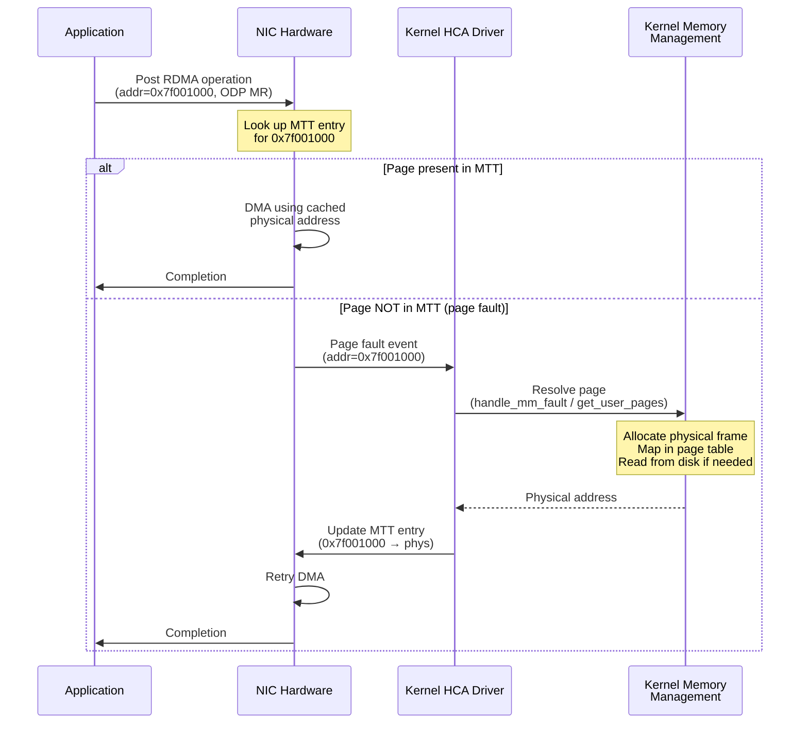

# 6.5 On-Demand Paging (ODP)

Throughout this chapter, we have treated memory registration as a prerequisite for RDMA operations: before the NIC can DMA to or from a buffer, the application must explicitly register that buffer, pinning its pages and programming the HCA's translation tables. On-Demand Paging (ODP) challenges this requirement by allowing the NIC to handle page faults transparently, much as the CPU does for ordinary memory accesses. With ODP, an application can perform RDMA operations on memory that has not been explicitly pinned -- and the hardware and kernel will cooperate to resolve the page mapping on the fly.

## Motivation

Explicit memory registration, as described in Sections 6.1 and 6.2, creates several practical challenges:

1. **Dynamic memory**: Applications that use `malloc()`, `mmap()`, or other dynamic allocation patterns cannot easily predict which buffers will be used for RDMA. Registration caches help, but they add complexity and have correctness pitfalls (stale registrations after `free()` and reallocation).

2. **Large address spaces**: Applications like databases or in-memory analytics engines may map terabytes of data, but only access a small working set at any given time. Registering the entire mapping wastes resources (pinning memory, consuming MTT entries); registering dynamically incurs overhead.

3. **Memory-mapped files**: Buffers backed by `mmap()` can be paged in and out by the kernel. Explicit registration forces all pages to be pinned, defeating the purpose of memory-mapped I/O.

4. **Integration with existing code**: Libraries and frameworks that were not designed for RDMA cannot easily be modified to pre-register their buffers. ODP allows RDMA middleware to work with arbitrary user buffers without registration overhead.

ODP addresses all of these by making registration a declaration of intent rather than a physical commitment. The application says "I may perform RDMA on this address range," and the NIC resolves physical mappings as needed.

## How ODP Works

The ODP mechanism involves cooperation between three components: the NIC hardware, the kernel RDMA driver, and the kernel's memory management subsystem.



### The Page Fault Path

1. **The application posts an RDMA operation** using a buffer covered by an ODP-enabled MR. The work request contains a virtual address and the MR's L_Key (or R_Key for remote operations).

2. **The NIC looks up the MTT** for the given virtual address. Unlike a standard MR, ODP MRs start with an empty (or partially populated) MTT.

3. **If the page is present**, the NIC proceeds with the DMA transfer normally. There is no performance penalty -- the fast path is identical to a non-ODP operation.

4. **If the page is absent (page fault)**, the NIC generates a page fault event. On modern NVIDIA/Mellanox hardware, this is delivered as a special event queue entry.

5. **The kernel driver's page fault handler** receives the event and calls into the kernel's memory management to resolve the page. This may involve:
   - Allocating a physical frame (if the page was never accessed)
   - Reading from swap (if the page was swapped out)
   - Reading from a file (if the page is file-backed via `mmap()`)
   - Handling copy-on-write (if the page is shared after `fork()`)

6. **The kernel creates a DMA mapping** for the resolved page and **programs the NIC's MTT** with the new virtual-to-physical mapping.

7. **The NIC retries the DMA** operation. This time the page is present, and the operation completes normally.

### MMU Notifiers

A critical component of ODP is the **MMU notifier** mechanism. The kernel may need to invalidate a page mapping at any time -- for example, when a page is swapped out, when the process calls `munmap()`, or when a copy-on-write fault occurs. The ODP driver registers an MMU notifier callback that the kernel invokes whenever a relevant page table entry changes:

```
Kernel MM: "Page at VA 0x7f001000 is being reclaimed"
    → MMU notifier callback → HCA driver
    → Driver removes MTT entry for 0x7f001000
    → NIC will page-fault on next access to that address
```

This ensures that the NIC's MTT always remains consistent with the process's page tables. Without MMU notifiers, the NIC could DMA to a stale physical address after the kernel reclaims or migrates the underlying page.

## Explicit ODP

Explicit ODP registers a specific address range with on-demand semantics:

```c
/* Register a specific buffer with ODP */
void *buf = malloc(BUFFER_SIZE);

struct ibv_mr *mr = ibv_reg_mr(pd, buf, BUFFER_SIZE,
                                IBV_ACCESS_LOCAL_WRITE |
                                IBV_ACCESS_REMOTE_WRITE |
                                IBV_ACCESS_REMOTE_READ |
                                IBV_ACCESS_ON_DEMAND);
```

With explicit ODP, only the specified address range is accessible for RDMA operations. The key difference from standard registration is that pages are not pinned at registration time. Instead:

- Registration completes almost instantly (no `get_user_pages()`, no DMA mapping, minimal MTT programming).
- The first RDMA operation to touch a given page incurs a page fault, adding latency.
- Subsequent accesses to the same page are fast (the MTT entry is cached).
- The kernel can reclaim pages from the ODP MR under memory pressure, and the NIC will re-fault them on next access.

<div class="note">

**Note**: Explicit ODP still requires you to specify the address range. The registration is lightweight, but you must know the buffer's address and size. For truly registration-free RDMA, see Implicit ODP below.

</div>

## Implicit ODP

Implicit ODP takes the concept further by registering the **entire virtual address space** of the process:

```c
/* Register the entire address space with implicit ODP */
struct ibv_mr *mr = ibv_reg_mr(pd, NULL, SIZE_MAX,
                                IBV_ACCESS_LOCAL_WRITE |
                                IBV_ACCESS_REMOTE_WRITE |
                                IBV_ACCESS_REMOTE_READ |
                                IBV_ACCESS_ON_DEMAND);
```

With implicit ODP, the application can use any valid virtual address in RDMA operations without per-buffer registration. This is the closest modern equivalent to the historical "global MR" concept, but with proper page fault handling rather than unsafe full-memory access.

**How it works**:
- The registration covers the entire process address space (0 to `SIZE_MAX`).
- Any RDMA operation can target any virtual address, as long as it is backed by a valid mapping (e.g., `malloc()`, `mmap()`, stack).
- The NIC page-faults and resolves each page on first access.
- The L_Key from this MR can be used in any scatter/gather entry.

```c
/* With implicit ODP, any buffer can be used directly */
struct ibv_mr *global_mr = ibv_reg_mr(pd, NULL, SIZE_MAX,
                                       IBV_ACCESS_LOCAL_WRITE |
                                       IBV_ACCESS_ON_DEMAND);

/* No per-buffer registration needed */
void *buf1 = malloc(4096);
void *buf2 = mmap(NULL, 1<<20, PROT_READ|PROT_WRITE,
                   MAP_PRIVATE|MAP_ANONYMOUS, -1, 0);

struct ibv_sge sge1 = {
    .addr = (uint64_t)buf1,
    .length = 4096,
    .lkey = global_mr->lkey,   /* Same lkey for everything */
};

struct ibv_sge sge2 = {
    .addr = (uint64_t)buf2,
    .length = 1 << 20,
    .lkey = global_mr->lkey,   /* Same lkey for everything */
};
```

<div class="warning">

**Warning**: Implicit ODP grants the NIC access to the entire process address space. Any bug that causes an RDMA operation to target an unintended address will read or write that address without a protection fault (as long as the page exists). This weakens the memory safety guarantees that explicit per-buffer registration provides. Use implicit ODP judiciously and only when the simplification it provides outweighs the reduced isolation.

</div>

## Performance Trade-offs

ODP's performance characteristics differ fundamentally from explicit registration:

### First-Access Latency (Cold Path)

The first RDMA operation to touch a page that is not in the NIC's MTT incurs a page fault. The cost of this page fault varies:

| Scenario | Approximate Latency |
|----------|-------------------|
| Page resident in RAM, not in MTT | 5-15 us |
| Page in page cache (file-backed) | 10-30 us |
| Page on swap (SSD) | 50-200 us |
| Page on swap (HDD) | 5-15 ms |
| Page never allocated (demand-zero) | 10-20 us |

Compare this to a standard RDMA Write latency of 1-2 us. The first-access penalty is significant.

### Steady-State Latency (Hot Path)

Once a page is resolved and present in the MTT, subsequent RDMA operations to that page run at full speed with no measurable overhead compared to a non-ODP MR. The NIC's internal TLB caches recently resolved translations, and the MTT lookup is identical.

### Throughput Impact

For large bulk transfers that touch many pages sequentially, the initial page fault storm can significantly reduce throughput. A 1 GB RDMA Write to a cold ODP region may need to fault in 262,144 pages (at 4 KB each), with each fault taking 5-15 us. The aggregate page fault cost could exceed one second.

### Registration Cost

ODP registrations are nearly instantaneous regardless of region size:

| Region Size | Standard Registration | ODP Registration |
|-------------|---------------------|-----------------|
| 4 KB | 5-10 us | <1 us |
| 1 MB | 30-80 us | <1 us |
| 1 GB | 5-50 ms | <1 us |
| Implicit (entire AS) | N/A | <1 us |

This is ODP's primary advantage: it trades per-operation page fault latency for near-zero registration cost.

## Prefetching with ibv_advise_mr()

To mitigate the first-access latency penalty, ODP provides a prefetch mechanism:

```c
struct ibv_sge sg_list = {
    .addr = (uint64_t)buf,
    .length = prefetch_size,
    .lkey = mr->lkey,
};

int rc = ibv_advise_mr(pd,
                        IBV_ADVISE_MR_ADVICE_PREFETCH_WRITE,
                        IB_UVERBS_ADVISE_MR_FLAG_FLUSH,
                        &sg_list,
                        1);  /* Number of SGEs */
```

`ibv_advise_mr()` proactively resolves page mappings and programs the NIC's MTT without performing an actual RDMA operation. The advice types are:

- `IBV_ADVISE_MR_ADVICE_PREFETCH`: Prefetch pages for read access.
- `IBV_ADVISE_MR_ADVICE_PREFETCH_WRITE`: Prefetch pages for write access (breaks COW if needed).
- `IBV_ADVISE_MR_ADVICE_PREFETCH_NO_FAULT`: Best-effort prefetch; does not fault in pages that are not resident.

The `IB_UVERBS_ADVISE_MR_FLAG_FLUSH` flag makes the call synchronous: it returns only after all pages have been resolved. Without this flag, the prefetch is asynchronous.

<div class="note">

**Tip**: For workloads with predictable access patterns, use `ibv_advise_mr()` to warm the MTT before the hot path begins. This combines ODP's registration flexibility with explicit registration's steady-state performance. For example, a database could prefetch pages for an index scan just before executing the scan.

</div>

## Hardware Support

ODP is not universally supported. It requires specific hardware capabilities:

```c
/* Query ODP capabilities */
struct ibv_device_attr_ex attr_ex;
ibv_query_device_ex(ctx, NULL, &attr_ex);

struct ibv_odp_caps *odp = &attr_ex.odp_caps;

if (odp->general_caps & IBV_ODP_SUPPORT) {
    printf("ODP supported\n");

    /* Check per-transport capabilities */
    if (odp->per_transport_caps.rc_odp_caps & IBV_ODP_SUPPORT_SEND)
        printf("  RC Send with ODP\n");
    if (odp->per_transport_caps.rc_odp_caps & IBV_ODP_SUPPORT_RECV)
        printf("  RC Recv with ODP\n");
    if (odp->per_transport_caps.rc_odp_caps & IBV_ODP_SUPPORT_WRITE)
        printf("  RC Write with ODP\n");
    if (odp->per_transport_caps.rc_odp_caps & IBV_ODP_SUPPORT_READ)
        printf("  RC Read with ODP\n");
    if (odp->per_transport_caps.rc_odp_caps & IBV_ODP_SUPPORT_ATOMIC)
        printf("  RC Atomic with ODP\n");
}

/* Check implicit ODP support */
if (odp->general_caps & IBV_ODP_SUPPORT_IMPLICIT)
    printf("Implicit ODP supported\n");
```

**Current hardware support** (as of ConnectX-6 and later NVIDIA NICs):
- Explicit ODP: Supported for RC transport (Send, Recv, Write, Read, Atomic).
- Implicit ODP: Supported on ConnectX-5 and later.
- UD transport: Limited or no ODP support on most hardware.
- XRC transport: Support varies by firmware version.

<div class="warning">

**Warning**: ODP support varies significantly across vendors and hardware generations. Always query capabilities at runtime and provide a fallback path using explicit registration for hardware that does not support ODP.

</div>

## ODP and fork()

The interaction between ODP and `fork()` is simpler than with standard registration:

- Standard MRs require `ibv_fork_init()` or `RDMAV_FORK_SAFE` to handle copy-on-write correctly after `fork()`. This is because pinned pages cannot be COW-split without invalidating the NIC's DMA addresses.

- ODP MRs handle `fork()` naturally. Because ODP uses MMU notifiers, the kernel notifies the driver when a COW fault splits a page. The driver invalidates the stale MTT entry, and the NIC re-faults to the new physical page on the next access.

This makes ODP particularly attractive for applications that `fork()` child processes (e.g., for monitoring, logging, or snapshot operations).

## Limitations

Despite its advantages, ODP has several limitations:

### Not All Operations Are Supported

Depending on hardware, certain RDMA operations may not support ODP. For example, some NICs do not support ODP with:
- UD transport
- Multicast
- Memory Windows
- Certain inline data configurations

### Page Fault Storms

A burst of RDMA operations to cold pages can overwhelm the page fault handler. The kernel processes page faults sequentially (or with limited parallelism), creating a bottleneck. Large scatter/gather lists to unmapped pages are particularly problematic.

### Interaction with Huge Pages

ODP with huge pages works but requires careful configuration. If a 2 MB huge page is partially faulted, the NIC may need to fault the entire huge page, which is more expensive than faulting a single 4 KB page. The MTT granularity must also match the page size.

### Memory Overhead

The NIC must maintain data structures for ODP page tracking, including a page fault event queue and an extended MTT. This consumes NIC memory that could otherwise be used for other resources (QPs, CQs, standard MRs).

### Latency Unpredictability

ODP introduces non-deterministic latency: most operations complete in microseconds, but occasionally one takes tens of microseconds (or more, if pages are on swap). For latency-sensitive applications with strict tail-latency requirements, this unpredictability may be unacceptable.

## When to Use ODP vs. Explicit Registration

The choice between ODP and explicit registration depends on your workload characteristics:

| Factor | Prefer Explicit Registration | Prefer ODP |
|--------|------------------------------|------------|
| **Memory pattern** | Static, predictable | Dynamic, unpredictable |
| **Latency requirements** | Strict, deterministic | Tolerant of occasional spikes |
| **Buffer lifetime** | Long-lived, reused | Short-lived, one-shot |
| **Memory size** | Moderate (fits in RAM) | Very large (exceeds practical pin limits) |
| **Code integration** | RDMA-aware code | Legacy or third-party code |
| **fork() usage** | No forking | Forks child processes |
| **Registration frequency** | Low (pre-register) | High (many distinct buffers) |

**Use explicit registration when**:
- You have a fixed pool of buffers allocated at startup.
- You need deterministic, predictable latency.
- Your workload re-uses the same buffers repeatedly.
- You can afford the pinned memory overhead.

**Use ODP when**:
- Your application dynamically allocates buffers of varying sizes.
- You need to RDMA to/from memory-mapped files.
- Registration overhead dominates your workload (e.g., many small, short-lived transfers).
- You want to simplify your code by eliminating per-buffer registration tracking.
- You use `fork()` and cannot tolerate the limitations of `ibv_fork_init()`.

**Use ODP with prefetch when**:
- You want ODP's flexibility but can predict access patterns slightly ahead of time.
- You have a mixed workload: mostly predictable, with occasional dynamic buffers.

<div class="note">

**Note**: ODP and explicit registration are not mutually exclusive. A single application can use both: explicitly register hot-path buffers for deterministic performance, and use ODP for cold-path or dynamic buffers. This hybrid approach combines the strengths of both mechanisms.

</div>

## Summary

On-Demand Paging transforms memory registration from a heavy, synchronous operation into a lightweight declaration with deferred cost. By leveraging the NIC's ability to handle page faults and the kernel's MMU notifier mechanism, ODP eliminates the need to pin pages at registration time, enables RDMA on dynamically allocated and memory-mapped buffers, and simplifies `fork()` handling. The trade-off is latency unpredictability on first access to each page. For workloads where registration overhead or memory pinning is a bottleneck, and where occasional page fault latency is acceptable, ODP is a powerful tool. For latency-critical workloads with static buffer pools, explicit registration remains the better choice. Understanding both mechanisms and their trade-offs allows you to make the right decision for your specific application.
