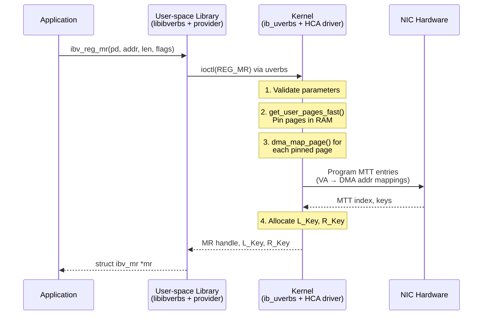

# 6.1 Memory Registration Deep Dive

Memory registration is the process by which an application declares a region of its address space to the RDMA hardware, transforming an ordinary virtual memory buffer into something that a NIC can directly read from and write to via DMA. It is one of the most frequently called verbs operations, and one of the most expensive. Understanding exactly what happens inside `ibv_reg_mr()` -- and how to manage its cost -- is essential knowledge for any RDMA developer.

## The Registration API

At the verbs API level, memory registration is straightforward:

```c
struct ibv_mr *ibv_reg_mr(struct ibv_pd *pd, void *addr,
                          size_t length, int access_flags);
```

The application provides a Protection Domain, a virtual address and length, and a set of access flags. The function returns a pointer to an `ibv_mr` structure containing, among other fields, the **L_Key** (Local Key) and **R_Key** (Remote Key) that the application will use in subsequent work requests. The L_Key is used in scatter/gather entries for local operations; the R_Key is communicated to remote peers to authorize RDMA Read and Write access.

But this simple API surface conceals a multi-layered process that spans user space, the kernel, and the NIC hardware itself. Let us trace each step.

## Step-by-Step: What ibv_reg_mr() Actually Does



### Step 1: User-Space Library Processing

When your application calls `ibv_reg_mr()`, it first enters the libibverbs user-space library. This library identifies the correct provider (the vendor-specific driver, such as `mlx5` for NVIDIA/Mellanox hardware) and prepares the registration request. In modern rdma-core implementations, the library constructs a command buffer and issues a `write()` or `ioctl()` system call to the `/dev/infiniband/uverbsN` character device. This is one of the few moments in an RDMA application's hot path where a system call occurs -- and it is precisely why registration is expensive.

### Step 2: Kernel Validation and Page Pinning

The kernel's `ib_uverbs` module receives the request and performs validation: checking that the Protection Domain is valid, that the access flags are legal, and that the requested memory range is within the process's address space. It then calls `get_user_pages_fast()` (or its variant `pin_user_pages()` in newer kernels) to **pin** every physical page backing the virtual address range.

Pinning is the critical operation. It does two things:

1. **Faults in all pages**: If any pages in the range are not yet backed by physical memory (e.g., because the application used `malloc()` and hasn't touched the pages yet), the kernel allocates physical frames and establishes the page table mappings.

2. **Prevents reclamation**: The kernel increments a reference count on each page, ensuring that the page cannot be swapped out, migrated, or reclaimed by the memory management subsystem for the duration of the registration.

For a 1 GB buffer with 4 KB pages, this means pinning 262,144 individual pages -- a non-trivial operation.

### Step 3: DMA Mapping

With the pages pinned, the kernel creates DMA mappings by calling `dma_map_page()` (or `dma_map_sg()` for scatter/gather lists) for each page. This step translates kernel physical addresses into bus addresses that the NIC's DMA engine can use. On systems with an IOMMU (Intel VT-d, AMD-Vi), this step programs the IOMMU page tables, adding another layer of address translation. On systems without an IOMMU, bus addresses typically equal physical addresses and this step is lightweight.

### Step 4: Programming the HCA Page Tables (MTT)

The kernel's HCA driver now programs the NIC's internal **Memory Translation Table (MTT)**. The MTT is a hardware data structure inside the NIC that maps virtual addresses (or IO virtual addresses) to DMA/bus addresses. Each entry in the MTT corresponds to a page of registered memory. The NIC uses this table on every RDMA operation to translate the virtual address in a work request into the physical address needed for DMA.

The driver also allocates a **Memory Region context** in the HCA, which stores metadata including the base address, length, access permissions, and the L_Key and R_Key values. These keys are indices (with a validity suffix) into the HCA's internal MR table.

### Step 5: Return to User Space

The kernel returns the MR handle, L_Key, and R_Key to the user-space library, which populates the `ibv_mr` structure and returns it to the application. The application can now use `mr->lkey` in scatter/gather entries and communicate `mr->rkey` to remote peers.

## Cost Analysis

Memory registration is expensive relative to other RDMA operations. While an RDMA Write can complete in 1-2 microseconds, registering a memory region takes significantly longer:

| Buffer Size | Approximate Registration Time |
|-------------|-------------------------------|
| 4 KB (1 page) | 5-10 us |
| 64 KB | 10-20 us |
| 1 MB | 30-80 us |
| 1 GB | 5-50 ms |
| 16 GB | 50-500 ms |

These numbers vary substantially by hardware, kernel version, IOMMU configuration, and system load. The cost has three major components:

1. **System call overhead**: The transition to kernel mode and back costs 1-2 us minimum.
2. **Page pinning**: `get_user_pages_fast()` must walk page tables and potentially fault in pages. This scales linearly with the number of pages.
3. **HCA programming**: Writing MTT entries to the NIC involves PCIe transactions. Some NICs support bulk MTT writes; others require per-entry programming.

<div class="warning">

**Warning**: Never call `ibv_reg_mr()` in a latency-sensitive path. A single registration of a large buffer can stall your application for milliseconds. Pre-register all buffers during initialization, or use a registration cache.

</div>

## Access Flags

The `access_flags` parameter controls what operations are permitted on the registered region:

```c
enum ibv_access_flags {
    IBV_ACCESS_LOCAL_WRITE   = 1,       /* Allow local writes (receives, local RDMA) */
    IBV_ACCESS_REMOTE_WRITE  = (1 << 1), /* Allow remote RDMA Write */
    IBV_ACCESS_REMOTE_READ   = (1 << 2), /* Allow remote RDMA Read */
    IBV_ACCESS_REMOTE_ATOMIC = (1 << 3), /* Allow remote atomic operations */
    IBV_ACCESS_MW_BIND       = (1 << 4), /* Allow Memory Window binding */
    IBV_ACCESS_ZERO_BASED    = (1 << 5), /* Use zero-based addressing */
    IBV_ACCESS_ON_DEMAND     = (1 << 6), /* On-Demand Paging (see Section 6.5) */
    IBV_ACCESS_HUGETLB       = (1 << 7), /* Region is backed by huge pages */
    IBV_ACCESS_RELAXED_ORDERING = (1 << 20), /* Allow relaxed PCIe ordering */
};
```

A few critical rules:

- **`IBV_ACCESS_LOCAL_WRITE` is required if the NIC will write to the buffer**: This includes receive buffers, RDMA Write targets, and atomic targets. If you forget this flag on a receive buffer, the NIC will fail the operation with a protection error.
- **Remote access flags require `IBV_ACCESS_LOCAL_WRITE`**: You cannot grant remote write or atomic access without also allowing local writes.
- **`IBV_ACCESS_REMOTE_READ` requires explicit opt-in**: By default, a registered MR is not remotely readable. The application must consciously grant this access.
- **`IBV_ACCESS_RELAXED_ORDERING`** tells the NIC it may reorder PCIe transactions for higher throughput, at the cost of weaker ordering guarantees. This is useful for large bulk transfers where order does not matter.

<div class="note">

**Note**: The principle of least privilege applies to RDMA access flags. Only grant the minimum access required. Granting `IBV_ACCESS_REMOTE_WRITE | IBV_ACCESS_REMOTE_READ` to a buffer that will only be used for sends creates an unnecessary attack surface.

</div>

## Registration Caching Strategies

Because registration is expensive, production RDMA applications rarely register and deregister buffers on every operation. Instead, they employ one or more strategies to amortize the cost.

### Pre-Registration

The simplest strategy: allocate all buffers at startup, register them once, and reuse them for the lifetime of the application. This works well for applications with predictable, static memory usage patterns -- for example, a key-value store with a fixed-size slab allocator.

```c
/* During initialization */
void *buf = malloc(BUFFER_POOL_SIZE);
struct ibv_mr *mr = ibv_reg_mr(pd, buf, BUFFER_POOL_SIZE,
                                IBV_ACCESS_LOCAL_WRITE |
                                IBV_ACCESS_REMOTE_WRITE |
                                IBV_ACCESS_REMOTE_READ);
/* Use buf + offsets for all RDMA operations */
```

The disadvantage is inflexibility: the application must know its maximum memory usage at startup and cannot dynamically grow its registered memory.

### MR Cache (Registration Cache)

A registration cache maintains a mapping from (virtual address, length) to MR handles. When the application needs to register a buffer, it first checks the cache. If the buffer (or a superset of it) is already registered, the cached MR is returned immediately. If not, a new registration is performed and cached for future use.

This pattern is widely used in middleware such as MPI implementations (Open MPI, MVAPICH2) and UCX, where the middleware has no control over which buffers the application passes to communication routines.

```c
struct ibv_mr *get_or_register(struct mr_cache *cache,
                                struct ibv_pd *pd,
                                void *addr, size_t len, int flags) {
    struct ibv_mr *mr = mr_cache_lookup(cache, addr, len);
    if (mr) return mr;

    mr = ibv_reg_mr(pd, addr, len, flags);
    if (mr) mr_cache_insert(cache, addr, len, mr);
    return mr;
}
```

<div class="warning">

**Warning**: Registration caches must handle memory deallocation carefully. If the application frees a buffer and reallocates new memory at the same virtual address, the cached registration points to stale physical pages. MPI implementations use mechanisms like `munmap` interposition (via `LD_PRELOAD`) or `userfaultfd` to detect when registered memory is freed.

</div>

### Lazy Deregistration

Rather than deregistering MRs immediately when they are no longer needed, lazy deregistration defers the `ibv_dereg_mr()` call. The MR is placed in a free list and reused if a future registration request matches the same memory region. Deregistration only occurs when the free list exceeds a configured size or when memory pressure demands it.

### MR Pools

An MR pool pre-allocates a large contiguous region and manages sub-allocations within it:

```c
struct mr_pool {
    void *base;
    size_t total_size;
    struct ibv_mr *mr;       /* Single registration covers entire pool */
    /* Free-list or bitmap for sub-allocation */
};

void *mr_pool_alloc(struct mr_pool *pool, size_t size) {
    /* Return pointer within the pre-registered region */
    /* The caller can use pool->mr->lkey for all allocations */
}
```

This approach is extremely efficient: a single registration covers the entire pool, and individual allocations require no registration at all. The trade-off is that the application must use the pool's allocator rather than `malloc()`, and the total pool size must be determined in advance.

## Deregistration: ibv_dereg_mr()

Deregistration reverses the registration process:

```c
int ibv_dereg_mr(struct ibv_mr *mr);
```

Internally, the kernel:

1. Removes the MTT entries from the HCA.
2. Invalidates the L_Key and R_Key.
3. Calls `dma_unmap_page()` for each page.
4. Calls `unpin_user_pages()` (or `put_user_pages()`) to release the pin on each physical page.

<div class="warning">

**Warning**: You must ensure that no RDMA operations are in flight on the MR when you deregister it. If the NIC attempts to DMA to/from a deregistered MR, the behavior is undefined -- it may silently corrupt memory, generate a fatal error, or crash the NIC. Always drain all CQs and ensure all posted work requests have completed before calling `ibv_dereg_mr()`.

</div>

The safest pattern for teardown is:

```c
/* 1. Transition QPs to Error state to flush outstanding WRs */
struct ibv_qp_attr attr = { .qp_state = IBV_QPS_ERR };
ibv_modify_qp(qp, &attr, IBV_QP_STATE);

/* 2. Poll CQ until all WRs are flushed (will complete with error status) */
while (outstanding_wrs > 0) {
    int n = ibv_poll_cq(cq, batch_size, wc_array);
    outstanding_wrs -= n;
}

/* 3. Now safe to deregister */
ibv_dereg_mr(mr);
```

## Keys: L_Key and R_Key

The L_Key and R_Key deserve closer examination. Both are 32-bit values, but they serve different purposes:

- **L_Key (Local Key)**: Used in scatter/gather entries (`struct ibv_sge`) to identify the MR for local operations. The NIC uses the L_Key to look up the MTT and verify that the operation is permitted.

- **R_Key (Remote Key)**: Communicated to a remote peer (typically via a Send message during connection setup). The remote peer includes the R_Key in RDMA Read or Write work requests to prove it has been authorized to access the memory.

Both keys contain an index portion (used to look up the MR in the HCA's table) and a variant portion (a small counter that changes with each registration, preventing stale keys from matching). The exact format is hardware-specific.

<div class="note">

**Note**: The R_Key is a capability: anyone who possesses it can read from or write to the registered memory (subject to the access flags). Treat R_Keys as secrets. Do not log them, broadcast them, or store them in world-readable locations. See Chapter 16 for a full discussion of RDMA security.

</div>

## Summary

Memory registration is the bridge between the virtual memory world of applications and the physical memory world of DMA-capable hardware. It is a complex, multi-step process involving system calls, page pinning, DMA mapping, and HCA programming. Its cost is significant -- microseconds for small buffers, milliseconds for large ones -- and managing that cost through pre-registration, caching, pooling, and careful lifecycle management is one of the core disciplines of RDMA programming. In the next section, we examine the page pinning mechanism in greater detail and its implications for system administration.
