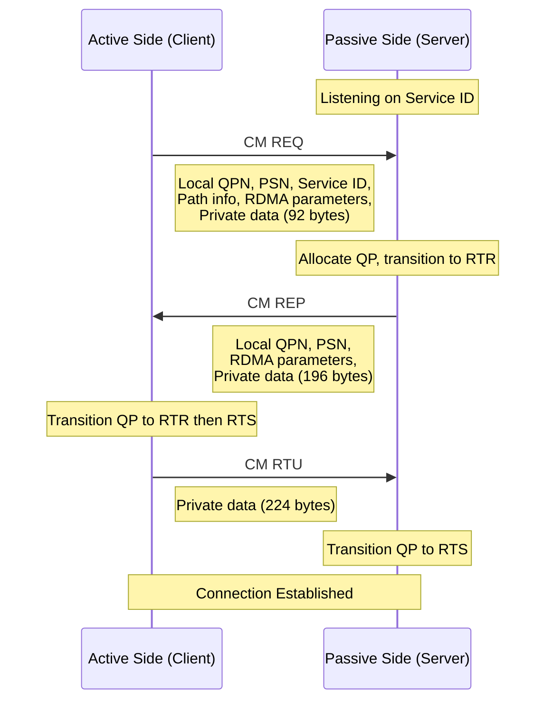

## 7.2 Communication Manager (CM)

In Section 7.1, we examined the QP state machine and the `ibv_modify_qp()` calls needed to walk a QP from RESET to RTS. A critical problem was left unaddressed: how do two nodes exchange the endpoint information -- QP numbers, LIDs, GIDs, PSNs -- required for the INIT-to-RTR transition? The QP state machine is purely local. It tells the hardware about the remote peer, but it provides no mechanism for *discovering* or *communicating with* that peer.

The InfiniBand Communication Manager (CM) solves this problem. The CM is a kernel-level protocol that enables nodes to establish, manage, and tear down connections using a well-defined message exchange carried over the InfiniBand fabric itself. It automates the metadata exchange that would otherwise require an out-of-band channel (such as a TCP socket), and it provides additional services including service discovery, alternate path negotiation, and graceful disconnection.

### CM Architecture

The Communication Manager operates over **Management Datagrams (MADs)**, which are special InfiniBand packets sent and received on **QP1** -- a dedicated Queue Pair that every InfiniBand port maintains for management traffic. QP1 is a UD (Unreliable Datagram) QP that is set up by the Subnet Manager during fabric initialization. Because QP1 is unreliable, the CM implements its own reliability mechanisms: timeouts, retransmissions, and sequence tracking.

The CM protocol is defined in the InfiniBand Architecture Specification (Volume 1, Chapter 12). It supports several connection models:

- **RC (Reliable Connected)** connections: full three-way handshake
- **UC (Unreliable Connected)** connections: same handshake, but with UC transport semantics
- **UD (Unreliable Datagram)** service resolution: SIDR protocol for resolving service IDs to QP numbers
- **XRC (eXtended Reliable Connected)**: extended connection model sharing transport resources

The CM maintains state machines for both the active side (initiator/client) and the passive side (responder/server) of a connection, and generates events that applications or upper-layer protocols consume through the kernel's CM interface or through user-space wrappers like `rdma_cm`.

### The Three-Way Handshake: REQ, REP, RTU

Connection establishment for RC and UC transport types uses a three-way handshake that is conceptually similar to TCP's SYN/SYN-ACK/ACK, but carries far more information. The exchange is illustrated below:



#### CM REQ (Connection Request)

The active side initiates a connection by sending a CM REQ message. This message contains all the information the passive side needs to set up its end of the connection:

- **Local Communication ID (Local COMID):** A unique identifier for this connection on the active side, used to correlate subsequent messages.
- **Service ID:** A 64-bit identifier that selects the target service on the passive side. Service IDs function like TCP port numbers -- the passive side registers interest in a specific Service ID, and incoming REQ messages are routed to the appropriate handler. Well-known Service IDs are defined in the IB spec; applications typically define their own in the upper 48 bits.
- **Local QPN:** The active side's QP number.
- **Starting PSN:** The PSN the active side will use for its first send packet.
- **Responder Resources:** The number of outstanding RDMA Read/Atomic operations the active side can accept (maps to `max_dest_rd_atomic`).
- **Initiator Depth:** The number of outstanding outgoing RDMA Read/Atomic operations (maps to `max_rd_atomic`).
- **Primary Path:** Complete path information including the source and destination LID/GID, service level, MTU, hop limit, and traffic class.
- **Alternate Path (optional):** A secondary path for Automatic Path Migration.
- **Retry Count and RNR Retry Count:** Transport-level retry parameters.
- **Private Data:** Up to 92 bytes of application-defined data. This is the application's opportunity to exchange protocol-level information during connection setup -- for example, a version identifier, capability flags, or memory region keys.

The CM REQ message is transmitted as a MAD on QP1. Because QP1 uses UD transport, the CM implements its own reliability: if no REP is received within a configurable timeout, the REQ is retransmitted. The timeout and maximum retry count are specified in the REQ message itself.

#### CM REP (Connection Reply)

Upon receiving a REQ, the passive side's CM generates an event for the application (or kernel-level consumer). The application examines the REQ parameters and private data, decides whether to accept the connection, and if so, allocates a QP and provides its own parameters. The CM then sends a REP message containing:

- **Remote Communication ID:** Echoes the active side's Local COMID.
- **Local Communication ID:** The passive side's unique identifier for this connection.
- **Local QPN:** The passive side's QP number.
- **Starting PSN:** The PSN the passive side will use for its first send packet.
- **Responder Resources and Initiator Depth:** The passive side's RDMA Read/Atomic capabilities, which must be compatible with the active side's request.
- **Private Data:** Up to 196 bytes of application-defined data. The asymmetry in private data sizes (92 for REQ, 196 for REP) reflects the fact that the server often needs to communicate more setup information (such as memory region keys and addresses for RDMA operations) than the client.

When the passive side sends the REP, its QP should already be in the RTR state -- it has all the information it needs from the REQ to complete the RESET -> INIT -> RTR transitions. The QP is ready to receive data but not yet ready to send.

#### CM RTU (Ready to Use)

The active side receives the REP, extracts the passive side's QP number and PSN, transitions its own QP through INIT -> RTR -> RTS, and sends the RTU message. The RTU is essentially an acknowledgment that the active side has processed the REP and is ready for data transfer. It carries up to 224 bytes of private data, though this is rarely used.

Upon receiving the RTU, the passive side transitions its QP from RTR to RTS. Both sides are now in the RTS state, and data transfer can begin.

<div class="note">

**Note on Timing:** There is an inherent asymmetry in the handshake. After sending the REP, the passive side's QP is in RTR -- it can *receive* packets but cannot yet *send*. The active side reaches RTS first (upon receiving the REP) and may begin sending data immediately. The passive side only reaches RTS after receiving the RTU. This means the active side should not expect immediate responses from the passive side -- there is a brief window where data can flow only from active to passive. Well-designed protocols account for this by having the active side send first, or by using the RTU's private data to signal readiness.

</div>

### Connection Rejection

The passive side may reject a connection request by sending a CM REJ (Reject) message instead of a REP. The REJ includes a reason code and up to 148 bytes of additional rejection information (ARI -- Additional Rejection Information) plus 196 bytes of private data. Common rejection reasons include:

- **Consumer Reject:** The application decided not to accept the connection. The private data may contain an application-specific reason.
- **Invalid Service ID:** No listener registered for the requested Service ID.
- **Stale Connection:** The connection request refers to a stale or already-destroyed connection.
- **Invalid Communication Instance:** The QP or CM state is inconsistent.

### Disconnection: DREQ and DREP

Graceful disconnection follows a two-way handshake:

```c
/* Disconnect sequence */
/* Active side: */
/*   sends CM DREQ (Disconnect Request) */
/*   includes up to 220 bytes private data */

/* Passive side: */
/*   receives DREQ event */
/*   sends CM DREP (Disconnect Reply) */
/*   includes up to 224 bytes private data */
```

Either side can initiate the disconnect. The DREQ sender waits for the DREP; if it times out, the disconnect is considered complete anyway (the remote side may have crashed). After the DREQ/DREP exchange, both sides transition their QPs to ERROR and clean up resources.

<div class="warning">

**Warning:** The CM does not automatically transition QPs to ERROR upon disconnect. The application must handle the disconnect event and explicitly tear down the QP. Failing to do so leaves the QP in RTS state, consuming NIC resources, potentially processing stale retransmissions, and leaking memory.

</div>

### Service IDs and Service Registration

Service IDs are 64-bit values that identify a service on the passive side. They are conceptually equivalent to TCP port numbers but with a much larger namespace. The InfiniBand specification defines a structure for Service IDs:

- **Bits 63-60:** Format type (0 for general services)
- **Bits 59-0:** Service-specific identifier

In practice, applications choose Service IDs by convention or configuration. The passive side registers a Service ID with the CM, indicating willingness to accept connections for that service:

```c
/* Kernel CM API (simplified) */
struct ib_cm_id *cm_id;
ib_cm_listen(cm_id, service_id, 0);  /* 0 = exact match */

/* User-space via RDMA_CM (see Section 7.3) */
struct rdma_cm_id *id;
struct sockaddr_in addr = {
    .sin_family = AF_INET,
    .sin_port   = htons(20886),    /* Port used to derive Service ID */
    .sin_addr   = { .s_addr = INADDR_ANY },
};
rdma_bind_addr(id, (struct sockaddr *)&addr);
rdma_listen(id, backlog);
```

The RDMA_CM library (Section 7.3) maps IP addresses and port numbers to Service IDs, making the service registration feel more like traditional socket programming.

### SIDR: Service ID Resolution for UD

Unreliable Datagram QPs are connectionless -- they do not go through the REQ/REP/RTU handshake. But a client still needs to discover the server's QP number and Q-Key before it can send UD messages. The CM provides the **SIDR (Service ID Resolution)** protocol for this purpose:

1. The client sends a **SIDR_REQ** to the server, specifying the desired Service ID and up to 216 bytes of private data.
2. The server responds with a **SIDR_REP** containing its QP number, Q-Key, and up to 136 bytes of private data.
3. The client creates an Address Handle and can now send UD messages to the server's QP.

SIDR is a simple request-response protocol with no connection state -- it is purely a discovery mechanism.

### Alternate Path: LAP and APR

InfiniBand supports **Automatic Path Migration (APM)**, a hardware-level mechanism for failover between a primary and alternate network path. The CM facilitates alternate path setup through the **LAP (Load Alternate Path)** and **APR (Alternate Path Response)** messages:

1. Either side sends a LAP message proposing an alternate path (different LID, different SL, or different port).
2. The receiving side evaluates the proposed path, and responds with an APR indicating acceptance or rejection.
3. If accepted, the alternate path is programmed into the QP through `ibv_modify_qp()` (typically requiring the SQD transition from RTS).
4. If the primary path fails, the hardware automatically switches to the alternate path and generates an `IBV_EVENT_PATH_MIG` async event.

APM is transparent to the data path -- the application does not need to take any action for the failover to occur. However, setting up the alternate path and monitoring path migration events requires application awareness.

### Retry and Timeout Mechanisms

The CM's own reliability is independent of the transport reliability of the data QPs. Since CM messages travel on QP1 (UD), which provides no delivery guarantees, the CM implements:

- **REQ retransmission:** If no REP is received within the timeout, the REQ is resent. The timeout and retry count are specified in the REQ message (encoded as a power-of-two multiplier of base timeout). Typical configurations allow 15-20 retries with exponential backoff.
- **REP retransmission:** If no RTU is received within the timeout, the REP is resent. The passive side retains the connection state in a "REP sent" state until the RTU arrives or the retry limit is exhausted.
- **DREQ retransmission:** If no DREP is received, the DREQ is resent. After the retry limit, the disconnect is considered complete unilaterally.
- **Duplicate detection:** Each CM message carries a communication ID and transaction ID. Duplicate messages (from retransmissions that arrive after the original was already processed) are detected and handled idempotently.

### CM Interaction with QP State

The CM protocol and the QP state machine interact in a specific sequence:

| Event | Active Side QP State | Passive Side QP State |
|-------|--------------------|-----------------------|
| Before REQ sent | RESET or INIT | RESET |
| REQ sent | INIT | RESET |
| REQ received | INIT | RESET -> INIT -> RTR |
| REP sent | INIT | RTR |
| REP received | INIT -> RTR -> RTS | RTR |
| RTU sent | RTS | RTR |
| RTU received | RTS | RTR -> RTS |

The passive side reaches RTR when it sends the REP (before the REP is even received by the active side). The active side reaches RTS when it receives the REP. The passive side only reaches RTS after receiving the RTU. This means there is a brief period where the active side can send data that the passive side can receive, but the passive side cannot yet send.

<div class="tip">

**Tip:** In high-performance applications that need to minimize connection setup latency, the active side can begin posting RDMA Write operations immediately after sending the RTU, without waiting for the passive side to confirm readiness. Since RDMA Write is one-sided and does not require a posted receive buffer on the remote side, the writes will be processed as soon as the passive side's QP reaches RTR. The passive side will see the data appear in memory once it transitions to RTS and begins checking.

</div>

### Using the CM Directly vs. RDMA_CM

The kernel CM API (`ib_cm_*` functions) provides the most control over connection management but requires kernel-mode programming or the use of low-level user-space wrappers through `/dev/infiniband/ucmX` device files. For most applications, the **RDMA_CM** library (Section 7.3) provides a far more convenient interface that wraps the CM protocol in a user-space event-driven API. The RDMA_CM handles QP state transitions automatically, maps between IP addresses and InfiniBand paths, and presents a programming model familiar to socket developers.

Direct CM usage is appropriate for kernel-level protocols (like NFS over RDMA or iSER), for applications that need fine-grained control over CM parameters (custom retry policies, alternate path setup), or for specialized scenarios where the RDMA_CM's abstractions are insufficient. For user-space applications, the RDMA_CM is almost always the right choice.
