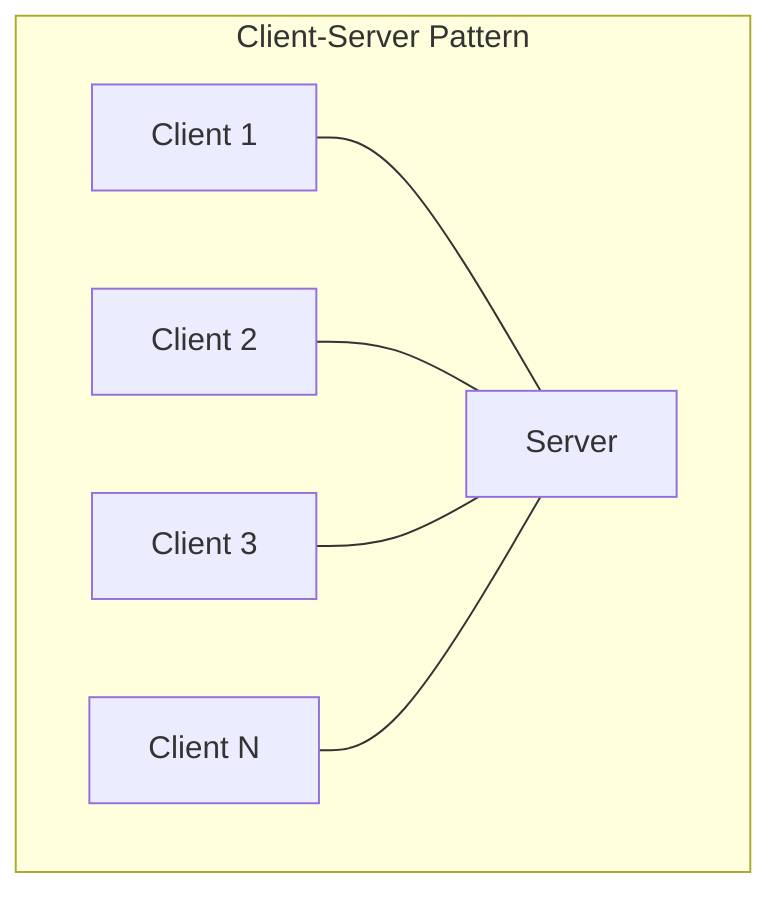
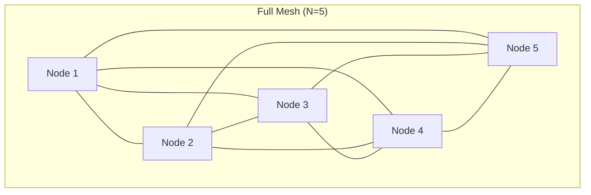
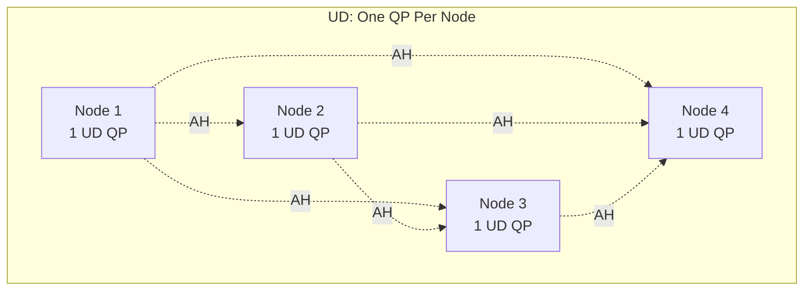
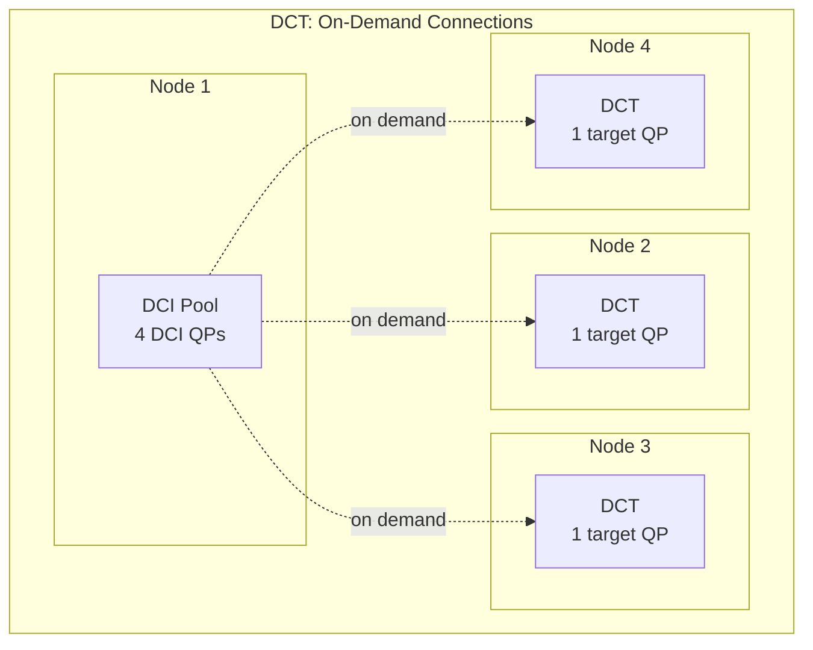
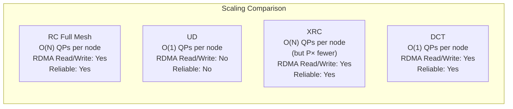

## 7.4 Connection Patterns

The previous sections covered the mechanics of establishing a single RDMA connection: walking the QP state machine, exchanging metadata through the Communication Manager, and using the RDMA_CM to simplify the process. In production systems, the challenge is not establishing one connection -- it is establishing thousands of connections efficiently, managing them at scale, and choosing the right topology for the workload. This section examines the architectural patterns for RDMA connectivity, the scaling problems that arise as clusters grow, and the transport-level solutions the InfiniBand architecture provides.

### Client-Server: The Simple Case

The simplest connection pattern is client-server, where multiple clients connect to a single server. Each client maintains one RC QP to the server, and the server maintains one RC QP per client. This is the pattern used by storage protocols like NFS over RDMA (NFS-RDMA) and iSER (iSCSI Extensions for RDMA), and by key-value stores like memcached-rdma.



The resource consumption on the server side is linear: N clients require N QPs, each consuming NIC memory for send/receive queue entries, PSN tracking, and retransmission buffers. For moderate-scale deployments (hundreds of clients), this is perfectly manageable. A modern ConnectX HCA can support hundreds of thousands of QPs, though the active working set in NIC cache is much smaller (typically a few thousand). QPs that are not actively sending or receiving data are paged out to host memory by the NIC's internal memory management, incurring a page-in latency (typically 1-5 microseconds) when they become active again.

### Full Mesh: The N-Squared Problem

Many distributed computing workloads require any-to-any communication. MPI (Message Passing Interface) programs, distributed databases, consensus protocols, and distributed training frameworks all need every node to communicate directly with every other node. The natural approach with RC transport is to create a full mesh: each node maintains a dedicated QP for every other node.



With N nodes, the total number of connections in a full mesh is N*(N-1)/2, and each node maintains N-1 QPs. This quadratic scaling becomes a serious problem at cluster scale:

| Cluster Size (N) | QPs per Node | Total Connections | NIC Memory per Node (est.) |
|:-:|:-:|:-:|:-:|
| 10 | 9 | 45 | ~0.5 MB |
| 100 | 99 | 4,950 | ~5 MB |
| 1,000 | 999 | 499,500 | ~50 MB |
| 10,000 | 9,999 | 49,995,000 | ~500 MB |
| 100,000 | 99,999 | ~5 billion | ~5 GB |

The memory estimates assume approximately 500 bytes of NIC memory per QP for the QP context (queue state, PSN tracking, path information) plus the send and receive queue entries. The actual numbers vary by hardware generation and configuration, but the trend is clear: at 10,000 nodes, each NIC needs to store context for 10,000 QPs, and at 100,000 nodes, the per-node QP memory alone exceeds the NIC's on-board memory capacity.

But memory is only part of the problem. Additional costs include:

- **Connection establishment time:** Even with parallel connection setup, establishing 10,000 CM handshakes takes seconds.
- **Receive buffer memory:** Each RC QP needs posted receive buffers. With 10,000 QPs and 16 receive buffers per QP (a modest number), that is 160,000 receive buffers consuming host memory.
- **NIC cache pressure:** Modern NICs cache active QP contexts in on-chip SRAM. With thousands of QPs, most contexts reside in host memory and must be fetched (paged in) when the QP becomes active. This "QP cache miss" adds 1-5 microseconds of latency to the first operation on a cold QP.
- **Completion queue scaling:** If each QP has a dedicated CQ, the number of CQs also scales linearly. Even with shared CQs, polling overhead increases with the number of active connections.

For MPI applications with multiple processes per node, the problem is even worse. If each node runs P MPI processes, and each process needs a QP to every remote process, the count becomes P*N*(P*N-1)/2 connections cluster-wide, or P*(N-1) QPs per process.

### Solution 1: Unreliable Datagram (UD)

The most direct solution to the N-squared problem is to use UD (Unreliable Datagram) transport. A UD QP is connectionless -- a single UD QP can send to and receive from any number of remote QPs. One QP per node is sufficient for any-to-any communication, regardless of cluster size.



The advantages are dramatic:
- **1 QP per node** regardless of cluster size (vs. N-1 for RC full mesh)
- **No connection establishment** -- just create Address Handles for each peer
- **Shared receive buffers** -- one set of receive buffers serves all peers

However, UD has significant limitations:

- **No RDMA Read/Write:** UD supports only Send/Receive operations. One-sided RDMA operations are not available. This is a fundamental limitation for applications that rely on direct memory access.
- **Message size limited to path MTU:** A single UD message cannot exceed the path MTU minus headers (typically ~4000 bytes for a 4096 MTU). Larger messages must be fragmented and reassembled in software, which reintroduces CPU overhead.
- **No reliability:** UD provides no delivery guarantees. Packets can be lost, duplicated, or reordered. The application must implement its own reliability layer if needed. Libraries like `libfabric` provide reliable datagram protocols on top of UD, but this adds latency and CPU overhead.
- **No ordering guarantees:** Even between the same pair of QPs, UD packets may arrive out of order.

Despite these limitations, UD is widely used for control-plane traffic, small message exchanges, and as the foundation for higher-level protocols. MPI implementations often use UD for short eager messages and fall back to RC for large RDMA transfers.

### Solution 2: Shared Receive Queue (SRQ)

The Shared Receive Queue does not solve the N-squared QP problem directly, but it addresses the receive buffer memory scaling problem. Instead of posting separate receive buffers to each of N QPs, all QPs can share a single receive queue:

```c
/* Create a Shared Receive Queue */
struct ibv_srq_init_attr srq_attr = {
    .attr = {
        .max_wr  = 4096,    /* Shared pool of receive buffers */
        .max_sge = 1,
    },
};
struct ibv_srq *srq = ibv_create_srq(pd, &srq_attr);

/* Create QPs that share the SRQ */
struct ibv_qp_init_attr qp_attr = {
    .send_cq = cq,
    .recv_cq = cq,
    .srq     = srq,         /* All QPs share this SRQ */
    .cap     = { .max_send_wr = 128, .max_send_sge = 1 },
    .qp_type = IBV_QPT_RC,
};
/* Create N QPs, all pointing to the same SRQ */
for (int i = 0; i < num_peers; i++) {
    qps[i] = ibv_create_qp(pd, &qp_attr);
}
```

Without SRQ, N QPs with R receive buffers each requires N*R buffers. With SRQ, a single pool of S buffers serves all N QPs, where S can be much smaller than N*R because not all connections are active simultaneously. For 1,000 QPs with 16 receive buffers each, the reduction is from 16,000 to perhaps 4,096 shared buffers -- a 4x saving.

<div class="note">

**Note:** SRQ introduces a subtlety in buffer management. When a message arrives on any QP sharing the SRQ, a receive buffer is consumed from the shared pool. If the pool is exhausted, incoming messages trigger RNR NAKs on the receiving QP. The application must monitor the SRQ fill level (via the `srq_limit` watermark and `IBV_EVENT_SRQ_LIMIT_REACHED` async event) and replenish buffers proactively.

</div>

### Solution 3: XRC (eXtended Reliable Connected)

XRC transport (introduced in the InfiniBand specification as an optional extension) addresses the N-squared problem in multi-process environments. Consider a node running P MPI processes, each needing to communicate with P processes on each of N remote nodes. With RC, each local process needs P*N QPs, for a total of P^2 * N QPs per node.

XRC reduces this by allowing processes on the same node to share transport resources. Instead of each local process maintaining a separate QP to each remote process, XRC uses a shared receive domain: an incoming message for any process on the node can be steered to the correct process's receive buffer without requiring a dedicated QP.

The XRC model works as follows:

- Each process creates an **XRC Send QP** (XRCSRQ) for each remote node (not each remote process). With N remote nodes and P local processes, this requires P*N XRC send QPs per node.
- Each node creates one **XRC Receive QP** (XRCRCV) per process, shared across all remote senders. The NIC demultiplexes incoming messages to the correct receive QP based on the XRC receive QP number embedded in the packet header.
- The total QP count per node is P*N (send) + P (receive) = P*(N+1), compared to P^2 * N for RC.

For a 1,000-node cluster with 16 processes per node:
- **RC:** 16 * 16 * 999 = ~256,000 QPs per node
- **XRC:** 16 * 999 + 16 = ~16,000 QPs per node (16x reduction)

### Solution 4: DCT (Dynamically Connected Transport)

DCT, introduced by Mellanox (now NVIDIA), takes a fundamentally different approach: connections are established and torn down transparently by the hardware on a per-message basis. A DCT QP (DC Target) listens for incoming connections, and a DCI QP (DC Initiator) can connect to any DCT on the fly.



The key insight is that a node rarely communicates with all N-1 peers simultaneously. At any given moment, it might be actively exchanging data with only K peers, where K is much smaller than N. DCT exploits this by maintaining a small pool of DCI QPs (typically 4-16 per node) that dynamically connect to DCT targets as needed. The hardware handles the connection setup transparently -- no CM handshake, no QP state transition visible to the application. The DCI sends a message to a DCT, the hardware establishes a transient connection, the message is delivered with full RC reliability, and the connection is released.

DCT advantages:
- **Constant QP count:** A node needs only a small DCI pool plus one DCT, regardless of cluster size.
- **Full RDMA support:** Unlike UD, DCT supports RDMA Read, RDMA Write, and Atomic operations.
- **Reliable delivery:** DCT uses RC-like reliability with retransmissions and ordering.
- **Transparent to application:** The API is similar to RC -- the application posts work requests with a destination address, and the hardware handles connection management.

DCT disadvantages:
- **Connection setup latency:** The first message to a new peer incurs a connection setup delay (typically 1-3 microseconds). Subsequent messages to the same peer may reuse a cached connection.
- **DCI contention:** If many threads compete for a small DCI pool, throughput can be limited. The pool size must be tuned to the concurrency level.
- **Hardware-specific:** DCT is an NVIDIA/Mellanox extension, not part of the base InfiniBand specification. It is widely supported on ConnectX-4 and later adapters but is not available on non-NVIDIA hardware.

### Scaling Comparison

The following table summarizes the QP resource requirements for different transport solutions at various cluster sizes, assuming 1 process per node:

| Cluster Size | RC Full Mesh | UD | XRC (P=16) | DCT |
|:---:|:---:|:---:|:---:|:---:|
| 10 | 9 QPs/node | 1 QP/node | ~10 QPs/node | ~5 QPs/node |
| 100 | 99 QPs/node | 1 QP/node | ~100 QPs/node | ~5 QPs/node |
| 1,000 | 999 QPs/node | 1 QP/node | ~1,000 QPs/node | ~5 QPs/node |
| 10,000 | 9,999 QPs/node | 1 QP/node | ~10,000 QPs/node | ~5 QPs/node |
| 100,000 | 99,999 QPs/node | 1 QP/node | ~100,000 QPs/node | ~5 QPs/node |



### Connection Establishment at Scale

Even with the right transport type, establishing connections efficiently at scale requires careful engineering. Establishing 10,000 RC connections sequentially, with each CM handshake taking ~1 ms, would take 10 seconds -- an unacceptable startup cost for many applications.

**Parallel connection establishment:** The RDMA_CM supports multiple outstanding connection requests. An application can call `rdma_connect()` for all peers without waiting for each to complete, processing the resulting events as they arrive. This parallelism reduces the wall-clock connection time from O(N) to O(log N) or better, limited by the CM's capacity to process concurrent requests and the fabric's ability to handle the burst of MAD traffic.

```c
/* Parallel connection setup */
for (int i = 0; i < num_peers; i++) {
    rdma_resolve_addr(ids[i], NULL, &peer_addrs[i], 2000);
}

/* Process events as they arrive */
int connected = 0;
while (connected < num_peers) {
    struct rdma_cm_event *event;
    rdma_get_cm_event(ec, &event);

    struct rdma_cm_id *id = event->id;
    switch (event->event) {
    case RDMA_CM_EVENT_ADDR_RESOLVED:
        rdma_resolve_route(id, 2000);
        break;
    case RDMA_CM_EVENT_ROUTE_RESOLVED:
        create_qp_and_connect(id);
        break;
    case RDMA_CM_EVENT_ESTABLISHED:
        connected++;
        break;
    case RDMA_CM_EVENT_REJECTED:
    case RDMA_CM_EVENT_CONNECT_ERROR:
        handle_error(id, event);
        break;
    }
    rdma_ack_cm_event(event);
}
```

**Lazy connection establishment** defers connection setup until the first message is sent to a peer. The application maintains a connection cache: when a send to a new peer is requested, the connection is established on-demand. This avoids the upfront cost of full-mesh setup and naturally adapts to the communication pattern of the workload. Many MPI implementations (including Open MPI and MVAPICH2) use lazy connection establishment by default.

The downside is that the first message to each new peer incurs a connection setup latency (typically 5-20 ms for the full CM handshake). For latency-sensitive applications, this cold-start penalty may be unacceptable. Hybrid approaches pre-establish connections to frequently-communicated peers and lazily establish the rest.

**Connection manager batching:** Some CM implementations support batched processing of connection requests, reducing the per-connection overhead by amortizing kernel transitions and MAD processing across multiple connections. This is an implementation optimization rather than an API feature, but it can significantly improve connection setup throughput.

### Connection Pooling

For applications with a relatively stable set of peers but bursty communication patterns, connection pooling maintains a set of pre-established connections that are reused across multiple operations. The pool may include:

- **Per-peer pools:** Multiple QPs to the same peer for parallelism. Separate QPs can be used by different threads without locking, and multiple QPs can saturate the network bandwidth that a single QP might not achieve (due to message rate limits per QP).
- **Priority pools:** Different QPs for different traffic classes, with different service levels (SL) and virtual lanes (VL).
- **Warm standby connections:** Pre-established connections that are kept in RTS state but not actively used, available for immediate use when needed without the CM handshake latency.

```c
/* Simple per-peer connection pool */
struct conn_pool {
    struct ibv_qp *qps[MAX_POOL_SIZE];
    int            count;
    int            next;          /* Round-robin index */
    pthread_mutex_t lock;
};

struct ibv_qp *pool_get_qp(struct conn_pool *pool)
{
    pthread_mutex_lock(&pool->lock);
    struct ibv_qp *qp = pool->qps[pool->next % pool->count];
    pool->next++;
    pthread_mutex_unlock(&pool->lock);
    return qp;
}
```

<div class="tip">

**Tip:** When using multiple QPs to the same peer for throughput, be aware that RDMA ordering guarantees apply only within a single QP. Messages sent on different QPs to the same destination may be completed in any order. If your application requires ordering across QPs, you must implement application-level sequencing.

</div>

### Choosing the Right Pattern

The choice of connection pattern depends on the application's requirements:

| Requirement | Recommended Pattern |
|-------------|-------------------|
| Simple client-server, < 1000 clients | RC, one QP per client |
| Full mesh, < 100 nodes, needs RDMA | RC full mesh |
| Full mesh, 100-10,000 nodes, needs RDMA | RC with lazy connect + SRQ |
| Full mesh, > 10,000 nodes, needs RDMA | DCT (if NVIDIA) or XRC |
| Any-to-any, small messages only | UD |
| Multi-process per node, needs RDMA | XRC |
| Unpredictable communication pattern | DCT or lazy RC |
| Latency-critical to all peers | Pre-established RC or DCT (warm cache) |

In practice, many production systems use a combination. A distributed storage system might use RC connections to a fixed set of storage nodes (known at startup) and UD for cluster membership and failure detection. An MPI implementation might use DCT for collective operations (which communicate with many peers briefly) and RC for persistent point-to-point channels between frequently-communicating ranks.

The N-squared problem is one of the few areas where RDMA's hardware-centric design creates a scaling challenge that traditional software-based networking handles more gracefully (TCP connections are lightweight kernel data structures, not hardware resources). Understanding the available solutions -- and their tradeoffs -- is essential for building RDMA applications that scale beyond a single rack.
