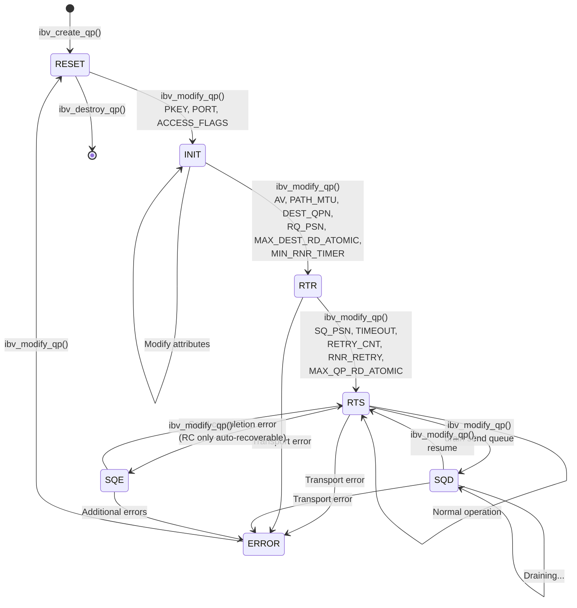

## 7.1 QP State Machine

Every Queue Pair in RDMA has a lifecycle governed by a finite state machine. Before a QP can send or receive data, it must be transitioned through a precise sequence of states, with specific attributes configured at each step. This state machine is not a software abstraction -- it is implemented in the NIC hardware. When you call `ibv_modify_qp()`, you are programming registers in the network adapter, telling it what this QP is allowed to do and what parameters to use when processing work requests. A QP in the wrong state will silently refuse to process posted work requests, or worse, transition to an error state that requires teardown and recreation.

Understanding the QP state machine is the single most important prerequisite for writing correct RDMA connection code. Every connection management abstraction -- the Communication Manager, RDMA_CM, even higher-level libraries like `libfabric` -- ultimately reduces to a sequence of `ibv_modify_qp()` calls that walk the QP through these states. When those abstractions fail or behave unexpectedly, diagnosing the problem requires understanding what is happening at the state machine level.

### The States

The QP state machine defines seven states. Not all states are reachable from all QP types, and the transitions available depend on the transport type (RC, UC, UD, XRC). The complete set of states is:



**RESET** is the initial state of every QP immediately after `ibv_create_qp()` returns. In this state, the QP is allocated but completely inert. No work requests can be posted to either the send queue or the receive queue. The QP has no associated port, no partition key, and no access permissions. It is a blank slate waiting to be configured.

**INIT (Initialized)** is the first configured state. The QP now knows which physical port it will use, which partition key it belongs to, and what remote access permissions it grants (RDMA Read, RDMA Write, Atomic). In the INIT state, receive work requests *can* be posted to the receive queue -- this is important because you typically want receive buffers posted before the connection is fully established, so that incoming messages have somewhere to land. However, no send operations are permitted, and no incoming packets will be processed yet.

**RTR (Ready to Receive)** means the QP is fully configured to receive packets from the remote peer. At this point, the QP knows the remote QP number, the path to the remote node (address vector, path MTU), and the receive-side PSN (Packet Sequence Number). Incoming packets matching this QP will be processed and delivered to posted receive buffers. However, the send queue is still inactive -- you cannot post send operations.

**RTS (Ready to Send)** is the fully operational state. Both the send queue and receive queue are active. The QP can send and receive data. The send-side PSN, timeout parameters, and retry counts have been configured. This is the steady-state for an active connection.

**SQD (Send Queue Drained)** is a transitional state entered when the application wants to modify certain QP attributes (such as the alternate path for APM) without disrupting in-flight operations. The transition to SQD causes the hardware to stop initiating new send operations while allowing outstanding operations to complete. Once the send queue is fully drained, an asynchronous event `IBV_EVENT_SQ_DRAINED` is generated. The application can then safely modify attributes and transition back to RTS.

**SQE (Send Queue Error)** is entered when a send operation completes with an error on an RC QP, but the error is recoverable. The receive queue continues to function normally. The application can handle the error and transition the QP back to RTS. Note that SQE is specific to certain transport types and error conditions; many errors go directly to the ERROR state instead.

**ERROR** is the terminal error state. All outstanding work requests on both the send and receive queues are flushed with error completions. No new work requests can be posted. The QP can be transitioned back to RESET to start over, or destroyed. Common causes include: retry count exhaustion (the remote side stopped responding), protection domain violations, and access permission errors.

### RESET to INIT: Basic Configuration

The first transition configures the QP's fundamental identity and permissions. The call requires exactly three mandatory attributes for RC and UC QPs:

```c
struct ibv_qp_attr attr = {
    .qp_state        = IBV_QPS_INIT,
    .pkey_index      = 0,        /* Default partition key */
    .port_num        = 1,        /* Physical port number (1-based) */
    .qp_access_flags = IBV_ACCESS_REMOTE_WRITE |
                       IBV_ACCESS_REMOTE_READ  |
                       IBV_ACCESS_REMOTE_ATOMIC,
};

int flags = IBV_QP_STATE      |
            IBV_QP_PKEY_INDEX |
            IBV_QP_PORT       |
            IBV_QP_ACCESS_FLAGS;

int ret = ibv_modify_qp(qp, &attr, flags);
if (ret) {
    fprintf(stderr, "RESET->INIT failed: %s\n", strerror(ret));
}
```

The `pkey_index` selects the partition key from the port's partition key table. Partition keys in InfiniBand serve a role similar to VLANs -- they isolate traffic between groups of nodes. Index 0 is the default full-membership partition key (`0xFFFF`), which is appropriate for most single-tenant environments.

The `port_num` identifies the physical port on the HCA. Multi-port adapters have port numbers starting at 1. This is a common source of off-by-one errors -- port numbering is 1-based, not 0-based.

The `qp_access_flags` determine what the *remote* side is allowed to do to local memory through this QP. Setting `IBV_ACCESS_REMOTE_WRITE` allows the remote peer to issue RDMA Write operations targeting memory regions registered on this QP's protection domain. Omitting this flag means RDMA Write attempts from the remote side will fail with an access violation, transitioning the QP to ERROR.

<div class="warning">

**Common Mistake:** Forgetting to set `qp_access_flags` is one of the most frequent RDMA programming errors. If you intend to use RDMA Read or Atomic operations, you must enable `IBV_ACCESS_REMOTE_READ` or `IBV_ACCESS_REMOTE_ATOMIC` on the *target* QP during the RESET-to-INIT transition. These flags cannot be changed later without transitioning back through RESET.

</div>

After this transition, you should post receive work requests to the receive queue. The QP in INIT state accepts receive WRs, and posting them now ensures that buffers are available when the first packets arrive after the QP reaches RTR.

### INIT to RTR: Connecting to the Remote Peer

The INIT-to-RTR transition is where the QP learns about its remote peer. This is the step that requires out-of-band exchange of endpoint information -- you need to know the remote side's QP number, LID (Local Identifier), and optionally GID (Global Identifier) before you can make this call.

```c
struct ibv_qp_attr attr = {
    .qp_state              = IBV_QPS_RTR,
    .path_mtu              = IBV_MTU_4096,
    .dest_qp_num           = remote_qpn,      /* Remote QP number */
    .rq_psn                = remote_psn,       /* Expected starting PSN */
    .max_dest_rd_atomic    = 16,               /* Max incoming RDMA Read/Atomic */
    .min_rnr_timer         = 12,               /* RNR NAK timer (~0.61ms) */
    .ah_attr               = {
        .is_global         = 0,                /* 1 if using GRH/RoCE */
        .dlid              = remote_lid,       /* Remote LID */
        .sl                = 0,                /* Service Level */
        .src_path_bits     = 0,                /* LMC path bits */
        .port_num          = 1,                /* Local port */
    },
};

/* For RoCE or cross-subnet IB, set GRH fields: */
if (use_grh) {
    attr.ah_attr.is_global = 1;
    attr.ah_attr.grh.dgid = remote_gid;       /* Remote GID */
    attr.ah_attr.grh.sgid_index = gid_index;   /* Local GID table index */
    attr.ah_attr.grh.flow_label = 0;
    attr.ah_attr.grh.hop_limit = 64;
    attr.ah_attr.grh.traffic_class = 0;
}

int flags = IBV_QP_STATE              |
            IBV_QP_AV                 |
            IBV_QP_PATH_MTU           |
            IBV_QP_DEST_QPN           |
            IBV_QP_RQ_PSN             |
            IBV_QP_MAX_DEST_RD_ATOMIC |
            IBV_QP_MIN_RNR_TIMER;

int ret = ibv_modify_qp(qp, &attr, flags);
```

The `path_mtu` sets the maximum payload size per packet. This must not exceed the MTU supported by every link and switch along the path between the two endpoints. Common values are `IBV_MTU_1024` (safe default for InfiniBand), `IBV_MTU_4096` (standard for modern InfiniBand), and `IBV_MTU_256` (common for RoCE over standard Ethernet). Setting this too high causes silent packet drops at switches that cannot handle the size.

The `dest_qp_num` is the QP number of the remote peer's Queue Pair. This value must be obtained from the remote side through whatever out-of-band mechanism you use (TCP socket, shared file, CM REQ/REP exchange).

The `rq_psn` is the Packet Sequence Number that the receive side expects the remote sender to start with. This must match the `sq_psn` that the remote QP will be configured with in its RTR-to-RTS transition. If they do not match, the first packet will be detected as out-of-sequence, and the hardware will enter error recovery (or drop the packet, depending on transport type). In practice, both sides often use 0 or a random starting PSN -- as long as sender and receiver agree.

The `max_dest_rd_atomic` limits the number of outstanding incoming RDMA Read and Atomic operations that this QP will handle simultaneously. The NIC must allocate hardware resources (read response buffers) for each concurrent outstanding Read. Setting this too high wastes NIC resources; setting it to 0 disables incoming RDMA Read and Atomic entirely. This value must not exceed `max_qp_rd_atom` reported by `ibv_query_device()`.

The `min_rnr_timer` specifies how long the remote sender should wait before retrying when this QP responds with a Receiver Not Ready (RNR) NAK. An RNR NAK is sent when a Send or RDMA Write with Immediate arrives but no receive buffer is posted. The timer value is an encoded duration, where value 0 means 655.36 ms and value 31 means 0.01 ms. Value 12 corresponds to approximately 0.61 ms. Setting this too low causes the remote side to retry aggressively; too high adds unnecessary latency to RNR recovery.

<div class="tip">

**Tip:** After the INIT-to-RTR transition completes, the QP can already receive packets. If the remote side sends data before you transition to RTS, the incoming packets will be processed and matched against posted receive buffers. This asymmetry is by design and is exploited by the CM handshake: the passive side (server) reaches RTR first and can receive the RTU message before transitioning to RTS.

</div>

### RTR to RTS: Enabling the Send Queue

The final transition to reach the operational state configures the send-side parameters:

```c
struct ibv_qp_attr attr = {
    .qp_state          = IBV_QPS_RTS,
    .sq_psn            = local_psn,    /* Starting send PSN */
    .timeout           = 14,           /* ~68 ms local ACK timeout */
    .retry_cnt         = 7,            /* Retry count (0-7) */
    .rnr_retry         = 7,            /* RNR retry count (7 = infinite) */
    .max_rd_atomic     = 16,           /* Max outgoing RDMA Read/Atomic */
};

int flags = IBV_QP_STATE          |
            IBV_QP_SQ_PSN         |
            IBV_QP_TIMEOUT        |
            IBV_QP_RETRY_CNT      |
            IBV_QP_RNR_RETRY      |
            IBV_QP_MAX_QP_RD_ATOMIC;

int ret = ibv_modify_qp(qp, &attr, flags);
```

The `sq_psn` is the Packet Sequence Number that the local send queue will use for its first packet. This must match the `rq_psn` configured on the remote QP during its INIT-to-RTR transition.

The `timeout` is the local ACK timeout, encoded as a power of 2 multiplied by 4.096 microseconds. Value 0 means infinite (no timeout -- generally only appropriate for debugging). Value 14 means approximately 68 ms (`4.096 * 2^14` microseconds). If an ACK is not received within this interval, the packet is retransmitted. This value should account for the round-trip time plus processing delays. For a local datacenter, values between 12-17 are typical.

The `retry_cnt` sets the maximum number of retransmission attempts before the QP gives up and transitions to ERROR. The maximum value is 7. After `retry_cnt` consecutive retransmission timeouts, the QP transitions to ERROR and all outstanding work requests are flushed. A value of 7 means 7 retries (8 total attempts). For production systems, 7 is typical; lower values cause faster failure detection but increase susceptibility to transient issues.

The `rnr_retry` controls how many times the sender will retry after receiving an RNR NAK. The special value 7 means infinite retries -- the sender will never give up due to RNR alone. This is the recommended setting for most applications, because RNR conditions are typically transient (the receiver just hasn't posted a receive buffer yet).

The `max_rd_atomic` limits the number of outstanding outgoing RDMA Read and Atomic operations. This must not exceed the `max_dest_rd_atomic` configured on the remote QP. Exceeding this causes operations to be silently queued by the hardware, which can lead to ordering surprises.

### SQD, SQE, and ERROR: Non-Operational States

**RTS to SQD:** This transition is used when you need to modify QP attributes that cannot be changed while the send queue is active -- most commonly the alternate path for Automatic Path Migration (APM). When you transition to SQD, the hardware stops issuing new packets from the send queue but allows in-flight operations to complete. An asynchronous event `IBV_EVENT_SQ_DRAINED` signals when the drain is complete. You can then modify the desired attributes and transition back to RTS.

```c
/* Transition to SQD */
struct ibv_qp_attr attr = { .qp_state = IBV_QPS_SQD };
ibv_modify_qp(qp, &attr, IBV_QP_STATE);

/* Wait for IBV_EVENT_SQ_DRAINED async event... */

/* Modify attributes (e.g., alternate path) and return to RTS */
attr.qp_state = IBV_QPS_RTS;
/* ... set new attributes ... */
ibv_modify_qp(qp, &attr, flags);
```

**SQE (Send Queue Error):** On RC QPs, certain send completion errors (such as a remote access violation) transition the QP to SQE rather than ERROR. In SQE, the receive queue continues to function -- the QP can still receive packets, but the send queue is frozen. This allows the application to examine the error, potentially correct the problem, and transition back to RTS. However, many errors bypass SQE and go directly to ERROR.

**ERROR State and Recovery:** When a QP enters ERROR, all outstanding work requests on both queues are flushed. You must poll all remaining completions (which will have error status) from the CQ before you can safely proceed. The QP can be transitioned back to RESET with `ibv_modify_qp()`, effectively reinitializing it for reuse. Alternatively, you can destroy the QP with `ibv_destroy_qp()` and create a new one.

<div class="warning">

**Warning:** When a QP transitions to ERROR, flushed completions appear on the CQ with status `IBV_WC_WR_FLUSH_ERR`. You **must** poll these completions and process them. Failing to do so can cause CQ overruns if you continue posting work requests on other QPs that share the same CQ.

</div>

### UD QP State Transitions

Unreliable Datagram (UD) QPs follow a simplified state machine because they are connectionless -- a single UD QP can send to and receive from any number of remote QPs. The transitions are the same (RESET -> INIT -> RTR -> RTS), but the required attributes differ significantly:

**RESET to INIT** for UD:
```c
struct ibv_qp_attr attr = {
    .qp_state   = IBV_QPS_INIT,
    .pkey_index = 0,
    .port_num   = 1,
    .qkey       = 0x11111111,   /* Q-Key instead of access flags */
};
int flags = IBV_QP_STATE | IBV_QP_PKEY_INDEX |
            IBV_QP_PORT  | IBV_QP_QKEY;
```

**INIT to RTR** for UD requires *no additional attributes* beyond the state change:
```c
struct ibv_qp_attr attr = { .qp_state = IBV_QPS_RTR };
ibv_modify_qp(qp, &attr, IBV_QP_STATE);
```

**RTR to RTS** for UD only requires the send PSN:
```c
struct ibv_qp_attr attr = {
    .qp_state = IBV_QPS_RTS,
    .sq_psn   = 0,
};
ibv_modify_qp(qp, &attr, IBV_QP_STATE | IBV_QP_SQ_PSN);
```

Notice the critical difference: UD QPs do not specify a destination QP number, address vector, or retry parameters during state transitions. The destination is specified per-send via an Address Handle attached to each work request. This is what makes UD connectionless and avoids the N-squared connection problem discussed in Section 7.4.

### Attribute Requirements Summary

| Transition | RC/UC Required | UD Required |
|------------|---------------|-------------|
| RESET -> INIT | STATE, PKEY_INDEX, PORT, ACCESS_FLAGS | STATE, PKEY_INDEX, PORT, QKEY |
| INIT -> RTR | STATE, AV, PATH_MTU, DEST_QPN, RQ_PSN, MAX_DEST_RD_ATOMIC, MIN_RNR_TIMER | STATE only |
| RTR -> RTS | STATE, SQ_PSN, TIMEOUT, RETRY_CNT, RNR_RETRY, MAX_QP_RD_ATOMIC | STATE, SQ_PSN |
| RTS -> SQD | STATE | STATE |
| SQD -> RTS | STATE | STATE |
| * -> ERROR | (automatic on error) | (automatic on error) |
| ERROR -> RESET | STATE | STATE |

### Common Mistakes and Debugging

**Wrong attribute mask.** The `flags` parameter to `ibv_modify_qp()` must exactly match the set of required attributes for the transition. Including extra flags for attributes you haven't set, or omitting required flags, causes the call to fail with `EINVAL`. The error message provides no indication of *which* flag is wrong. When debugging, compare your flags against the table above.

**Mismatched PSNs.** If the local `sq_psn` does not match the remote `rq_psn`, the first packet sent will be treated as out-of-sequence. For RC QPs, this triggers retransmission. If the mismatch is not corrected, the retry count will be exhausted and the QP will transition to ERROR. Always ensure both sides agree on PSN values.

**MTU mismatch.** Setting `path_mtu` higher than what the network path supports causes packets to be silently dropped by switches. Query the port attributes with `ibv_query_port()` to determine the maximum supported MTU, and use the minimum of the two endpoints' capabilities.

**Posting sends before RTS.** A QP in RTR state can receive but not send. Posting a send work request to a QP that has not reached RTS will not produce an immediate error from `ibv_post_send()` -- the WR is simply queued. But it will not be processed, and depending on the implementation, may eventually produce a completion error or simply hang.

**Not posting receives before RTR.** While technically legal, transitioning to RTR without any posted receive buffers means that the first incoming Send (or RDMA Write with Immediate) will trigger an RNR NAK. If the sender has limited RNR retries, this can cause the connection to fail during establishment. Best practice is to post receive WRs immediately after the RESET-to-INIT transition.
