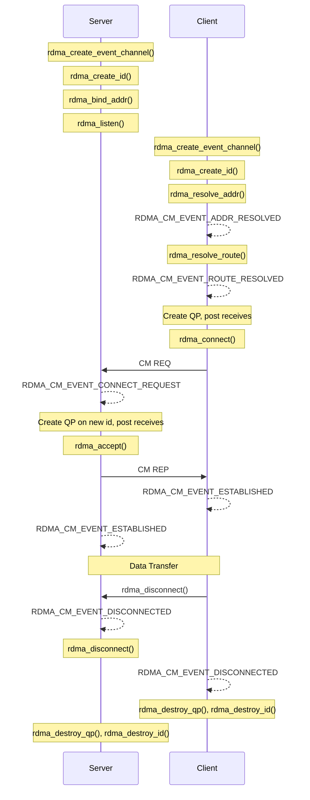

## 7.3 RDMA_CM

The raw verbs approach to RDMA connection management -- creating QPs, manually exchanging endpoint information over a sideband TCP socket, calling `ibv_modify_qp()` with the correct attributes at each state transition -- is tedious and error-prone. Even a minimal connection setup requires approximately 100 lines of boilerplate code for the QP state transitions alone, plus another 50-100 lines for the TCP-based metadata exchange. Multiply this by the number of error paths, and the connection code quickly dwarfs the actual data transfer logic.

The **RDMA Connection Manager (RDMA_CM)**, provided by the `librdmacm` library, solves this problem by offering a socket-like, event-driven API that abstracts away QP state transitions, address resolution, and route discovery. With RDMA_CM, establishing a connection requires roughly a dozen API calls instead of dozens of low-level verbs calls plus out-of-band socket code. The library handles the interaction with the kernel Communication Manager (Section 7.2), translates between IP addresses and InfiniBand paths, and optionally creates and manages QPs on the application's behalf.

### Programming Model

RDMA_CM uses an event-driven programming model. The application creates an event channel, performs operations that generate events asynchronously, and processes those events in a loop. This model is well-suited for connection management, where operations involve network round-trips and cannot complete instantaneously.

The key objects in the RDMA_CM API are:

- **`struct rdma_event_channel`**: An event notification channel, analogous to an `epoll` file descriptor. Events from all CM identifiers on the channel are delivered here.
- **`struct rdma_cm_id`**: A CM identifier, analogous to a socket. Each `rdma_cm_id` represents one endpoint of a connection (or a listening endpoint).
- **`struct rdma_cm_event`**: An event structure describing what happened (address resolved, connection request received, connection established, disconnected, etc.).

The overall flow follows a pattern familiar to socket programmers, but with explicit event processing at each step:



### Event Channel and CM Identifier Creation

Every RDMA_CM session begins by creating an event channel and one or more CM identifiers:

```c
#include <rdma/rdma_cma.h>

/* Create the event channel */
struct rdma_event_channel *ec = rdma_create_event_channel();
if (!ec) {
    perror("rdma_create_event_channel");
    exit(1);
}

/* Create a CM identifier (like a socket) */
struct rdma_cm_id *id;
int ret = rdma_create_id(ec, &id, user_context, RDMA_PS_TCP);
if (ret) {
    perror("rdma_create_id");
    exit(1);
}
```

The `RDMA_PS_TCP` parameter specifies the port space. This determines how the RDMA_CM maps IP addresses and port numbers to InfiniBand Service IDs. `RDMA_PS_TCP` is the most common choice and provides a mapping compatible with TCP port numbers. Other options include `RDMA_PS_UDP` (for UDP-like semantics using UD transport) and `RDMA_PS_IB` (for raw InfiniBand Service IDs).

The `user_context` parameter is an opaque pointer stored in the `rdma_cm_id` structure. It is returned with every event associated with this identifier, providing a convenient way to associate application state with a connection without external lookup tables.

The event channel's file descriptor (`ec->fd`) can be used with `poll()`, `epoll()`, or `select()` for non-blocking event processing, enabling integration with existing event loops.

### Address and Route Resolution

Before a client can connect to a server, it must resolve the server's IP address to a local RDMA device and then discover the route (path) through the InfiniBand fabric:

```c
/* Step 1: Resolve the destination address */
struct sockaddr_in dst_addr = {
    .sin_family = AF_INET,
    .sin_port   = htons(20886),
    .sin_addr.s_addr = inet_addr("192.168.1.100"),
};

ret = rdma_resolve_addr(id, NULL, (struct sockaddr *)&dst_addr, 2000);
/* timeout = 2000 ms */

/* Wait for event */
struct rdma_cm_event *event;
rdma_get_cm_event(ec, &event);
assert(event->event == RDMA_CM_EVENT_ADDR_RESOLVED);
rdma_ack_cm_event(event);  /* Must acknowledge every event */

/* Step 2: Resolve the route to the destination */
ret = rdma_resolve_route(id, 2000);

rdma_get_cm_event(ec, &event);
assert(event->event == RDMA_CM_EVENT_ROUTE_RESOLVED);
rdma_ack_cm_event(event);
```

**Address resolution** (`rdma_resolve_addr()`) determines which local RDMA device and port can reach the specified destination IP address. Internally, this involves consulting the system's routing table to determine the outgoing interface, then mapping that interface to an RDMA device. After address resolution, `id->verbs` points to the RDMA device context, and `id->pd` (if created through `rdma_create_qp()`) to the protection domain. For RoCE, this step also performs ARP/neighbor resolution to obtain the remote MAC address. The `NULL` source address means "let the system choose the appropriate local address."

**Route resolution** (`rdma_resolve_route()`) discovers the path through the fabric. For InfiniBand, this involves querying the Subnet Administrator (SA) for a path record between the local and remote ports. The path record contains the DLID, SL, MTU, rate, and other routing parameters. For RoCE, route resolution resolves the Ethernet path (which is simpler -- essentially just the IP route). After route resolution, `id->route` contains the complete path information needed for the QP state transitions.

<div class="note">

**Note:** Both resolution steps are asynchronous. The function returns immediately, and the result is delivered as an event on the event channel. The timeout parameter specifies how long the library should wait for the underlying resolution to complete before generating an error event. In practice, address resolution completes in microseconds (it is a local lookup), while route resolution may take milliseconds (it involves a fabric query to the SA).

</div>

### Server Side: Bind, Listen, Accept

The server side follows the traditional socket pattern of bind, listen, and accept:

```c
/* Bind to a local address and port */
struct sockaddr_in addr = {
    .sin_family = AF_INET,
    .sin_port   = htons(20886),
    .sin_addr.s_addr = INADDR_ANY,
};
ret = rdma_bind_addr(listen_id, (struct sockaddr *)&addr);

/* Start listening for connection requests */
ret = rdma_listen(listen_id, 10);  /* backlog = 10 */

/* Event loop */
while (1) {
    struct rdma_cm_event *event;
    rdma_get_cm_event(ec, &event);

    switch (event->event) {
    case RDMA_CM_EVENT_CONNECT_REQUEST: {
        /* A new connection request arrived */
        struct rdma_cm_id *new_id = event->id;
        /* new_id is a fresh CM identifier for this connection */

        /* Create QP on the new identifier */
        struct ibv_qp_init_attr qp_attr = {
            .send_cq = cq,
            .recv_cq = cq,
            .cap = {
                .max_send_wr  = 128,
                .max_recv_wr  = 128,
                .max_send_sge = 1,
                .max_recv_sge = 1,
            },
            .qp_type = IBV_QPT_RC,
        };
        ret = rdma_create_qp(new_id, pd, &qp_attr);

        /* Post receive buffers before accepting */
        post_receive_buffers(new_id->qp);

        /* Accept the connection */
        struct rdma_conn_param conn_param = {
            .responder_resources = 16,
            .initiator_depth     = 16,
            .private_data        = server_metadata,
            .private_data_len    = sizeof(server_metadata),
        };
        ret = rdma_accept(new_id, &conn_param);
        break;
    }
    case RDMA_CM_EVENT_ESTABLISHED:
        /* Connection fully established */
        printf("Connection established with %s\n",
               inet_ntoa(rdma_get_peer_addr(event->id)->sin_addr));
        break;

    case RDMA_CM_EVENT_DISCONNECTED:
        /* Peer disconnected */
        rdma_destroy_qp(event->id);
        rdma_destroy_id(event->id);
        break;
    }
    rdma_ack_cm_event(event);
}
```

When a `RDMA_CM_EVENT_CONNECT_REQUEST` arrives, the event contains a *new* `rdma_cm_id` that represents the incoming connection. This is analogous to how `accept()` returns a new socket. The server creates a QP on this new identifier, posts receive buffers, and calls `rdma_accept()`. The RDMA_CM library handles the QP state transitions (RESET -> INIT -> RTR -> RTS) internally.

<div class="warning">

**Warning:** You **must** call `rdma_ack_cm_event()` for every event retrieved with `rdma_get_cm_event()`. Failing to acknowledge events causes the event channel to stall, as the library limits the number of outstanding unacknowledged events. This is easy to miss in error paths. Furthermore, you must not access the event structure after acknowledging it -- the memory is freed.

</div>

### Client Side: Connect

The client creates a QP, posts initial receive buffers, and initiates the connection:

```c
/* After address and route resolution... */

/* Create QP */
struct ibv_qp_init_attr qp_attr = { /* ... same as server ... */ };
ret = rdma_create_qp(id, pd, &qp_attr);

/* Post receive buffers */
post_receive_buffers(id->qp);

/* Connect to server */
struct rdma_conn_param conn_param = {
    .responder_resources = 16,
    .initiator_depth     = 16,
    .retry_count         = 7,
    .rnr_retry_count     = 7,
    .private_data        = client_metadata,
    .private_data_len    = sizeof(client_metadata),
};
ret = rdma_connect(id, &conn_param);

/* Wait for connection established event */
struct rdma_cm_event *event;
rdma_get_cm_event(ec, &event);
if (event->event == RDMA_CM_EVENT_ESTABLISHED) {
    /* Extract server's private data if needed */
    memcpy(&remote_info, event->param.conn.private_data,
           sizeof(remote_info));
}
rdma_ack_cm_event(event);
```

The `rdma_conn_param` structure controls connection parameters and carries private data. The `responder_resources` and `initiator_depth` fields correspond to the `max_dest_rd_atomic` and `max_rd_atomic` QP attributes from Section 7.1. The `private_data` field is passed through the CM REQ message to the server, where it appears in the connect request event.

### Automatic QP Management with rdma_create_qp()

One of RDMA_CM's most valuable features is `rdma_create_qp()`, which creates a QP and associates it with a CM identifier. When you use `rdma_create_qp()` instead of `ibv_create_qp()`, the RDMA_CM library manages QP state transitions automatically:

- When `rdma_connect()` or `rdma_accept()` is called, the library transitions the QP through RESET -> INIT -> RTR -> RTS with the correct attributes.
- When `rdma_disconnect()` is called, the library handles the QP teardown.
- The application never needs to call `ibv_modify_qp()` directly.

This is the recommended approach for most applications. If you need finer control over QP attributes, you can create the QP with `ibv_create_qp()` and assign it to the CM identifier with `rdma_cm_id->qp = my_qp`. In that case, you manage some or all of the state transitions yourself, using the CM events to know when to transition.

### Complete Event Types

The RDMA_CM defines the following event types, each corresponding to a specific stage in the connection lifecycle:

| Event | Description | Triggered By |
|-------|-------------|-------------|
| `RDMA_CM_EVENT_ADDR_RESOLVED` | Address resolution completed | `rdma_resolve_addr()` |
| `RDMA_CM_EVENT_ADDR_ERROR` | Address resolution failed | `rdma_resolve_addr()` |
| `RDMA_CM_EVENT_ROUTE_RESOLVED` | Route resolution completed | `rdma_resolve_route()` |
| `RDMA_CM_EVENT_ROUTE_ERROR` | Route resolution failed | `rdma_resolve_route()` |
| `RDMA_CM_EVENT_CONNECT_REQUEST` | Incoming connection request | Remote `rdma_connect()` |
| `RDMA_CM_EVENT_CONNECT_RESPONSE` | Connection response received | `rdma_connect()` |
| `RDMA_CM_EVENT_CONNECT_ERROR` | Connection attempt failed | `rdma_connect()` |
| `RDMA_CM_EVENT_UNREACHABLE` | Remote unreachable | `rdma_connect()` |
| `RDMA_CM_EVENT_REJECTED` | Connection rejected by peer | Remote `rdma_reject()` |
| `RDMA_CM_EVENT_ESTABLISHED` | Connection established | `rdma_accept()`/`rdma_connect()` |
| `RDMA_CM_EVENT_DISCONNECTED` | Connection disconnected | Remote or local `rdma_disconnect()` |
| `RDMA_CM_EVENT_DEVICE_REMOVAL` | RDMA device removed | Hot-unplug |
| `RDMA_CM_EVENT_MULTICAST_JOIN` | Multicast group joined | `rdma_join_multicast()` |
| `RDMA_CM_EVENT_MULTICAST_ERROR` | Multicast error | Multicast subsystem |
| `RDMA_CM_EVENT_ADDR_CHANGE` | Address change detected | Network reconfiguration |
| `RDMA_CM_EVENT_TIMEWAIT_EXIT` | Time-wait period ended | After disconnect |

### Error Handling and Rejection

When the server decides to reject a connection, it calls `rdma_reject()`:

```c
/* Server-side rejection */
const char *reason = "Service not available";
rdma_reject(new_id, reason, strlen(reason) + 1);
```

The client receives a `RDMA_CM_EVENT_REJECTED` event, and the rejection data is available in `event->param.conn.private_data`. The event's `status` field contains the CM rejection reason code.

Robust applications should handle all error events in their event loop:

```c
void handle_event(struct rdma_cm_event *event)
{
    switch (event->event) {
    case RDMA_CM_EVENT_ADDR_ERROR:
        fprintf(stderr, "Address resolution failed: %d\n",
                event->status);
        break;
    case RDMA_CM_EVENT_ROUTE_ERROR:
        fprintf(stderr, "Route resolution failed: %d\n",
                event->status);
        break;
    case RDMA_CM_EVENT_CONNECT_ERROR:
        fprintf(stderr, "Connection error: %d\n", event->status);
        break;
    case RDMA_CM_EVENT_UNREACHABLE:
        fprintf(stderr, "Destination unreachable\n");
        break;
    case RDMA_CM_EVENT_REJECTED:
        fprintf(stderr, "Connection rejected: %s\n",
                (char *)event->param.conn.private_data);
        break;
    case RDMA_CM_EVENT_DEVICE_REMOVAL:
        fprintf(stderr, "RDMA device removed!\n");
        /* Must destroy all resources on this device */
        break;
    /* ... */
    }
}
```

<div class="tip">

**Tip:** The `RDMA_CM_EVENT_TIMEWAIT_EXIT` event signals that the CM's time-wait period has ended for a disconnected connection. During time-wait, the CM retains connection state to handle late-arriving retransmissions. The QP number is not reused until time-wait expires. If your application disconnects and reconnects rapidly, you may run out of QP numbers unless you wait for this event before destroying the identifier. In practice, this is only a concern for applications that create and destroy thousands of connections per second.

</div>

### Comparison: Raw Verbs vs. RDMA_CM

The following table compares the two approaches:

| Aspect | Raw Verbs + TCP Sideband | RDMA_CM |
|--------|------------------------|---------|
| Lines of code | 200-400 for connection setup | 50-100 for connection setup |
| Address resolution | Manual (application responsibility) | Automatic (`rdma_resolve_addr`) |
| Route resolution | Manual (SA query or hardcoded) | Automatic (`rdma_resolve_route`) |
| QP state transitions | Manual (`ibv_modify_qp` x3) | Automatic (hidden inside `rdma_connect`/`rdma_accept`) |
| Metadata exchange | Out-of-band (TCP socket) | In-band (CM private data) |
| Transport support | IB, RoCE (with manual GID setup) | IB, RoCE, iWARP (transparent) |
| Error handling | Parse `errno` from `ibv_modify_qp` | Typed CM events |
| Control | Full control over every parameter | Less control, sensible defaults |
| Dependencies | `libibverbs` only | `libibverbs` + `librdmacm` |
| iWARP support | Not possible (iWARP requires CM) | Native |

For most applications, RDMA_CM is the right choice. The raw verbs approach makes sense when: you need precise control over QP attributes that RDMA_CM doesn't expose; you are building a kernel-level protocol; your application already has a metadata exchange channel (e.g., MPI's out-of-band bootstrap) and doesn't want the CM overhead; or you are working with transport types that RDMA_CM doesn't support well.

### Thread Safety and Concurrent Connections

The RDMA_CM library is thread-safe. Multiple threads can call RDMA_CM functions concurrently, and a single event channel can be shared across threads (though only one thread should call `rdma_get_cm_event()` at a time on a given channel). For high-connection-rate servers, a common pattern is:

1. One listener thread calls `rdma_get_cm_event()` in a loop.
2. Connection request events are dispatched to a pool of worker threads.
3. Each worker thread handles the accept/reject decision and subsequent data transfer.
4. Each worker may use a separate event channel for its connection's lifecycle events.

Alternatively, the event channel's file descriptor can be integrated into an `epoll`-based event loop alongside other file descriptors (TCP sockets, timer FDs, signal FDs), providing a unified event-driven architecture.

```c
/* Non-blocking event processing with epoll */
int flags = fcntl(ec->fd, F_GETFL);
fcntl(ec->fd, F_SETFL, flags | O_NONBLOCK);

struct epoll_event ev = {
    .events = EPOLLIN,
    .data.ptr = ec,
};
epoll_ctl(epfd, EPOLL_CTL_ADD, ec->fd, &ev);
```

This integration is essential for building production RDMA servers that must handle both RDMA connections and TCP management traffic in a single event loop.
