# 12.1 Latency Analysis

Latency is the single most important performance metric for many RDMA applications. High-frequency trading systems, distributed lock managers, and consensus protocols all depend on sub-microsecond or low-microsecond round-trip times. To optimize latency, we must first understand exactly where time is spent in every phase of an RDMA operation.

This section decomposes the end-to-end latency of RDMA operations into their constituent phases, quantifies each phase, and presents the techniques that minimize total latency.

## End-to-End Latency Breakdown

An RDMA operation traverses multiple hardware and software components between the moment the application posts a work request and the moment the operation completes. The total latency can be expressed as:

$$t_{total} = t_{sw} + t_{pcie\_db} + t_{nic\_local} + t_{wire} + t_{nic\_remote} + t_{completion}$$

Each term represents a distinct phase of the operation. Let us examine them in detail.

### Phase 1: Software Posting ($t_{sw}$)

**Duration: ~100--300 ns**

The application constructs a Work Queue Element (WQE) in the send queue buffer and writes a doorbell register to notify the NIC. This phase includes:

- **WQE construction**: Populating the WQE descriptor with the operation type, scatter-gather entries, remote address and rkey (for RDMA operations), and flags. The WQE is written to a pre-allocated buffer in host memory that the NIC can access via DMA.

- **Doorbell write**: A single 4-byte or 8-byte MMIO write to a register mapped into the process's virtual address space (the User Access Region, or UAR). This write crosses the PCIe bus and is inherently expensive because it is an uncacheable write to device memory.

The software posting cost depends on the complexity of the WQE. A simple RDMA Write with a single scatter-gather entry (SGE) requires writing approximately 64 bytes of WQE data. Operations with multiple SGEs or extended atomics require larger WQEs and proportionally more time.

```c
// Typical WQE posting - this is what costs ~100-300 ns
struct ibv_send_wr wr = {
    .wr_id      = id,
    .sg_list    = &sge,
    .num_sge    = 1,
    .opcode     = IBV_WR_RDMA_WRITE,
    .send_flags = IBV_SEND_SIGNALED,
    .wr.rdma    = { .remote_addr = remote_addr, .rkey = rkey }
};
struct ibv_send_wr *bad_wr;
ibv_post_send(qp, &wr, &bad_wr);  // Triggers doorbell write
```

### Phase 2: PCIe Doorbell Propagation ($t_{pcie\_db}$)

**Duration: ~100--200 ns**

The doorbell MMIO write must traverse the PCIe bus from the CPU to the NIC. This is a posted write (no acknowledgment required at the PCIe level), but the CPU's write-combining buffer must be flushed, and the write must propagate through the PCIe root complex, any PCIe switches, and finally reach the NIC's BAR (Base Address Register) space.

The PCIe latency depends on the topology:

- **Direct attachment** to root complex: ~100 ns
- **Through PCIe switch**: ~150--200 ns
- **Cross-NUMA socket**: add ~100 ns for QPI/UPI traversal

### Phase 3: Local NIC Processing ($t_{nic\_local}$)

**Duration: ~200--500 ns**

Once the NIC receives the doorbell, it must:

1. **Fetch the WQE** from host memory via a DMA read over PCIe. The NIC reads the WQE descriptor to determine the operation type, data location, and destination.

2. **Fetch the data** for send and RDMA Write operations. The NIC issues DMA reads to gather the payload from the scatter-gather entries specified in the WQE. For RDMA Read, this phase is deferred to the remote side.

3. **Perform address translation** using the Memory Translation Table (MTT) to convert virtual addresses in the SGEs to physical addresses for DMA. The NIC maintains a cache of recent translations; cache misses require additional DMA reads to fetch MTT entries.

4. **Construct the packet** including the transport headers (BTH, RETH, etc.), ICRC, and optionally the GRH/IPv6/UDP headers for RoCEv2.

5. **Transmit the packet** through the NIC's internal pipeline to the MAC layer and onto the wire.

### Phase 4: Wire Time ($t_{wire}$)

**Duration: ~5--100 ns (depends on message size and link speed)**

Wire time has two components:

$$t_{wire} = t_{serialization} + t_{propagation}$$

**Serialization delay** is the time to clock all bits of the packet onto the wire:

$$t_{serialization} = \frac{packet\_size\_bits}{link\_rate\_bps}$$

At 100 Gbps, a minimum-size 64-byte Ethernet frame takes:

$$t_{serialization} = \frac{64 \times 8}{100 \times 10^9} = 5.12 \text{ ns}$$

A 4 KB payload (typical RDMA Write):

$$t_{serialization} = \frac{4096 \times 8}{100 \times 10^9} \approx 328 \text{ ns}$$

**Propagation delay** depends on the physical distance. In a data center with copper or short-reach optical cables (1--10 meters), propagation is approximately 5 ns per meter, contributing 5--50 ns.

For most data center RDMA workloads with small messages, wire time is negligible compared to software and NIC processing.

### Phase 5: Remote NIC Processing ($t_{nic\_remote}$)

**Duration: ~200--500 ns**

The remote NIC must:

1. **Receive and parse the packet**: Validate the ICRC, extract transport headers, identify the destination QP.

2. **Look up QP context**: Fetch the QP state from the NIC's context cache. If the QP context is not cached, the NIC must fetch it from host memory via DMA, adding significant latency.

3. **Perform the data operation**:
   - For **RDMA Write**: DMA write the payload to the destination address specified in the RETH header, after translating the virtual address through the MTT.
   - For **Send**: DMA write to the next available receive WQE's buffer.
   - For **RDMA Read**: DMA read the requested data from local memory and construct a response packet.

4. **Generate ACK** (if required by the transport): For RC transport, the remote NIC sends an ACK packet back to the sender.

### Phase 6: Completion ($t_{completion}$)

**Duration: ~100--300 ns**

After the operation completes (ACK received for RC, or data written for one-sided operations), the local NIC generates a Completion Queue Element (CQE):

1. **CQE DMA write**: The NIC writes the CQE to the completion queue in host memory.
2. **Notification**: If the application is using polling (`ibv_poll_cq`), it detects the CQE on its next poll iteration. If using event notification, the NIC must trigger an interrupt, which adds microseconds of overhead.

## Total Latency Summary

Summing the phases for typical operations on a modern ConnectX-6/7 NIC at 100 Gbps with small messages:

| Operation | Typical Latency | Notes |
|-----------|----------------|-------|
| RDMA Write | ~1.0--2.0 us | One-way, no response needed |
| RDMA Write with Immediate | ~1.0--2.0 us | One-way, generates remote CQE |
| Send/Receive | ~1.0--2.0 us | One-way |
| RDMA Read | ~2.0--3.0 us | Round-trip: request + response |
| Atomic (CAS/FAA) | ~2.0--3.5 us | Round-trip, NIC-side execution |

The following diagram illustrates the latency waterfall for an RDMA Write operation:

```mermaid
gantt
    title RDMA Write Latency Breakdown (Small Message, 100 Gbps)
    dateFormat X
    axisFormat %L ns

    section Sender
    SW posting (WQE + doorbell)       :a1, 0, 200
    PCIe doorbell propagation         :a2, 200, 350
    NIC WQE fetch + DMA read          :a3, 350, 650
    Packet construction + TX          :a4, 650, 800

    section Network
    Wire time (serialization + prop)  :a5, 800, 850

    section Receiver
    RX + parse + QP lookup            :a6, 850, 1000
    Address translation + DMA write   :a7, 1000, 1250
    CQE generation (if imm)           :a8, 1250, 1350
```



## Latency Optimization Techniques

### BlueFlame: Combined Doorbell and Data

BlueFlame is an NVIDIA-specific optimization that combines the doorbell notification and the first 64 bytes of WQE data into a single MMIO write. Instead of the NIC needing to perform a DMA read to fetch the WQE from host memory, the WQE data arrives with the doorbell itself.

This eliminates the WQE fetch latency (one PCIe round-trip), saving approximately 200--400 ns:

$$t_{blueflame} = t_{total} - t_{wqe\_fetch} \approx t_{total} - 300 \text{ ns}$$

BlueFlame requires:

- The WQE must fit within 64 bytes (single SGE, small descriptors)
- The UAR page must be mapped with write-combining (WC) memory type
- The CPU must support and enable write-combining for the MMIO region

```c
// BlueFlame posting (simplified, library-internal)
// 1. Write WQE data to BlueFlame register (write-combining MMIO)
// 2. Memory barrier to flush write-combining buffer
// 3. NIC receives WQE inline with doorbell - no DMA fetch needed
```

### Inline Data

For small payloads (up to ~256 bytes depending on WQE size), the payload data can be embedded directly in the WQE rather than referenced via a scatter-gather entry. This eliminates the NIC's DMA read to fetch the payload:

```c
struct ibv_send_wr wr = {
    .sg_list    = &sge,
    .num_sge    = 1,
    .opcode     = IBV_WR_RDMA_WRITE,
    .send_flags = IBV_SEND_SIGNALED | IBV_SEND_INLINE,  // Inline the data
    // ...
};
```

Benefits of inline data:

- Eliminates one DMA read (~200 ns savings)
- The source memory region does not need to be registered (no MR required for the data)
- The application can reuse or free the source buffer immediately after `ibv_post_send` returns

<div class="warning">

**Inline data limitation**: The maximum inline data size is determined at QP creation time via `ibv_qp_init_attr.cap.max_inline_data`. Setting this too large wastes WQE buffer space. A typical value is 64--256 bytes.

</div>

### Polling vs. Event Notification

Completion notification method has a dramatic impact on latency:

| Method | Additional Latency | CPU Cost |
|--------|-------------------|----------|
| Busy polling (`ibv_poll_cq` in loop) | ~0 ns (detected within poll interval) | 100% of one CPU core |
| Event-driven (`ibv_get_cq_event`) | ~5--10 us (interrupt overhead) | Minimal |
| Adaptive polling | ~0--1000 ns (polls, then sleeps) | Variable |

For latency-critical applications, busy polling is essential. The application dedicates a CPU core to continuously calling `ibv_poll_cq`:

```c
// Latency-critical polling loop
struct ibv_wc wc;
while (1) {
    int n = ibv_poll_cq(cq, 1, &wc);
    if (n > 0) {
        // Process completion immediately
        handle_completion(&wc);
    }
    // No sleep, no yield - burn CPU for minimum latency
}
```

### NUMA Affinity

Running the application on the same NUMA node as the NIC eliminates cross-socket memory access penalties. Cross-NUMA access adds approximately 100--200 ns to every DMA operation. See Section 12.4 for detailed treatment.

### Summary: Latency Optimization Checklist

The following table summarizes the key latency optimization techniques and their approximate impact:

| Technique | Latency Reduction | Applicability |
|-----------|-------------------|---------------|
| BlueFlame | ~200--400 ns | Small WQEs (<=64 bytes) |
| Inline data | ~200 ns | Small payloads (<=256 bytes) |
| Polling (not events) | ~5--10 us | All operations |
| NUMA affinity | ~100--200 ns | Multi-socket systems |
| QP context caching | ~200--500 ns | Keep active QP count low |
| Avoid cross-socket | ~100--200 ns | Bind to NIC's NUMA node |

<div class="note">

**Measurement note**: The latency numbers in this section are approximate and vary with NIC model, firmware version, PCIe topology, and system configuration. Always measure on your specific hardware. Section 12.6 covers benchmarking methodology.

</div>

## RDMA Read vs. Write Latency

RDMA Read requires a round-trip: the initiator sends a read request, the responder fetches the data and sends it back, and the initiator writes the data to local memory. This doubles the NIC processing and wire time:

$$t_{read} = t_{sw} + t_{pcie} + t_{nic\_local} + t_{wire} + t_{nic\_remote\_fetch} + t_{wire\_response} + t_{nic\_local\_write} + t_{completion}$$

In practice, RDMA Read latency is approximately 1.5--2x that of RDMA Write for small messages. For latency-sensitive designs, prefer RDMA Write (push model) over RDMA Read (pull model) when the data flow permits it.

## Latency Variability and Tail Latency

Beyond average latency, the **tail latency** (p99, p99.9) is often the metric that matters for production systems. Sources of latency variability include:

- **QP context cache misses**: When the NIC's internal cache cannot hold all active QP contexts, cache misses add 500+ ns per operation
- **MR translation cache misses**: Similar to QP cache misses, MTT cache misses require additional DMA reads
- **PCIe congestion**: Competing DMA traffic from other devices sharing the PCIe root complex
- **CPU cache effects**: Last-level cache misses when accessing WQE buffers or polled CQEs
- **Interrupt coalescing**: When mixing polled and event-driven CQs, interrupt storms can affect polling latency on adjacent cores

For applications requiring predictable tail latency, isolate CPU cores, pin IRQs, and limit the number of active QPs to fit within the NIC's context cache.
