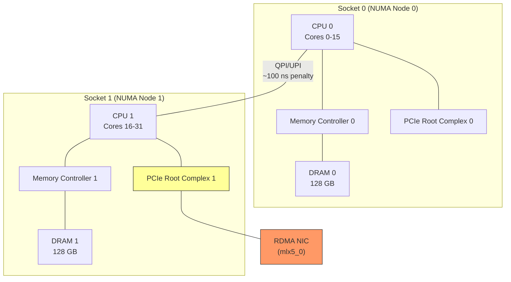

# 12.4 NUMA Awareness

Non-Uniform Memory Access (NUMA) is the memory architecture of virtually all modern multi-socket servers. In a NUMA system, each CPU socket has its own local memory controller and local DRAM. Accessing memory attached to the local socket is fast; accessing memory attached to a remote socket requires traversing the inter-socket interconnect (Intel QPI/UPI or AMD Infinity Fabric) and is significantly slower. For RDMA workloads, NUMA misalignment can silently degrade performance by 50--100%, making NUMA awareness one of the most important -- and most frequently overlooked -- performance considerations.

## NUMA Architecture

A typical dual-socket server has the following topology:



In this example, the RDMA NIC is physically connected to Socket 1's PCIe root complex. This means:

- **Local access** (Socket 1): DMA operations between the NIC and Socket 1's memory traverse only the local PCIe bus. Latency: ~100 ns.
- **Remote access** (Socket 0): DMA operations between the NIC and Socket 0's memory must cross the QPI/UPI interconnect. Latency: ~200 ns (2x penalty).

The penalty applies to **every DMA operation**: data transfers, WQE fetches, CQE writes, and doorbell propagation. For an RDMA operation that involves 4--6 DMA transactions, cross-NUMA penalties accumulate to 400--600 ns of additional latency.

## Determining NIC NUMA Affinity

Every PCIe device is associated with a specific NUMA node. To find your NIC's NUMA node:

```bash
# Method 1: sysfs (most reliable)
cat /sys/class/infiniband/mlx5_0/device/numa_node
# Output: 1

# Method 2: via PCI bus address
PCIADDR=$(readlink -f /sys/class/infiniband/mlx5_0/device | xargs basename)
cat /sys/bus/pci/devices/$PCIADDR/numa_node
# Output: 1

# Method 3: lstopo (hwloc package, shows full topology)
lstopo --of txt | grep -A5 mlx5

# Method 4: lspci + numactl
numactl --hardware
# Shows NUMA node distances and CPU-to-node mapping
```

<div class="warning">

**Beware of `-1` NUMA node**: Some systems report `numa_node` as `-1`, indicating the firmware did not properly configure NUMA affinity. In this case, you must determine the correct node manually from the PCIe topology, or assume node 0 and verify with benchmarks.

</div>

## Binding Processes to the Correct NUMA Node

### Using numactl

The `numactl` command is the simplest way to ensure NUMA-correct execution:

```bash
# Run the RDMA application on the NIC's NUMA node (node 1)
numactl --cpunodebind=1 --membind=1 ./rdma_server

# --cpunodebind=1: Schedule threads only on node 1's CPUs
# --membind=1:     Allocate all memory from node 1's DRAM
```

For more fine-grained control:

```bash
# Bind to specific CPUs on node 1 (e.g., cores 16-19)
numactl --physcpubind=16-19 --membind=1 ./rdma_server

# Prefer local memory but allow remote if local is exhausted
numactl --cpunodebind=1 --preferred=1 ./rdma_server
```

### CPU Affinity in Code

For applications that need programmatic control:

```c
#define _GNU_SOURCE
#include <sched.h>
#include <pthread.h>
#include <numa.h>
#include <numaif.h>

// Determine NIC's NUMA node programmatically
int get_nic_numa_node(const char *ib_dev_name) {
    char path[256];
    snprintf(path, sizeof(path),
             "/sys/class/infiniband/%s/device/numa_node",
             ib_dev_name);

    FILE *f = fopen(path, "r");
    if (!f) return -1;

    int node;
    fscanf(f, "%d", &node);
    fclose(f);
    return node;
}

// Bind current thread to the NIC's NUMA node
int bind_to_nic_node(const char *ib_dev_name) {
    int node = get_nic_numa_node(ib_dev_name);
    if (node < 0) return -1;

    // Get CPUs on this NUMA node
    struct bitmask *cpumask = numa_allocate_cpumask();
    numa_node_to_cpus(node, cpumask);

    // Set CPU affinity
    cpu_set_t cpuset;
    CPU_ZERO(&cpuset);
    for (int i = 0; i < numa_num_possible_cpus(); i++) {
        if (numa_bitmask_isbitset(cpumask, i))
            CPU_SET(i, &cpuset);
    }
    numa_free_cpumask(cpumask);

    return pthread_setaffinity_np(pthread_self(),
                                   sizeof(cpuset), &cpuset);
}

// Allocate memory on a specific NUMA node
void *alloc_on_node(size_t size, int node) {
    return numa_alloc_onnode(size, node);
    // Alternative: use mmap with mbind()
}
```

### Using taskset

For quick binding to specific cores:

```bash
# Bind to cores 16-23 (assumed to be on node 1)
taskset -c 16-23 ./rdma_server
```

## IRQ Affinity

When using event-driven completion notification (as opposed to polling), the NIC delivers interrupts to signal completions. These interrupts should be directed to CPUs on the NIC's NUMA node to avoid cross-socket handling:

```bash
# Find the NIC's IRQ numbers
cat /proc/interrupts | grep mlx5
#  78: ... mlx5_comp0@pci:0000:86:00.0
#  79: ... mlx5_comp1@pci:0000:86:00.0
#  ...

# Set IRQ affinity to CPUs on node 1 (cores 16-31)
# Mask: 0x00FF0000 (bits 16-23 set) or use irqbalance

# Pin IRQ 78 to core 16
echo 10000 > /proc/irq/78/smp_affinity
# Pin IRQ 79 to core 17
echo 20000 > /proc/irq/79/smp_affinity
```

Alternatively, use the `set_irq_affinity.sh` script provided by Mellanox/NVIDIA:

```bash
# Mellanox-provided script (included with MLNX_OFED)
/usr/sbin/set_irq_affinity_bynode.sh 1 mlx5_0
```

<div class="note">

**irqbalance interference**: The `irqbalance` daemon may reassign IRQ affinities. For RDMA applications, either stop `irqbalance` or configure it to exclude the NIC's IRQs:

```bash
# Option 1: Stop irqbalance entirely
systemctl stop irqbalance

# Option 2: Exclude NIC IRQs via IRQBALANCE_BANNED_INTERRUPTS
# Add to /etc/sysconfig/irqbalance
IRQBALANCE_BANNED_INTERRUPTS="78 79 80 81"
```

</div>

## NUMA-Aware Memory Allocation

For RDMA, the memory regions registered with `ibv_reg_mr` should be allocated on the NIC's NUMA node. This applies to:

- **Data buffers**: The source/destination memory for RDMA operations
- **Work queue buffers**: Allocated internally by libibverbs during QP creation
- **Completion queue buffers**: Allocated during CQ creation

### Data Buffer Allocation

```c
#include <numa.h>

int nic_node = get_nic_numa_node("mlx5_0");

// Allocate data buffer on NIC's NUMA node
size_t buf_size = 4096 * 1024;  // 4 MB
void *buf = numa_alloc_onnode(buf_size, nic_node);
if (!buf) {
    fprintf(stderr, "Failed to allocate on node %d\n", nic_node);
    exit(1);
}

// Register the NUMA-local buffer
struct ibv_mr *mr = ibv_reg_mr(pd, buf, buf_size,
    IBV_ACCESS_LOCAL_WRITE | IBV_ACCESS_REMOTE_WRITE);

// When done:
ibv_dereg_mr(mr);
numa_free(buf, buf_size);
```

### Huge Pages and NUMA

Huge pages (2 MB or 1 GB) provide two RDMA performance benefits: fewer TLB misses for the NIC's address translation, and guaranteed physically contiguous memory. Combining huge pages with NUMA-correct allocation:

```c
#include <sys/mman.h>

// Allocate huge pages on a specific NUMA node
void *buf = mmap(NULL, buf_size,
    PROT_READ | PROT_WRITE,
    MAP_PRIVATE | MAP_ANONYMOUS | MAP_HUGETLB,
    -1, 0);

// Bind to NUMA node using mbind
unsigned long nodemask = 1UL << nic_node;
mbind(buf, buf_size, MPOL_BIND, &nodemask,
      sizeof(nodemask) * 8, MPOL_MF_STRICT);
```

### Internal Buffer Placement

The libibverbs library allocates internal buffers (for WQEs, CQEs) during QP and CQ creation. These allocations use the calling thread's NUMA policy. Therefore, **create QPs and CQs from a thread bound to the NIC's NUMA node**:

```c
// Ensure we're on the right NUMA node before creating resources
bind_to_nic_node("mlx5_0");

// Now create CQ and QP - internal buffers will be NUMA-local
struct ibv_cq *cq = ibv_create_cq(ctx, cq_depth, NULL, NULL, 0);
struct ibv_qp *qp = ibv_create_qp(pd, &qp_init_attr);
```

## Measuring NUMA Effects

The impact of NUMA misalignment can be measured directly:

```bash
# Benchmark on correct NUMA node (node 1, where NIC is attached)
numactl --cpunodebind=1 --membind=1 ib_write_lat -d mlx5_0

# Benchmark on wrong NUMA node (node 0)
numactl --cpunodebind=0 --membind=0 ib_write_lat -d mlx5_0
```

Typical results for RDMA Write latency:

| Configuration | Latency (us) | Bandwidth (GB/s) |
|--------------|-------------|-------------------|
| Local NUMA (correct) | 1.2 | 12.0 |
| Remote NUMA (wrong) | 1.8 | 8.5 |
| **Penalty** | **+50%** | **-29%** |

The bandwidth penalty is often worse than the latency penalty because every DMA operation pays the cross-socket tax, and bandwidth workloads involve many more DMA operations per second.

## Verifying NUMA Correctness at Runtime

Use `numastat` to monitor NUMA memory allocation in a running application:

```bash
# Monitor per-node memory allocation for a process
numastat -p $(pidof rdma_server)

# Example output:
#                  Node 0     Node 1
# Heap                0.50       95.20    # Most memory on node 1 (good)
# Stack               0.10        0.00
# Private             1.20      102.40
```

If you see significant memory on the "wrong" node, the application has a NUMA allocation problem.

## Multi-NIC NUMA Considerations

Servers with multiple RDMA NICs may have NICs on different NUMA nodes:

```bash
# NIC 0 on node 0
cat /sys/class/infiniband/mlx5_0/device/numa_node  # 0

# NIC 1 on node 1
cat /sys/class/infiniband/mlx5_1/device/numa_node  # 1
```

In this configuration, the application should use separate threads for each NIC, with each thread bound to the NIC's NUMA node:

```c
// Thread for NIC on node 0
void *nic0_thread(void *arg) {
    bind_to_nic_node("mlx5_0");
    // All RDMA operations for mlx5_0 happen here
    run_rdma_worker("mlx5_0");
    return NULL;
}

// Thread for NIC on node 1
void *nic1_thread(void *arg) {
    bind_to_nic_node("mlx5_1");
    // All RDMA operations for mlx5_1 happen here
    run_rdma_worker("mlx5_1");
    return NULL;
}
```

## NUMA Checklist

| Item | How to Check | Fix |
|------|-------------|-----|
| NIC NUMA node | `cat /sys/class/infiniband/*/device/numa_node` | -- |
| Process CPU binding | `taskset -p <pid>` | `numactl --cpunodebind` |
| Memory allocation node | `numastat -p <pid>` | `numactl --membind` |
| IRQ affinity | `cat /proc/irq/*/smp_affinity` | `set_irq_affinity_bynode.sh` |
| irqbalance disabled | `systemctl status irqbalance` | `systemctl stop irqbalance` |
| Huge pages on correct node | `cat /sys/devices/system/node/node*/hugepages/*/nr_hugepages` | `echo N > .../nr_hugepages` |

<div class="tip">

**Rule of thumb**: Every RDMA resource -- threads, memory buffers, QPs, CQs, and interrupt handlers -- should be on the same NUMA node as the NIC. Treat NUMA misalignment as a bug, not a configuration preference.

</div>
