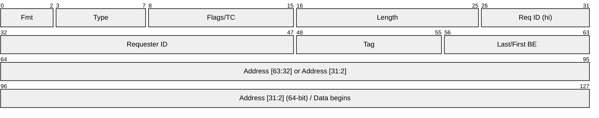

# 12.3 PCIe Considerations

The PCI Express (PCIe) bus is the physical interconnect between the CPU and the RDMA NIC. Every RDMA operation traverses PCIe at least twice: once for the doorbell write and WQE fetch, and once for the data DMA transfer. In many real-world deployments, PCIe -- not the network link -- is the binding performance constraint. Understanding PCIe architecture, its overheads, and the techniques to maximize PCIe efficiency is essential for RDMA performance engineering.

## PCIe Generations and Bandwidth

PCIe bandwidth has doubled with each generation. The following table shows the raw and effective bandwidths for common configurations:

| Generation | Data Rate (per lane) | Encoding | Effective Rate (per lane) | x8 Bandwidth | x16 Bandwidth |
|-----------|---------------------|----------|--------------------------|---------------|----------------|
| Gen3 | 8.0 GT/s | 128b/130b | ~1.0 GB/s | ~8 GB/s | ~16 GB/s |
| Gen4 | 16.0 GT/s | 128b/130b | ~2.0 GB/s | ~16 GB/s | ~32 GB/s |
| Gen5 | 32.0 GT/s | 128b/130b | ~4.0 GB/s | ~32 GB/s | ~64 GB/s |

The "effective rate" accounts for the encoding overhead. Gen3+ uses 128b/130b encoding, which wastes only 2 bits per 130 (1.5% overhead), a significant improvement over Gen1/Gen2's 8b/10b encoding (20% overhead).

<div class="note">

**Matching PCIe to link speed**: A 100 Gbps NIC requires ~12.5 GB/s of PCIe bandwidth for data alone. A PCIe Gen3 x16 slot provides ~16 GB/s, leaving only ~3.5 GB/s of headroom for DMA overhead. A PCIe Gen4 x16 slot provides ~32 GB/s, comfortably accommodating 100 Gbps. For 200 Gbps or 400 Gbps NICs, PCIe Gen5 is essential.

</div>

## PCIe Transaction Layer Packets (TLPs)

All data crossing the PCIe bus is encapsulated in Transaction Layer Packets. Understanding TLP structure is key to understanding PCIe efficiency.



A TLP consists of:

- **TLP header**: 12 bytes (3 DW) for 32-bit addressing, 16 bytes (4 DW) for 64-bit addressing
- **Payload**: 0 to MPS bytes of data
- **ECRC** (optional): 4 bytes end-to-end CRC
- **Link-layer framing**: additional 2--6 bytes of overhead per TLP

The key parameter is **Max Payload Size (MPS)**: the maximum number of data bytes in a single TLP. Common MPS values are 128, 256, or 512 bytes. Larger MPS means fewer TLPs for the same data transfer, reducing per-TLP overhead.

### PCIe Bandwidth Efficiency

The effective PCIe bandwidth accounting for TLP overhead is:

$$BW_{pcie} = \frac{MPS}{MPS + TLP_{header}} \times lanes \times rate_{per\_lane}$$

For a Gen4 x16 link with MPS=256 and a 20-byte TLP overhead (header + framing):

$$BW_{pcie} = \frac{256}{256 + 20} \times 16 \times 2.0 \text{ GB/s} = \frac{256}{276} \times 32 = 29.7 \text{ GB/s}$$

With MPS=128:

$$BW_{pcie} = \frac{128}{128 + 20} \times 32 = 27.7 \text{ GB/s}$$

The difference is significant. Increasing MPS from 128 to 256 yields ~7% more effective bandwidth.

To check and configure MPS on Linux:

```bash
# Check current MPS for a device
lspci -s 86:00.0 -vvv | grep MaxPayload
#   MaxPayload 256 bytes, MaxReadReq 512 bytes

# Set MPS (requires root, affects entire hierarchy)
setpci -s 86:00.0 CAP_EXP+08.w=2050  # Example: set MPS to 256
```

### Max Read Request Size (MRRS)

For DMA reads (NIC fetching data from host memory), the **Max Read Request Size** limits how much data can be requested in a single read TLP. Larger MRRS reduces the number of read requests and improves efficiency:

```bash
# Check MRRS
lspci -s 86:00.0 -vvv | grep MaxReadReq
#   MaxReadReq 512 bytes
```

## MMIO Writes: The Doorbell Cost

When the application posts a work request, it writes to a memory-mapped I/O (MMIO) register on the NIC -- the doorbell. MMIO writes are fundamentally different from regular memory writes:

- **Uncacheable**: MMIO writes bypass all CPU caches and go directly to the PCIe bus
- **Serializing**: The CPU's memory ordering guarantees may require pipeline flushes
- **Non-posted** (for reads) or **posted** (for writes): MMIO reads are especially expensive as they require a round-trip

A single MMIO write to the NIC's BAR space costs approximately 100--200 ns, compared to ~5 ns for a cached memory write. This is why doorbell amortization (batching) is so important.

```c
// Each ibv_post_send ultimately does something like:
*(volatile uint32_t *)doorbell_addr = doorbell_value;
// This write traverses: CPU -> write buffer -> PCIe root complex -> NIC
// Cost: ~100-200 ns, compared to ~5 ns for a normal memory write
```

## BlueFlame: Optimizing the MMIO Path

BlueFlame (specific to Mellanox/NVIDIA NICs) eliminates the NIC's DMA read of the WQE by piggybacking the WQE data on the doorbell write itself. It works by using **write-combining** (WC) MMIO mappings.

### How BlueFlame Works

1. The NIC exposes a special BlueFlame register within the UAR page
2. The UAR page is mapped with **write-combining** memory type (`pgprot_writecombine`)
3. The application writes the 64-byte WQE to the BlueFlame register using a series of 8-byte stores
4. The CPU's write-combining buffer aggregates these stores into a single 64-byte PCIe write transaction
5. The NIC receives the WQE inline with the doorbell -- no DMA read needed

```
Normal doorbell path:
  CPU -> doorbell MMIO write -> NIC
  NIC -> DMA read WQE from host memory -> NIC processes WQE

BlueFlame path:
  CPU -> WC MMIO write (doorbell + WQE data) -> NIC processes WQE immediately
```

The savings are substantial: eliminating the WQE DMA read removes one PCIe round-trip (~300 ns), reducing small-message latency by 20--30%.

<div class="warning">

**BlueFlame limitations**: BlueFlame only works for WQEs that fit in 64 bytes (the write-combining buffer size). Operations with multiple SGEs or large descriptors cannot use BlueFlame. Additionally, BlueFlame requires proper WC mapping support from the CPU and operating system.

</div>

## Relaxed Ordering

By default, PCIe enforces strict ordering: DMA writes must complete in the order they were issued. This prevents the NIC from overlapping or reordering DMA transactions, limiting throughput.

**Relaxed ordering** allows the NIC to reorder PCIe transactions for higher throughput. When enabled, the NIC can issue multiple outstanding DMA reads and writes without waiting for earlier transactions to complete.

Relaxed ordering is particularly beneficial for:

- **Large RDMA transfers**: Multiple DMA reads can be pipelined
- **Multi-QP workloads**: DMA transactions from different QPs can be interleaved
- **Scatter-gather operations**: Multiple SGE fetches can proceed in parallel

Enable relaxed ordering when registering memory regions:

```c
// Enable relaxed ordering for MR
struct ibv_mr *mr = ibv_reg_mr(pd, buf, size,
    IBV_ACCESS_LOCAL_WRITE |
    IBV_ACCESS_REMOTE_WRITE |
    IBV_ACCESS_RELAXED_ORDERING);  // Allow reordering
```

<div class="warning">

**Ordering implications**: Relaxed ordering means that a completion for an RDMA Write does not guarantee that the data is visible to the remote CPU in the order it was written. Applications that depend on write ordering (e.g., writing data then setting a flag) must use RDMA Write with Immediate or explicit fences.

</div>

## Read Combining and Write Combining

**Write combining (WC)** is a CPU feature that aggregates multiple sequential writes to the same cache line into a single bus transaction. This is critical for BlueFlame and beneficial for any MMIO write pattern.

**Read combining** is less relevant for RDMA since the NIC, not the CPU, initiates most reads (DMA reads from host memory). However, CPU reads from NIC MMIO space (e.g., reading the CQ doorbell) benefit from proper caching configuration.

Memory type configuration for RDMA-relevant regions:

| Region | Memory Type | Reason |
|--------|-------------|--------|
| Doorbell (UAR) | Write-combining (WC) | Aggregate doorbell + WQE writes |
| Data buffers | Write-back (WB) | Normal cached access for CPU |
| CQ buffers | Write-back (WB) | Polling reads benefit from caching |
| BlueFlame register | Write-combining (WC) | Aggregate WQE data writes |

## PCIe Bottleneck Analysis

Determining whether PCIe is the bottleneck requires comparing the total PCIe traffic against the available PCIe bandwidth.

Total PCIe traffic for an RDMA Write includes:

| Traffic | Direction | Size | Per-message |
|---------|-----------|------|-------------|
| Doorbell write | CPU -> NIC | 8 bytes | Once per batch |
| WQE DMA read | NIC -> CPU -> NIC | 64 bytes | Per WQE (skipped with BlueFlame) |
| Data DMA read | NIC -> CPU -> NIC | payload size | Per SGE |
| CQE DMA write | NIC -> CPU | 32--64 bytes | Per signaled completion |

For a single RDMA Write of 4 KB payload with signal interval of 32:

$$PCIe_{total} = 8 + 64 + 4096 + \frac{64}{32} = 4170 \text{ bytes per message}$$

The PCIe overhead ratio:

$$overhead = \frac{4170 - 4096}{4096} = 1.8\%$$

For small messages (64 bytes), the overhead is much larger:

$$PCIe_{total} = 8 + 64 + 64 + \frac{64}{32} = 138 \text{ bytes per message}$$

$$overhead = \frac{138 - 64}{64} = 115.6\%$$

This means PCIe carries 2.15x more bytes than the payload, which can become the bottleneck for small-message workloads at high message rates.

## Checking PCIe Configuration

Use `lspci` to verify your NIC's PCIe configuration:

```bash
# Find the NIC's PCIe device
lspci | grep Mellanox
# 86:00.0 Infiniband controller: Mellanox Technologies MT28908 [ConnectX-6]

# Check detailed PCIe capabilities
lspci -s 86:00.0 -vvv | grep -E "LnkCap|LnkSta|MaxPayload|MaxReadReq"
#   LnkCap: Port #0, Speed 16GT/s, Width x16
#   LnkSta: Speed 16GT/s (ok), Width x16 (ok)
#   DevCtl: MaxPayload 256 bytes, MaxReadReq 512 bytes

# Check NUMA node
cat /sys/bus/pci/devices/0000:86:00.0/numa_node
# 1
```

Common issues to check:

1. **Link speed degradation**: `LnkSta` shows lower speed than `LnkCap` -- indicates a bad cable, slot, or riser
2. **Width degradation**: x16 capable device running at x8 -- check physical seating
3. **Wrong NUMA node**: NIC on node 1 but application running on node 0

```bash
# Quick PCIe health check script
#!/bin/bash
DEV="86:00.0"
echo "PCIe Link Status:"
lspci -s $DEV -vvv | grep -E "LnkCap|LnkSta"
echo ""
echo "Payload/Request Sizes:"
lspci -s $DEV -vvv | grep -E "MaxPayload|MaxReadReq"
echo ""
echo "NUMA Node:"
cat /sys/bus/pci/devices/0000:$DEV/numa_node
```

<div class="tip">

**PCIe performance counters**: Some systems expose PCIe performance counters through the `perf` tool or vendor-specific utilities. NVIDIA's `mlnx_perf` can show PCIe utilization for ConnectX NICs. Use these to confirm whether PCIe is saturated.

</div>

## PCIe Gen5 and Beyond

PCIe Gen5 (32 GT/s) doubles bandwidth again, providing ~64 GB/s with x16 lanes. This is critical for 400 Gbps NICs, which require ~50 GB/s of PCIe bandwidth for data alone. Gen5 also introduces **Compute Express Link (CXL)**, which shares the PCIe physical layer but adds cache coherency protocols -- opening the door to coherent NIC-to-CPU memory access in future RDMA implementations.

PCIe Gen6 (64 GT/s, expected 2025--2026) will provide ~128 GB/s with x16, supporting 800 Gbps and beyond.
