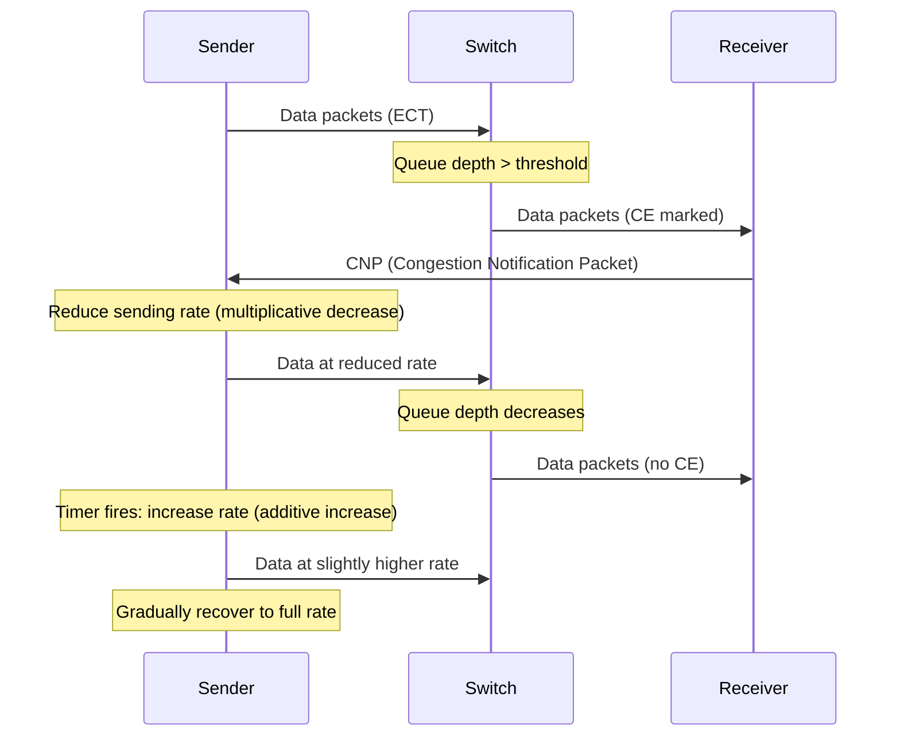

# 13.3 ECN and DCQCN

While PFC prevents packet loss, it is a reactive, coarse-grained mechanism that creates head-of-line blocking and can cascade across the fabric. The primary congestion control mechanism for RoCEv2 networks should be **Explicit Congestion Notification (ECN)** combined with the **DCQCN** (Data Center Quantized Congestion Notification) algorithm. ECN provides early warning of congestion, and DCQCN translates those warnings into sender-side rate adjustments that resolve congestion before PFC is needed.

## Explicit Congestion Notification (ECN)

### ECN in the IP Header

ECN uses two bits in the IP header's Type of Service (ToS) / Differentiated Services field:

| ECN Bits | Code Point | Meaning |
|----------|------------|---------|
| 00 | Not-ECT | Not ECN-Capable Transport |
| 01 | ECT(1) | ECN-Capable Transport |
| 10 | ECT(0) | ECN-Capable Transport |
| 11 | CE | Congestion Experienced |

RDMA endpoints set the ECN bits to ECT(0) or ECT(1) to indicate that they support ECN. When a switch detects congestion, it changes the ECN bits to CE (Congestion Experienced) rather than dropping the packet. The packet is delivered with the CE marking intact.

### ECN Marking at Switches

Switches mark packets with ECN CE based on queue depth thresholds. The two most common marking strategies are:

**Threshold-based marking**: Mark all packets when queue depth exceeds a fixed threshold.

$$P_{mark} = \begin{cases} 0 & \text{if } q < K_{min} \\ 1 & \text{if } q \geq K_{min} \end{cases}$$

**RED-like probabilistic marking**: Mark packets with increasing probability as queue depth grows between minimum and maximum thresholds.

$$P_{mark} = \begin{cases} 0 & \text{if } q < K_{min} \\ \frac{q - K_{min}}{K_{max} - K_{min}} & \text{if } K_{min} \leq q < K_{max} \\ 1 & \text{if } q \geq K_{max} \end{cases}$$

Where $q$ is the instantaneous queue depth and $K_{min}$, $K_{max}$ are configurable thresholds.

```
! Switch ECN configuration example
! Enable ECN marking on priority 3 with WRED profile
interface Ethernet1/1
  random-detect ecn
  random-detect minimum-threshold priority 3 150 kbytes
  random-detect maximum-threshold priority 3 1500 kbytes
```

<div class="tip">

**ECN threshold tuning**: Setting thresholds too low causes unnecessary rate reduction (under-utilization). Setting them too high causes ECN to react too late, triggering PFC. A good starting point is $K_{min} = 100\text{--}200$ KB for 100 Gbps ports, adjusted based on observed PFC activity.

</div>

## DCQCN Algorithm

DCQCN (Data Center QCN) is the end-to-end congestion control algorithm used in RoCEv2 networks. It is based on the IEEE 802.1Qau Quantized Congestion Notification (QCN) standard, adapted for Layer 3 (IP-routed) data center networks.

### Algorithm Overview

DCQCN operates through three participants:

1. **Switch** (Congestion Point): Detects congestion and marks packets with ECN CE
2. **Receiver** (Reaction Point): Observes CE-marked packets and sends CNP (Congestion Notification Packet) back to sender
3. **Sender** (Rate Limiter): Receives CNP and adjusts its sending rate



### Step 1: ECN Marking at the Switch

When the switch's output queue for the relevant priority exceeds the configured ECN threshold, it sets the CE bits in the IP header of transiting packets. The switch does not drop or delay the packet -- it only marks it.

### Step 2: CNP Generation at the Receiver

When the RDMA NIC at the receiver detects a CE-marked packet, it generates a **Congestion Notification Packet (CNP)** and sends it back to the sender. The CNP is a special RoCEv2 packet (opcode 0x81) containing:

- The destination QP number of the congested flow
- The DSCP/priority of the congested traffic class

The receiver rate-limits CNP generation to avoid flooding the sender. Typically, at most one CNP is sent per flow per microsecond interval.

### Step 3: Rate Adjustment at the Sender

Upon receiving a CNP, the sender adjusts its transmission rate using a combination of multiplicative decrease and additive increase:

**Multiplicative Decrease (on CNP receipt):**

$$R_{target} = R_{current} \times (1 - \alpha / 2)$$

Where $\alpha$ is the congestion severity factor, updated using an exponential moving average:

$$\alpha = (1 - g) \times \alpha_{prev} + g$$

The parameter $g$ is the gain factor (typically 1/256). Each CNP reception increases $\alpha$; the absence of CNPs causes $\alpha$ to decay toward zero.

The current rate is immediately cut:

$$R_{current} = R_{target}$$

**Additive Increase (on timer expiration):**

Between CNP receptions, the sender periodically increases its rate. DCQCN uses a two-phase recovery:

*Phase 1: Fast Recovery (timer-based)*

$$R_{current} = R_{current} + R_{AI}$$

Where $R_{AI}$ is the additive increase rate (e.g., 40 Mbps per timer interval).

*Phase 2: Hyper Increase*

After several timer intervals without a CNP, the sender switches to faster recovery:

$$R_{current} = \frac{R_{current} + R_{target}}{2}$$

This allows rapid recovery when congestion has clearly subsided.

*Phase 3: Byte Counter Increase*

Additionally, after transmitting a configurable number of bytes without receiving a CNP, the rate is further increased:

$$R_{target} = R_{target} + R_{AI\_bytes}$$

### DCQCN Rate Control State Machine

The complete DCQCN state machine at the sender can be summarized:

```
State: NORMAL (sending at line rate)
  |
  v
[CNP received]
  |
  v
State: RATE_LIMITED
  - Cut rate: R = R * (1 - alpha/2)
  - Start recovery timer
  |
  +--> [Timer fires, no CNP] --> Increase R by R_AI
  |                               |
  |                               +--> [After F timer intervals]
  |                                     --> Hyper-increase: R = (R + R_target) / 2
  |
  +--> [CNP received again] --> Cut rate again
  |
  +--> [R reaches line rate] --> State: NORMAL
```

### Key DCQCN Parameters

| Parameter | Symbol | Typical Value | Description |
|-----------|--------|---------------|-------------|
| Gain factor | $g$ | 1/256 | Alpha EWMA weight |
| Rate reduction factor | $1 - \alpha/2$ | Variable | Multiplicative decrease |
| Additive increase rate | $R_{AI}$ | 5--40 Mbps | Timer-based rate increase |
| Timer interval | $T$ | 55 us | Recovery timer period |
| Hyper-increase threshold | $F$ | 5 | Timer intervals before hyper-increase |
| Byte counter threshold | $B_{AI}$ | 150 KB | Bytes before byte-counter increase |
| CNP interval | $T_{CNP}$ | 50 us | Minimum interval between CNPs |

### Configuring DCQCN on ConnectX NICs

```bash
# Enable ECN on the NIC for priority 3
mlnx_qos -d mlx5_0 --ecn 0,0,0,1,0,0,0,0
# Format: pri0,pri1,...,pri7 (1=ECN enabled)

# Set DSCP value for RoCE traffic (maps to switch ECN marking)
echo 26 > /sys/class/infiniband/mlx5_0/tc/1/traffic_class

# Advanced: Tune DCQCN parameters (via mlx5 debugfs or sysctl)
# These are typically left at defaults unless specific tuning is needed
```

## Tuning DCQCN

### ECN Threshold Tuning on Switches

The ECN marking threshold is the most critical tuning parameter. It must balance two competing goals:

- **Too low** (e.g., 10 KB): ECN marks packets too early, triggering unnecessary rate reduction. Result: under-utilization of the link.
- **Too high** (e.g., 5 MB): ECN marks packets too late, allowing queues to build and triggering PFC. Result: PFC storms and head-of-line blocking.

Guidelines for threshold selection:

| Port Speed | $K_{min}$ (minimum threshold) | $K_{max}$ (maximum threshold) |
|-----------|------|------|
| 25 Gbps | 50--100 KB | 500 KB--1 MB |
| 100 Gbps | 100--200 KB | 1--2 MB |
| 200 Gbps | 200--400 KB | 2--4 MB |
| 400 Gbps | 400--800 KB | 4--8 MB |

These values assume shallow-buffer switches (32--64 MB total buffer). Deep-buffer switches allow higher thresholds.

### Rate Parameter Tuning

- **Aggressive rate reduction** (small $\alpha$ decay, large $g$): Responds quickly to congestion but may cause throughput oscillation
- **Conservative rate reduction** (large $\alpha$ decay, small $g$): Smooths throughput but may not reduce rate fast enough to prevent PFC

The default DCQCN parameters work well for most deployments. Tuning is typically only needed for:
- Mixed workloads with very different flow sizes (elephant and mice flows)
- Networks with unusual latency characteristics (long-distance links)
- Fabrics with limited buffer space

### Validating DCQCN Operation

```bash
# Monitor ECN counters on the NIC
ethtool -S mlx5_0 | grep ecn
#   rx_ecn_mark: 12345     # ECN-marked packets received
#   rx_cnp:      6789      # CNPs received (we are being rate-limited)
#   tx_cnp:      0         # CNPs sent (we are rate-limiting others)

# Healthy behavior:
# - Some rx_ecn_mark is normal under load
# - rx_cnp should be proportional to ecn_mark
# - PFC pause counters should remain near zero
```

<div class="warning">

**DCQCN + PFC interaction**: DCQCN and PFC must be coordinated. The ECN marking threshold ($K_{min}$) must be lower than the PFC XOFF threshold. If ECN is marked only after PFC activates, DCQCN cannot prevent PFC triggering:

$$K_{min}^{ECN} < threshold_{XOFF}^{PFC}$$

A good rule of thumb: set $K_{min}^{ECN}$ to 10--30% of the PFC XOFF threshold.

</div>

## Alternative Congestion Control Algorithms

### TIMELY (RTT-based)

Developed by Google, TIMELY uses measured round-trip time (RTT) as the congestion signal instead of ECN:

- **Advantage**: No switch configuration required (no ECN marking)
- **Advantage**: RTT provides a continuous congestion signal (vs. ECN's binary signal)
- **Disadvantage**: RTT measurement accuracy is limited by NIC timestamp resolution
- **Disadvantage**: Does not distinguish between queuing delay and propagation delay changes

### HPCC (High Precision Congestion Control)

Developed by Alibaba, HPCC uses **in-network telemetry** (INT) to provide precise congestion information:

- Switches embed queue depth, link utilization, and timestamp in packet headers
- The sender observes exact congestion state at every hop
- Rate adjustment is precise: the sender calculates the exact rate needed to eliminate congestion

HPCC achieves near-zero queue occupancy with near-100% utilization, but requires INT support in all switches.

### Swift

Developed by Google, Swift is a delay-based algorithm designed for large-scale deployments:

- Uses fabric-level RTT measurements
- Separates endpoint delay from fabric delay
- Targets a specific fabric delay (e.g., 2 us)
- Scales to networks with hundreds of thousands of endpoints

### Comparison

| Algorithm | Signal | Switch Config | Precision | Deployment |
|-----------|--------|--------------|-----------|------------|
| DCQCN | ECN | Required | Moderate | Widespread |
| TIMELY | RTT | None | Low | Google internal |
| HPCC | INT | Required (INT) | High | Alibaba, research |
| Swift | RTT | None | Moderate | Google internal |

For most deployments, DCQCN remains the standard choice due to broad hardware and switch support.

## End-to-End Configuration Summary

A complete RoCEv2 congestion control deployment requires coordinated configuration across NICs and switches:

### NIC Configuration

```bash
# 1. Enable ECN for RoCE priority
mlnx_qos -d mlx5_0 --ecn 0,0,0,1,0,0,0,0

# 2. Enable PFC as safety net
mlnx_qos -d mlx5_0 --pfc 0,0,0,1,0,0,0,0

# 3. Set DSCP for RoCE traffic
cma_roce_tos -d mlx5_0 -t 106
# DSCP 26 (binary 011010) -> ToS byte 104 (26 << 2 | ECT)
```

### Switch Configuration (Conceptual)

```
! 1. Map DSCP 26 to priority queue 3
qos map dscp-to-queue 26 to 3

! 2. Enable PFC on priority 3
priority-flow-control mode on
priority-flow-control priority 3 no-drop

! 3. Enable ECN marking on priority 3
random-detect ecn
random-detect minimum-threshold priority 3 150 kbytes
random-detect maximum-threshold priority 3 1500 kbytes

! 4. Enable PFC watchdog
priority-flow-control watchdog timeout 300
priority-flow-control watchdog action drop
```

<div class="note">

**Vendor-specific details**: The exact configuration commands vary significantly between switch vendors (Cisco, Arista, Broadcom SONiC, Mellanox Onyx/Cumulus). Always consult your switch vendor's RoCEv2 deployment guide for exact syntax and recommended parameter values.

</div>
