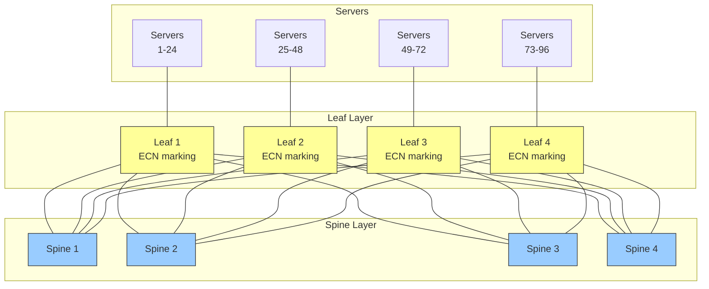

# 13.4 Fabric Design for RDMA

The network fabric's physical topology, switch architecture, and traffic engineering configuration are the foundation upon which all RDMA congestion control mechanisms operate. A poorly designed fabric will suffer from congestion no matter how well PFC and DCQCN are tuned. Conversely, a well-designed fabric minimizes congestion opportunities and allows the congestion control mechanisms to handle the remaining transient events effectively.

This section covers the fabric design principles that create a robust foundation for RoCEv2 deployment.

## Clos and Fat-Tree Topology

The **Clos topology** (also called a fat-tree when applied to networks) is the standard architecture for data center networks that support RDMA. A Clos network provides **non-blocking** connectivity: any endpoint can communicate with any other endpoint at full line rate without contention, provided the traffic matrix is admissible (no single endpoint is oversubscribed).

### Two-Tier Clos (Leaf-Spine)

The most common data center topology is the two-tier leaf-spine:



**Properties of leaf-spine:**

- Every leaf is connected to every spine (full mesh between layers)
- Traffic between any two leaves traverses exactly 2 hops (leaf -> spine -> leaf)
- Equal-cost paths exist between every pair of leaves (one through each spine)
- Horizontal scaling: add more spines for more bisection bandwidth, more leaves for more endpoints

**Full bisection bandwidth** means the aggregate bandwidth between any two halves of the network equals the aggregate server-facing bandwidth. In the diagram above, with 4 spines and 100 Gbps links:

$$BW_{bisection} = 4 \times 100 \text{ Gbps} = 400 \text{ Gbps per leaf}$$

If each leaf has 24 downlink ports at 100 Gbps (2.4 Tbps aggregate), and 4 uplinks at 100 Gbps (400 Gbps aggregate), the oversubscription ratio is:

$$oversubscription = \frac{24 \times 100}{4 \times 100} = 6:1$$

For RDMA deployments, an oversubscription ratio of 2:1 or lower is recommended. A 1:1 (non-blocking) fabric is ideal but expensive.

### Three-Tier Clos

For larger deployments (thousands of servers), a three-tier Clos adds a **super-spine** layer:

```
Super-Spine Layer (Tier 3)
        |
    Spine Layer (Tier 2)
        |
    Leaf Layer (Tier 1)
        |
    Servers
```

Three-tier Clos networks scale to tens of thousands of endpoints while maintaining non-blocking properties. The trade-off is increased latency (4 hops instead of 2 for inter-pod traffic) and more complex cabling and management.

## Switch Buffer Sizing

Switch buffer architecture profoundly affects RDMA congestion control behavior.

### Shallow vs. Deep Buffers

| Characteristic | Shallow Buffer (12--32 MB) | Deep Buffer (64--256 MB) |
|---------------|---------------------------|--------------------------|
| Cost | Lower (merchant silicon) | Higher (custom ASIC) |
| Port density | Higher | Lower |
| PFC headroom | Limited (constrains reaction time) | Ample |
| ECN sensitivity | Must mark early | Can absorb bursts |
| Typical use | Leaf switches | Spine switches, WAN |
| Examples | Broadcom Memory (12--32 MB) | Memory (64+ MB) |

For RDMA deployments:

- **Leaf switches**: Shallow buffers are acceptable if ECN thresholds are properly tuned to trigger before PFC
- **Spine switches**: Moderate buffers (32--64 MB) help absorb transient bursts from multiple leaves converging on one spine uplink
- **All switches**: PFC headroom must be correctly calculated based on cable length and port speed

### Buffer Allocation

Switch buffers are typically divided into:

- **Ingress buffer**: Absorbs incoming traffic before forwarding decisions
- **Egress buffer**: Queues traffic waiting for the output port
- **Headroom buffer**: Reserved exclusively for PFC -- holds traffic between the PFC XOFF trigger and the upstream sender stopping

```
Total switch buffer: 32 MB

Allocation for 32-port switch (100 Gbps):
  Per-port shared buffer: ~800 KB
  Per-port PFC headroom:  ~40 KB (per lossless priority)
  Shared pool:            ~6 MB (dynamically shared across ports)
```

The headroom buffer must be large enough to absorb traffic during PFC reaction time:

$$headroom_{per\_port} = (t_{cable} + t_{switch} + t_{NIC}) \times BW_{port}$$

For a 100 Gbps port with 5-meter cable and 3 us total reaction time:

$$headroom = 3 \times 10^{-6} \times 12.5 \times 10^9 = 37.5 \text{ KB}$$

With 32 ports and one lossless priority, total headroom is $32 \times 37.5 = 1.2$ MB, leaving adequate shared buffer.

## ECMP: Equal-Cost Multi-Path

ECMP distributes traffic across multiple equal-cost paths, which is essential in Clos topologies where multiple spine paths exist between any pair of leaves.

### Hash-Based Load Balancing

ECMP uses a hash function on packet header fields to determine the output path:

$$path = hash(src\_ip, dst\_ip, src\_port, dst\_port, protocol) \mod N_{paths}$$

For RoCEv2 traffic, the hash typically uses:
- Source and destination IP addresses
- UDP source port (randomized per QP by the NIC)
- UDP destination port (4791 for RoCEv2)

### ECMP Challenges for RDMA

**Flow polarization**: If the hash function maps many flows to the same path, some spines are overloaded while others are idle. This is particularly problematic for RDMA because:
- RDMA flows are often long-lived (persistent QP connections)
- A few large flows can dominate total traffic
- Once polarized, the imbalance persists until flows are rebalanced

**Elephant flows**: A single large RDMA transfer can saturate a spine link. ECMP cannot split a single flow across multiple paths (doing so would cause packet reordering, which is expensive for RDMA).

**Mitigations**:

1. **More spine paths**: More spines give the hash function more output options, reducing collision probability
2. **Flowlet switching**: Split flows at natural gaps (flowlets) to re-hash across paths
3. **Adaptive routing**: NIC or switch dynamically selects the least-congested path (ConnectX-7 supports this)
4. **Multi-path QPs**: Use multiple QPs to the same destination, each hashing to a different path

```bash
# Verify ECMP paths on Linux
ip route show
# Example: 10.0.0.0/24 via 10.0.1.1 dev eth0
#          10.0.0.0/24 via 10.0.1.2 dev eth0  (ECMP)

# Check ECMP hash policy
sysctl net.ipv4.fib_multipath_hash_policy
# 0: Layer 3 only (src_ip, dst_ip)
# 1: Layer 3+4 (src_ip, dst_ip, src_port, dst_port) - preferred for RoCE
```

## QoS Configuration

Quality of Service configuration ensures RDMA traffic receives appropriate treatment throughout the fabric.

### Traffic Classification

Map RDMA traffic to a dedicated traffic class (TC) with lossless properties:

| Traffic Class | Priority | PFC | ECN | Description |
|--------------|----------|-----|-----|-------------|
| TC0 | 0 | No | No | Best-effort (default) |
| TC1 | 1 | No | No | Background |
| TC2 | 2 | No | No | Standard |
| **TC3** | **3** | **Yes** | **Yes** | **RDMA (lossless)** |
| TC4 | 4 | No | No | Video/streaming |
| TC5 | 5 | No | No | Voice |
| TC6 | 6 | No | No | Network control |
| TC7 | 7 | No | No | Internetwork control |

### Bandwidth Allocation (ETS)

Enhanced Transmission Selection (802.1Qaz) allocates bandwidth among traffic classes:

```
! ETS bandwidth allocation
qos ets bandwidth-allocation
  traffic-class 0 bandwidth 40   ! Best-effort gets 40%
  traffic-class 3 bandwidth 50   ! RDMA gets 50%
  traffic-class 6 bandwidth 10   ! Control gets 10%
```

<div class="note">

**Strict priority vs. ETS**: Some deployments use strict priority scheduling for RDMA traffic (TC3 always preempts lower priorities). This guarantees RDMA bandwidth but can starve other traffic classes. ETS provides fairer sharing and is generally preferred unless RDMA requires absolute priority.

</div>

### Separating Lossless and Lossy Traffic

A fundamental principle of RoCEv2 fabric design is to separate lossless (RDMA) and lossy (TCP, UDP) traffic into different priority classes:

- **Lossless traffic** (PFC-enabled): Only RDMA traffic on TC3
- **Lossy traffic** (no PFC): Everything else on TC0

This separation prevents lossy traffic from triggering PFC pauses that affect RDMA, and prevents RDMA congestion from interfering with other traffic.

```bash
# NIC: Ensure only RDMA uses the lossless priority
# Set RoCE DSCP to 26 (maps to TC3)
cma_roce_tos -d mlx5_0 -t 106

# Verify traffic separation
mlnx_qos -d mlx5_0
```

## Network Design Best Practices for RoCEv2

### Topology

1. **Use leaf-spine (Clos) topology**: Provides predictable, non-blocking connectivity
2. **Minimize oversubscription**: Target 2:1 or lower for RDMA-heavy workloads; 1:1 for storage
3. **Keep cable lengths short**: Shorter cables mean less PFC headroom needed and lower propagation delay
4. **Use consistent link speeds**: Mixed speeds (e.g., 25G downlinks, 100G uplinks) complicate buffer sizing

### Switch Configuration

1. **Enable ECN marking on all switch ports**: Both leaf and spine (congestion can occur at any hop)
2. **Enable PFC on lossless priority only**: One priority (e.g., TC3) for RDMA
3. **Enable PFC watchdog**: 100--500 ms timeout with drop action
4. **Configure ETS**: Guarantee minimum bandwidth for RDMA traffic class
5. **Set ECMP hash to L3+L4**: Include UDP source port for better RoCEv2 load balancing

### NIC Configuration

1. **Enable ECN**: For the RDMA priority
2. **Enable PFC**: Matching the switch configuration
3. **Set DSCP**: Consistent with switch QoS mapping
4. **Enable DCBX**: For automatic parameter exchange

### Monitoring

1. **PFC counters**: Should be near zero in steady state; sustained PFC indicates a problem
2. **ECN counters**: Some marking under load is expected and healthy
3. **Buffer utilization**: Monitor peak and average queue depths on switches
4. **Link utilization**: Identify hot spots before they cause congestion
5. **Packet drops**: Any drops on lossless priorities indicate a configuration error

### Failure Handling

1. **Link failure**: ECMP re-routes around failed links, but the reduced path count increases congestion risk. Size the fabric for N-1 resilience.
2. **Switch failure**: Leaf failure isolates one rack. Spine failure reduces bisection bandwidth. Design for N-1 spine failure tolerance.
3. **PFC storm**: PFC watchdog breaks the storm. Root-cause analysis should follow (usually a misbehaving NIC or misconfigured switch).

## Design Checklist

| Item | Recommendation | Rationale |
|------|---------------|-----------|
| Topology | Leaf-spine Clos | Non-blocking, scalable |
| Oversubscription | <= 2:1 | Reduce congestion probability |
| PFC | Single priority (TC3) | Minimize deadlock and HoL blocking risk |
| ECN | Enabled on all hops | Early congestion detection |
| ECN thresholds | $K_{min}$ = 100--200 KB @ 100G | Mark before PFC triggers |
| PFC watchdog | 100--500 ms, drop mode | Circuit breaker for storms |
| ECMP | L3+L4 hash | Better load distribution for RoCE |
| Lossless/lossy separation | Dedicated TC for RDMA | Isolation |
| Buffer headroom | Calculated per port speed/cable | Prevent loss during PFC reaction |
| Monitoring | PFC, ECN, drops, utilization | Detect problems early |

<div class="tip">

**Start simple, tune iteratively**: Begin with the vendor's recommended RoCEv2 configuration. Deploy traffic and monitor PFC and ECN counters. If PFC is triggering frequently, lower ECN thresholds. If throughput is below expectations, check ECMP distribution and NUMA alignment. Fabric tuning is an iterative process, not a one-time configuration.

</div>
