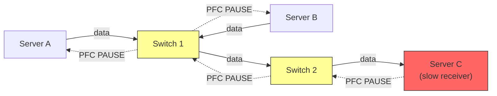

# 13.2 Priority Flow Control (PFC)

Priority Flow Control (PFC), defined in IEEE 802.1Qbb, is the mechanism that makes Ethernet lossless for RoCEv2 traffic. PFC extends Ethernet's original PAUSE mechanism (802.3x) with per-priority granularity, allowing switches to selectively pause specific traffic classes while allowing others to continue flowing. This section covers PFC's operation, configuration, failure modes, and best practices.

## How PFC Works

### Per-Priority PAUSE Frames

Ethernet defines 8 priority levels (0--7), carried in the 802.1Q VLAN tag's Priority Code Point (PCP) field or mapped from the IP header's DSCP field. PFC operates independently on each priority.

When a switch's ingress buffer for a particular priority approaches a threshold, the switch sends a PFC PAUSE frame upstream to the sender. The PAUSE frame specifies:

- **Which priorities to pause**: A bitmask of priorities (0--7)
- **How long to pause**: A quanta value (1 quanta = time to transmit 512 bits at the port speed)

The upstream sender (either another switch or a NIC) must stop transmitting frames of the paused priority within a specified response time.

```
Normal flow:
  Sender ----[data]----[data]----[data]----> Switch ----> Receiver

Congestion detected at switch buffer:
  Sender ----[data]----[data]----[data]----> Switch ----> Receiver
  Sender <----[PFC PAUSE pri=3]------------- Switch      (buffer filling)

After PAUSE received:
  Sender     [data queued locally]           Switch ----> Receiver
             (pri 3 paused)                  (buffer drains)

PAUSE expires or switch sends resume:
  Sender ----[data]----[data]----> Switch ----> Receiver
             (pri 3 resumed)
```

### PFC Timing

PFC must be configured with appropriate headroom to prevent loss during the reaction time. The critical parameters are:

$$headroom = (t_{propagation} + t_{response}) \times BW_{port}$$

Where:
- $t_{propagation}$: Cable propagation delay (round-trip) -- ~5 ns/meter, typical 50--100 ns
- $t_{response}$: Time for the sender to process the PAUSE and stop transmitting -- typically 2--4 us
- $BW_{port}$: Port bandwidth in bytes per second

For a 100 Gbps port with 3 us response time:

$$headroom = 3 \times 10^{-6} \times 12.5 \times 10^9 = 37{,}500 \text{ bytes} \approx 37 \text{ KB}$$

The switch must begin sending PFC PAUSE when the buffer occupancy reaches:

$$threshold_{xoff} = buffer_{total} - headroom$$

And resume sending when buffer occupancy drops to:

$$threshold_{xon} = threshold_{xoff} - hysteresis$$

The hysteresis prevents rapid oscillation between paused and unpaused states.

## PFC Configuration

### DSCP to Priority Mapping

RoCEv2 packets carry a DSCP value in the IP header. Switches and NICs map DSCP values to priority classes. A typical configuration dedicates priority 3 to RoCEv2 traffic:

```bash
# On the NIC (mlx5): Set DSCP for RoCE traffic
mlnx_qos -d mlx5_0 --dscp2prio set,3,26
# Maps DSCP 26 (typical for RoCE) to priority 3

# Verify priority mapping
mlnx_qos -d mlx5_0 --dscp2prio show
```

### Enabling PFC on Switch Ports

Switch configuration varies by vendor. Here is a conceptual example for a typical data center switch:

```
! Enable PFC on priority 3 only
interface Ethernet1/1
  priority-flow-control mode on
  priority-flow-control priority 3 no-drop

! Set buffer thresholds for priority 3
  priority-flow-control xoff-threshold priority 3 dynamic
  priority-flow-control xon-threshold priority 3 dynamic
```

### Enabling PFC on the NIC

```bash
# Enable PFC on the NIC for priority 3
mlnx_qos -d mlx5_0 --pfc 0,0,0,1,0,0,0,0
# Format: pri0,pri1,...,pri7 (1=PFC enabled)

# Verify PFC status
mlnx_qos -d mlx5_0 --pfc show
# Priority  PFC
# 0         disabled
# 1         disabled
# 2         disabled
# 3         enabled
# 4-7       disabled
```

### DCBX: Automatic Configuration Exchange

The Data Center Bridging eXchange (DCBX) protocol, carried over LLDP, allows switches and NICs to automatically negotiate PFC parameters:

```bash
# Enable DCBX on the NIC
mlnx_qos -d mlx5_0 --dcbx mode=firmware

# Check DCBX status
lldptool -ti mlx5_0 -V PFC
```

<div class="warning">

**Configuration consistency**: PFC must be consistently configured on every hop between sender and receiver. A single misconfigured switch that drops PFC-enabled traffic will cause packet loss and RDMA performance degradation. Use DCBX for automatic configuration when possible.

</div>

## Problems with PFC

PFC prevents packet loss, but it introduces several serious problems that must be managed carefully.

### Head-of-Line Blocking

When PFC pauses a priority on one port, **all flows** on that priority through that port are paused, even if only one flow is causing the congestion. Innocent flows sharing the same priority become "victim flows."

```
                    Congested output port
Flow A (heavy) ----+
                   |----> Switch port ----> Destination X
Flow B (light) ----+      (buffer full)

PFC PAUSE is sent upstream:
- Flow A is paused (correct - it's the congester)
- Flow B is ALSO paused (incorrect - it's a victim)
```

This is fundamentally similar to the head-of-line blocking problem that motivated Virtual Output Queuing (VOQ) in switch design. PFC operates at the priority level, not the flow level, so it cannot distinguish between the congestor and the victim.

### PFC Storms

A PFC storm occurs when PAUSE frames cascade through the network, pausing traffic across multiple hops and potentially affecting the entire fabric.



In this scenario:
1. Server C is slow to process incoming data (perhaps due to a software hang)
2. Switch 2's buffer fills; it sends PFC PAUSE to Switch 1
3. Switch 1's buffer fills; it sends PFC PAUSE to all upstream ports
4. Servers A and B are both paused, even though only Server C is the problem
5. If Servers A and B are also connected to other switches, the pause propagates further

A PFC storm can bring down an entire data center fabric in seconds.

### PFC Deadlocks

A PFC deadlock occurs when circular buffer dependencies form across switches. Each switch is waiting for the next switch in the cycle to release buffer space, but none can because they are all paused:

```
Switch A ----[paused]----> Switch B
   ^                         |
   |                         v
Switch D <----[paused]---- Switch C
   |                         ^
   v                         |
   +-------[paused]----------+
```

Deadlocks are permanent -- traffic stops and never recovers without manual intervention. They are most likely in networks with:
- Routing loops (even temporary ones during reconvergence)
- Non-Clos topologies with cyclic paths
- Multiple lossless priorities with shared buffers

### Unfairness

PFC does not provide any fairness guarantees. A single aggressive flow can consume most of the bandwidth while victim flows are repeatedly paused. This is because PFC only controls whether traffic flows or stops -- it has no concept of fair bandwidth allocation.

## PFC Watchdog

**PFC watchdog** is a switch feature that detects and breaks PFC storms by monitoring how long a port remains in the paused state. If a port is paused for longer than a configurable timeout (typically 100 ms -- 1 s), the watchdog takes action:

- **Drop mode**: Drops all traffic on the paused priority, breaking the storm but causing packet loss
- **Alert mode**: Generates a log entry and SNMP trap but takes no action
- **Forward mode**: Stops honoring PFC PAUSE and forwards traffic, causing loss but breaking the storm

```
! Configure PFC watchdog (switch example)
priority-flow-control watchdog timeout 300
priority-flow-control watchdog action drop

! Monitor PFC watchdog events
show priority-flow-control watchdog statistics
```

<div class="tip">

**Always enable PFC watchdog**: PFC storms and deadlocks are rare but catastrophic. PFC watchdog provides a circuit breaker that limits the blast radius. The brief packet loss when the watchdog triggers is far preferable to a fabric-wide traffic outage.

</div>

## Monitoring PFC

### NIC-Level Counters

```bash
# Check PFC counters on the NIC
ethtool -S mlx5_0 | grep pfc
#   rx_pfc_pause_duration_0: 0
#   rx_pfc_pause_duration_3: 12345  # PFC pauses received on priority 3
#   tx_pfc_pause_duration_3: 0      # PFC pauses sent on priority 3

# Monitor PFC events over time
watch -n 1 'ethtool -S mlx5_0 | grep pfc'
```

### Key Counters to Monitor

| Counter | Meaning | Action if High |
|---------|---------|----------------|
| `rx_pfc_pause` | PFC pauses received (being throttled) | Check downstream for congestion |
| `tx_pfc_pause` | PFC pauses sent (throttling upstream) | Check local buffer usage |
| `rx_pfc_pause_duration` | Total time paused | Should be near zero in normal operation |
| `rx_discards` | Packets dropped | PFC not working; check config |

### Switch-Level Monitoring

```
! Check PFC statistics on switch
show interface Ethernet1/1 priority-flow-control
show interface Ethernet1/1 counters pfc

! Check buffer utilization
show buffer utilization interface Ethernet1/1
```

## Best Practices for PFC Deployment

1. **Use PFC as a safety net, not primary congestion control**: Deploy ECN/DCQCN (Section 13.3) to handle congestion before PFC activates. PFC should trigger rarely in a well-tuned network.

2. **Minimize lossless priorities**: Enable PFC on only one priority (e.g., priority 3 for RoCE). More lossless priorities mean more headroom buffer consumption and more deadlock risk.

3. **Enable PFC watchdog on all switches**: Set a reasonable timeout (100--500 ms) and use drop mode.

4. **Use Clos/leaf-spine topology**: Avoid topologies with potential routing loops. Clos topologies are inherently loop-free (see Section 13.4).

5. **Size buffers appropriately**: Ensure switches have sufficient headroom buffer for PFC reaction time at the configured port speed.

6. **Monitor continuously**: Set up alerts on PFC pause duration counters. Sustained PFC activity indicates a problem.

7. **Test failure scenarios**: Simulate link failures, switch reboots, and traffic bursts during network qualification to verify PFC behavior under stress.

8. **Separate lossless and lossy traffic**: Map RDMA traffic to a dedicated priority with PFC enabled. Keep all other traffic on lossy priorities. Never enable PFC on all priorities.

<div class="note">

**Design philosophy**: The ideal RoCEv2 network rarely triggers PFC. ECN/DCQCN should keep queue depths below the PFC threshold 99.9% of the time. PFC exists only for the rare burst or transient event where ECN cannot react fast enough. If you observe sustained PFC activity, tune your ECN thresholds or investigate the traffic pattern.

</div>
